# AI集成模块架构与实现详解

<cite>
**本文档引用的文件**
- [gemini.ts](file://src/ai/gemini.ts)
- [openai.ts](file://src/ai/openai.ts)
- [request.ts](file://src/ai/request.ts)
- [response.ts](file://src/ai/response.ts)
- [prompts.ts](file://src/ai/prompts.ts)
- [chat-types.ts](file://src/ai/chat-types.ts)
- [ai-store.ts](file://src/store/ai-store.ts)
- [ScanPage.tsx](file://src/components/pages/ScanPage.tsx)
- [ChatPage.tsx](file://src/components/pages/ChatPage.tsx)
- [InitPage.tsx](file://src/components/pages/InitPage.tsx)
</cite>

## 目录
1. [概述](#概述)
2. [项目架构](#项目架构)
3. [AI适配器设计](#ai适配器设计)
4. [请求响应处理](#请求响应处理)
5. [提示词工程](#提示词工程)
6. [错误处理与重试机制](#错误处理与重试机制)
7. [状态管理](#状态管理)
8. [扩展新AI服务](#扩展新ai服务)
9. [最佳实践](#最佳实践)
10. [总结](#总结)

## 概述

AI集成模块是skid-homework项目的核心组件，负责统一管理和调用不同的AI服务提供商（Google Gemini和OpenAI）。该模块采用适配器模式设计，提供了统一的接口抽象，支持多种AI服务的无缝切换和扩展。

### 主要特性

- **多服务支持**：同时支持Google Gemini和OpenAI两大主流AI平台
- **统一接口**：通过标准化的接口契约实现服务抽象
- **流式处理**：支持实时流式响应处理
- **错误恢复**：内置重试机制和错误处理策略
- **灵活配置**：支持自定义模型、提示词和行为特征

## 项目架构

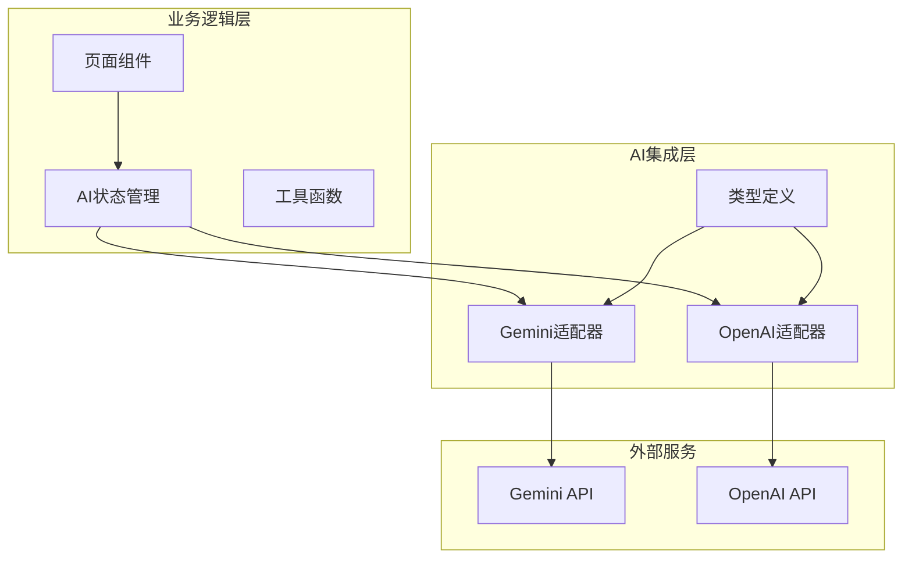

**图表来源**
- [ai-store.ts](file://src/store/ai-store.ts#L1-L275)
- [gemini.ts](file://src/ai/gemini.ts#L1-L205)
- [openai.ts](file://src/ai/openai.ts#L1-L267)

**章节来源**
- [ai-store.ts](file://src/store/ai-store.ts#L1-L275)
- [gemini.ts](file://src/ai/gemini.ts#L1-L205)
- [openai.ts](file://src/ai/openai.ts#L1-L267)

## AI适配器设计

### 架构概览

AI适配器采用面向对象的设计模式，每个适配器类都实现了统一的接口契约，确保不同AI服务之间的兼容性。

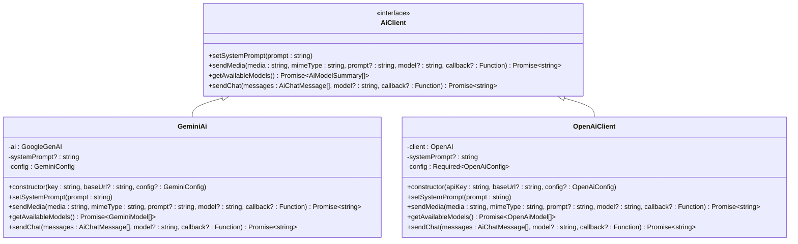

**图表来源**
- [ai-store.ts](file://src/store/ai-store.ts#L28-L43)
- [gemini.ts](file://src/ai/gemini.ts#L17-L204)
- [openai.ts](file://src/ai/openai.ts#L53-L266)

### Gemini适配器实现

Gemini适配器基于Google GenAI SDK构建，支持文本和媒体内容的处理。

#### 核心功能特性

| 功能 | 描述 | 实现方式 |
|------|------|----------|
| 系统提示设置 | 设置全局系统提示词 | `setSystemPrompt()` 方法 |
| 媒体处理 | 支持图片和PDF文件处理 | `sendMedia()` 方法 |
| 流式响应 | 实时流式处理AI响应 | `generateContentStream()` API |
| 多模态支持 | 文本、图片混合输入 | 支持多种内容类型 |
| 安全设置 | 自定义安全阈值 | `safetySettings` 配置 |

#### 配置选项

```typescript
interface GeminiConfig {
  thinkingBudget?: number;           // 思考预算限制
  safetySettings?: Array<{         // 安全设置数组
    category: HarmCategory;         // 危害类别
    threshold: HarmBlockThreshold;  // 阻止阈值
  }>;
}
```

**章节来源**
- [gemini.ts](file://src/ai/gemini.ts#L9-L50)

### OpenAI适配器实现

OpenAI适配器基于官方OpenAI SDK，提供强大的多模态AI能力。

#### 核心功能特性

| 功能 | 描述 | 实现方式 |
|------|------|----------|
| 响应流处理 | 基于事件的流式响应 | `responses.stream()` API |
| 超时控制 | 可配置的最大轮询时间 | `maxPollMs` 参数 |
| 错误处理 | 详细的错误信息捕获 | 事件类型检查 |
| 图像处理 | 支持高分辨率图像分析 | `detail: "auto"` 参数 |

#### 配置参数

```typescript
interface OpenAiConfig {
  pollIntervalMs?: number;   // 轮询间隔（毫秒）
  maxPollMs?: number;        // 最大轮询时间（毫秒）
}
```

**章节来源**
- [openai.ts](file://src/ai/openai.ts#L9-L12)

## 请求响应处理

### 类型定义系统

AI模块定义了完整的类型系统来确保数据的一致性和安全性。

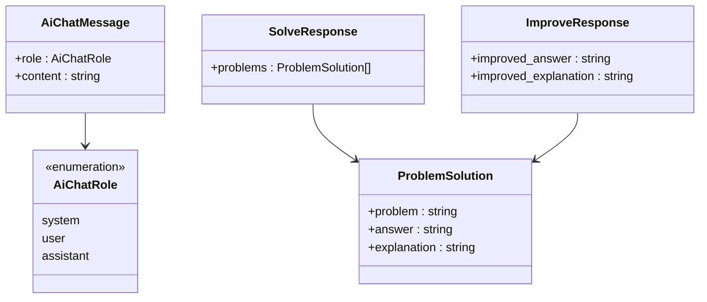

**图表来源**
- [chat-types.ts](file://src/ai/chat-types.ts#L1-L7)
- [response.ts](file://src/ai/response.ts#L5-L12)

### 响应解析机制

系统支持多种响应格式的自动解析：

#### 解析流程图

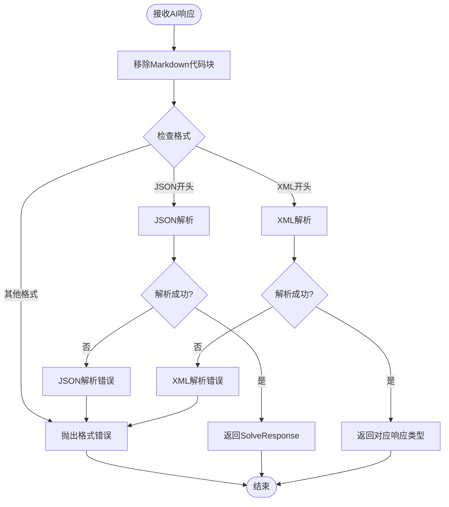

**图表来源**
- [response.ts](file://src/ai/response.ts#L96-L114)
- [response.ts](file://src/ai/response.ts#L150-L159)

### XML处理工具

系统提供了专门的XML处理工具来确保数据的安全性和完整性。

#### CDATA转义机制

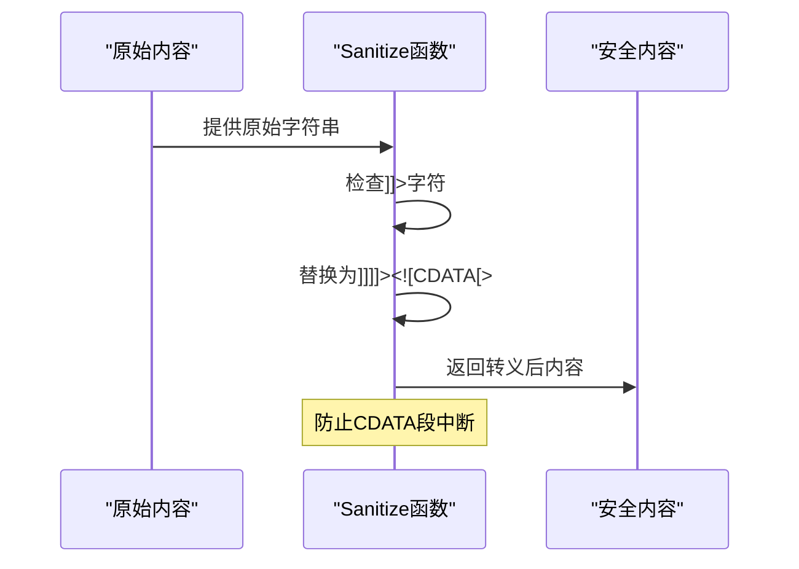

**图表来源**
- [request.ts](file://src/ai/request.ts#L18-L23)

**章节来源**
- [response.ts](file://src/ai/response.ts#L1-L160)
- [request.ts](file://src/ai/request.ts#L1-L49)

## 提示词工程

### 系统提示设计原则

提示词工程是AI交互质量的关键因素，系统采用了精心设计的提示词模板。

#### 提示词架构

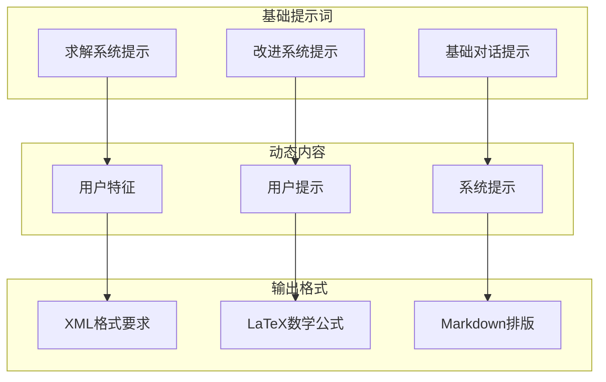

**图表来源**
- [prompts.ts](file://src/ai/prompts.ts#L1-L155)

### SOLVE系统提示

SOLVE提示词专注于数学问题的识别和求解，具有严格的格式要求。

#### 核心指令结构

| 指令级别 | 内容 | 目标 |
|----------|------|------|
| 分析图片 | OCR识别、问题分割 | 准确提取问题内容 |
| 求解问题 | 数学计算、逻辑推理 | 提供正确答案 |
| 撰写解析 | 步骤说明、公式展示 | 清晰的解题过程 |
| 格式化输出 | XML结构、LaTeX公式 | 标准化输出格式 |

#### 输出格式规范

```xml
<solution>
  <problems>
    <problem>
      <problem_text><![CDATA[问题文本]]></problem_text>
      <answer><![CDATA[最终答案]]></answer>
      <explanation><![CDATA[详细解析过程]]></explanation>
    </problem>
  </problems>
</solution>
```

### IMPROVE系统提示

IMPROVE提示词用于优化现有的解题方案，强调质量提升和准确性。

#### 改进策略

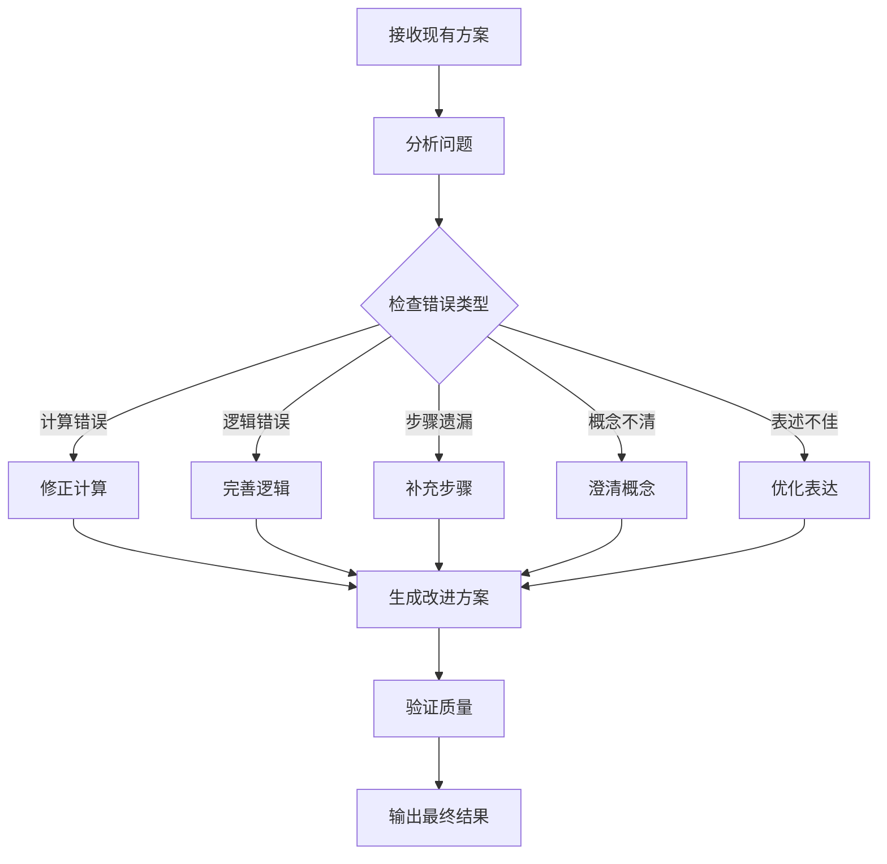

**图表来源**
- [prompts.ts](file://src/ai/prompts.ts#L1-L69)

**章节来源**
- [prompts.ts](file://src/ai/prompts.ts#L1-L155)

## 错误处理与重试机制

### 重试策略设计

系统实现了智能的重试机制来应对网络不稳定和API限流等问题。

#### 重试算法

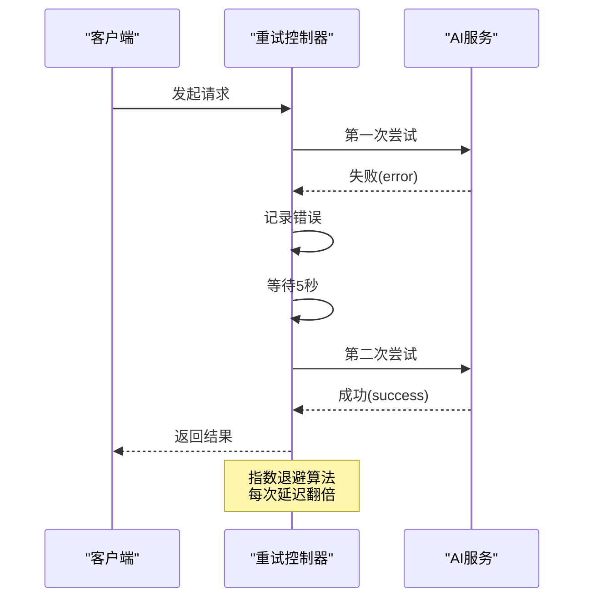

**图表来源**
- [ScanPage.tsx](file://src/components/pages/ScanPage.tsx#L188-L214)

#### 重试配置参数

| 参数 | 默认值 | 说明 |
|------|--------|------|
| 最大重试次数 | 5次 | 防止无限重试 |
| 初始延迟 | 5000ms | 首次重试等待时间 |
| 退避因子 | 2 | 每次重试延迟翻倍 |
| 最大总等待时间 | 约60秒 | 防止过长等待 |

### 超时控制机制

不同AI服务采用不同的超时策略：

#### OpenAI超时控制

```typescript
// OpenAI特定的超时处理
const controller = new AbortController();
const startTime = Date.now();

for await (const event of stream) {
  // 检查是否超过最大轮询时间
  if (Date.now() - startTime > this.config.maxPollMs) {
    controller.abort();
    throw new Error("OpenAI response polling timed out");
  }
}
```

#### Gemini超时处理

Gemini适配器通过配置思考预算来间接控制响应时间。

**章节来源**
- [ScanPage.tsx](file://src/components/pages/ScanPage.tsx#L188-L214)
- [openai.ts](file://src/ai/openai.ts#L155-L158)

## 状态管理

### AI存储架构

AI状态管理采用Zustand库实现，提供了集中式的AI服务配置和状态管理。

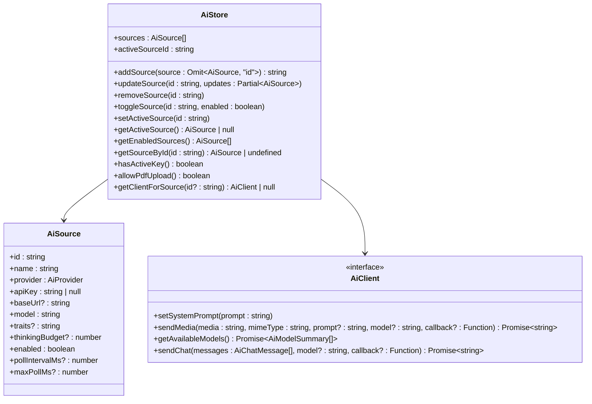

**图表来源**
- [ai-store.ts](file://src/store/ai-store.ts#L131-L147)

### 数据持久化

状态管理支持本地存储持久化，确保用户配置的长期保存。

#### 存储策略

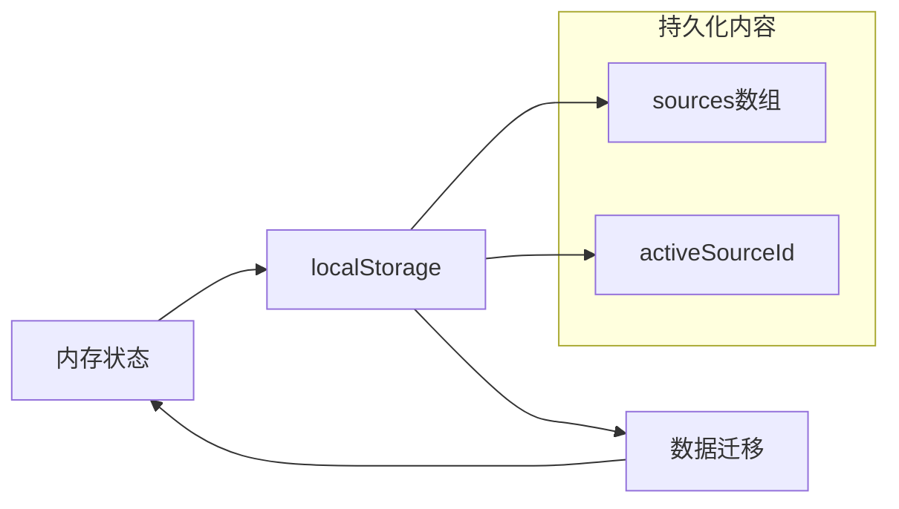

**图表来源**
- [ai-store.ts](file://src/store/ai-store.ts#L261-L269)

### 客户端工厂模式

系统使用工厂模式根据配置动态创建AI客户端实例。

#### 客户端创建流程

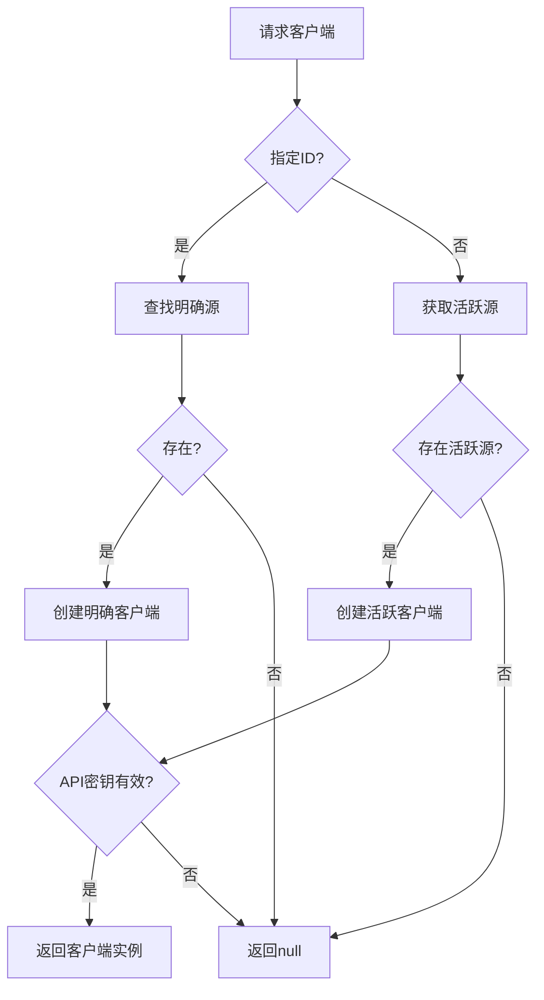

**图表来源**
- [ai-store.ts](file://src/store/ai-store.ts#L245-L258)

**章节来源**
- [ai-store.ts](file://src/store/ai-store.ts#L1-L275)

## 扩展新AI服务

### 接口契约规范

要扩展新的AI服务提供商，需要实现以下接口契约：

#### 核心接口定义

```typescript
interface AiClient {
  setSystemPrompt(prompt: string): void;
  sendMedia(
    media: string, 
    mimeType: string, 
    prompt?: string, 
    model?: string, 
    callback?: (text: string) => void
  ): Promise<string>;
  getAvailableModels?(): Promise<AiModelSummary[]>;
  sendChat?(
    messages: AiChatMessage[], 
    model?: string, 
    callback?: (text: string) => void
  ): Promise<string>;
}
```

### 新服务实现指南

#### 1. 创建适配器类

```typescript
export class NewAiClient implements AiClient {
  private client: NewAiSDK;
  private systemPrompt?: string;
  
  constructor(apiKey: string, baseUrl?: string, config?: NewAiConfig) {
    this.client = new NewAiSDK({
      apiKey,
      baseURL: baseUrl,
    });
  }
  
  setSystemPrompt(prompt: string): void {
    this.systemPrompt = prompt;
  }
  
  async sendMedia(/* 参数 */) {
    // 实现媒体处理逻辑
  }
  
  async getAvailableModels() {
    // 实现模型列表获取
  }
}
```

#### 2. 更新工厂函数

在 `ai-store.ts` 中添加新的客户端创建逻辑：

```typescript
function createClientForSource(source: AiSource): AiClient | null {
  if (source.provider === "newai") {
    return new NewAiClient(source.apiKey, source.baseUrl, {});
  }
  // 其他提供商...
}
```

#### 3. 添加类型定义

```typescript
export type AiProvider = "gemini" | "openai" | "newai";

export interface AiSource {
  id: string;
  name: string;
  provider: AiProvider;
  // ... 其他字段
}

export interface AiClient {
  // ... 接口定义
}
```

### 最佳实践建议

#### 错误处理规范

1. **统一错误格式**：所有异常都应该包含有意义的错误消息
2. **分类错误类型**：区分网络错误、认证错误、业务逻辑错误
3. **提供重试建议**：对于临时性错误，提供重试建议

#### 性能优化

1. **连接池管理**：复用HTTP连接减少建立开销
2. **缓存策略**：缓存模型列表和常用配置
3. **并发控制**：限制同时进行的API调用数量

#### 安全考虑

1. **API密钥保护**：不在前端暴露敏感信息
2. **输入验证**：验证所有用户输入
3. **输出过滤**：过滤潜在的有害内容

## 最佳实践

### 开发建议

#### 1. 接口设计原则

- **单一职责**：每个方法只负责一个明确的功能
- **一致性**：保持与现有接口的兼容性
- **可扩展性**：预留扩展点以支持未来需求

#### 2. 错误处理策略

```typescript
// 推荐的错误处理模式
async function safeCall<T>(
  operation: () => Promise<T>,
  fallbackValue: T,
  errorMessage: string
): Promise<T> {
  try {
    return await operation();
  } catch (error) {
    console.error(`${errorMessage}:`, error);
    return fallbackValue;
  }
}
```

#### 3. 性能监控

- **响应时间跟踪**：记录每个API调用的耗时
- **成功率统计**：监控各服务的成功率
- **资源使用监控**：跟踪内存和CPU使用情况

### 部署注意事项

#### 1. 配置管理

- 使用环境变量管理API密钥
- 提供配置验证机制
- 支持配置热更新

#### 2. 监控告警

- 设置服务可用性监控
- 配置性能指标告警
- 建立错误日志聚合

#### 3. 容量规划

- 评估并发用户需求
- 预留适当的API配额
- 实施流量控制机制

## 总结

AI集成模块通过精心设计的架构和实现，成功地实现了多AI服务的统一管理和无缝切换。该模块的主要优势包括：

### 技术优势

1. **高度抽象**：通过接口契约实现了服务的完全解耦
2. **灵活扩展**：支持轻松添加新的AI服务提供商
3. **健壮性**：完善的错误处理和重试机制
4. **性能优化**：流式处理和并发控制

### 设计亮点

- **适配器模式**：优雅地解决了不同API的差异性
- **工厂模式**：简化了客户端实例的创建和管理
- **观察者模式**：支持实时流式响应处理
- **策略模式**：允许运行时选择不同的AI服务

### 应用价值

该模块不仅满足了当前的业务需求，还为未来的功能扩展和技术演进奠定了坚实的基础。通过模块化的设计和标准化的接口，开发者可以快速集成新的AI服务，而无需修改核心业务逻辑。

这种架构设计体现了现代软件开发的最佳实践，为构建可维护、可扩展的企业级应用提供了优秀的参考范例。