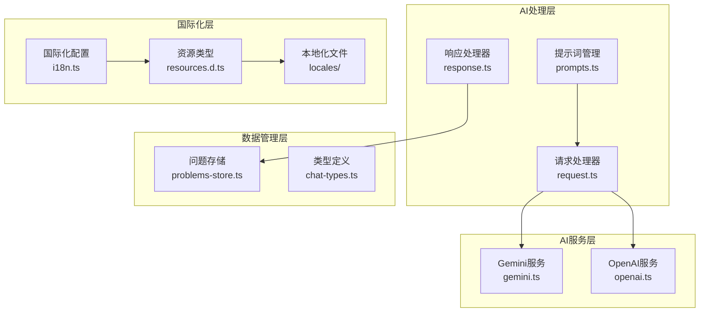

# API参考

<cite>
**本文档中引用的文件**
- [request.ts](file://src/ai/request.ts)
- [response.ts](file://src/ai/response.ts)
- [resources.d.ts](file://src/@types/resources.d.ts)
- [chat-types.ts](file://src/ai/chat-types.ts)
- [problems-store.ts](file://src/store/problems-store.ts)
- [gemini.ts](file://src/ai/gemini.ts)
- [openai.ts](file://src/ai/openai.ts)
- [prompts.ts](file://src/ai/prompts.ts)
- [i18n.ts](file://src/i18n.ts)
- [commons.json](file://public/locales/en/commons.json)
- [commons.json](file://public/locales/zh/commons.json)
</cite>

## 目录
1. [简介](#简介)
2. [项目架构概览](#项目架构概览)
3. [AI请求处理API](#ai请求处理api)
4. [AI响应处理API](#ai响应处理api)
5. [国际化资源API](#国际化资源api)
6. [数据类型定义](#数据类型定义)
7. [AI服务提供商API](#ai服务提供商api)
8. [错误处理机制](#错误处理机制)
9. [使用示例](#使用示例)
10. [最佳实践](#最佳实践)

## 简介

SkidHomework是一个本地运行的作业辅助工具，提供了完整的AI集成解决方案。本文档详细介绍了项目中定义的核心API接口，包括AI请求处理、响应解析、国际化支持等关键功能模块。

该项目采用现代化的TypeScript架构，支持多种AI服务提供商（Gemini和OpenAI），并提供了强大的国际化功能支持多语言界面。

## 项目架构概览



**图表来源**
- [request.ts](file://src/ai/request.ts#L1-L49)
- [response.ts](file://src/ai/response.ts#L1-L160)
- [gemini.ts](file://src/ai/gemini.ts#L1-L205)
- [openai.ts](file://src/ai/openai.ts#L1-L267)

## AI请求处理API

### XML生成器

项目提供了专门的XML生成器用于AI请求的数据格式化。

#### `renderImproveXml(data: ImproveXmlData): string`

将改进请求数据转换为XML格式字符串。

**参数类型：**
```typescript
interface ImproveXmlData {
  problem: string;           // 原始问题
  answer: string;            // 原始答案
  explanation: string;       // 原始解析
  user_suggestion: string;   // 用户建议
}
```

**返回值：** 格式化的XML字符串

**使用场景：**
- AI改进请求的数据准备
- XML格式的标准化输出

**节来源**
- [request.ts](file://src/ai/request.ts#L31-L48)

### XML内容安全处理

#### `sanitizeForCData(content: string): string`

安全地转义CDATA段中的特殊字符。

**参数：**
- `content` (string): 需要转义的原始内容

**返回值：** 安全的CDATA内容字符串

**功能特性：**
- 自动处理`]]>`字符序列
- 防止XML解析错误
- 支持空字符串输入

**节来源**
- [request.ts](file://src/ai/request.ts#L18-L22)

## AI响应处理API

### 解析器接口

#### `parseSolveResponse(response: string): SolveResponse | null`

解析AI解决请求的响应。

**参数：**
- `response` (string): AI返回的原始响应字符串

**返回值：**
- `SolveResponse`: 包含问题解决方案的对象
- `null`: 解析失败时返回

**支持格式：**
- JSON格式
- XML格式（自动检测）
- Markdown代码块包装

**节来源**
- [response.ts](file://src/ai/response.ts#L96-L114)

#### `parseImproveResponse(response: string): ImproveResponse | null`

解析AI改进请求的响应。

**参数：**
- `response` (string): AI返回的原始响应字符串

**返回值：**
- `ImproveResponse`: 包含改进后答案的对象
- `null`: 解析失败时返回

**支持格式：**
- XML格式（必需）
- Markdown代码块包装

**节来源**
- [response.ts](file://src/ai/response.ts#L150-L159)

### 响应数据结构

#### SolveResponse接口

```typescript
interface SolveResponse {
  problems: ProblemSolution[];
}

interface ProblemSolution {
  problem: string;      // 问题描述
  answer: string;       // 最终答案
  explanation: string;  // 详细解析
}
```

#### ImproveResponse接口

```typescript
interface ImproveResponse {
  improved_answer: string;        // 改进后的答案
  improved_explanation: string;   // 改进后的解析
}
```

**节来源**
- [response.ts](file://src/ai/response.ts#L5-L12)

## 国际化资源API

### 资源类型定义

项目通过`resources.d.ts`文件定义了完整的国际化资源类型系统。

#### 主要命名空间

```typescript
interface Resources {
  "commons": {
    // 通用界面元素
    "actions": {
      "scan": "Let's Skid",
      "chat": "Chat",
      "settings": "Settings"
    },
    // 扫描页面相关
    "scan-page": {
      "title": "Scan your homework",
      "toasts": {
        "working": {
          "title": "Working...",
          "description": "Sending {{count}} file(s) to your AI sources..."
        }
      }
    },
    // 聊天页面相关
    "chat-page": {
      "title": "SkidHomework Chat",
      "composer": {
        "placeholder": "Ask a question or paste a problem..."
      }
    }
  }
}
```

**节来源**
- [resources.d.ts](file://src/@types/resources.d.ts#L1-L504)

### 国际化配置

#### i18next配置

```typescript
// 默认语言设置
fallbackLng: "en",

// 命名空间配置
ns: ["commons"],

// 后端加载配置
backend: {
  loadPath: "/locales/{{lng}}/{{ns}}.json",
}
```

**功能特性：**
- 支持动态语言切换
- 延迟加载翻译资源
- 自动语言检测
- 错误边界处理

**节来源**
- [i18n.ts](file://src/i18n.ts#L23-L48)

### 本地化文件结构

项目支持英语（en）和中文（zh）两种语言环境。

#### 英文资源示例

```json
{
  "actions": {
    "scan": "Let's Skid",
    "chat": "Chat",
    "settings": "Settings"
  },
  "scan-page": {
    "title": "Scan your homework",
    "toasts": {
      "working": {
        "title": "Working...",
        "description": "Sending {{count}} file(s) to your AI sources..."
      }
    }
  }
}
```

#### 中文资源示例

```json
{
  "actions": {
    "scan": "开始打滑",
    "chat": "聊天",
    "settings": "设置"
  },
  "scan-page": {
    "title": "扫描你的作业",
    "toasts": {
      "working": {
        "title": "正在处理...",
        "description": "正在将 {{count}} 个文件发送到 AI 源..."
      }
    }
  }
}
```

**节来源**
- [commons.json](file://public/locales/en/commons.json#L1-L503)
- [commons.json](file://public/locales/zh/commons.json#L1-L503)

## 数据类型定义

### 聊天消息类型

#### AiChatRole枚举

```typescript
type AiChatRole = "system" | "user" | "assistant";
```

#### AiChatMessage接口

```typescript
interface AiChatMessage {
  role: AiChatRole;    // 消息角色
  content: string;     // 消息内容
}
```

**节来源**
- [chat-types.ts](file://src/ai/chat-types.ts#L1-L7)

### 问题存储类型

#### FileItem接口

```typescript
interface FileItem {
  id: string;                    // 唯一标识符
  file: File;                    // 实际文件对象
  mimeType: string;              // MIME类型
  url: string;                   // 客户端预览URL
  source: "upload" | "camera";   // 来源类型
  status: "success" | "pending" | "failed" | "rasterizing";
}
```

#### Solution接口

```typescript
interface Solution {
  imageUrl: string;              // 源图像URL
  status: "success" | "processing" | "failed";
  streamedOutput?: string | null; // 流式输出
  problems: ProblemSolution[];   // 问题解决方案数组
  aiSourceId?: string;           // AI源标识
}
```

**节来源**
- [problems-store.ts](file://src/store/problems-store.ts#L5-L21)

## AI服务提供商API

### Gemini AI服务

#### GeminiAi类

```typescript
class GeminiAi {
  private ai: GoogleGenAI;
  private systemPrompt?: string;
  private config: GeminiConfig;

  constructor(key: string, baseUrl?: string, config?: GeminiConfig);
  
  setSystemPrompt(prompt: string): void;
  sendMedia(media: string, mimeType: string, prompt?: string, model?: string, callback?: (text: string) => void): Promise<string>;
  sendChat(messages: AiChatMessage[], model?: string, callback?: (text: string) => void): Promise<string>;
  getAvailableModels(): Promise<GeminiModel[]>;
}
```

#### 配置选项

```typescript
interface GeminiConfig {
  thinkingBudget?: number;           // 思考预算
  safetySettings?: Array<{
    category: HarmCategory;
    threshold: HarmBlockThreshold;
  }>;
}
```

**功能特性：**
- 支持媒体文件处理
- 流式响应处理
- 自定义安全设置
- 思考预算控制

**节来源**
- [gemini.ts](file://src/ai/gemini.ts#L17-L204)

### OpenAI服务

#### OpenAiClient类

```typescript
class OpenAiClient {
  private client: OpenAI;
  private systemPrompt?: string;
  private config: Required<OpenAiConfig>;

  constructor(apiKey: string, baseUrl?: string, config?: OpenAiConfig);
  
  setSystemPrompt(prompt: string): void;
  sendMedia(media: string, mimeType: string, prompt?: string, model?: string, callback?: (text: string) => void): Promise<string>;
  sendChat(messages: AiChatMessage[], model?: string, callback?: (text: string) => void): Promise<string>;
  getAvailableModels(): Promise<OpenAiModel[]>;
}
```

#### 配置选项

```typescript
interface OpenAiConfig {
  pollIntervalMs?: number;    // 轮询间隔（毫秒）
  maxPollMs?: number;         // 最大轮询时间（毫秒）
}
```

**功能特性：**
- 响应流处理
- 自动轮询控制
- 错误处理机制
- 超时保护

**节来源**
- [openai.ts](file://src/ai/openai.ts#L53-L266)

## 错误处理机制

### XML解析错误处理

项目实现了完善的XML解析错误处理机制：

```typescript
function parseXmlString(xmlString: string): Document | null {
  try {
    const parser = new DOMParser();
    const xmlDoc = parser.parseFromString(xmlString, "application/xml");
    const parseError = xmlDoc.getElementsByTagName("parsererror");
    
    if (parseError.length > 0) {
      console.error("Failed to parse XML: ", parseError);
      return null;
    }
    return xmlDoc;
  } catch (e) {
    console.error("An unexpected error occurred during XML parsing:", e, xmlString);
    return null;
  }
}
```

### 响应格式验证

```typescript
function trimMarkdownFence(content: string): string {
  const regex = /^```(?:\w+\s*)?\n?([\s\S]*)\n?```$/;
  const match = content.trim().match(regex);
  
  return match ? match[1].trim() : content.trim();
}
```

**错误处理策略：**
- 优雅降级
- 详细日志记录
- 用户友好的错误提示
- 类型安全的返回值

**节来源**
- [response.ts](file://src/ai/response.ts#L33-L51)

## 使用示例

### 基本AI请求处理

```typescript
// 1. 创建改进请求
const improveData: ImproveXmlData = {
  problem: "解方程 x² - 5x + 6 = 0",
  answer: "x = 2, x = 3",
  explanation: "因式分解法求解",
  user_suggestion: "请提供更详细的步骤说明"
};

const xmlRequest = renderImproveXml(improveData);

// 2. 发送请求并处理响应
const response = await geminiClient.sendMedia(xmlRequest, "text/xml");
const parsedResponse = parseImproveResponse(response);
```

### 国际化资源使用

```typescript
// 1. 获取翻译资源
import resources from '@/types/resources';

// 2. 使用命名空间访问
const scanTitle = resources.commons.actions.scan; // "Let's Skid"
const scanDescription = resources.commons.scan_page.toasts.working.description;

// 3. 参数化翻译
const workingToast = resources.commons.scan_page.toasts.working.description.replace(
  '{{count}}', '3'
); // "Sending 3 file(s) to your AI sources..."
```

### 多语言界面支持

```typescript
// 1. 初始化国际化
import i18n from './i18n';

// 2. 动态语言切换
i18n.changeLanguage('zh');

// 3. 获取本地化内容
const localizedTitle = i18n.t('commons.scan-page.title');
```

## 最佳实践

### 1. 请求处理最佳实践

- 使用`renderImproveXml`确保XML格式正确
- 实现适当的错误边界处理
- 验证输入数据完整性
- 使用类型安全的响应解析

### 2. 响应处理最佳实践

- 检查响应格式（JSON/XML）
- 实现优雅降级策略
- 处理网络超时情况
- 记录详细的错误日志

### 3. 国际化最佳实践

- 使用类型安全的资源访问
- 实现参数化翻译
- 支持动态语言切换
- 维护翻译文件一致性

### 4. 错误处理最佳实践

- 实现分层错误处理
- 提供用户友好的错误信息
- 记录详细的调试信息
- 实现重试机制

### 5. 性能优化最佳实践

- 使用延迟加载翻译资源
- 实现响应式缓存机制
- 优化XML解析性能
- 减少不必要的DOM操作