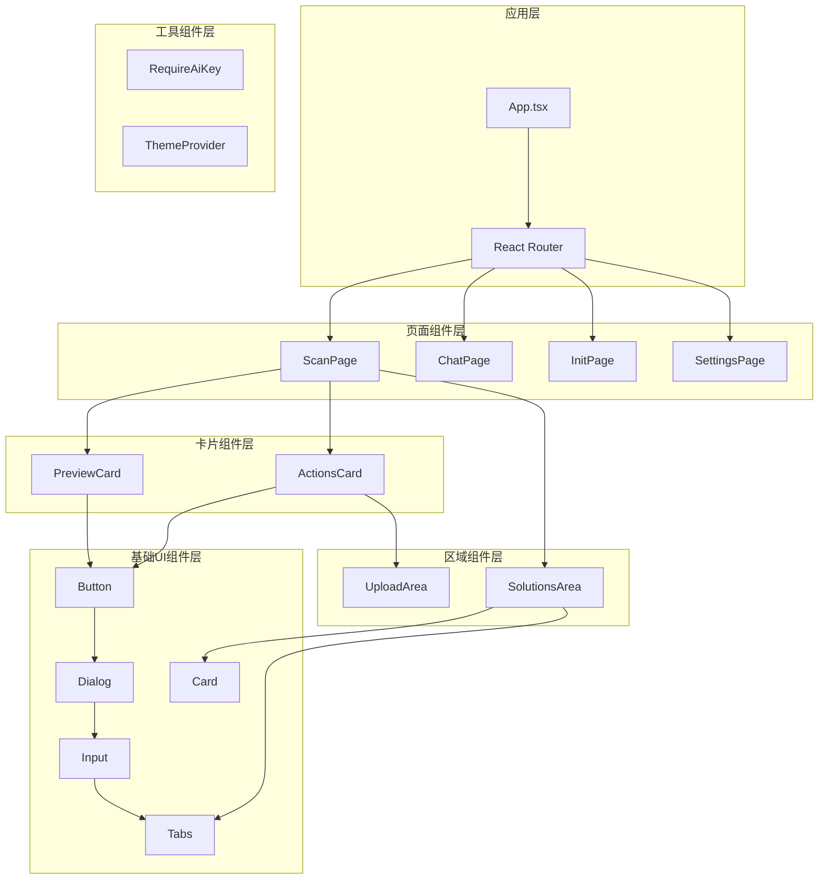
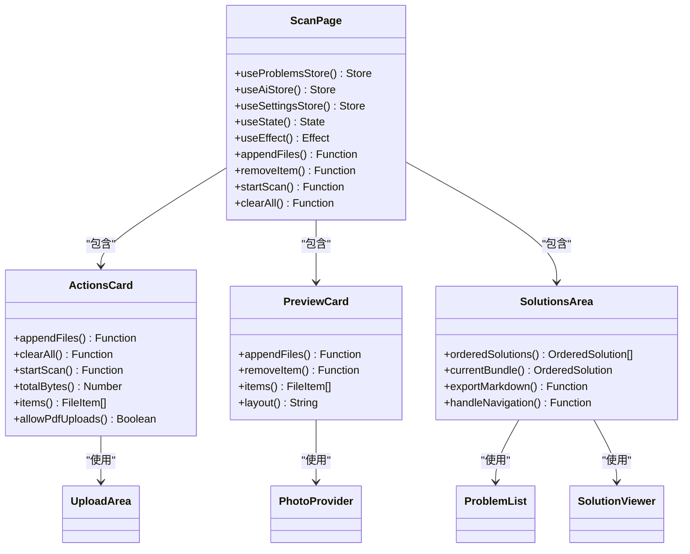
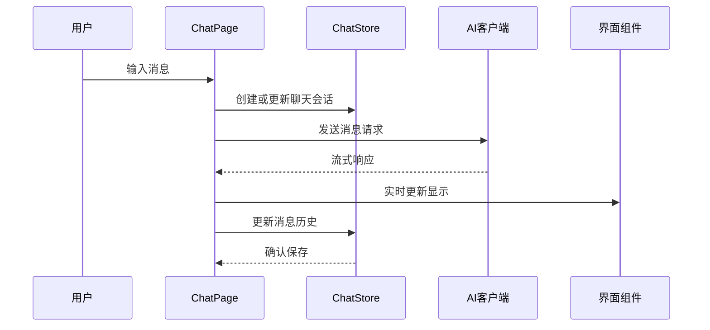
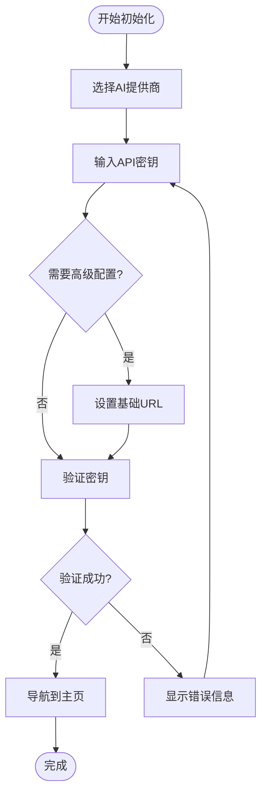
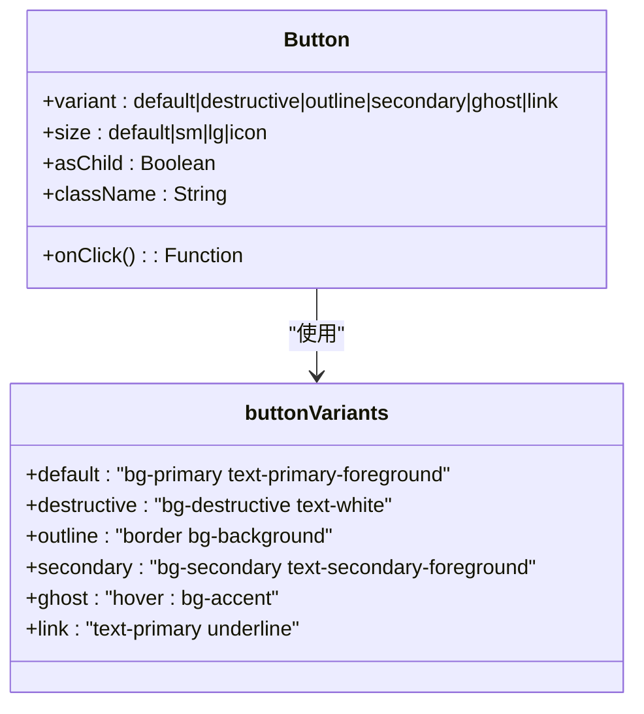
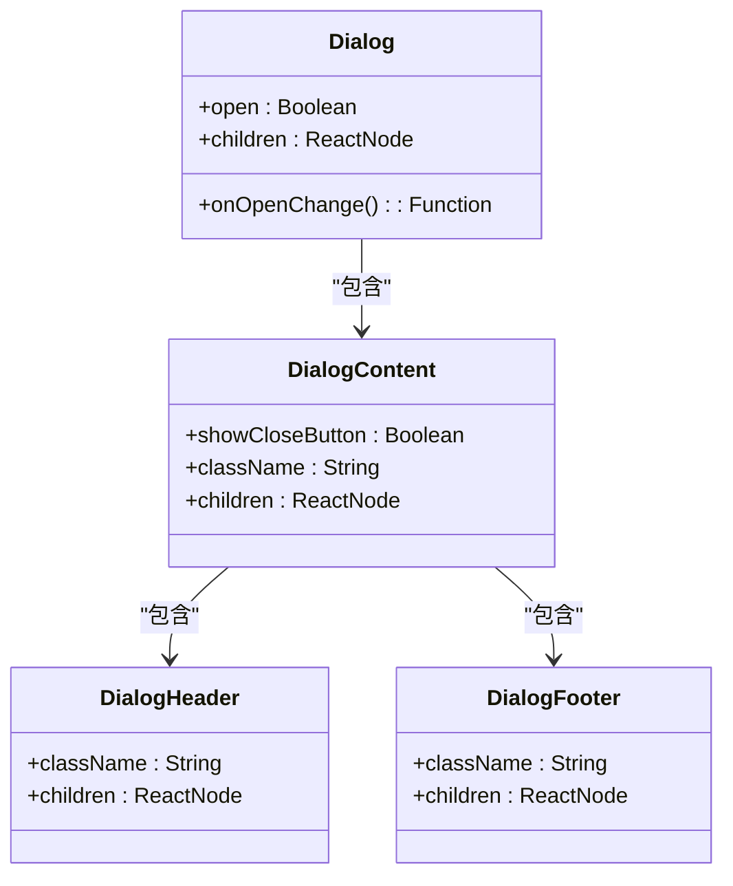
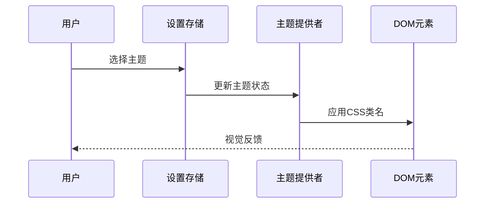
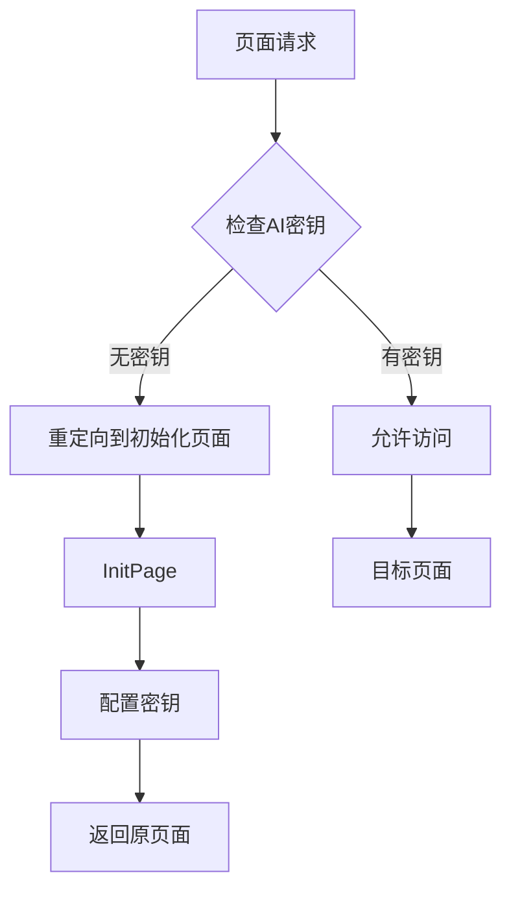
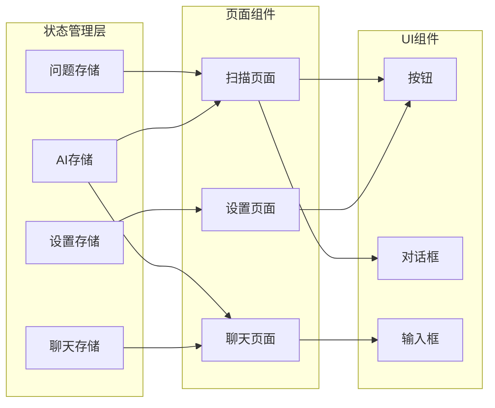
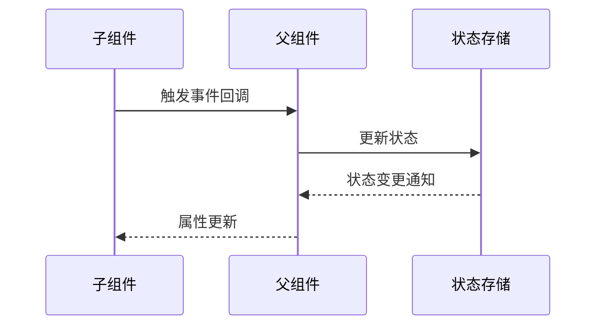

# UI组件架构

<cite>
**本文档中引用的文件**
- [src/components/pages/ScanPage.tsx](file://src/components/pages/ScanPage.tsx)
- [src/components/pages/ChatPage.tsx](file://src/components/pages/ChatPage.tsx)
- [src/components/pages/InitPage.tsx](file://src/components/pages/InitPage.tsx)
- [src/components/pages/SettingsPage.tsx](file://src/components/pages/SettingsPage.tsx)
- [src/components/guards/RequireAiKey.tsx](file://src/components/guards/RequireAiKey.tsx)
- [src/components/theme-provider.tsx](file://src/components/theme-provider.tsx)
- [src/components/areas/UploadArea.tsx](file://src/components/areas/UploadArea.tsx)
- [src/components/areas/SolutionsArea.tsx](file://src/components/areas/SolutionsArea.tsx)
- [src/components/ui/button.tsx](file://src/components/ui/button.tsx)
- [src/components/ui/dialog.tsx](file://src/components/ui/dialog.tsx)
- [src/components/ui/input.tsx](file://src/components/ui/input.tsx)
- [src/components/ui/tabs.tsx](file://src/components/ui/tabs.tsx)
- [src/components/cards/ActionsCard.tsx](file://src/components/cards/ActionsCard.tsx)
- [src/components/cards/PreviewCard.tsx](file://src/components/cards/PreviewCard.tsx)
- [src/App.tsx](file://src/App.tsx)
</cite>

## 目录
1. [项目概述](#项目概述)
2. [UI组件架构概览](#ui组件架构概览)
3. [核心页面组件分析](#核心页面组件分析)
4. [基础UI组件系统](#基础ui组件系统)
5. [主题切换机制](#主题切换机制)
6. [访问控制与守卫组件](#访问控制与守卫组件)
7. [组件树结构与数据流](#组件树结构与数据流)
8. [响应式设计与移动端适配](#响应式设计与移动端适配)
9. [最佳实践与设计原则](#最佳实践与设计原则)

## 项目概述

该项目采用基于React的现代化前端架构，构建了一个功能丰富的AI图像处理应用。项目遵循组件化设计理念，通过清晰的层次结构实现了高度可维护和可扩展的UI系统。

### 技术栈特点
- **React 18**：利用最新的React特性，包括并发渲染和新的Hooks API
- **TypeScript**：提供类型安全和更好的开发体验
- **Tailwind CSS**：实用优先的CSS框架，支持快速原型开发
- **Radix UI**：可访问性优先的UI组件库
- **Zustand**：轻量级状态管理，替代Redux的现代选择

## UI组件架构概览

项目采用分层架构设计，从底层的基础UI组件到顶层的应用页面，形成了清晰的组件层次结构。

**图表来源**
- [src/App.tsx](file://src/App.tsx#L1-L54)
- [src/components/pages/ScanPage.tsx](file://src/components/pages/ScanPage.tsx#L1-L552)
- [src/components/ui/button.tsx](file://src/components/ui/button.tsx#L1-L60)

## 核心页面组件分析

### ScanPage - 主要功能页面

ScanPage是应用的核心功能页面，负责图像上传、处理和解决方案展示。该页面展示了复杂的组件组合和状态管理模式。

#### 组件结构与功能

**图表来源**
- [src/components/pages/ScanPage.tsx](file://src/components/pages/ScanPage.tsx#L27-L552)
- [src/components/cards/ActionsCard.tsx](file://src/components/cards/ActionsCard.tsx#L26-L125)
- [src/components/cards/PreviewCard.tsx](file://src/components/cards/PreviewCard.tsx#L35-L227)

#### 关键特性

1. **多文件处理能力**：支持图片和PDF文件的批量上传和处理
2. **实时状态反馈**：通过状态指示器显示处理进度
3. **并发处理优化**：使用工作线程池提高处理效率
4. **智能重试机制**：指数退避算法确保处理可靠性

**章节来源**
- [src/components/pages/ScanPage.tsx](file://src/components/pages/ScanPage.tsx#L1-L552)

### ChatPage - 对话交互页面

ChatPage提供了与AI模型进行对话交互的功能，支持多轮对话和上下文管理。

#### 聊天界面设计

**图表来源**
- [src/components/pages/ChatPage.tsx](file://src/components/pages/ChatPage.tsx#L1-L976)

#### 核心功能模块

1. **多源AI支持**：支持多个AI提供商的无缝切换
2. **会话管理**：完整的聊天历史记录和恢复功能
3. **快捷键支持**：丰富的键盘快捷键操作
4. **响应式布局**：桌面和移动设备的自适应设计

**章节来源**
- [src/components/pages/ChatPage.tsx](file://src/components/pages/ChatPage.tsx#L1-L976)

### InitPage - 初始化配置页面

InitPage负责首次设置和API密钥配置，是用户体验的重要入口点。

#### 配置流程设计

**图表来源**
- [src/components/pages/InitPage.tsx](file://src/components/pages/InitPage.tsx#L1-L300)

**章节来源**
- [src/components/pages/InitPage.tsx](file://src/components/pages/InitPage.tsx#L1-L300)

### SettingsPage - 设置管理页面

SettingsPage提供了全面的配置管理功能，涵盖外观、行为和AI集成等各个方面。

#### 设置分类体系

| 设置类别 | 功能模块 | 配置选项 |
|---------|---------|---------|
| 外观设置 | 主题切换 | light, dark, system |
| 外观设置 | 语言选择 | en, zh |
| AI配置 | 提供商管理 | 添加、删除、启用/禁用 |
| AI配置 | 模型选择 | 自动检测、手动指定 |
| 行为设置 | 快捷键配置 | 自定义热键绑定 |
| 行为设置 | 图像处理 | 二值化、思维预算 |

**章节来源**
- [src/components/pages/SettingsPage.tsx](file://src/components/pages/SettingsPage.tsx#L1-L935)

## 基础UI组件系统

项目构建了一套完整的UI组件库，基于Radix UI和Tailwind CSS，提供了统一的设计语言和交互体验。

### 组件设计原则

1. **可访问性优先**：所有组件都遵循ARIA标准
2. **一致性**：统一的样式规范和交互模式
3. **可组合性**：灵活的组件组合和扩展能力
4. **响应式设计**：自适应不同屏幕尺寸

### 核心UI组件详解

#### Button组件 - 可变式按钮

Button组件采用了class-variance-authority库实现变体系统，支持多种视觉风格和尺寸。

**图表来源**
- [src/components/ui/button.tsx](file://src/components/ui/button.tsx#L7-L35)

#### Dialog组件 - 对话框系统

Dialog组件提供了模态对话框的完整解决方案，支持嵌套和复杂交互场景。

**图表来源**
- [src/components/ui/dialog.tsx](file://src/components/ui/dialog.tsx#L1-L142)

#### Input组件 - 输入控件

Input组件提供了统一的输入控件样式，支持各种输入类型和状态反馈。

**章节来源**
- [src/components/ui/button.tsx](file://src/components/ui/button.tsx#L1-L60)
- [src/components/ui/dialog.tsx](file://src/components/ui/dialog.tsx#L1-L142)
- [src/components/ui/input.tsx](file://src/components/ui/input.tsx#L1-L22)

## 主题切换机制

项目实现了灵活的主题管理系统，支持明暗主题和系统跟随模式。

### 主题架构设计

**图表来源**
- [src/components/theme-provider.tsx](file://src/components/theme-provider.tsx#L1-L94)

### 主题切换实现

ThemeProvider组件通过Context API提供主题状态管理，支持本地存储持久化和实时同步。

#### 关键特性

1. **系统跟随**：自动检测系统主题偏好
2. **持久化存储**：主题选择保存到localStorage
3. **实时更新**：DOM类名动态切换
4. **状态同步**：本地状态与全局状态保持一致

**章节来源**
- [src/components/theme-provider.tsx](file://src/components/theme-provider.tsx#L1-L94)

## 访问控制与守卫组件

RequireAiKey组件实现了基于AI密钥的访问控制机制，确保只有授权用户才能访问核心功能。

### 守卫机制设计

**图表来源**
- [src/components/guards/RequireAiKey.tsx](file://src/components/guards/RequireAiKey.tsx#L1-L22)

### 访问控制策略

1. **条件渲染**：根据密钥状态决定组件渲染
2. **路由保护**：防止未授权访问
3. **状态保持**：保留原始访问路径
4. **用户体验**：平滑的重定向流程

**章节来源**
- [src/components/guards/RequireAiKey.tsx](file://src/components/guards/RequireAiKey.tsx#L1-L22)

## 组件树结构与数据流

### 数据流向分析

项目采用单向数据流架构，通过Zustand状态管理实现组件间的数据共享和状态同步。

**图表来源**
- [src/App.tsx](file://src/App.tsx#L1-L54)

### 父子组件通信模式

#### 数据传递模式

1. **属性传递**：父组件向子组件传递配置和回调函数
2. **状态提升**：多个组件共享的状态管理
3. **事件回调**：子组件向父组件传递用户操作

#### 事件通信机制

**章节来源**
- [src/components/areas/UploadArea.tsx](file://src/components/areas/UploadArea.tsx#L1-L176)
- [src/components/areas/SolutionsArea.tsx](file://src/components/areas/SolutionsArea.tsx#L1-L528)

## 响应式设计与移动端适配

### 断点策略

项目采用移动优先的设计理念，通过媒体查询实现响应式布局。

#### 设计断点

| 断点 | 屏幕宽度 | 适用场景 |
|------|---------|---------|
| 移动端 | < 640px | 手机设备 |
| 平板端 | 640px - 1024px | 平板设备 |
| 桌面端 | > 1024px | 桌面设备 |

### 移动端优化

#### 布局调整

1. **网格系统**：从三列布局变为单列布局
2. **按钮尺寸**：增大触摸目标区域
3. **间距调整**：增加内边距和外边距
4. **字体大小**：提升可读性

#### 交互优化

1. **手势支持**：添加拖拽和滑动手势
2. **快捷键**：键盘导航支持
3. **加载状态**：明确的进度指示

**章节来源**
- [src/components/areas/UploadArea.tsx](file://src/components/areas/UploadArea.tsx#L1-L176)
- [src/components/cards/ActionsCard.tsx](file://src/components/cards/ActionsCard.tsx#L1-L125)

## 最佳实践与设计原则

### 组件设计原则

1. **单一职责**：每个组件只负责一个特定功能
2. **可复用性**：组件设计考虑通用性和可扩展性
3. **类型安全**：充分利用TypeScript的类型系统
4. **性能优化**：合理使用memoization和懒加载

### 开发最佳实践

1. **状态管理**：使用Zustand替代Redux，简化状态逻辑
2. **代码分割**：按需加载大型组件
3. **错误边界**：实现组件级别的错误处理
4. **测试覆盖**：编写单元测试和集成测试

### 性能优化策略

1. **虚拟滚动**：处理大量列表数据
2. **图片优化**：使用WebP格式和懒加载
3. **内存管理**：及时清理事件监听器和定时器
4. **网络优化**：实现请求缓存和防抖

### 可访问性标准

1. **语义化HTML**：正确使用HTML标签
2. **ARIA属性**：提供屏幕阅读器支持
3. **键盘导航**：完整的键盘操作支持
4. **色彩对比**：满足WCAG 2.1 AA标准

通过这套完整的UI组件架构，项目实现了高度模块化、可维护和可扩展的前端解决方案，为用户提供流畅的AI图像处理体验。