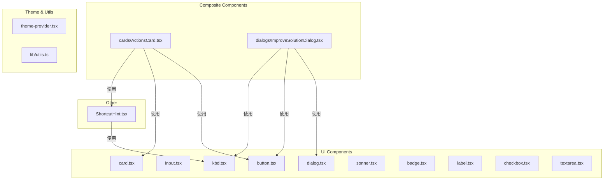
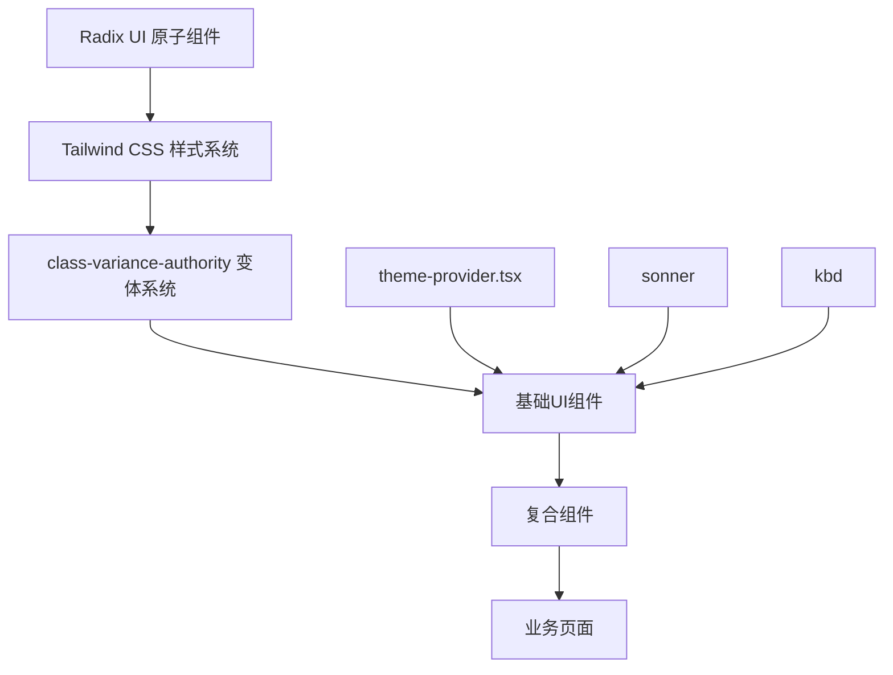
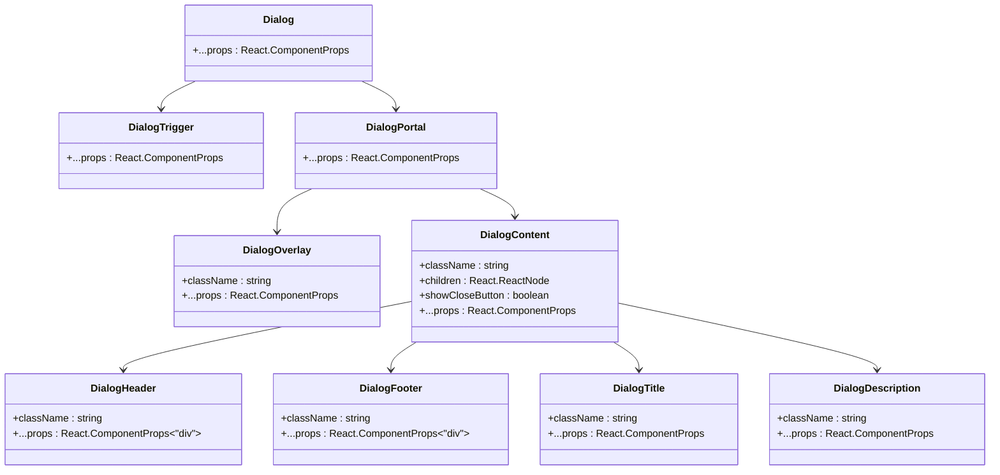
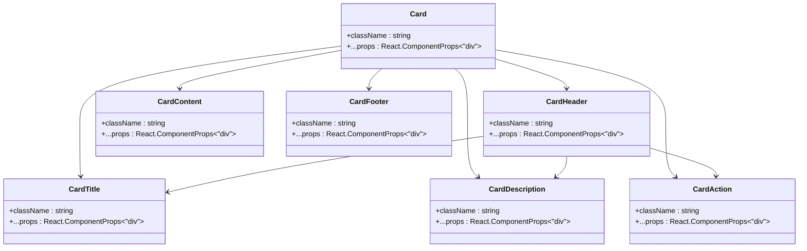
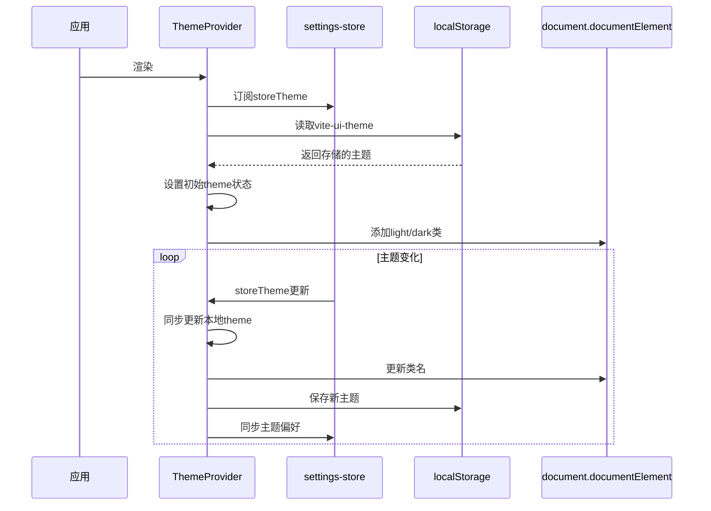
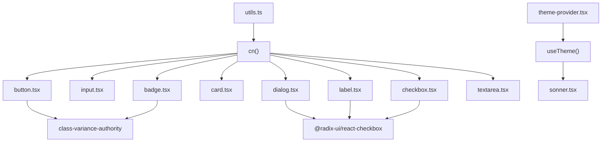

# 基础UI组件

<cite>
**本文档中引用的文件**  
- [button.tsx](file://src/components/ui/button.tsx)
- [input.tsx](file://src/components/ui/input.tsx)
- [dialog.tsx](file://src/components/ui/dialog.tsx)
- [card.tsx](file://src/components/ui/card.tsx)
- [sonner.tsx](file://src/components/ui/sonner.tsx)
- [kbd.tsx](file://src/components/ui/kbd.tsx)
- [badge.tsx](file://src/components/ui/badge.tsx)
- [label.tsx](file://src/components/ui/label.tsx)
- [checkbox.tsx](file://src/components/ui/checkbox.tsx)
- [textarea.tsx](file://src/components/ui/textarea.tsx)
- [theme-provider.tsx](file://src/components/theme-provider.tsx)
- [utils.ts](file://src/lib/utils.ts)
- [index.css](file://src/index.css)
- [ImproveSolutionDialog.tsx](file://src/components/dialogs/ImproveSolutionDialog.tsx)
- [ActionsCard.tsx](file://src/components/cards/ActionsCard.tsx)
- [ShortcutHint.tsx](file://src/components/ShortcutHint.tsx)
</cite>

## 目录
1. [简介](#简介)
2. [项目结构](#项目结构)
3. [核心组件](#核心组件)
4. [架构概览](#架构概览)
5. [详细组件分析](#详细组件分析)
6. [依赖分析](#依赖分析)
7. [性能考虑](#性能考虑)
8. [故障排除指南](#故障排除指南)
9. [结论](#结论)

## 简介
本项目构建了一个基于Radix UI和Tailwind CSS的统一设计系统，提供了一系列可复用的基础UI组件。这些组件通过`theme-provider.tsx`实现了暗色/亮色主题的动态切换，并利用`sonner`进行通知提示，`kbd`组件用于快捷键展示。组件库注重可访问性、响应式设计和自定义属性支持，形成了完整的前端UI解决方案。

## 项目结构
项目结构清晰地分离了不同类型的组件和功能模块，`components/ui/`目录下存放所有基础UI组件，其他目录则按功能组织复合组件和页面。



**Diagram sources**
- [button.tsx](file://src/components/ui/button.tsx)
- [card.tsx](file://src/components/ui/card.tsx)
- [dialog.tsx](file://src/components/ui/dialog.tsx)
- [kbd.tsx](file://src/components/ui/kbd.tsx)
- [ActionsCard.tsx](file://src/components/cards/ActionsCard.tsx)
- [ImproveSolutionDialog.tsx](file://src/components/dialogs/ImproveSolutionDialog.tsx)
- [ShortcutHint.tsx](file://src/components/ShortcutHint.tsx)

**Section sources**
- [button.tsx](file://src/components/ui/button.tsx)
- [card.tsx](file://src/components/ui/card.tsx)
- [dialog.tsx](file://src/components/ui/dialog.tsx)
- [kbd.tsx](file://src/components/ui/kbd.tsx)

## 核心组件
基础UI组件库包含按钮、输入框、对话框、卡片等高频使用组件，均基于Radix UI构建，确保了良好的可访问性和原生事件处理能力。通过`clsx`和`tailwind-merge`实现CSS类名的智能合并，支持灵活的样式定制。所有组件都遵循统一的设计语言，通过CSS变量和主题系统实现暗色/亮色模式切换。

**Section sources**
- [button.tsx](file://src/components/ui/button.tsx)
- [input.tsx](file://src/components/ui/input.tsx)
- [dialog.tsx](file://src/components/ui/dialog.tsx)
- [card.tsx](file://src/components/ui/card.tsx)
- [sonner.tsx](file://src/components/ui/sonner.tsx)
- [kbd.tsx](file://src/components/ui/kbd.tsx)

## 架构概览
整个UI组件库采用分层架构，底层是Radix UI提供的无障碍可访问组件，中间层是Tailwind CSS提供的原子化样式系统，上层是基于`class-variance-authority`的变体系统，最上层是业务组件对基础UI组件的组合使用。



**Diagram sources**
- [button.tsx](file://src/components/ui/button.tsx)
- [input.tsx](file://src/components/ui/input.tsx)
- [dialog.tsx](file://src/components/ui/dialog.tsx)
- [card.tsx](file://src/components/ui/card.tsx)
- [theme-provider.tsx](file://src/components/theme-provider.tsx)
- [sonner.tsx](file://src/components/ui/sonner.tsx)
- [kbd.tsx](file://src/components/ui/kbd.tsx)

## 详细组件分析
对各个核心UI组件进行深入分析，包括其视觉样式、可访问性支持、响应式行为及自定义属性。

### 按钮组件分析
按钮组件是系统中最常用的交互元素，支持多种变体和尺寸，具有完善的焦点管理和可访问性支持。

```mermaid
classDiagram
class Button {
+className : string
+variant : "default"|"destructive"|"outline"|"secondary"|"ghost"|"link"
+size : "default"|"sm"|"lg"|"icon"
+asChild : boolean
+...props : React.ComponentProps<"button">
}
Button -->|使用| cva : buttonVariants
Button -->|使用| cn : class合并
Button -->|代理| Slot : asChild
```

**Diagram sources**
- [button.tsx](file://src/components/ui/button.tsx#L7-L59)

**Section sources**
- [button.tsx](file://src/components/ui/button.tsx#L1-L60)

### 输入框组件分析
输入框组件提供了统一的样式和行为，支持各种输入类型，具有良好的可访问性和错误状态处理。

```mermaid
classDiagram
class Input {
+className : string
+type : string
+...props : React.ComponentProps<"input">
}
Input -->|使用| cn : class合并
Input -->|应用| aria-invalid : 可访问性
Input -->|应用| focus-visible : 焦点状态
```

**Diagram sources**
- [input.tsx](file://src/components/ui/input.tsx#L5-L21)

**Section sources**
- [input.tsx](file://src/components/ui/input.tsx#L1-L22)

### 对话框组件分析
对话框组件基于Radix UI的Dialog构建，提供了完整的模态对话框解决方案，包括遮罩层、内容区域、标题、描述和操作按钮。



**Diagram sources**
- [dialog.tsx](file://src/components/ui/dialog.tsx#L7-L141)

**Section sources**
- [dialog.tsx](file://src/components/ui/dialog.tsx#L1-L142)

### 卡片组件分析
卡片组件提供了内容容器的标准样式，支持标题、描述、操作按钮、内容和页脚的灵活布局。



**Diagram sources**
- [card.tsx](file://src/components/ui/card.tsx#L5-L92)

**Section sources**
- [card.tsx](file://src/components/ui/card.tsx#L1-L93)

### 主题系统分析
主题系统通过`ThemeProvider`组件和`useTheme` Hook实现，支持系统级、亮色和暗色三种主题模式，并与本地存储同步。



**Diagram sources**
- [theme-provider.tsx](file://src/components/theme-provider.tsx#L24-L83)

**Section sources**
- [theme-provider.tsx](file://src/components/theme-provider.tsx#L1-L94)

### 通知与快捷键组件分析
`sonner`通知组件和`kbd`快捷键组件提供了特定语义化的UI元素，增强了用户体验。

```mermaid
flowchart TD
A[Toaster] --> B[useTheme]
B --> C{主题}
C --> |light| D[应用浅色主题样式]
C --> |dark| E[应用深色主题样式]
C --> |system| F[根据系统偏好设置]
A --> G[设置CSS变量]
G --> H[--normal-bg: var(--popover)]
G --> I[--normal-text: var(--popover-foreground)]
G --> J[--normal-border: var(--border)]
K[Kbd] --> L[基础样式]
L --> M[背景: muted]
L --> N[文字: muted-foreground]
L --> O[圆角: sm]
K --> P[特殊状态]
P --> Q[在Tooltip中: 半透明背景]
```

**Diagram sources**
- [sonner.tsx](file://src/components/ui/sonner.tsx#L4-L23)
- [kbd.tsx](file://src/components/ui/kbd.tsx#L3-L28)

**Section sources**
- [sonner.tsx](file://src/components/ui/sonner.tsx#L1-L24)
- [kbd.tsx](file://src/components/ui/kbd.tsx#L1-L29)

## 依赖分析
UI组件库的依赖关系清晰，基础组件之间低耦合，通过统一的工具函数和样式系统保持一致性。



**Diagram sources**
- [utils.ts](file://src/lib/utils.ts#L4-L6)
- [theme-provider.tsx](file://src/components/theme-provider.tsx#L86-L93)
- [button.tsx](file://src/components/ui/button.tsx#L7-L59)
- [badge.tsx](file://src/components/ui/badge.tsx#L7-L47)
- [dialog.tsx](file://src/components/ui/dialog.tsx#L2)
- [label.tsx](file://src/components/ui/label.tsx#L2)
- [checkbox.tsx](file://src/components/ui/checkbox.tsx#L2)

**Section sources**
- [utils.ts](file://src/lib/utils.ts#L1-L7)
- [theme-provider.tsx](file://src/components/theme-provider.tsx#L1-L94)

## 性能考虑
UI组件库在性能方面做了多项优化，包括使用`memo`避免不必要的重渲染、通过`Slot`实现组件组合的灵活性、利用CSS变量实现主题切换的高效性等。`cn`工具函数通过`clsx`和`tailwind-merge`智能合并类名，避免了样式冲突和重复。

## 故障排除指南
当遇到UI组件显示异常时，可按以下步骤排查：
1. 检查是否正确包裹在`ThemeProvider`中
2. 确认`index.css`已正确引入
3. 验证组件的`asChild`属性使用是否正确
4. 检查主题相关的CSS变量是否正确设置
5. 确认Radix UI相关依赖已正确安装

**Section sources**
- [theme-provider.tsx](file://src/components/theme-provider.tsx#L24-L83)
- [index.css](file://src/index.css#L48-L115)

## 结论
该UI组件库成功构建了一个基于Radix UI和Tailwind CSS的现代化设计系统，提供了丰富的基础组件和完善的主题支持。通过合理的架构设计和代码组织，实现了组件的高复用性和易维护性，为项目的持续发展奠定了坚实的基础。