# 页面组件深度分析文档

<cite>
**本文档中引用的文件**
- [ScanPage.tsx](file://src/components/pages/ScanPage.tsx)
- [ChatPage.tsx](file://src/components/pages/ChatPage.tsx)
- [InitPage.tsx](file://src/components/pages/InitPage.tsx)
- [SettingsPage.tsx](file://src/components/pages/SettingsPage.tsx)
- [RequireAiKey.tsx](file://src/components/guards/RequireAiKey.tsx)
- [UploadArea.tsx](file://src/components/areas/UploadArea.tsx)
- [ActionsCard.tsx](file://src/components/cards/ActionsCard.tsx)
- [PreviewCard.tsx](file://src/components/cards/PreviewCard.tsx)
- [SolutionsArea.tsx](file://src/components/areas/SolutionsArea.tsx)
- [settings-store.ts](file://src/store/settings-store.ts)
- [problems-store.ts](file://src/store/problems-store.ts)
</cite>

## 目录
1. [概述](#概述)
2. [项目架构概览](#项目架构概览)
3. [ScanPage - 文件扫描与处理核心](#scanpage---文件扫描与处理核心)
4. [ChatPage - 实时对话交互界面](#chatpage---实时对话交互界面)
5. [InitPage - AI密钥初始化配置](#initpage---ai密钥初始化配置)
6. [SettingsPage - 全局配置管理](#settingspage---全局配置管理)
7. [状态管理系统](#状态管理系统)
8. [组件间通信机制](#组件间通信机制)
9. [访问控制与路由保护](#访问控制与路由保护)
10. [总结](#总结)

## 概述

SkidHomework是一个基于React和TypeScript构建的AI图像识别与问题解答应用，采用现代化的前端架构设计。本文档深入分析四个核心页面组件的实现结构、用户交互流程以及它们如何通过Zustand状态管理系统实现数据同步和组件间通信。

## 项目架构概览

系统采用分层架构设计，主要包含以下层次：

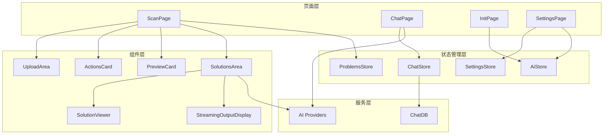

**图表来源**
- [ScanPage.tsx](file://src/components/pages/ScanPage.tsx#L1-L50)
- [ChatPage.tsx](file://src/components/pages/ChatPage.tsx#L1-L50)
- [InitPage.tsx](file://src/components/pages/InitPage.tsx#L1-L50)
- [SettingsPage.tsx](file://src/components/pages/SettingsPage.tsx#L1-L50)

## ScanPage - 文件扫描与处理核心

ScanPage是系统的核心功能页面，负责处理用户上传的图片或PDF文件，并通过AI模型进行智能解析和问题识别。

### 核心功能架构

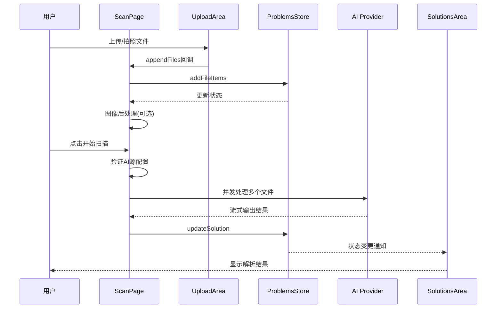

**图表来源**
- [ScanPage.tsx](file://src/components/pages/ScanPage.tsx#L106-L170)
- [UploadArea.tsx](file://src/components/areas/UploadArea.tsx#L39-L55)
- [problems-store.ts](file://src/store/problems-store.ts#L82-L87)

### 文件上传与预处理流程

ScanPage集成了UploadArea组件实现完整的文件上传功能：

1. **多格式支持**: 支持图片文件和PDF文档上传
2. **图像二值化**: 可选的图像后处理功能
3. **并发处理**: 最大支持4个文件同时处理
4. **错误重试**: 实现指数退避算法的重试机制

### AI处理工作流

系统支持多个AI提供商的配置和轮询：

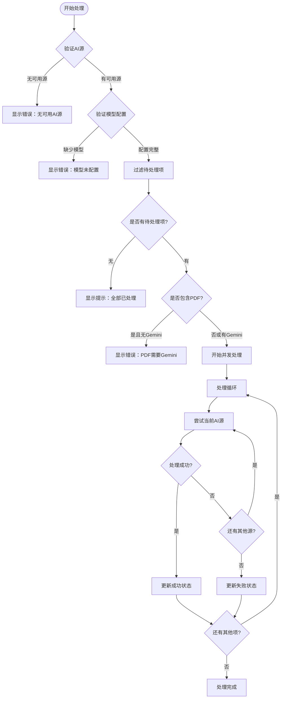

**图表来源**
- [ScanPage.tsx](file://src/components/pages/ScanPage.tsx#L220-L390)

### 响应式布局设计

ScanPage实现了自适应布局，支持移动端和桌面端的不同交互方式：

- **移动端**: 使用标签页切换上传和预览功能
- **桌面端**: 采用三列布局，左侧为操作面板，中间为预览区，右侧为解决方案展示

**章节来源**
- [ScanPage.tsx](file://src/components/pages/ScanPage.tsx#L1-L552)
- [UploadArea.tsx](file://src/components/areas/UploadArea.tsx#L1-L176)
- [ActionsCard.tsx](file://src/components/cards/ActionsCard.tsx#L1-L125)
- [PreviewCard.tsx](file://src/components/cards/PreviewCard.tsx#L1-L227)

## ChatPage - 实时对话交互界面

ChatPage提供了强大的实时对话功能，支持多轮对话、上下文管理和多种AI提供商的无缝切换。

### 对话系统架构

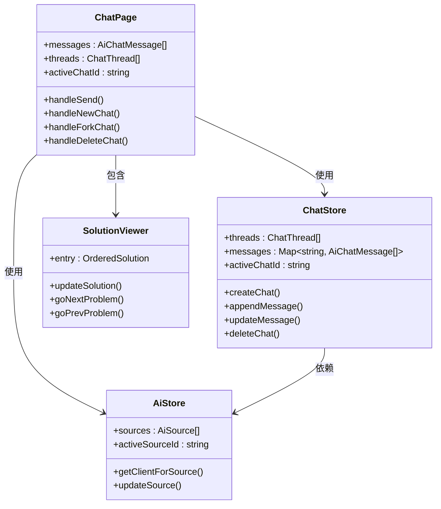

**图表来源**
- [ChatPage.tsx](file://src/components/pages/ChatPage.tsx#L67-L120)
- [chat-store.ts](file://src/store/chat-store.ts)

### 多源AI管理

ChatPage支持动态切换不同的AI提供商：

1. **源选择器**: 通过下拉菜单选择活跃的AI源
2. **模型管理**: 支持自定义模型名称覆盖默认值
3. **上下文保持**: 在不同会话间保持用户配置

### 侧边栏导航系统

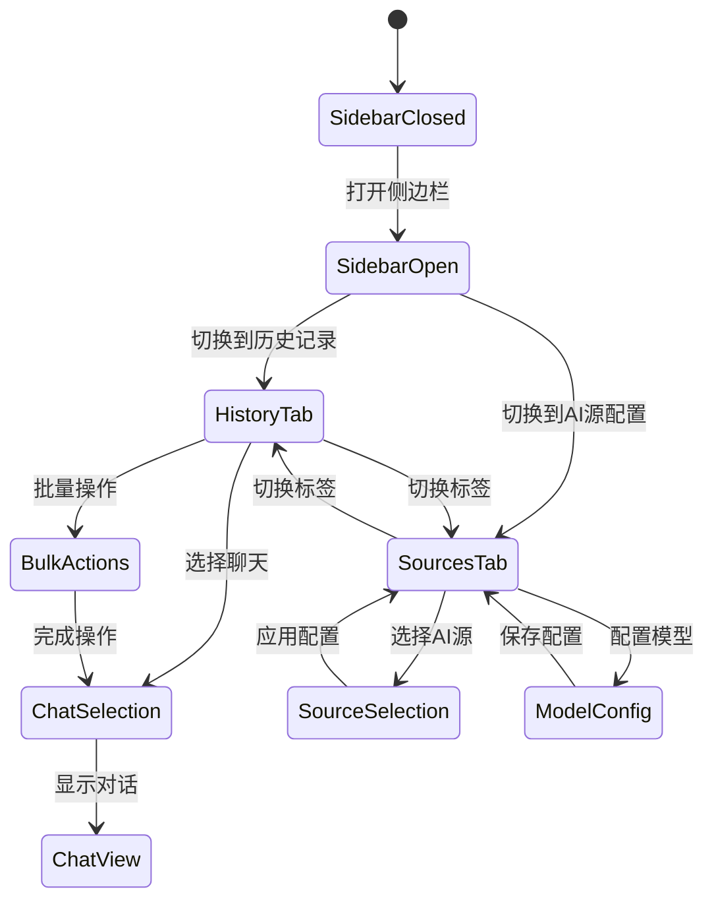

**图表来源**
- [ChatPage.tsx](file://src/components/pages/ChatPage.tsx#L600-L796)

### 实时流式响应

系统实现了高效的流式响应机制：

- **增量更新**: 实时显示AI生成的内容
- **错误恢复**: 处理网络中断和API错误
- **性能优化**: 使用防抖和节流技术

**章节来源**
- [ChatPage.tsx](file://src/components/pages/ChatPage.tsx#L1-L976)

## InitPage - AI密钥初始化配置

InitPage专门用于首次配置AI提供商的API密钥和其他必要参数，确保系统能够正常运行。

### 配置流程设计

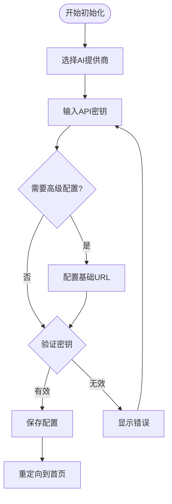

**图表来源**
- [InitPage.tsx](file://src/components/pages/InitPage.tsx#L46-L64)

### 多提供商支持

InitPage支持多种AI提供商的配置：

- **Google Gemini**: 默认使用官方API
- **OpenAI**: 支持GPT系列模型
- **自定义提供商**: 支持自定义基础URL

### 安全性考虑

1. **本地存储**: API密钥仅存储在浏览器本地
2. **密码输入**: 使用type="password"防止明文显示
3. **即时验证**: 提交时立即验证密钥有效性

**章节来源**
- [InitPage.tsx](file://src/components/pages/InitPage.tsx#L1-L300)

## SettingsPage - 全局配置管理

SettingsPage提供了全面的系统配置选项，包括AI源管理、外观偏好、快捷键设置等。

### 配置分类体系

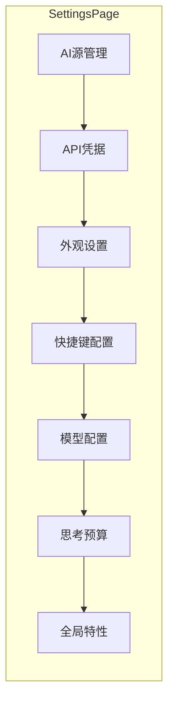

**图表来源**
- [SettingsPage.tsx](file://src/components/pages/SettingsPage.tsx#L61-L800)

### AI源管理功能

SettingsPage实现了完整的AI源生命周期管理：

1. **添加新源**: 支持动态添加多个AI提供商实例
2. **源切换**: 实现活跃源的快速切换
3. **启用/禁用**: 控制特定源的可用性
4. **删除保护**: 防止删除唯一活跃源

### 主题与语言偏好

系统支持灵活的主题和语言配置：

- **主题选项**: light、dark、system三种模式
- **语言切换**: 英语和中文双语支持
- **持久化**: 配置自动保存到localStorage

### 快捷键系统

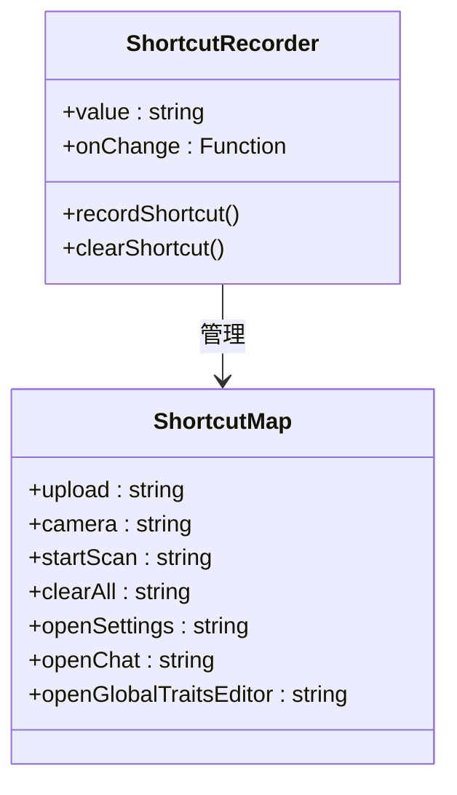

**图表来源**
- [settings-store.ts](file://src/store/settings-store.ts#L6-L15)

**章节来源**
- [SettingsPage.tsx](file://src/components/pages/SettingsPage.tsx#L1-L935)
- [settings-store.ts](file://src/store/settings-store.ts#L1-L116)

## 状态管理系统

系统采用Zustand作为状态管理解决方案，实现了清晰的状态分离和高效的数据流。

### 状态架构设计

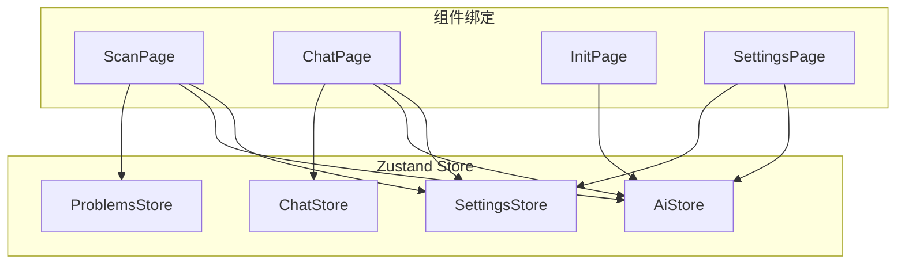

**图表来源**
- [problems-store.ts](file://src/store/problems-store.ts#L72-L281)
- [settings-store.ts](file://src/store/settings-store.ts#L53-L116)

### ProblemsStore - 文件处理状态

ProblemsStore管理所有文件上传和AI处理相关的状态：

| 状态字段 | 类型 | 描述 |
|---------|------|------|
| imageItems | FileItem[] | 上传的文件列表 |
| imageSolutions | Map<string, Solution> | 文件对应的解决方案映射 |
| selectedImage | string \| undefined | 当前选中的图片URL |
| selectedProblem | number | 当前选中的问题索引 |
| isWorking | boolean | 是否正在处理中 |

### SettingsStore - 全局配置状态

SettingsStore集中管理用户的个性化配置：

| 配置项 | 类型 | 默认值 | 描述 |
|--------|------|--------|------|
| imageBinarizing | boolean | false | 是否启用图像二值化 |
| theme | ThemePreference | "system" | 主题偏好设置 |
| language | LanguagePreference | "en"/"zh" | 语言偏好设置 |
| keybindings | ShortcutMap | 默认快捷键 | 键盘快捷键配置 |
| traits | string | "" | 全局AI特性描述 |

**章节来源**
- [problems-store.ts](file://src/store/problems-store.ts#L1-L281)
- [settings-store.ts](file://src/store/settings-store.ts#L1-L116)

## 组件间通信机制

系统通过多种机制实现组件间的高效通信：

### Props传递模式

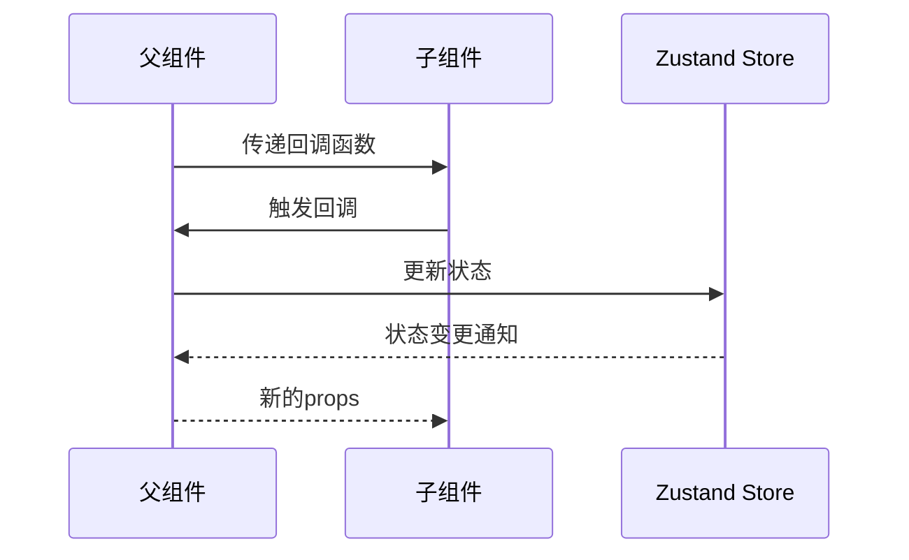

**图表来源**
- [ActionsCard.tsx](file://src/components/cards/ActionsCard.tsx#L15-L24)
- [PreviewCard.tsx](file://src/components/cards/PreviewCard.tsx#L13-L18)

### 事件回调机制

各页面组件通过标准化的事件回调实现功能扩展：

1. **文件操作**: `appendFiles`, `removeItem`, `clearAll`
2. **AI处理**: `startScan`, `updateSolution`
3. **导航控制**: `handleNewChat`, `handleSettingsBtnClick`

### 状态订阅模式

组件通过`useStore`钩子订阅状态变化：

```typescript
// 示例：状态订阅模式
const { imageItems, addFileItems } = useProblemsStore((state) => ({
  imageItems: state.imageItems,
  addFileItems: state.addFileItems
}));
```

## 访问控制与路由保护

系统实现了完善的访问控制系统，确保只有授权用户才能访问特定功能。

### RequireAiKey守卫组件

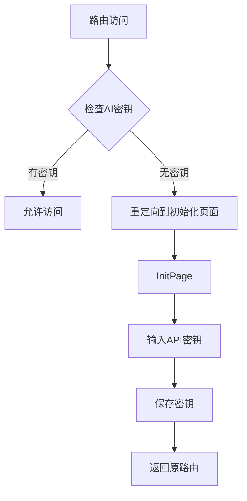

**图表来源**
- [RequireAiKey.tsx](file://src/components/guards/RequireAiKey.tsx#L1-L22)

### 路由保护策略

1. **ScanPage**: 需要有效的AI密钥才能访问
2. **ChatPage**: 同样需要AI密钥认证
3. **SettingsPage**: 无需特殊权限，但某些配置需要密钥验证

### 权限验证流程

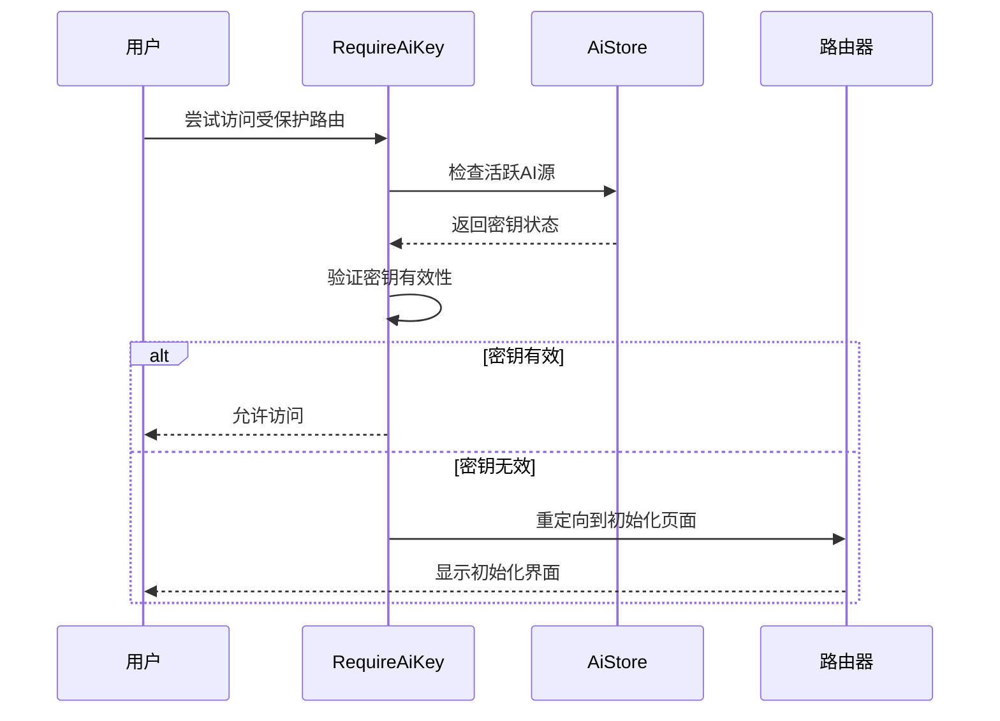

**图表来源**
- [RequireAiKey.tsx](file://src/components/guards/RequireAiKey.tsx#L10-L21)

**章节来源**
- [RequireAiKey.tsx](file://src/components/guards/RequireAiKey.tsx#L1-L22)

## 总结

SkidHomework的四个核心页面组件展现了现代React应用的最佳实践：

1. **模块化设计**: 每个页面都有明确的职责边界
2. **状态管理**: 通过Zustand实现高效的状态共享
3. **组件复用**: 底层组件可在多个页面中重复使用
4. **用户体验**: 响应式设计和流畅的交互体验
5. **可维护性**: 清晰的代码结构和类型安全

这种架构设计不仅保证了系统的稳定性和可扩展性，也为未来的功能扩展奠定了坚实的基础。通过合理的组件拆分和状态管理，开发者可以轻松地添加新功能或修改现有行为，而不会影响系统的整体稳定性。