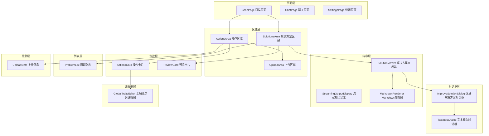
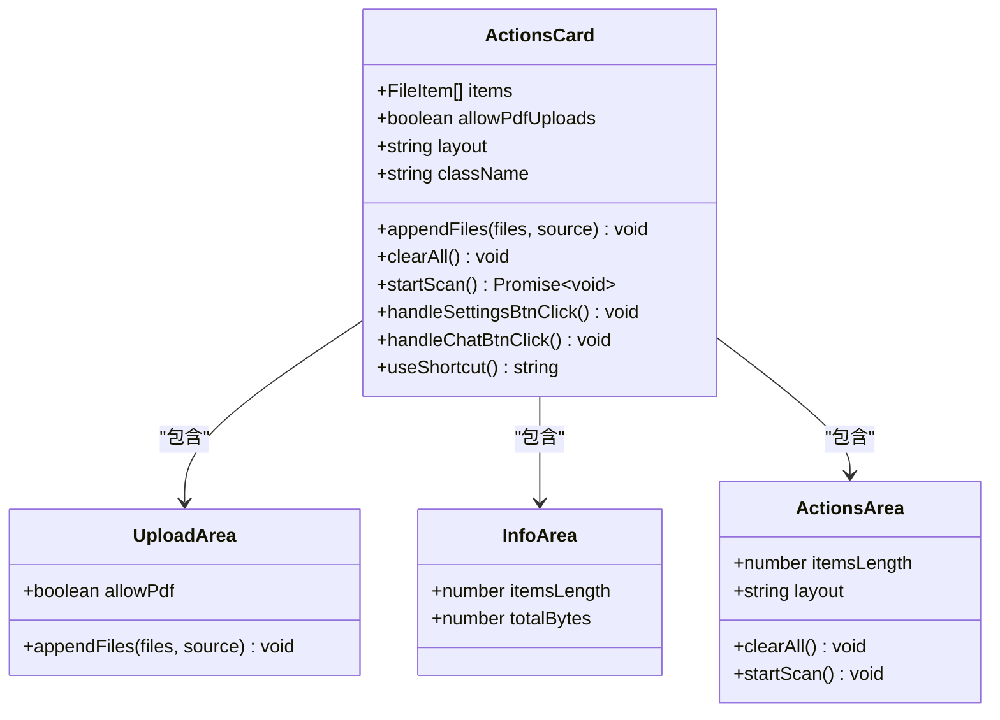
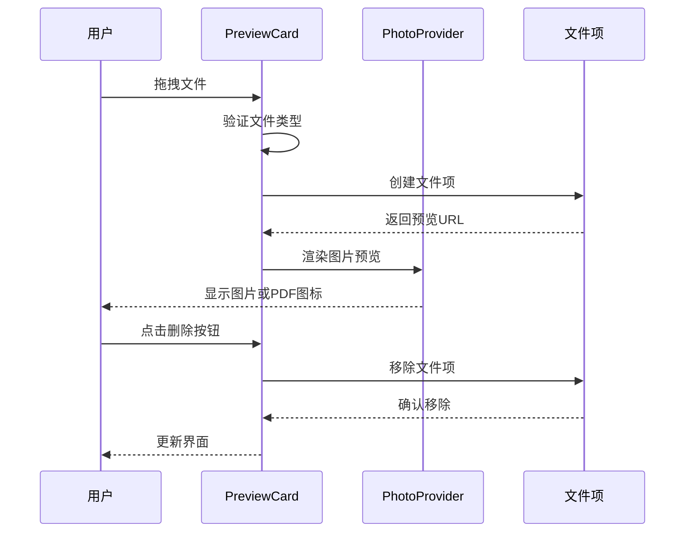
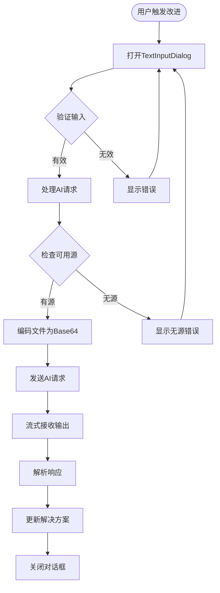
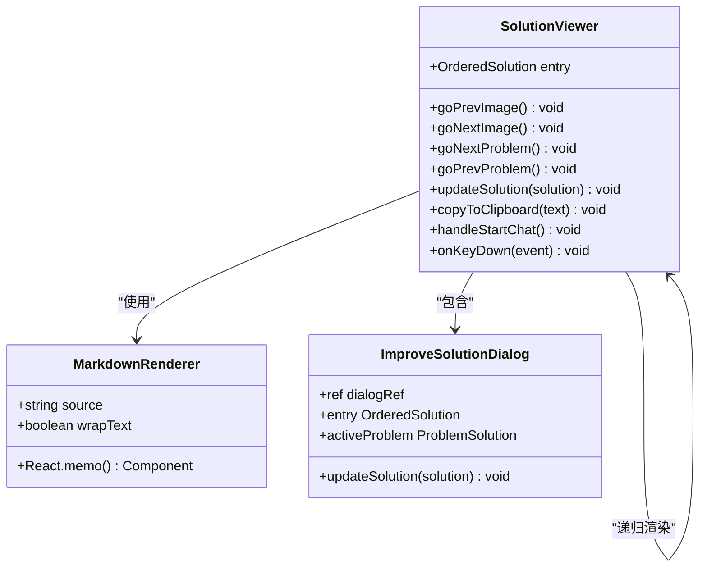
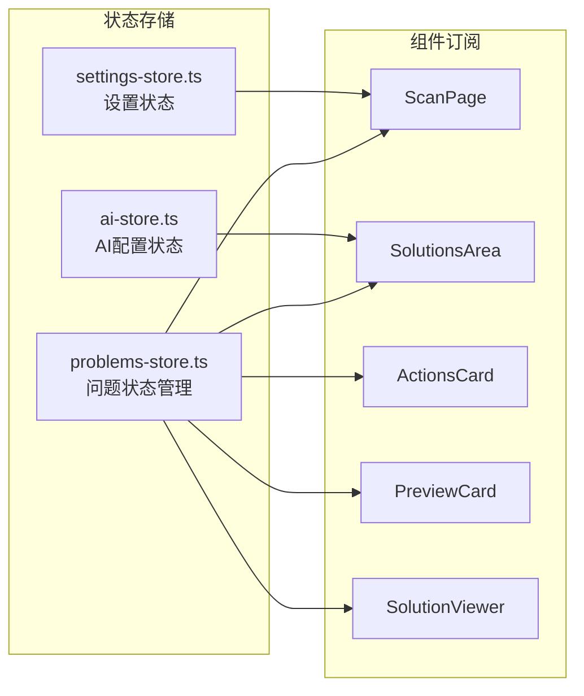
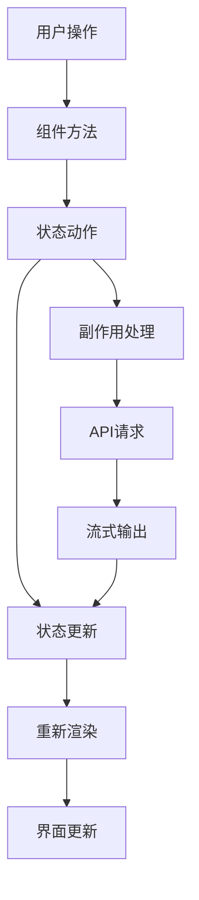
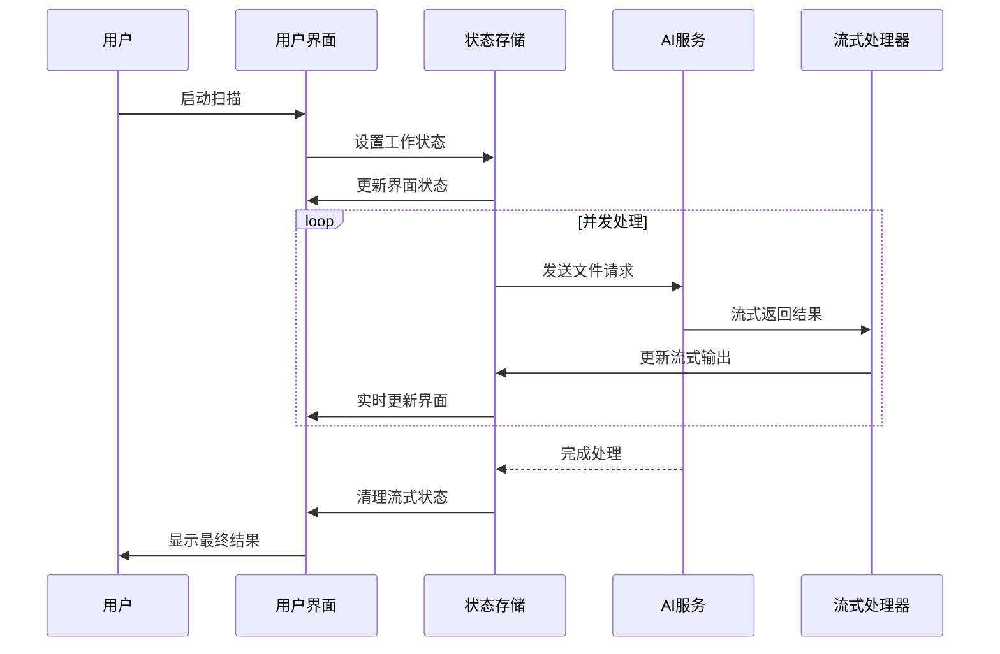
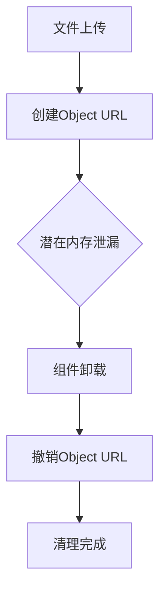

# 高级UI组件

<cite>
**本文档中引用的文件**
- [ActionsCard.tsx](file://src/components/cards/ActionsCard.tsx)
- [PreviewCard.tsx](file://src/components/cards/PreviewCard.tsx)
- [ImproveSolutionDialog.tsx](file://src/components/dialogs/ImproveSolutionDialog.tsx)
- [TextInputDialog.tsx](file://src/components/dialogs/TextInputDialog.tsx)
- [SolutionViewer.tsx](file://src/components/SolutionViewer.tsx)
- [StreamingOutputDisplay.tsx](file://src/components/StreamingOutputDisplay.tsx)
- [GlobalTraitsEditor.tsx](file://src/components/GlobalTraitsEditor.tsx)
- [ProblemList.tsx](file://src/components/ProblemList.tsx)
- [UploadsInfo.tsx](file://src/components/UploadsInfo.tsx)
- [ScanPage.tsx](file://src/components/pages/ScanPage.tsx)
- [SolutionsArea.tsx](file://src/components/areas/SolutionsArea.tsx)
- [problems-store.ts](file://src/store/problems-store.ts)
- [MarkdownRenderer.tsx](file://src/components/MarkdownRenderer.tsx)
</cite>

## 目录
1. [简介](#简介)
2. [项目结构概览](#项目结构概览)
3. [核心复合型UI组件](#核心复合型ui组件)
4. [状态管理系统](#状态管理系统)
5. [组件架构分析](#组件架构分析)
6. [交互行为与用户体验](#交互行为与用户体验)
7. [性能优化策略](#性能优化策略)
8. [故障排除指南](#故障排除指南)
9. [总结](#总结)

## 简介

本文档深入分析了skid-homework项目中的复合型高级UI组件系统。这些组件不仅仅是简单的界面元素，而是封装了复杂业务逻辑、状态管理和用户交互行为的完整解决方案。通过Zustand状态管理库，这些组件实现了响应式的数据流和高效的用户交互体验。

项目中的高级UI组件主要分为以下几个类别：
- **卡片组件**：ActionsCard和PreviewCard负责文件上传和预览功能
- **对话框组件**：ImproveSolutionDialog和TextInputDialog提供模态交互
- **内容渲染组件**：SolutionViewer和StreamingOutputDisplay处理AI输出展示
- **编辑器组件**：GlobalTraitsEditor提供全局配置功能
- **列表组件**：ProblemList管理多问题状态
- **信息组件**：UploadsInfo显示文件元数据

## 项目结构概览

项目的组件架构采用分层设计，从底层的基础UI组件到顶层的业务逻辑组件：



**图表来源**
- [ScanPage.tsx](file://src/components/pages/ScanPage.tsx#L1-L552)
- [SolutionsArea.tsx](file://src/components/areas/SolutionsArea.tsx#L1-L528)
- [ActionsArea.tsx](file://src/components/areas/ActionsArea.tsx)
- [UploadArea.tsx](file://src/components/areas/UploadArea.tsx)

## 核心复合型UI组件

### ActionsCard：扫描页面的操作中心

ActionsCard是扫描页面的核心控制面板，整合了文件上传、状态管理和导航功能。



**图表来源**
- [ActionsCard.tsx](file://src/components/cards/ActionsCard.tsx#L15-L24)
- [UploadArea.tsx](file://src/components/areas/UploadArea.tsx)
- [UploadsInfo.tsx](file://src/components/UploadsInfo.tsx#L14-L17)

**节来源**
- [ActionsCard.tsx](file://src/components/cards/ActionsCard.tsx#L1-L125)

### PreviewCard：文件预览与管理

PreviewCard提供了强大的文件预览功能，支持拖拽上传、图片查看和PDF预览。



**图表来源**
- [PreviewCard.tsx](file://src/components/cards/PreviewCard.tsx#L47-L57)
- [PhotoProvider](file://src/components/cards/PreviewCard.tsx#L109-L208)

**节来源**
- [PreviewCard.tsx](file://src/components/cards/PreviewCard.tsx#L1-L227)

### ImproveSolutionDialog：智能改进对话框

ImproveSolutionDialog是一个复杂的模态交互组件，集成了AI对话框和文本输入功能。



**图表来源**
- [ImproveSolutionDialog.tsx](file://src/components/dialogs/ImproveSolutionDialog.tsx#L58-L138)
- [TextInputDialog.tsx](file://src/components/dialogs/TextInputDialog.tsx#L31-L89)

**节来源**
- [ImproveSolutionDialog.tsx](file://src/components/dialogs/ImproveSolutionDialog.tsx#L1-L161)
- [TextInputDialog.tsx](file://src/components/dialogs/TextInputDialog.tsx#L1-L90)

### SolutionViewer：AI内容渲染器

SolutionViewer是解决方案展示的核心组件，负责渲染AI生成的Markdown内容并支持代码高亮。



**图表来源**
- [SolutionViewer.tsx](file://src/components/SolutionViewer.tsx#L24-L32)
- [MarkdownRenderer.tsx](file://src/components/MarkdownRenderer.tsx#L13-L31)

**节来源**
- [SolutionViewer.tsx](file://src/components/SolutionViewer.tsx#L1-L302)
- [MarkdownRenderer.tsx](file://src/components/MarkdownRenderer.tsx#L1-L32)

### GlobalTraitsEditor：全局配置编辑器

GlobalTraitsEditor提供了一个简洁的全局提示词编辑功能，通过TextInputDialog实现模态编辑。

**节来源**
- [GlobalTraitsEditor.tsx](file://src/components/GlobalTraitsEditor.tsx#L1-L55)

### ProblemList：多问题状态管理

ProblemList负责管理单个图像中的多个问题，并支持动态更新和选择状态。

**节来源**
- [ProblemList.tsx](file://src/components/ProblemList.tsx#L1-L37)

### UploadsInfo：文件元数据显示

UploadsInfo展示了上传文件的数量和总大小，提供直观的文件管理信息。

**节来源**
- [UploadsInfo.tsx](file://src/components/UploadsInfo.tsx#L1-L35)

## 状态管理系统

项目使用Zustand作为状态管理解决方案，实现了高效的状态共享和组件间通信。



**图表来源**
- [problems-store.ts](file://src/store/problems-store.ts#L72-L281)
- [ScanPage.tsx](file://src/components/pages/ScanPage.tsx#L30-L44)

**节来源**
- [problems-store.ts](file://src/store/problems-store.ts#L1-L281)

## 组件架构分析

### 数据流架构

项目采用了单向数据流架构，确保状态变更的可预测性和调试便利性：



**图表来源**
- [ScanPage.tsx](file://src/components/pages/ScanPage.tsx#L106-L170)
- [SolutionsArea.tsx](file://src/components/areas/SolutionsArea.tsx#L257-L268)

### 组件间通信机制

组件间通过以下方式实现通信：

1. **属性传递**：父组件向子组件传递props
2. **回调函数**：子组件调用父组件提供的回调
3. **状态共享**：通过Zustand store共享状态
4. **事件系统**：键盘快捷键和手势事件

**节来源**
- [ScanPage.tsx](file://src/components/pages/ScanPage.tsx#L487-L502)
- [SolutionsArea.tsx](file://src/components/areas/SolutionsArea.tsx#L435-L440)

## 交互行为与用户体验

### 键盘快捷键系统

项目实现了完整的键盘导航系统，支持多种快捷键操作：

| 快捷键组合 | 功能描述 | 触发组件 |
|-----------|----------|----------|
| `/` | 打开改进对话框 | SolutionViewer |
| `Ctrl+Shift+C` | 复制答案到剪贴板 | SolutionViewer |
| `Space` | 下一个问题 | SolutionsArea |
| `Shift+Space` | 上一个问题 | SolutionsArea |
| `Tab` | 下一张图片 | SolutionsArea |
| `Shift+Tab` | 上一张图片 | SolutionsArea |
| `Ctrl+Enter` | 提交对话框 | TextInputDialog |

### 响应式设计

组件支持移动端和桌面端的不同布局：

```mermaid
graph TB
subgraph "桌面端布局"
DesktopLayout[三列布局<br/>ActionsCard | PreviewCard | SolutionsArea]
end
subgraph "移动端布局"
MobileLayout[标签页布局<br/>捕获/预览切换]
end
MediaQuery[媒体查询检测] --> DesktopLayout
MediaQuery --> MobileLayout
```

**图表来源**
- [ScanPage.tsx](file://src/components/pages/ScanPage.tsx#L464-L506)

**节来源**
- [ScanPage.tsx](file://src/components/pages/ScanPage.tsx#L71-L75)

### 异步数据处理

项目实现了复杂的异步数据处理流程：



**图表来源**
- [ScanPage.tsx](file://src/components/pages/ScanPage.tsx#L275-L398)
- [SolutionsArea.tsx](file://src/components/areas/SolutionsArea.tsx#L480-L487)

**节来源**
- [ScanPage.tsx](file://src/components/pages/ScanPage.tsx#L275-L398)

## 性能优化策略

### 组件记忆化

项目广泛使用React.memo进行组件记忆化：

```typescript
// MarkdownRenderer组件的记忆化
export const MemoizedMarkdown = React.memo(MarkdownRenderer);

// 使用场景：避免不必要的Markdown重渲染
```

### 状态优化

状态管理采用以下优化策略：

1. **Map数据结构**：使用Map替代数组进行O(1)查找
2. **部分更新**：只更新发生变化的状态字段
3. **批量操作**：合并多个状态更新操作

### 内存管理

项目实现了完善的内存管理机制：



**图表来源**
- [ScanPage.tsx](file://src/components/pages/ScanPage.tsx#L92-L97)

**节来源**
- [ScanPage.tsx](file://src/components/pages/ScanPage.tsx#L92-L97)

## 故障排除指南

### 常见问题与解决方案

| 问题类型 | 症状描述 | 可能原因 | 解决方案 |
|---------|----------|----------|----------|
| AI请求失败 | 解决方案无法生成 | API密钥缺失或网络问题 | 检查AI配置和网络连接 |
| 文件上传失败 | 文件无法添加到列表 | 文件格式不支持或大小超限 | 验证文件格式和大小限制 |
| 界面卡顿 | 滚动或切换缓慢 | 大量数据渲染 | 启用虚拟滚动和组件记忆化 |
| 内存泄漏 | 应用运行时间长后变慢 | Object URL未正确清理 | 确保组件卸载时清理资源 |

### 调试技巧

1. **状态检查**：使用浏览器开发者工具监控Zustand状态
2. **性能分析**：使用React Profiler分析组件渲染性能
3. **网络监控**：检查AI请求的网络状态和响应时间
4. **内存监控**：观察Object URL的创建和销毁情况

**节来源**
- [ScanPage.tsx](file://src/components/pages/ScanPage.tsx#L350-L358)

## 总结

skid-homework项目中的高级UI组件系统展现了现代前端开发的最佳实践。通过合理的架构设计、完善的状态管理和优秀的用户体验，这些组件实现了复杂业务逻辑的封装和高效的数据流转。

### 关键特性

1. **模块化设计**：每个组件职责单一，易于维护和测试
2. **状态管理**：使用Zustand实现高效的状态共享和更新
3. **响应式交互**：支持键盘导航、触摸手势等多种交互方式
4. **性能优化**：通过记忆化、虚拟滚动等技术提升性能
5. **错误处理**：完善的错误边界和用户友好的错误提示

### 技术亮点

- **流式数据处理**：实时显示AI生成的内容
- **智能状态同步**：自动处理组件间的状态一致性
- **跨平台兼容**：统一的代码同时支持桌面和移动设备
- **国际化支持**：完整的多语言本地化框架

这套高级UI组件系统不仅满足了当前的功能需求，更为未来的功能扩展奠定了坚实的技术基础。通过持续的优化和改进，它将继续为用户提供卓越的使用体验。