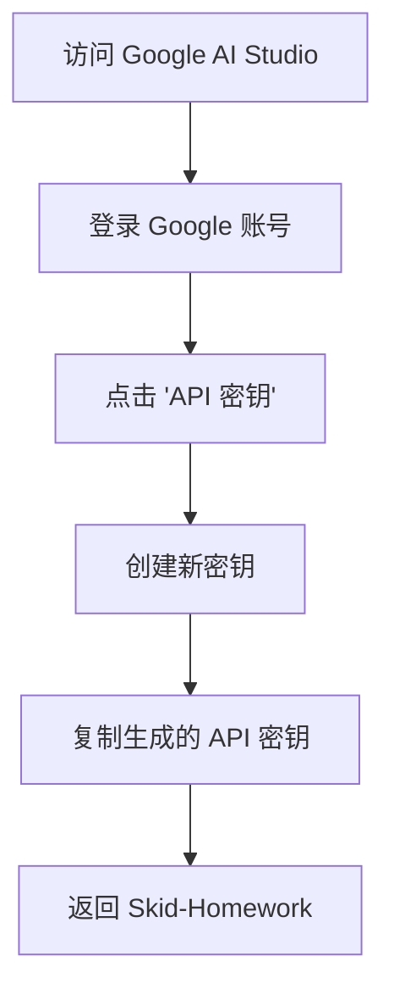
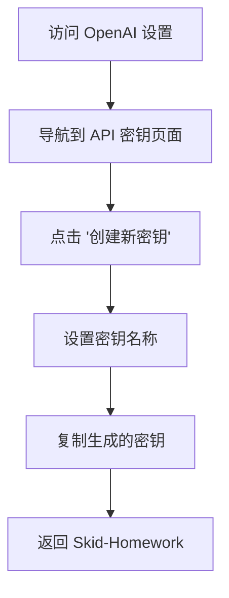
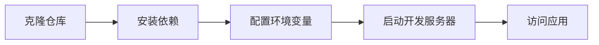
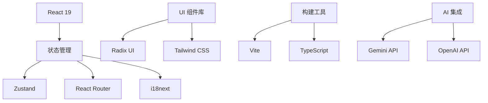
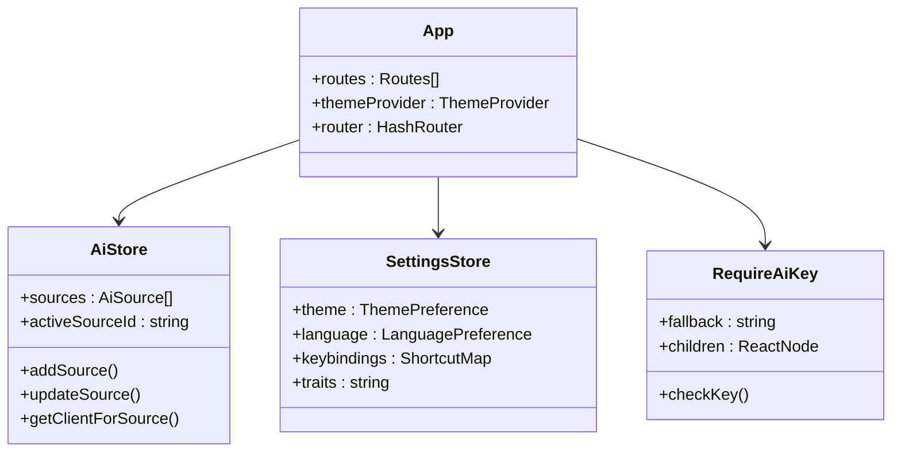
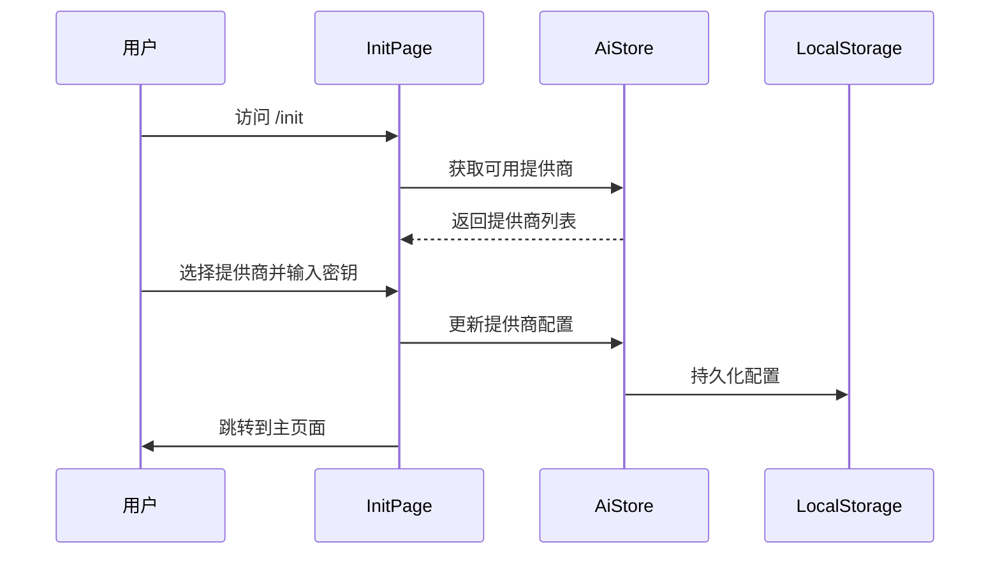
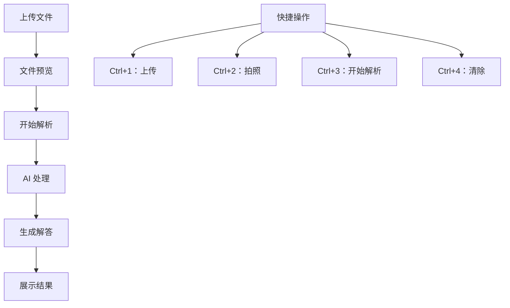
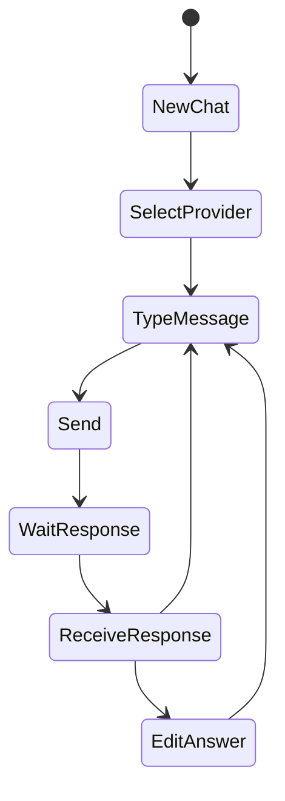
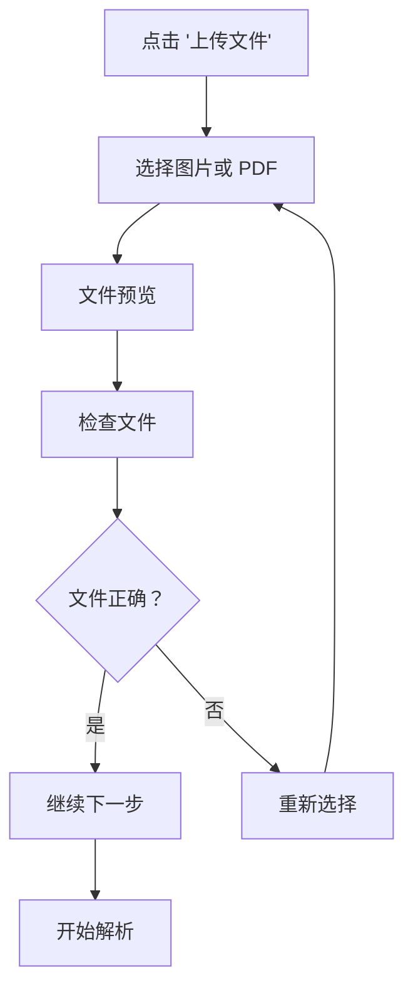
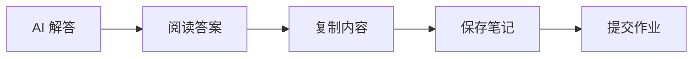

# 快速开始

<cite>
**本文档中引用的文件**
- [README.md](file://README.md)
- [package.json](file://package.json)
- [vite.config.ts](file://vite.config.ts)
- [src/main.tsx](file://src/main.tsx)
- [src/App.tsx](file://src/App.tsx)
- [src/components/pages/InitPage.tsx](file://src/components/pages/InitPage.tsx)
- [src/components/pages/ScanPage.tsx](file://src/components/pages/ScanPage.tsx)
- [src/components/pages/ChatPage.tsx](file://src/components/pages/ChatPage.tsx)
- [src/components/pages/SettingsPage.tsx](file://src/components/pages/SettingsPage.tsx)
- [src/store/settings-store.ts](file://src/store/settings-store.ts)
- [src/store/ai-store.ts](file://src/store/ai-store.ts)
- [src/ai/gemini.ts](file://src/ai/gemini.ts)
- [src/ai/openai.ts](file://src/ai/openai.ts)
- [src/components/guards/RequireAiKey.tsx](file://src/components/guards/RequireAiKey.tsx)
</cite>

## 目录
1. [简介](#简介)
2. [访问官方实例](#访问官方实例)
3. [配置API密钥](#配置api密钥)
4. [本地开发环境搭建](#本地开发环境搭建)
5. [项目架构概览](#项目架构概览)
6. [核心页面介绍](#核心页面介绍)
7. [完整操作流程](#完整操作流程)
8. [快捷键说明](#快捷键说明)
9. [常见问题解决](#常见问题解决)
10. [总结](#总结)

## 简介

Skid-Homework 是一个开源的 AI 家庭作业解答器，专为自学者设计，能够帮助用户快速解析作业题目并提供详细解答。该项目采用现代化的前端技术栈，支持多种 AI 提供商，具有直观的用户界面和强大的功能特性。

### 主要特性
- **节省时间**：高效的工作流程，快速获得作业解答
- **隐私保护**：无遥测、无垃圾电话、无需电话号码
- **跨平台访问**：支持电脑、平板电脑和手机
- **人体工程学设计**：支持纯键盘操作
- **多格式支持**：支持解析多张图片/PDF 文件
- **可定制性**：支持自定义答案风格

## 访问官方实例

### 方式一：直接使用在线版本

最简单的方式是直接访问官方部署的在线版本：

1. 打开浏览器，访问：[https://skid.996every.day](https://skid.996every.day)
2. 页面加载完成后，您将看到应用程序的主界面
3. 首次访问时，系统会自动跳转到初始化页面配置 API 密钥

### 方式二：使用镜像站点

如果遇到访问限制，可以尝试以下镜像站点：
- [https://skid.996every.day](https://skid.996every.day)（推荐）
- [https://skid-homework.vercel.app](https://skid-homework.vercel.app)

## 配置API密钥

### 获取API密钥

Skid-Homework 需要配置有效的 API 密钥才能使用 AI 功能。支持两种主要的 AI 提供商：

#### 1. Google Gemini API 密钥



**步骤：**
1. 访问 [Google AI Studio](https://aistudio.google.com/api-keys)
2. 使用 Google 账号登录
3. 点击右上角的 "API 密钥" 按钮
4. 点击 "创建新密钥" 按钮
5. 复制生成的 API 密钥
6. 返回 Skid-Homework 并粘贴密钥

#### 2. OpenAI API 密钥



**步骤：**
1. 访问 [OpenAI 组织设置](https://platform.openai.com/settings/organization/api-keys)
2. 登录 OpenAI 账号
3. 点击 "创建新密钥" 按钮
4. 设置密钥名称（如 "Skid-Homework"）
5. 复制生成的 API 密钥
6. 返回 Skid-Homework 并粘贴密钥

### 配置步骤

1. **首次访问**：打开 [https://skid.996every.day](https://skid.996every.day)
2. **选择提供商**：在初始化页面选择 "Gemini" 或 "OpenAI"
3. **输入密钥**：在提供的输入框中粘贴您的 API 密钥
4. **确认配置**：点击 "提交" 按钮完成配置
5. **开始使用**：系统会自动跳转到主页面

**注意**：API 密钥仅保存在您的浏览器本地存储中，不会发送到任何服务器。

## 本地开发环境搭建

### 系统要求

- **Node.js**：版本 18 或更高
- **包管理器**：pnpm（推荐）或 npm
- **操作系统**：Windows、macOS 或 Linux

### 安装步骤

#### 1. 克隆仓库

```bash
# 使用 HTTPS
git clone https://github.com/996-ai/skid-homework.git

# 或使用 SSH
git clone git@github.com:996-ai/skid-homework.git
```

#### 2. 进入项目目录

```bash
cd skid-homework
```

#### 3. 安装依赖

```bash
# 使用 pnpm（推荐）
pnpm install

# 或使用 npm
npm install
```

#### 4. 启动开发服务器

```bash
# 启动开发服务器
pnpm run dev

# 或使用 npm
npm run dev
```

#### 5. 访问应用

启动成功后，打开浏览器访问：
- **本地开发环境**：[http://localhost:5173](http://localhost:5173)
- **终端显示**：通常会在终端看到类似 "Local: http://localhost:5173" 的提示

### 开发环境配置



**项目结构说明：**
- `src/`：源代码目录
- `public/`：静态资源文件
- `package.json`：项目依赖和脚本配置
- `vite.config.ts`：Vite 构建工具配置

**常见安装问题：**

1. **pnpm 安装失败**：确保已安装 pnpm，或改用 npm
2. **端口冲突**：开发服务器默认使用 5173 端口，可修改 `vite.config.ts` 配置
3. **依赖版本冲突**：清理缓存后重新安装：`pnpm install --force`

## 项目架构概览

### 技术栈



### 核心架构组件



**图表来源**
- [src/App.tsx](file://src/App.tsx#L1-L54)
- [src/store/ai-store.ts](file://src/store/ai-store.ts#L1-L275)
- [src/store/settings-store.ts](file://src/store/settings-store.ts#L1-L116)

### 应用入口点

应用的入口点位于 `src/main.tsx`：

**文件路径**：[`src/main.tsx`](file://src/main.tsx#L1-L12)

该文件负责：
1. 初始化国际化配置
2. 加载样式表
3. 渲染根组件

### 路由结构

应用使用 React Router 进行页面导航：

**文件路径**：[`src/App.tsx`](file://src/App.tsx#L23-L45)

路由配置：
- `/init`：初始化页面，用于配置 API 密钥
- `/`：主页面，扫描和解析作业
- `/chat`：聊天页面，与 AI 进行对话
- `/settings`：设置页面，配置应用选项

## 核心页面介绍

### 1. 初始化页面 (/init)

这是首次使用的必经页面，用于配置 AI 提供商和 API 密钥。



**功能特性：**
- 支持多个 AI 提供商（Gemini、OpenAI）
- 可配置自定义 API 基础 URL
- 支持多语言界面
- 提供详细的使用说明

**文件路径**：[`src/components/pages/InitPage.tsx`](file://src/components/pages/InitPage.tsx#L1-L300)

### 2. 主页面 (/)

主页面是应用的核心功能区域，用于上传作业文件并获取 AI 解析结果。



**主要功能：**
- 支持图片和 PDF 文件上传
- 实时文件预览和管理
- 并行处理多个文件
- 流式响应显示

**文件路径**：[`src/components/pages/ScanPage.tsx`](file://src/components/pages/ScanPage.tsx#L1-L552)

### 3. 聊天页面 (/chat)

聊天页面提供了与 AI 的交互式对话功能。



**功能特性：**
- 支持上下文对话
- 多轮会话管理
- 对话历史持久化
- 支持 Fork 和删除操作

**文件路径**：[`src/components/pages/ChatPage.tsx`](file://src/components/pages/ChatPage.tsx#L1-L976)

### 4. 设置页面 (/settings)

设置页面允许用户自定义应用的各种选项。

**主要配置项：**
- **外观设置**：主题（亮色/暗色/跟随系统）、语言（中文/英文）
- **快捷键**：自定义键盘快捷键
- **AI 配置**：提供商选择、模型设置、提示词配置
- **高级选项**：思维预算、轮询间隔等

**文件路径**：[`src/components/pages/SettingsPage.tsx`](file://src/components/pages/SettingsPage.tsx#L1-L935)

## 完整操作流程

### 第一步：配置 API 密钥

1. **访问应用**：打开 [https://skid.996every.day](https://skid.996every.day)
2. **选择提供商**：在初始化页面选择 "Gemini" 或 "OpenAI"
3. **输入密钥**：粘贴您的 API 密钥
4. **确认配置**：点击 "提交" 按钮

### 第二步：上传作业文件



**支持的文件格式：**
- 图片文件：JPG、PNG、GIF、WebP
- PDF 文件：单页或多页 PDF（仅 Gemini 支持）

### 第三步：开始解析

1. **确认文件**：检查上传的文件是否正确
2. **点击开始**：按下 `Ctrl+3` 或点击 "开始解析" 按钮
3. **等待处理**：观察进度指示器
4. **查看结果**：解析完成后在下方区域查看 AI 解答

### 第四步：查看和使用结果



**结果展示：**
- 结构化的解答内容
- 数学公式渲染（支持 LaTeX）
- 图片中的文字识别结果
- 详细的解题步骤

### 第五步：后续操作

1. **编辑答案**：在设置中自定义 AI 的回答风格
2. **聊天互动**：使用 `/chat` 页面与 AI 进行更深入的交流
3. **导出结果**：将解析结果复制到其他文档中
4. **清理文件**：使用 `Ctrl+4` 清除所有上传的文件

## 快捷键说明

Skid-Homework 提供了丰富的键盘快捷键，提高操作效率：

| 快捷键 | 功能描述 |
|--------|----------|
| `Ctrl+1` | 上传文件 |
| `Ctrl+2` | 拍照（需要摄像头权限） |
| `Ctrl+3` | 将文件提交给 AI 解析 |
| `Ctrl+4` | 删除所有文件 |
| `Ctrl+5` | 打开设置页面 |
| `Ctrl+E` | 打开聊天页面 |
| `Ctrl+X` | 打开全局提示词编辑器 |
| `ESC` | 关闭设置页面/当前对话框 |
| `空格` | 切换到下一个题目 |
| `Shift+空格` | 切换到上一个题目 |
| `Tab` 或 `→` | 切换到下一个文件 |
| `Shift+Tab` 或 `←` | 切换到上一个文件 |
| `/` | 改进当前答案 |

### 自定义快捷键

1. **访问设置**：按 `Ctrl+5` 打开设置页面
2. **选择快捷键**：在快捷键设置区域找到对应的操作
3. **录制新组合**：点击输入框，按下新的快捷键组合
4. **保存更改**：系统会自动保存您的自定义设置

## 常见问题解决

### 问题 1：API 密钥无效

**症状**：提交密钥后无法正常使用 AI 功能

**解决方案：**
1. 检查 API 密钥是否正确复制
2. 确认密钥未过期
3. 验证网络连接正常
4. 尝试使用不同的 AI 提供商

### 问题 2：文件上传失败

**症状**：无法上传图片或 PDF 文件

**解决方案：**
1. 检查文件格式是否支持
2. 确认文件大小是否超出限制
3. 尝试刷新页面重新上传
4. 使用 Chrome 或 Firefox 浏览器

### 问题 3：解析速度慢

**症状**：AI 处理时间过长

**解决方案：**
1. 减少 "思维预算" 设置
2. 使用更简单的提示词
3. 确保网络连接稳定
4. 尝试使用 `gemini-2.5-flash` 模型

### 问题 4：浏览器兼容性

**症状**：某些功能在特定浏览器中无法使用

**解决方案：**
1. 使用最新版本的 Chrome、Firefox 或 Safari
2. 禁用可能干扰的浏览器扩展
3. 清除浏览器缓存
4. 尝试隐身模式

### 问题 5：本地开发环境问题

**症状**：本地运行时出现错误

**解决方案：**
1. 确保 Node.js 版本 >= 18
2. 清理并重新安装依赖：`pnpm install --force`
3. 检查端口是否被占用
4. 查看浏览器控制台错误信息

## 总结

Skid-Homework 是一个功能强大且易于使用的 AI 作业助手，通过简单的配置即可开始使用。以下是快速上手的关键要点：

### 核心步骤总结

1. **访问应用**：打开 [https://skid.996every.day](https://skid.996every.day)
2. **配置 API**：获取并输入有效的 API 密钥
3. **上传文件**：选择需要解析的作业文件
4. **开始解析**：按下 `Ctrl+3` 开始 AI 处理
5. **查看结果**：在页面下方查看 AI 生成的解答

### 最佳实践建议

- **定期备份设置**：应用设置会保存在浏览器中
- **合理使用快捷键**：掌握快捷键可以显著提高效率
- **保持网络稳定**：稳定的网络连接有助于更好的使用体验
- **及时清理文件**：避免积累过多的临时文件

### 技术优势

- **开源透明**：代码完全开源，无黑箱操作
- **隐私保护**：所有数据处理都在本地浏览器中进行
- **跨平台兼容**：支持各种设备和浏览器
- **持续更新**：项目活跃维护，不断优化功能

通过遵循本指南，即使是完全没有经验的新用户也能在 5 分钟内成功运行 Skid-Homework 并开始使用其强大的 AI 功能。祝您学习愉快！