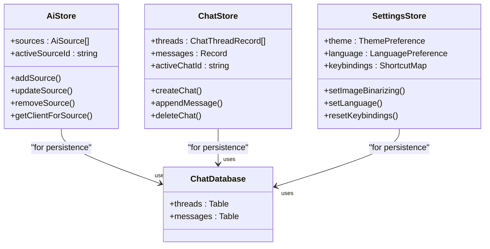

# 技术栈与依赖

<cite>
**本文档中引用的文件**  
- [package.json](file://package.json)
- [vite.config.ts](file://vite.config.ts)
- [tsconfig.json](file://tsconfig.json)
- [eslint.config.js](file://eslint.config.js)
- [i18next.config.ts](file://i18next.config.ts)
- [main.tsx](file://src/main.tsx)
- [App.tsx](file://src/App.tsx)
- [ai-store.ts](file://src/store/ai-store.ts)
- [chat-store.ts](file://src/store/chat-store.ts)
- [settings-store.ts](file://src/store/settings-store.ts)
- [chat-db.ts](file://src/store/chat-db.ts)
- [gemini.ts](file://src/ai/gemini.ts)
- [openai.ts](file://src/ai/openai.ts)
- [i18n.ts](file://src/i18n.ts)
- [resources.d.ts](file://src/@types/resources.d.ts)
</cite>

## 目录
1. [技术选型概述](#技术选型概述)
2. [核心依赖库详解](#核心依赖库详解)
3. [状态管理与数据持久化](#状态管理与数据持久化)
4. [国际化与本地化](#国际化与本地化)
5. [类型安全与代码质量](#类型安全与代码质量)
6. [构建工具与开发体验](#构建工具与开发体验)
7. [新贡献者指南](#新贡献者指南)

## 技术选型概述

skid-homework项目采用现代前端技术栈，以React + Vite为核心框架，结合TypeScript提供类型安全，使用Zustand进行高效的状态管理。该技术组合为项目提供了卓越的开发效率、运行性能和可维护性。

选择React + Vite作为前端框架主要基于以下优势：Vite利用浏览器原生ES模块导入和现代构建工具（如esbuild和Rollup），实现了闪电般的冷启动和热模块替换（HMR），极大地提升了开发体验。React的组件化架构和丰富的生态系统使得UI开发高效且可维护。这种组合特别适合skid-homework这类需要快速迭代和良好开发者体验的AI辅助工具。

**Section sources**
- [package.json](file://package.json)
- [vite.config.ts](file://vite.config.ts)
- [main.tsx](file://src/main.tsx)

## 核心依赖库详解

项目的核心依赖库在`package.json`中明确定义，每个库都有其特定用途：

- **@google/genai**: 用于与Google Gemini API进行交互，实现图像和文本的AI分析功能。该库提供了流式响应支持，使得AI思考过程可以实时显示。
- **openai**: 用于与OpenAI API集成，为用户提供Gemini之外的AI模型选择，增强了项目的灵活性和可用性。
- **react-router-dom**: 实现客户端路由管理，支持`HashRouter`模式，使得应用可以在不刷新页面的情况下导航于"扫描"、"聊天"、"设置"等不同页面之间。
- **tailwindcss**: 作为原子化CSS框架，提供高度可定制的样式系统，与`@radix-ui/react-*`组件库结合，构建出美观且响应式的用户界面。
- **i18next**: 实现完整的国际化（i18n）解决方案，支持中文（zh）和英文（en）双语言，通过`i18next-http-backend`动态加载语言包，减少初始加载体积。
- **dexie**: 作为IndexedDB的封装库，提供类似数据库的API，用于持久化存储聊天记录、AI配置和用户设置，确保数据在浏览器关闭后依然保留。

**Section sources**
- [package.json](file://package.json)
- [App.tsx](file://src/App.tsx)
- [gemini.ts](file://src/ai/gemini.ts)
- [openai.ts](file://src/ai/openai.ts)
- [chat-db.ts](file://src/store/chat-db.ts)
- [i18n.ts](file://src/i18n.ts)

## 状态管理与数据持久化

项目采用Zustand作为状态管理解决方案，其优势在于简洁的API和无样板代码的特性。通过`create`和`persist`中间件，项目实现了多个全局状态的管理：

- **ai-store.ts**: 管理所有AI服务提供者（如Gemini和OpenAI）的配置，包括API密钥、模型选择和高级设置。状态通过`localStorage`持久化，确保用户配置不会丢失。
- **chat-store.ts**: 管理聊天会话的状态，包括会话列表、消息记录和当前活动会话。它与`chat-db.ts`中的Dexie数据库紧密集成，实现数据的持久化存储和查询。
- **settings-store.ts**: 存储用户界面偏好，如主题（明/暗/系统）、语言、快捷键和图像后处理设置。该状态同样被持久化，并包含版本迁移逻辑以处理未来可能的结构变更。

**Diagram sources**
- [ai-store.ts](file://src/store/ai-store.ts)
- [chat-store.ts](file://src/store/chat-store.ts)
- [settings-store.ts](file://src/store/settings-store.ts)
- [chat-db.ts](file://src/store/chat-db.ts)

**Section sources**
- [ai-store.ts](file://src/store/ai-store.ts)
- [chat-store.ts](file://src/store/chat-store.ts)
- [settings-store.ts](file://src/store/settings-store.ts)
- [chat-db.ts](file://src/store/chat-db.ts)

## 国际化与本地化

项目通过i18next生态系统实现了完整的国际化支持。`i18n.ts`文件初始化i18next实例，配置了HTTP后端以按需加载位于`public/locales/`目录下的语言资源文件。`resources.d.ts`文件为TypeScript提供了类型定义，确保在代码中使用翻译键时具有类型安全。

`i18next.config.ts`配置文件定义了支持的语言（en和zh）和资源文件的提取路径。这种设计使得添加新语言变得简单，只需在`public/locales/`下创建相应的JSON文件即可。用户可以在设置页面中切换语言，应用会立即响应并重新渲染。

**Section sources**
- [i18n.ts](file://src/i18n.ts)
- [resources.d.ts](file://src/@types/resources.d.ts)
- [i18next.config.ts](file://i18next.config.ts)

## 类型安全与代码质量

TypeScript在项目中扮演着至关重要的角色，通过静态类型检查在编译时捕获潜在错误。`tsconfig.json`文件配置了项目的基础类型设置，而`tsconfig.app.json`和`tsconfig.node.json`则分别针对应用和Node.js环境进行了细化。

ESLint和Prettier共同保障了代码质量。`eslint.config.js`文件集成了`typescript-eslint`、`react-hooks`等插件，强制执行代码规范和最佳实践。Prettier确保了代码格式的一致性。开发脚本中的`lint`命令允许开发者在提交前检查代码，维护了代码库的整洁和可读性。

**Section sources**
- [tsconfig.json](file://tsconfig.json)
- [eslint.config.js](file://eslint.config.js)

## 构建工具与开发体验

Vite的配置在`vite.config.ts`中定义，其核心优势包括：
- **极快的启动速度**：利用浏览器原生ES模块，无需打包即可启动开发服务器。
- **即时热更新**：修改代码后，只有相关模块被重新加载，无需刷新整个页面。
- **插件集成**：通过`@vitejs/plugin-react`支持React，`@tailwindcss/vite`集成Tailwind CSS，实现了开箱即用的现代开发工作流。
- **路径别名**：配置了`@`别名指向`src`目录，简化了模块导入路径。

这些配置共同为开发者提供了流畅、高效的开发体验，是项目能够快速迭代的关键因素。

**Section sources**
- [vite.config.ts](file://vite.config.ts)

## 新贡献者指南

对于新贡献者，理解项目的技术全景图至关重要。项目结构清晰，`src`目录下按功能组织：
- `ai/`: 包含与AI服务交互的核心逻辑。
- `components/`: 所有UI组件，按功能分组。
- `store/`: Zustand状态管理逻辑。
- `utils/`: 工具函数。

技术栈的核心是React + Vite + TypeScript + Zustand的组合，辅以Tailwind CSS进行样式设计，i18next进行国际化，Dexie进行数据持久化。建议新贡献者首先阅读`package.json`了解依赖，然后查看`main.tsx`和`App.tsx`理解应用入口和路由结构，最后深入各个store文件掌握状态管理机制。

**Section sources**
- [package.json](file://package.json)
- [main.tsx](file://src/main.tsx)
- [App.tsx](file://src/App.tsx)