# 应用状态模型

<cite>
**本文档中引用的文件**
- [problems-store.ts](file://src/store/problems-store.ts)
- [chat-types.ts](file://src/ai/chat-types.ts)
- [chat-store.ts](file://src/store/chat-store.ts)
- [chat-db.ts](file://src/store/chat-db.ts)
- [ai-store.ts](file://src/store/ai-store.ts)
- [settings-store.ts](file://src/store/settings-store.ts)
</cite>

## 目录
1. [概述](#概述)
2. [核心状态架构](#核心状态架构)
3. [问题处理状态模型](#问题处理状态模型)
4. [聊天状态模型](#聊天状态模型)
5. [AI服务状态模型](#ai服务状态模型)
6. [设置状态模型](#设置状态模型)
7. [状态管理架构](#状态管理架构)
8. [状态变更流程](#状态变更流程)
9. [性能优化策略](#性能优化策略)
10. [最佳实践指南](#最佳实践指南)

## 概述

本应用采用基于Zustand的状态管理架构，通过多个独立的store模块实现不同功能域的状态管理。每个store专注于特定的业务领域，通过清晰的类型定义和操作接口确保类型安全和可维护性。

主要特点：
- **模块化设计**：每个store负责特定的功能域
- **类型安全**：完整的TypeScript类型定义
- **高性能**：针对不同场景选择最优的数据结构
- **持久化支持**：关键状态自动持久化到localStorage
- **响应式更新**：组件自动订阅状态变化

## 核心状态架构


**图表来源**
- [problems-store.ts](file://src/store/problems-store.ts#L73-L281)
- [chat-store.ts](file://src/store/chat-store.ts#L69-L302)
- [ai-store.ts](file://src/store/ai-store.ts#L149-L271)
- [settings-store.ts](file://src/store/settings-store.ts#L53-L116)

## 问题处理状态模型

### 核心数据结构

问题处理状态模型是应用的核心状态之一，负责管理图像上传、AI分析和解决方案展示的完整流程。


**图表来源**
- [problems-store.ts](file://src/store/problems-store.ts#L5-L30)

### FileItem 类型详解

`FileItem` 是上传图像的基本单元，包含完整的图像元数据和状态信息：

| 字段名 | 类型 | 描述 | 默认值 |
|--------|------|------|--------|
| `id` | `string` | 唯一标识符，用于快速查找和更新 | 自动生成 |
| `file` | `File` | 实际的图像文件对象 | - |
| `mimeType` | `string` | 图像的MIME类型（如 `image/jpeg`） | - |
| `url` | `string` | 客户端预览用的对象URL | - |
| `source` | `"upload" \| "camera"` | 图像来源：上传或相机拍摄 | - |
| `status` | `"success" \| "pending" \| "failed" \| "rasterizing"` | 当前处理状态 | `"pending"` |

### Solution 类型详解

`Solution` 表示单张图像的AI分析结果，采用Map结构存储以获得O(1)访问性能：

| 字段名 | 类型 | 描述 | 性能影响 |
|--------|------|------|----------|
| `imageUrl` | `string` | 源图像URL，作为Map的键 | O(1)查找 |
| `status` | `"success" \| "processing" \| "failed"` | AI处理状态 | 状态驱动UI更新 |
| `streamedOutput` | `string \| null` | 流式输出内容 | 支持实时显示 |
| `problems` | `ProblemSolution[]` | 找到的问题列表 | 数组顺序保持 |
| `aiSourceId` | `string` | AI服务提供商标识 | 关联AI源 |

### ProblemSolution 类型详解

单个问题-答案对的结构设计：

| 字段名 | 类型 | 描述 | 用途 |
|--------|------|------|------|
| `problem` | `string` | 问题描述文本 | 显示给用户 |
| `answer` | `string` | AI提供的答案 | 用户交互 |
| `explanation` | `string` | 解释说明 | 深度理解 |

### Map vs Array 选择策略

系统在不同场景下选择不同的数据结构：


**图表来源**
- [problems-store.ts](file://src/store/problems-store.ts#L35-L37)

**节来源**
- [problems-store.ts](file://src/store/problems-store.ts#L5-L30)

## 聊天状态模型

### 数据库架构

聊天功能采用IndexedDB进行本地持久化，支持离线聊天和历史记录管理。


**图表来源**
- [chat-db.ts](file://src/store/chat-db.ts#L5-L21)

### 聊天消息类型

基于 `AiChatMessage` 类型扩展的聊天消息系统：


**图表来源**
- [chat-types.ts](file://src/ai/chat-types.ts#L1-L7)
- [chat-db.ts](file://src/store/chat-db.ts#L5-L21)

### 聊天状态操作流程


**图表来源**
- [chat-store.ts](file://src/store/chat-store.ts#L122-L165)
- [chat-store.ts](file://src/store/chat-store.ts#L167-L196)

**节来源**
- [chat-store.ts](file://src/store/chat-store.ts#L1-L302)
- [chat-db.ts](file://src/store/chat-db.ts#L1-L45)

## AI服务状态模型

### AI源配置管理

AI服务状态模型负责管理多个AI提供商的配置和连接：


**图表来源**
- [ai-store.ts](file://src/store/ai-store.ts#L14-L42)

### AI提供商支持

| 提供商 | 支持功能 | 特殊配置 | 用途 |
|--------|----------|----------|------|
| Gemini | 文本、图像分析 | 思维预算、基础URL | 主要AI服务 |
| OpenAI | 文本、图像分析 | 轮询间隔、最大轮询时间 | 备选AI服务 |

### AI客户端工厂模式


**图表来源**
- [ai-store.ts](file://src/store/ai-store.ts#L112-L129)

**节来源**
- [ai-store.ts](file://src/store/ai-store.ts#L1-L275)

## 设置状态模型

### 配置项分类

设置状态模型涵盖了应用的各种配置选项：


**图表来源**
- [settings-store.ts](file://src/store/settings-store.ts#L32-L51)

### 快捷键映射表

| 功能动作 | 默认快捷键 | 可自定义 |
|----------|------------|----------|
| 上传文件 | Ctrl+1 | ✓ |
| 拍照 | Ctrl+2 | ✓ |
| 开始扫描 | Ctrl+3 | ✓ |
| 清空所有 | Ctrl+4 | ✓ |
| 打开设置 | Ctrl+5 | ✓ |
| 打开聊天 | Ctrl+E | ✓ |
| 全局特性编辑器 | Ctrl+X | ✓ |

**节来源**
- [settings-store.ts](file://src/store/settings-store.ts#L1-L116)

## 状态管理架构

### Zustand集成模式


### 状态订阅模式

组件通过多种方式订阅状态变化：


**节来源**
- [problems-store.ts](file://src/store/problems-store.ts#L73-L281)
- [chat-store.ts](file://src/store/chat-store.ts#L69-L302)
- [ai-store.ts](file://src/store/ai-store.ts#L149-L271)
- [settings-store.ts](file://src/store/settings-store.ts#L53-L116)

## 状态变更流程

### 添加文件项流程


### AI解决方案处理流程


### 聊天消息发送流程


**图表来源**
- [problems-store.ts](file://src/store/problems-store.ts#L86-L97)
- [problems-store.ts](file://src/store/problems-store.ts#L178-L202)
- [chat-store.ts](file://src/store/chat-store.ts#L167-L196)

## 性能优化策略

### 数据结构选择对性能的影响

| 场景 | 选择的数据结构 | 时间复杂度 | 空间复杂度 | 优势 | 劣势 |
|------|----------------|------------|------------|------|------|
| 图像列表管理 | `FileItem[]` | O(n) 查找 | O(1) | 简单迭代 | 大量查找慢 |
| 解决方案存储 | `Map<string, Solution>` | O(1) 查找 | O(n) | 快速访问 | 内存占用高 |
| 对话消息管理 | `Record<string, Message[]>` | O(1) 查找 | O(n) | 分类存储 | 需要额外索引 |
| AI源管理 | `AiSource[]` | O(n) 查找 | O(1) | 顺序访问 | 大量查找慢 |

### 缓存策略

```mermaid
graph TB
subgraph "缓存层次"
A["内存缓存<br/>Zustand Store"] --> B["浏览器缓存<br/>localStorage"]
B --> C["数据库缓存<br/>IndexedDB"]
end
subgraph "缓存策略"
D["热数据"] --> A
E["温数据"] --> B
F["冷数据"] --> C
G["LRU淘汰"] --> A
H["版本控制"] --> B
I["定期清理"] --> C
end
```



### 订阅优化

组件订阅采用精细化策略减少不必要的重渲染：


**节来源**
- [problems-store.ts](file://src/store/problems-store.ts#L35-L37)

## 最佳实践指南

### 状态设计原则

1. **单一职责**：每个store只负责一个功能域
2. **不可变更新**：使用函数式更新避免直接修改状态
3. **类型安全**：充分利用TypeScript类型系统
4. **性能优先**：根据访问模式选择合适的数据结构

### 常见使用模式

#### 状态读取模式
```typescript
// 读取整个状态
const state = useProblemsStore();

// 使用 selector 读取部分状态
const { imageItems, selectedImage } = useProblemsStore((state) => ({
  imageItems: state.imageItems,
  selectedImage: state.selectedImage
}));
```

#### 状态更新模式
```typescript
// 直接更新
useProblemsStore.setState({ isWorking: true });

// 函数式更新
useProblemsStore.setState((state) => ({
  imageItems: [...state.imageItems, newItem]
}));

// 使用 action
useProblemsStore.getState().addFileItems([newItem]);
```

### 错误处理策略


### 调试和监控

建议在开发环境中启用Zustand的调试工具，监控状态变化和性能指标。

**节来源**
- [problems-store.ts](file://src/store/problems-store.ts#L1-L281)
- [chat-store.ts](file://src/store/chat-store.ts#L1-L302)
- [ai-store.ts](file://src/store/ai-store.ts#L1-L275)
- [settings-store.ts](file://src/store/settings-store.ts#L1-L116)