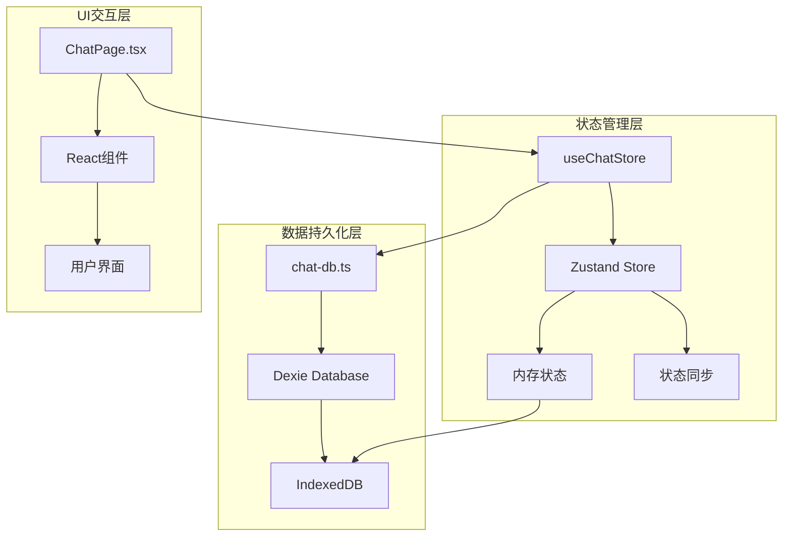
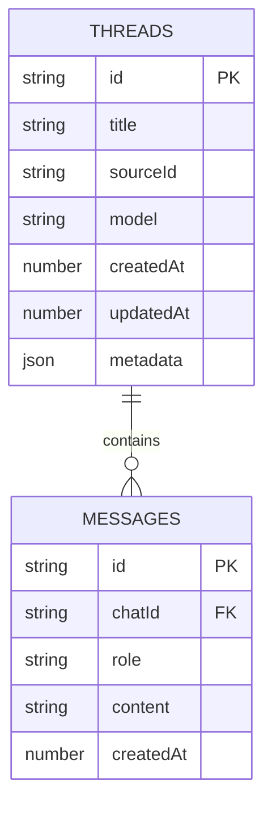
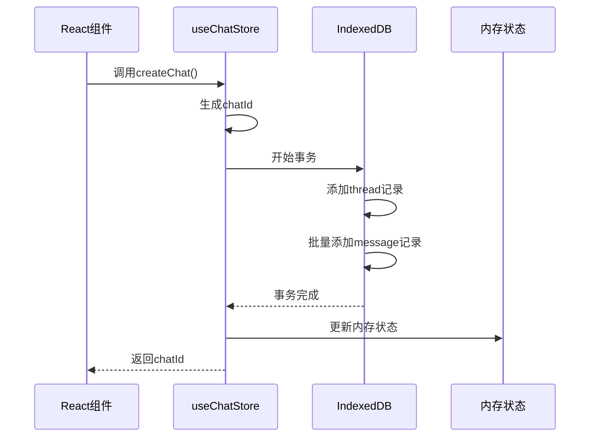
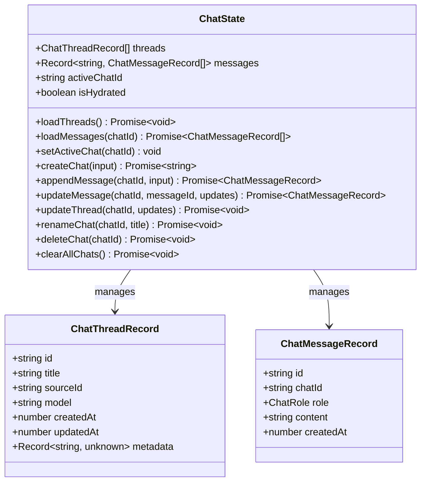
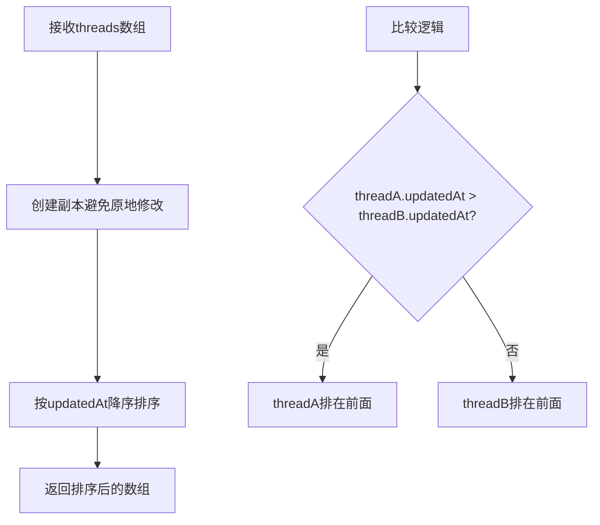
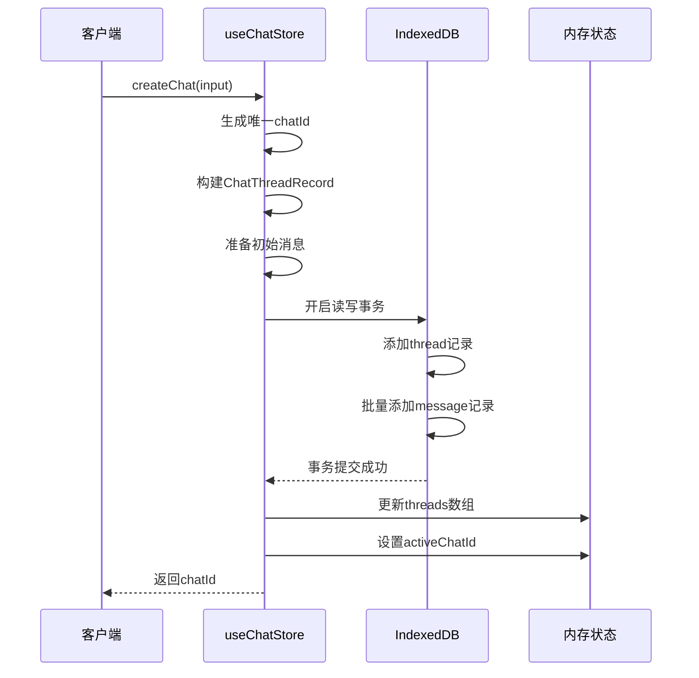
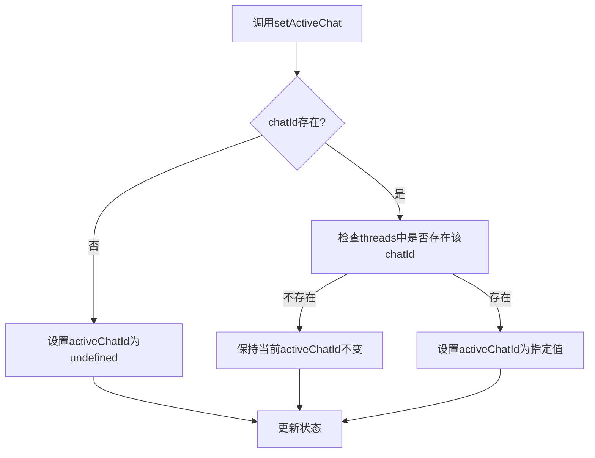
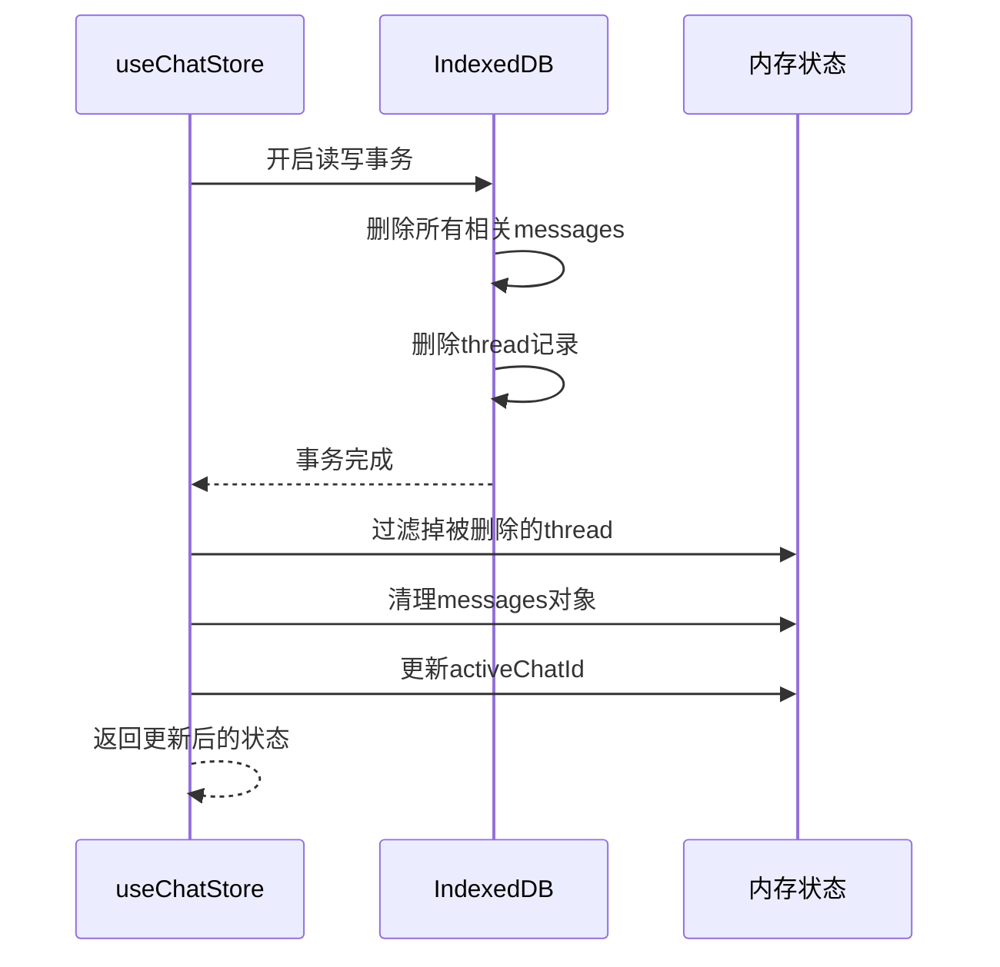
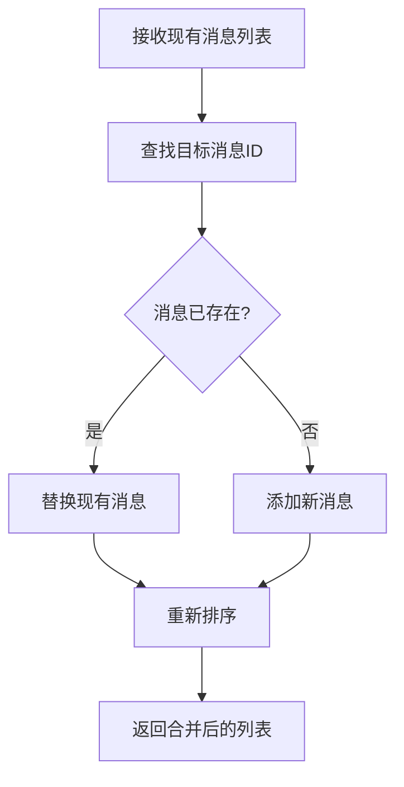
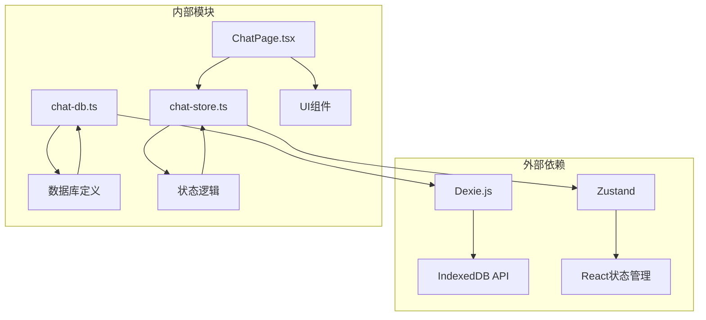

# 会话线程管理

<cite>
**本文档引用的文件**
- [src/store/chat-store.ts](file://src/store/chat-store.ts)
- [src/store/chat-db.ts](file://src/store/chat-db.ts)
- [src/ai/chat-types.ts](file://src/ai/chat-types.ts)
- [src/components/pages/ChatPage.tsx](file://src/components/pages/ChatPage.tsx)
</cite>

## 目录
1. [简介](#简介)
2. [项目结构概览](#项目结构概览)
3. [核心数据结构](#核心数据结构)
4. [架构概览](#架构概览)
5. [详细组件分析](#详细组件分析)
6. [依赖关系分析](#依赖关系分析)
7. [性能考虑](#性能考虑)
8. [故障排除指南](#故障排除指南)
9. [结论](#结论)

## 简介

本文档深入分析了Skid Homework项目中的会话线程管理系统，重点关注`ChatThreadRecord`数据结构及其在`useChatStore`中的操作实现。该系统采用内存状态管理和IndexedDB持久化相结合的方式，为用户提供完整的聊天会话管理功能。

系统的核心设计理念是通过Zustand状态管理库维护内存中的实时状态，同时利用Dexie.js进行IndexedDB数据库的持久化存储，确保用户会话数据的安全性和一致性。

## 项目结构概览

会话线程管理系统主要由以下核心模块组成：

**图表来源**
- [src/store/chat-store.ts](file://src/store/chat-store.ts#L69-L301)
- [src/store/chat-db.ts](file://src/store/chat-db.ts#L23-L44)

**章节来源**
- [src/store/chat-store.ts](file://src/store/chat-store.ts#L1-L301)
- [src/store/chat-db.ts](file://src/store/chat-db.ts#L1-L44)

## 核心数据结构

### ChatThreadRecord接口定义

`ChatThreadRecord`是会话线程的核心数据结构，定义了每个聊天会话的基本属性：

| 字段名 | 类型 | 描述 | 业务含义 |
|--------|------|------|----------|
| `id` | `string` | 唯一标识符 | 会话的全局唯一ID，用于关联消息记录 |
| `title` | `string` | 会话标题 | 用户可见的会话名称，默认使用第一条消息内容 |
| `sourceId` | `string` | 源标识符 | 关联的AI服务提供商ID（如OpenAI、Gemini） |
| `model` | `string` | 模型名称 | 使用的具体AI模型名称 |
| `createdAt` | `number` | 创建时间戳 | 会话创建的时间点（毫秒级Unix时间戳） |
| `updatedAt` | `number` | 更新时间戳 | 最后一次修改或消息添加的时间 |
| `metadata` | `Record<string, unknown> \| null` | 元数据 | 可选的扩展信息，如上下文消息等 |

### 数据库表结构映射

系统使用两个主要的数据表来存储会话信息：

**图表来源**
- [src/store/chat-db.ts](file://src/store/chat-db.ts#L5-L21)
- [src/store/chat-db.ts](file://src/store/chat-db.ts#L23-L33)

**章节来源**
- [src/store/chat-db.ts](file://src/store/chat-db.ts#L5-L21)

## 架构概览

会话线程管理系统采用分层架构设计，实现了内存状态与数据库存储的分离：

**图表来源**
- [src/store/chat-store.ts](file://src/store/chat-store.ts#L122-L164)
- [src/store/chat-store.ts](file://src/store/chat-store.ts#L144-L163)

## 详细组件分析

### Zustand状态管理器

`useChatStore`是整个会话管理系统的核心状态管理器，负责协调内存状态和数据库操作：

#### 核心状态属性

**图表来源**
- [src/store/chat-store.ts](file://src/store/chat-store.ts#L25-L49)
- [src/store/chat-db.ts](file://src/store/chat-db.ts#L5-L21)

#### 排序算法实现

`sortThreadsByUpdated`函数实现了基于最后更新时间的智能排序：

**图表来源**
- [src/store/chat-store.ts](file://src/store/chat-store.ts#L52-L53)

**章节来源**
- [src/store/chat-store.ts](file://src/store/chat-store.ts#L25-L53)

### 核心操作方法详解

#### 创建会话（createChat）

创建新会话是系统中最复杂的操作之一，涉及多个步骤的协调：

**图表来源**
- [src/store/chat-store.ts](file://src/store/chat-store.ts#L122-L164)

#### 会话激活机制

`setActiveChat`方法负责管理当前活跃的会话：

**图表来源**
- [src/store/chat-store.ts](file://src/store/chat-store.ts#L112-L119)

#### 会话删除操作

`deleteChat`方法执行完整的级联删除操作：

**图表来源**
- [src/store/chat-store.ts](file://src/store/chat-store.ts#L269-L285)

**章节来源**
- [src/store/chat-store.ts](file://src/store/chat-store.ts#L122-L285)

### 数据库事务管理

系统使用Dexie.js的事务机制确保数据一致性：

#### 事务类型与作用域

| 操作类型 | 事务模式 | 涉及表 | 业务场景 |
|----------|----------|--------|----------|
| 创建会话 | `rw` | threads, messages | 新增会话和初始消息 |
| 添加消息 | `rw` | threads, messages | 追加对话内容 |
| 更新会话 | `rw` | threads | 修改会话属性 |
| 删除会话 | `rw` | threads, messages | 完整会话清理 |
| 清空所有 | `rw` | threads, messages | 初始化系统 |

#### 合并消息机制

`mergeMessage`函数实现了消息的智能合并策略：

**图表来源**
- [src/store/chat-store.ts](file://src/store/chat-store.ts#L55-L67)

**章节来源**
- [src/store/chat-store.ts](file://src/store/chat-store.ts#L55-L67)

## 依赖关系分析

### 组件耦合度分析

**图表来源**
- [src/store/chat-store.ts](file://src/store/chat-store.ts#L1-L8)
- [src/store/chat-db.ts](file://src/store/chat-db.ts#L1-L2)

### 循环依赖检测

系统设计避免了循环依赖：
- `chat-db.ts`只提供数据结构定义
- `chat-store.ts`依赖`chat-db.ts`但不反向依赖
- `ChatPage.tsx`通过hooks间接使用store

**章节来源**
- [src/store/chat-store.ts](file://src/store/chat-store.ts#L1-L8)
- [src/store/chat-db.ts](file://src/store/chat-db.ts#L1-L2)

## 性能考虑

### 内存优化策略

1. **懒加载机制**：消息列表仅在需要时加载
2. **状态压缩**：使用对象索引而非数组查找
3. **批量操作**：使用bulkAdd减少数据库访问次数

### 数据库查询优化

1. **索引利用**：threads表使用updatedAt和createdAt索引
2. **复合索引**：messages表使用chatId+createdAt复合索引
3. **事务批处理**：将多个操作合并到单个事务中

### 缓存策略

系统实现了多层缓存机制：
- **内存缓存**：活跃会话的消息直接存储在内存中
- **状态缓存**：Zustand自动管理的状态缓存
- **数据库缓存**：浏览器IndexedDB提供的持久化缓存

## 故障排除指南

### 常见问题诊断

#### 会话无法加载

**症状**：会话列表为空或显示错误
**可能原因**：
1. IndexedDB初始化失败
2. 数据库版本不匹配
3. 浏览器隐私模式限制

**解决方案**：
1. 检查浏览器控制台错误信息
2. 验证IndexedDB是否可用
3. 尝试清除浏览器缓存

#### 会话状态不一致

**症状**：内存状态与数据库状态不同步
**可能原因**：
1. 异步操作顺序错误
2. 事务未正确提交
3. 并发操作冲突

**解决方案**：
1. 检查事务边界
2. 验证异步操作链
3. 实现适当的锁机制

#### 性能问题

**症状**：大量会话时界面卡顿
**可能原因**：
1. 内存泄漏
2. 频繁的DOM更新
3. 数据库查询效率低

**解决方案**：
1. 实施虚拟滚动
2. 优化状态更新频率
3. 添加数据库查询缓存

**章节来源**
- [src/store/chat-store.ts](file://src/store/chat-store.ts#L75-L95)
- [src/store/chat-db.ts](file://src/store/chat-db.ts#L23-L33)

## 结论

Skid Homework的会话线程管理系统展现了现代Web应用中状态管理的最佳实践。通过Zustand与Dexie.js的完美结合，系统实现了：

1. **高性能的内存状态管理**：利用Zustand的高效状态更新机制
2. **可靠的数据持久化**：通过IndexedDB确保数据安全
3. **优雅的用户体验**：即时响应和离线支持
4. **可维护的代码架构**：清晰的职责分离和模块化设计

该系统的设计理念和实现方式为类似的聊天应用开发提供了宝贵的参考价值，特别是在状态管理、数据持久化和用户体验优化方面的平衡处理。