# 数据库持久化机制

<cite>
**本文档中引用的文件**
- [chat-db.ts](file://src/store/chat-db.ts)
- [chat-store.ts](file://src/store/chat-store.ts)
- [ai-store.ts](file://src/store/ai-store.ts)
- [settings-store.ts](file://src/store/settings-store.ts)
- [ChatPage.tsx](file://src/components/pages/ChatPage.tsx)
- [App.tsx](file://src/App.tsx)
- [main.tsx](file://src/main.tsx)
</cite>

## 目录
1. [简介](#简介)
2. [项目结构概览](#项目结构概览)
3. [核心组件分析](#核心组件分析)
4. [架构概览](#架构概览)
5. [详细组件分析](#详细组件分析)
6. [依赖关系分析](#依赖关系分析)
7. [性能考虑](#性能考虑)
8. [故障排除指南](#故障排除指南)
9. [结论](#结论)

## 简介

本文档深入分析了Skid Homework项目中基于Dexie.js的数据库持久化机制。该系统采用IndexedDB作为底层存储，通过Dexie.js ORM提供类型安全的数据库操作，实现了聊天记录的完整生命周期管理。系统的核心设计理念是通过Zustand状态管理器实现内存状态与持久化存储之间的双向同步，确保数据的一致性和可靠性。

## 项目结构概览

项目的数据库持久化机制主要分布在以下关键模块中：

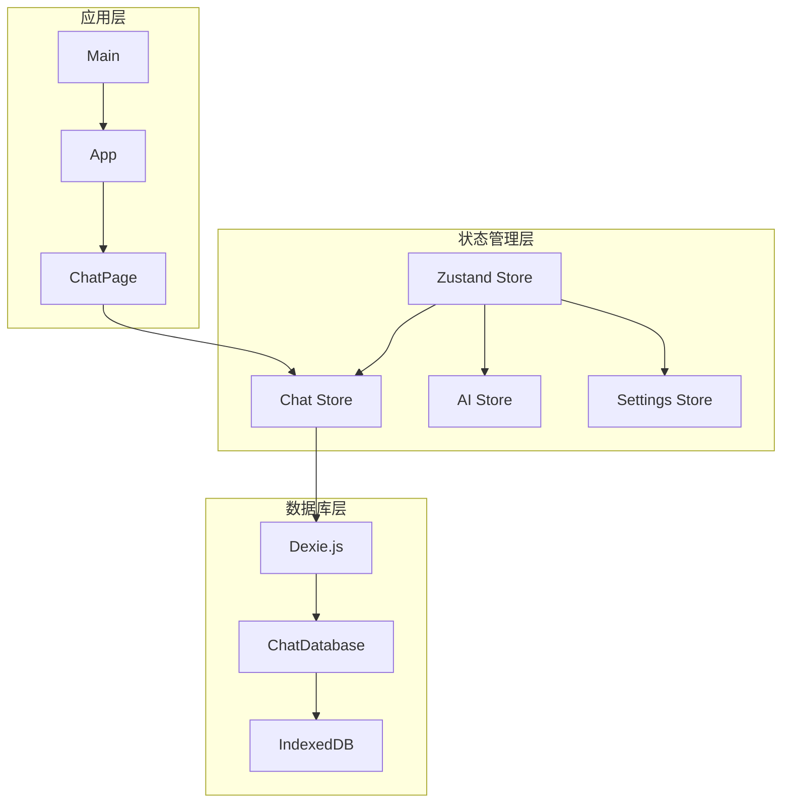

**图表来源**
- [chat-store.ts](file://src/store/chat-store.ts#L69-L301)
- [chat-db.ts](file://src/store/chat-db.ts#L23-L35)
- [App.tsx](file://src/App.tsx#L13-L52)

**章节来源**
- [chat-db.ts](file://src/store/chat-db.ts#L1-L45)
- [chat-store.ts](file://src/store/chat-store.ts#L1-L302)

## 核心组件分析

### ChatDatabase类设计

`ChatDatabase`类是整个数据库系统的核心，继承自Dexie.js的基类，定义了两个主要的数据表：

#### 表结构设计

| 表名 | 主键 | 复合索引 | 字段说明 |
|------|------|----------|----------|
| threads | id | updatedAt, createdAt | 聊天会话记录表 |
| messages | id | chatId, createdAt, [chatId+createdAt] | 聊天消息记录表 |

#### 主键与索引设计考量

**主键设计：**
- 使用UUID格式的字符串作为主键，确保全局唯一性
- 支持离线环境下的ID生成兼容性（见createId函数）

**复合索引设计：**
- `[chatId+createdAt]`：优化按聊天会话查询消息的性能
- `chatId`：支持快速查找特定会话的所有消息
- `createdAt`：支持时间顺序查询

**章节来源**
- [chat-db.ts](file://src/store/chat-db.ts#L23-L35)

### ID生成策略

系统实现了智能的ID生成机制，优先使用Web Crypto API的`randomUUID()`方法，在不支持的环境中回退到随机字符串生成：

```mermaid
flowchart TD
A[开始ID生成] --> B{检查crypto支持}
B --> |支持| C[使用randomUUID]
B --> |不支持| D[生成随机字符串]
C --> E[返回UUID格式ID]
D --> F[格式: id-{随机字符}]
F --> G[返回兼容ID]
E --> H[ID生成完成]
G --> H
```

**图表来源**
- [chat-db.ts](file://src/store/chat-db.ts#L39-L44)

**章节来源**
- [chat-db.ts](file://src/store/chat-db.ts#L39-L44)

## 架构概览

整个数据库持久化机制采用分层架构设计，实现了清晰的关注点分离：

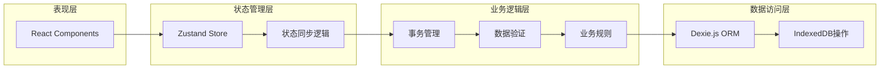

**图表来源**
- [chat-store.ts](file://src/store/chat-store.ts#L69-L301)
- [chat-db.ts](file://src/store/chat-db.ts#L23-L35)

## 详细组件分析

### 异步操作与事务机制

#### loadThreads方法

该方法负责加载所有聊天会话，实现数据的首次加载和排序：

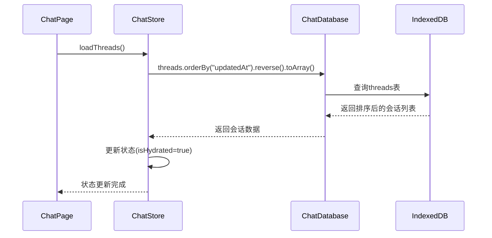

**图表来源**
- [chat-store.ts](file://src/store/chat-store.ts#L75-L95)
- [chat-db.ts](file://src/store/chat-db.ts#L24-L25)

#### loadMessages方法

该方法实现单个聊天会话的消息加载：

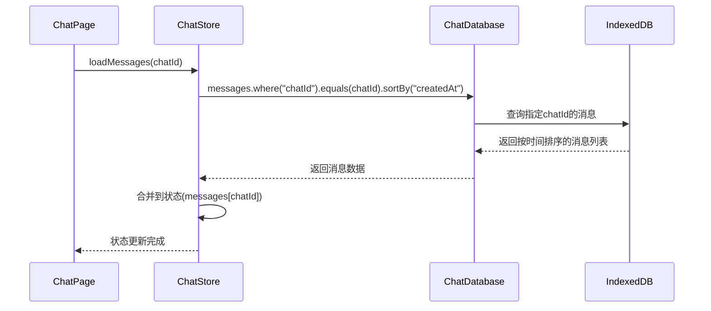

**图表来源**
- [chat-store.ts](file://src/store/chat-store.ts#L98-L109)

#### createChat方法

该方法展示了完整的事务处理流程，确保数据一致性：

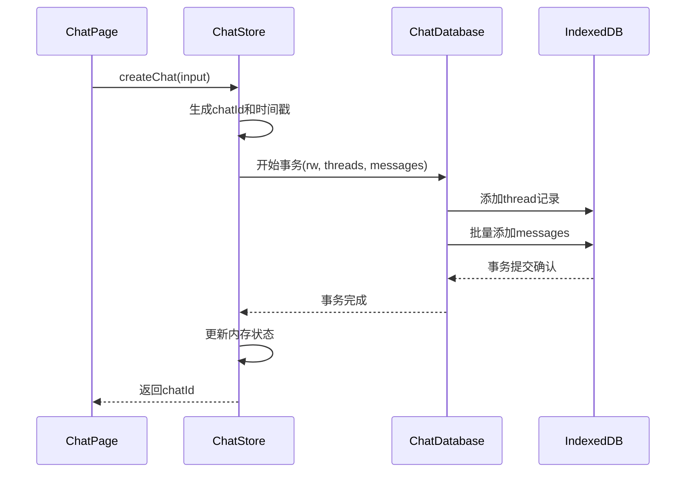

**图表来源**
- [chat-store.ts](file://src/store/chat-store.ts#L122-L165)

#### appendMessage方法

该方法演示了跨表事务的使用：

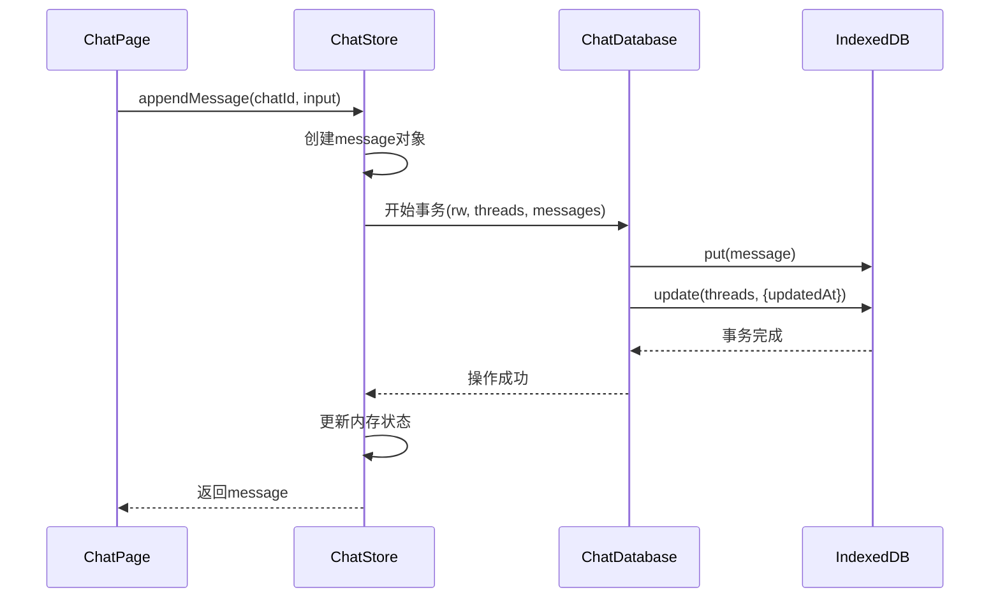

**图表来源**
- [chat-store.ts](file://src/store/chat-store.ts#L167-L196)

### 数据恢复机制

#### isHydrated标志的作用

`isHydrated`标志是数据恢复机制的核心组件，用于跟踪数据加载状态：

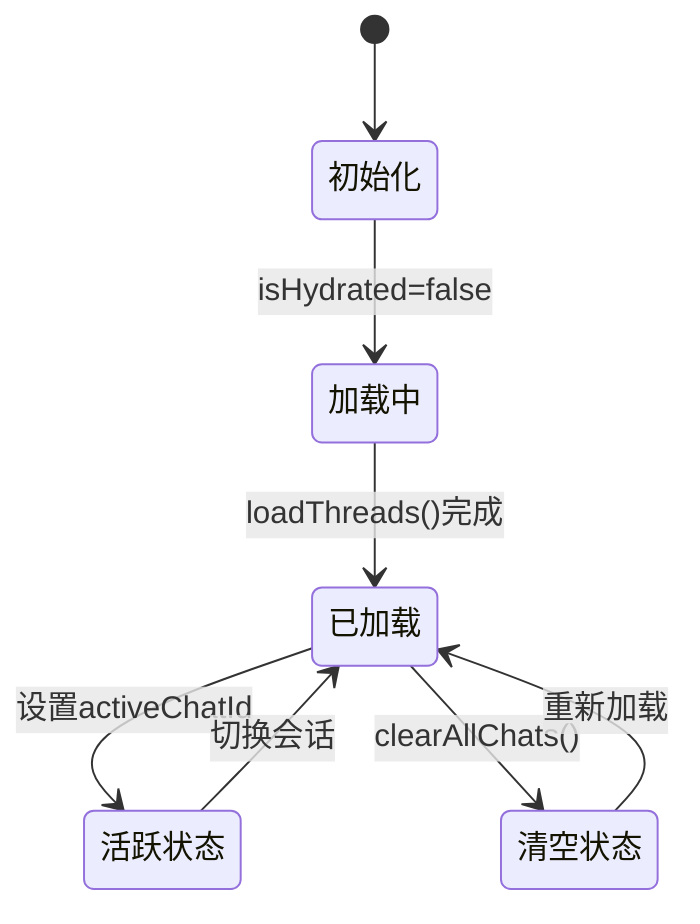

**图表来源**
- [chat-store.ts](file://src/store/chat-store.ts#L73-L95)
- [ChatPage.tsx](file://src/components/pages/ChatPage.tsx#L123-L128)

#### 应用启动时的数据恢复流程

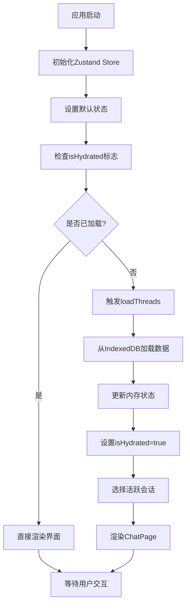

**图表来源**
- [ChatPage.tsx](file://src/components/pages/ChatPage.tsx#L123-L128)
- [chat-store.ts](file://src/store/chat-store.ts#L75-L95)

**章节来源**
- [chat-store.ts](file://src/store/chat-store.ts#L75-L165)
- [ChatPage.tsx](file://src/components/pages/ChatPage.tsx#L123-L128)

### 双向同步机制

#### 状态更新到持久化的流程

系统通过Zustand的`set`函数实现状态变更，自动触发相应的数据库操作：

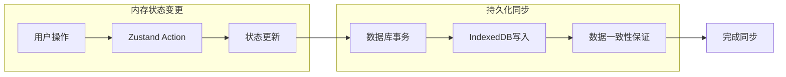

**图表来源**
- [chat-store.ts](file://src/store/chat-store.ts#L144-L149)
- [chat-store.ts](file://src/store/chat-store.ts#L176-L179)

#### 持久化到状态更新的流程

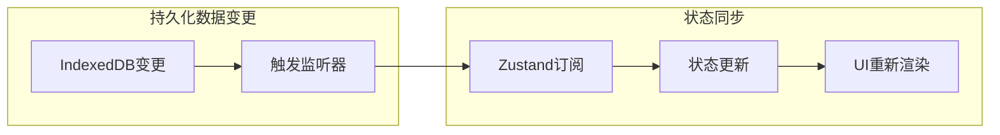

**章节来源**
- [chat-store.ts](file://src/store/chat-store.ts#L144-L196)

## 依赖关系分析

### 组件间依赖关系

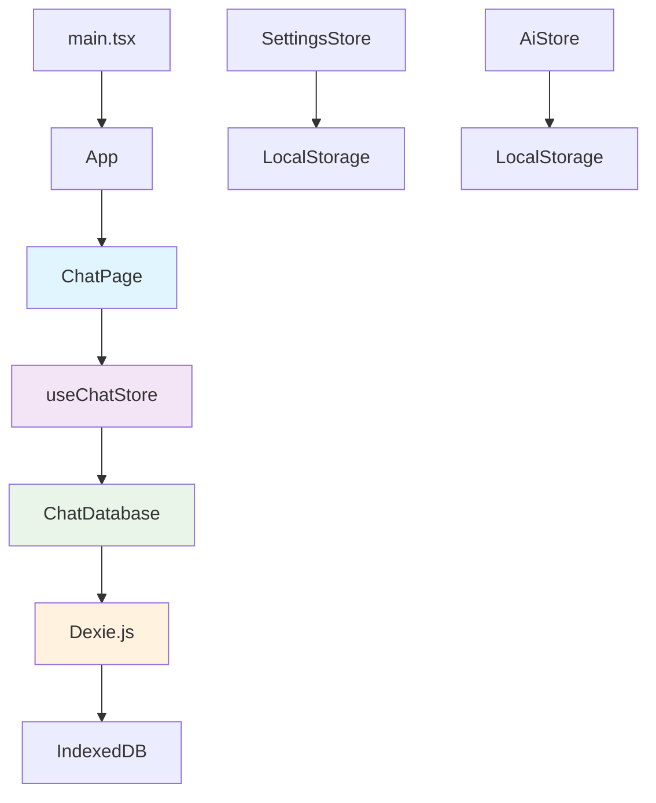

**图表来源**
- [chat-store.ts](file://src/store/chat-store.ts#L1-L10)
- [chat-db.ts](file://src/store/chat-db.ts#L1-L10)
- [App.tsx](file://src/App.tsx#L1-L10)

### 外部依赖分析

| 依赖包 | 版本 | 用途 | 关键特性 |
|--------|------|------|----------|
| dexie | 4.2.1 | IndexedDB ORM | 类型安全、Promise支持 |
| zustand | 核心状态管理 | 内存状态管理 | 原子状态、中间件支持 |
| react | React框架 | UI渲染 | 组件化、状态驱动 |

**章节来源**
- [pnpm-lock.yaml](file://pnpm-lock.yaml#L2059-L2060)

## 性能考虑

### 查询优化策略

1. **索引利用**：充分利用复合索引提高查询性能
2. **批量操作**：使用`bulkAdd`减少数据库往返次数
3. **事务批处理**：将相关操作打包在单一事务中

### 内存管理

1. **懒加载**：仅在需要时加载消息数据
2. **状态分割**：将大对象拆分为可管理的片段
3. **及时清理**：删除不再需要的历史数据

### 离线兼容性

1. **ID生成兼容性**：支持各种运行环境的ID生成
2. **错误处理**：优雅处理数据库访问失败
3. **数据完整性**：确保离线操作的数据一致性

## 故障排除指南

### 常见问题及解决方案

#### 数据加载失败

**症状**：聊天记录无法显示，isHydrated保持false状态

**排查步骤**：
1. 检查IndexedDB是否可用
2. 验证数据库版本兼容性
3. 查看浏览器控制台错误信息

**解决方案**：
- 清除浏览器缓存和IndexedDB数据
- 检查网络连接（如果涉及服务器同步）
- 验证数据库模式定义

#### 数据不一致

**症状**：内存状态与数据库内容不符

**排查步骤**：
1. 检查事务是否正确提交
2. 验证状态更新逻辑
3. 确认并发访问控制

**解决方案**：
- 重新执行数据同步流程
- 手动触发数据重载
- 检查并发操作冲突

#### 性能问题

**症状**：大量数据加载缓慢

**优化措施**：
- 实现虚拟滚动
- 增加数据分页
- 优化查询索引

**章节来源**
- [chat-store.ts](file://src/store/chat-store.ts#L75-L95)
- [chat-store.ts](file://src/store/chat-store.ts#L98-L109)

## 结论

Skid Homework项目的数据库持久化机制展现了现代Web应用的最佳实践。通过Dexie.js的类型安全ORM、Zustand的状态管理以及精心设计的事务机制，系统实现了可靠的数据持久化和高效的用户体验。

### 关键优势

1. **类型安全**：完整的TypeScript类型定义确保开发时的类型检查
2. **性能优化**：合理的索引设计和查询优化策略
3. **数据一致性**：事务机制保证操作的原子性
4. **离线支持**：完善的ID生成策略适应各种运行环境
5. **双向同步**：内存状态与持久化存储的无缝集成

### 设计亮点

- **复合索引设计**：针对聊天场景优化的索引策略
- **事务处理**：跨表操作的一致性保证
- **Hydration机制**：优雅的应用启动和数据恢复
- **错误处理**：健壮的异常处理和恢复机制

这套数据库持久化机制为现代Web应用提供了可参考的架构模式，特别是在需要离线支持和实时同步的场景中具有重要的借鉴价值。