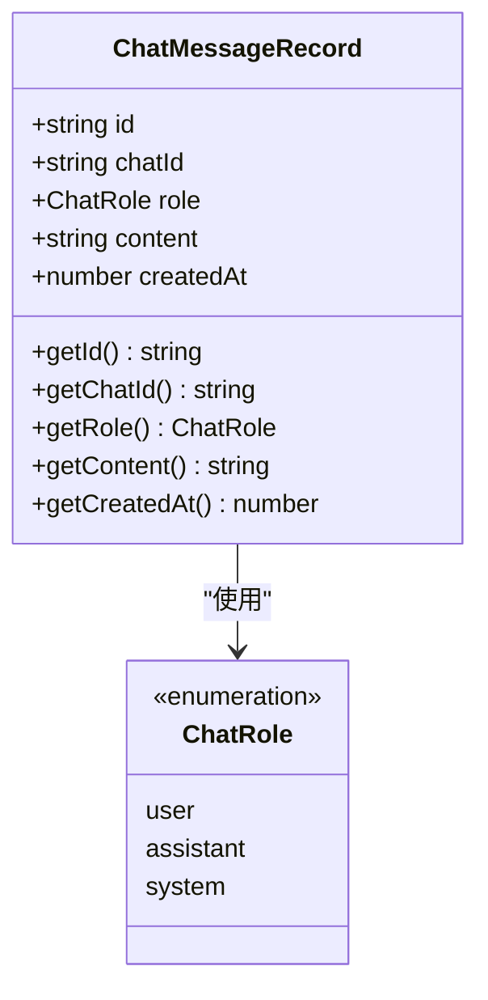
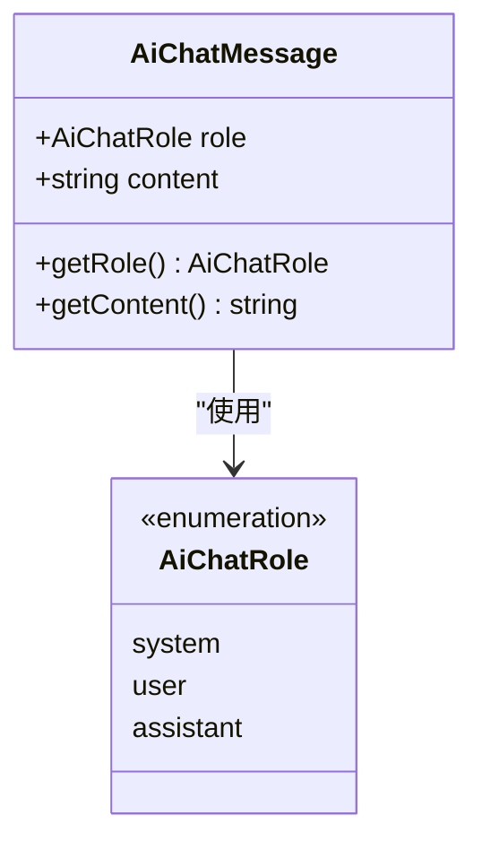
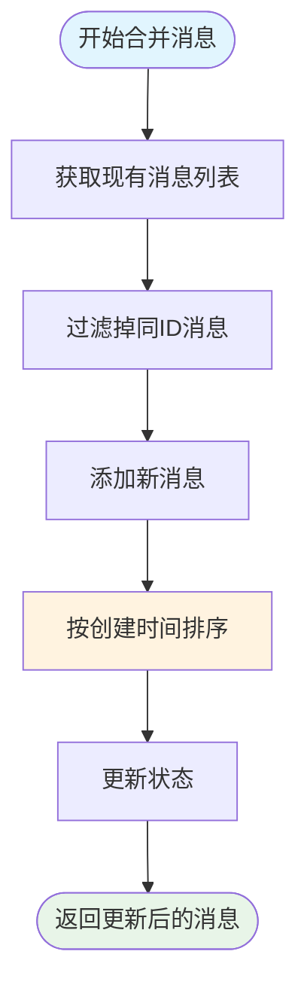
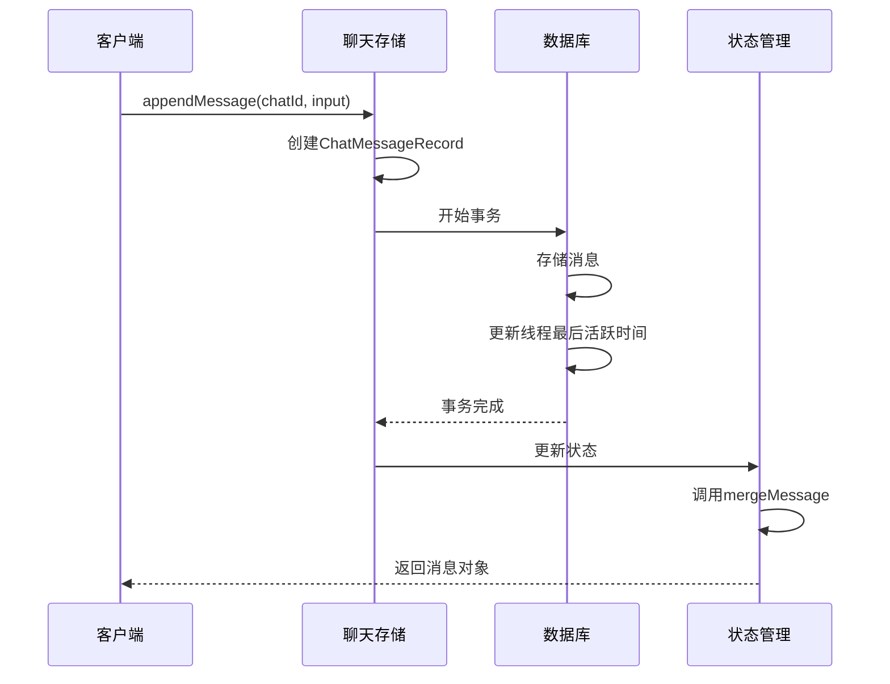
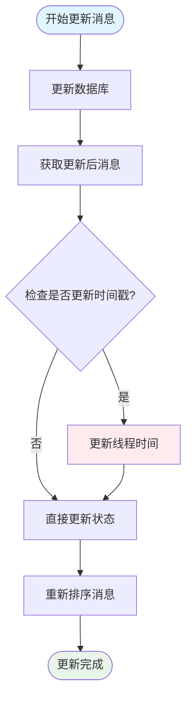
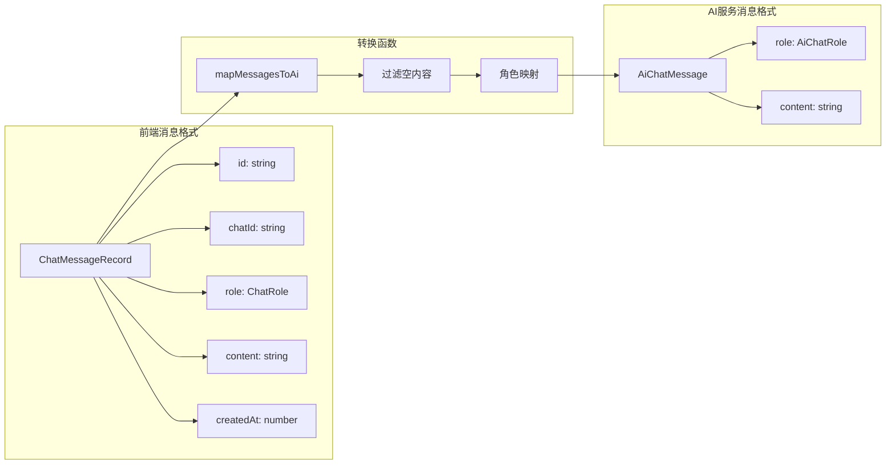
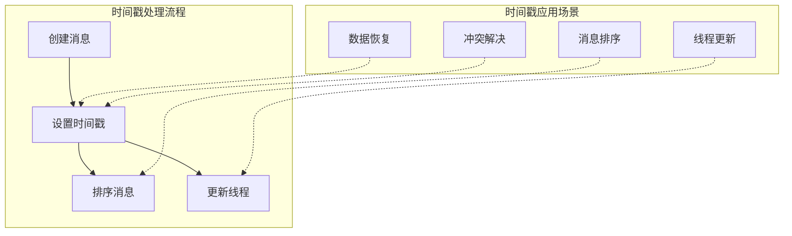
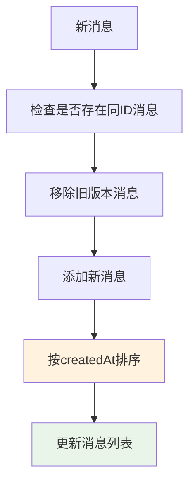
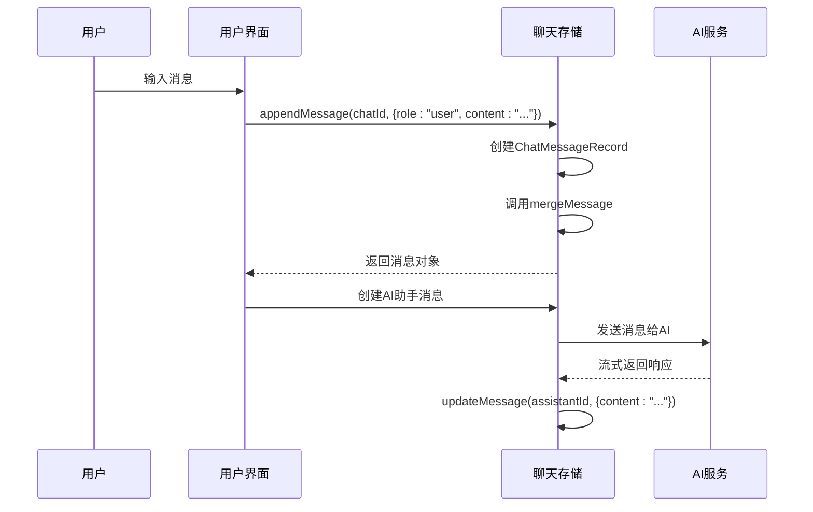
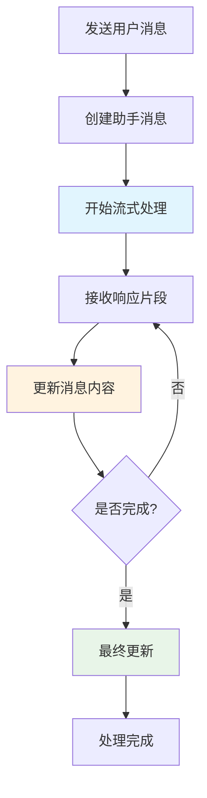

# 消息记录结构

<cite>
**本文档中引用的文件**
- [chat-store.ts](file://src/store/chat-store.ts)
- [chat-db.ts](file://src/store/chat-db.ts)
- [chat-types.ts](file://src/ai/chat-types.ts)
- [ChatPage.tsx](file://src/components/pages/ChatPage.tsx)
- [openai.ts](file://src/ai/openai.ts)
- [gemini.ts](file://src/ai/gemini.ts)
</cite>

## 目录
1. [简介](#简介)
2. [核心数据结构](#核心数据结构)
3. [消息记录架构](#消息记录架构)
4. [消息操作方法](#消息操作方法)
5. [前端与AI服务接口转换](#前端与ai服务接口转换)
6. [时间戳管理](#时间戳管理)
7. [使用示例](#使用示例)
8. [最佳实践](#最佳实践)

## 简介

本文档详细介绍了Skid Homework项目中消息记录系统的完整架构和实现细节。该系统采用分层设计，通过`ChatMessageRecord`类型定义核心消息结构，并通过`messages`对象以聊天ID为键的嵌套结构组织消息数据。系统支持多种AI服务提供商（OpenAI、Gemini等），并通过标准化的消息格式实现前后端数据流转。

## 核心数据结构

### ChatMessageRecord 类型定义

`ChatMessageRecord`是系统的核心数据结构，定义了单条消息的基本属性：



**图表来源**
- [chat-db.ts](file://src/store/chat-db.ts#L15-L21)

### AiChatMessage 类型定义

AI服务接口使用的标准化消息格式：



**图表来源**
- [chat-types.ts](file://src/ai/chat-types.ts#L1-L6)

**节来源**
- [chat-db.ts](file://src/store/chat-db.ts#L15-L21)
- [chat-types.ts](file://src/ai/chat-types.ts#L1-L6)

## 消息记录架构

### 嵌套结构设计原理

系统采用以聊天ID为键的嵌套结构来组织消息数据：

```mermaid
graph TB
subgraph "消息存储结构"
Messages[messages 对象]
Chat1[chatId: string]
Chat2[chatId: string]
ChatN[chatId: string]
Messages --> Chat1
Messages --> Chat2
Messages --> ChatN
Chat1 --> MsgArray1[ChatMessageRecord[]]
Chat2 --> MsgArray2[ChatMessageRecord[]]
ChatN --> MsgArrayN[ChatMessageRecord[]]
MsgArray1 --> Msg1[消息1]
MsgArray1 --> Msg2[消息2]
MsgArray1 --> Msg3[消息3]
end
subgraph "数据流"
Frontend[前端组件]
Store[状态管理]
DB[数据库]
Frontend --> Store
Store --> DB
DB --> Store
Store --> Frontend
end
```

**图表来源**
- [chat-store.ts](file://src/store/chat-store.ts#L27)

### 角色分类体系

系统支持三种消息角色，每种角色在对话中承担不同职责：

| 角色类型 | 描述 | 使用场景 |
|---------|------|----------|
| `user` | 用户输入消息 | 用户提出问题或指令 |
| `assistant` | AI助手回复 | AI生成的回答内容 |
| `system` | 系统提示消息 | 定义AI行为和上下文 |

**节来源**
- [chat-db.ts](file://src/store/chat-db.ts#L3)

## 消息操作方法

### mergeMessage 工具函数

`mergeMessage`函数是维护消息列表时序一致性的核心工具：



**图表来源**
- [chat-store.ts](file://src/store/chat-store.ts#L55-L66)

### appendMessage 方法

向指定聊天添加新消息的异步操作流程：



**图表来源**
- [chat-store.ts](file://src/store/chat-store.ts#L167-L196)

### updateMessage 方法

更新现有消息内容和元数据的操作：



**图表来源**
- [chat-store.ts](file://src/store/chat-store.ts#L198-L236)

**节来源**
- [chat-store.ts](file://src/store/chat-store.ts#L55-L66)
- [chat-store.ts](file://src/store/chat-store.ts#L167-L196)
- [chat-store.ts](file://src/store/chat-store.ts#L198-L236)

## 前端与AI服务接口转换

### 消息格式映射

系统在前端和AI服务之间进行消息格式转换：



**图表来源**
- [ChatPage.tsx](file://src/components/pages/ChatPage.tsx#L45-L57)
- [chat-types.ts](file://src/ai/chat-types.ts#L1-L6)

### AI客户端集成

不同AI服务提供商的消息处理差异：

| 提供商 | 角色映射 | 内容格式 | 流式处理 |
|--------|----------|----------|----------|
| OpenAI | user/assistant/system | 字符串数组 | 支持 |
| Gemini | user/model | 文本片段 | 支持 |

**节来源**
- [ChatPage.tsx](file://src/components/pages/ChatPage.tsx#L45-L57)
- [openai.ts](file://src/ai/openai.ts#L193-L208)
- [gemini.ts](file://src/ai/gemini.ts#L178-L183)

## 时间戳管理

### createdAt 字段的作用

`createdAt`时间戳在系统中发挥关键作用：



**图表来源**
- [chat-store.ts](file://src/store/chat-store.ts#L173)
- [chat-store.ts](file://src/store/chat-store.ts#L188)

### 排序机制

系统确保消息按时间顺序排列：



**图表来源**
- [chat-store.ts](file://src/store/chat-store.ts#L61-L62)

**节来源**
- [chat-store.ts](file://src/store/chat-store.ts#L173)
- [chat-store.ts](file://src/store/chat-store.ts#L61-L62)

## 使用示例

### 用户输入消息构造

用户发送消息时的消息构造过程：



**图表来源**
- [ChatPage.tsx](file://src/components/pages/ChatPage.tsx#L460-L581)

### AI响应消息处理

AI服务响应的处理和更新流程：



**图表来源**
- [ChatPage.tsx](file://src/components/pages/ChatPage.tsx#L544-L572)

**节来源**
- [ChatPage.tsx](file://src/components/pages/ChatPage.tsx#L460-L581)

## 最佳实践

### 消息验证和清理

系统实现了多层验证机制：

1. **内容验证**：过滤空内容消息
2. **角色验证**：确保角色值的有效性
3. **时间戳验证**：保证时间戳的正确性
4. **ID生成**：自动生成唯一消息ID

### 性能优化策略

1. **批量操作**：使用事务批量处理消息
2. **懒加载**：按需加载聊天消息
3. **内存管理**：及时清理不需要的消息
4. **索引优化**：数据库查询使用适当索引

### 错误处理机制

系统提供了完善的错误处理：

1. **网络错误**：重试机制和降级处理
2. **数据一致性**：事务保证和回滚机制
3. **用户反馈**：友好的错误提示信息
4. **日志记录**：详细的错误日志追踪