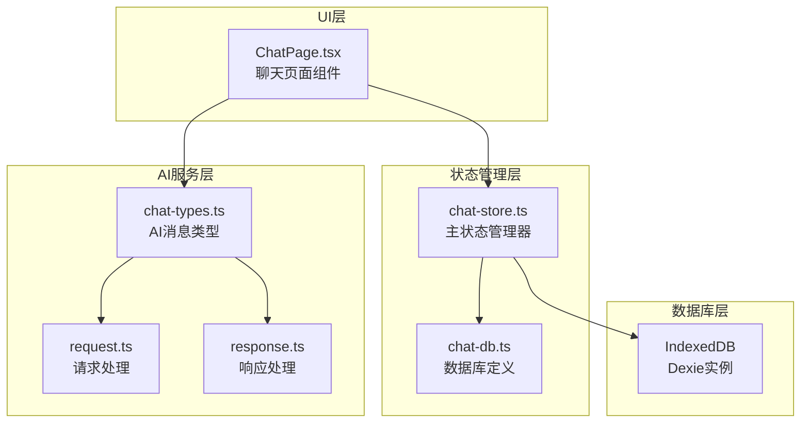
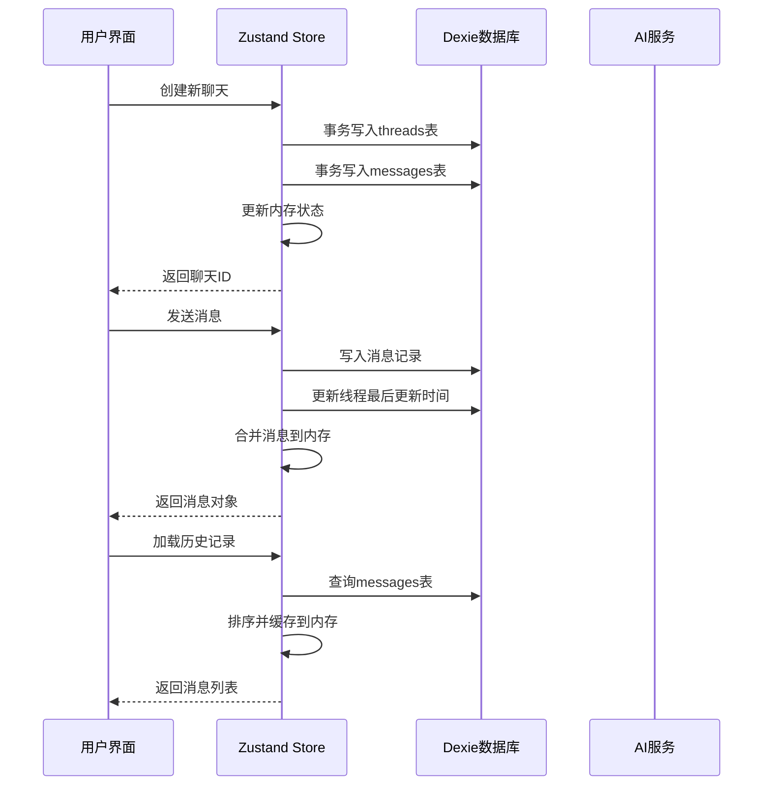
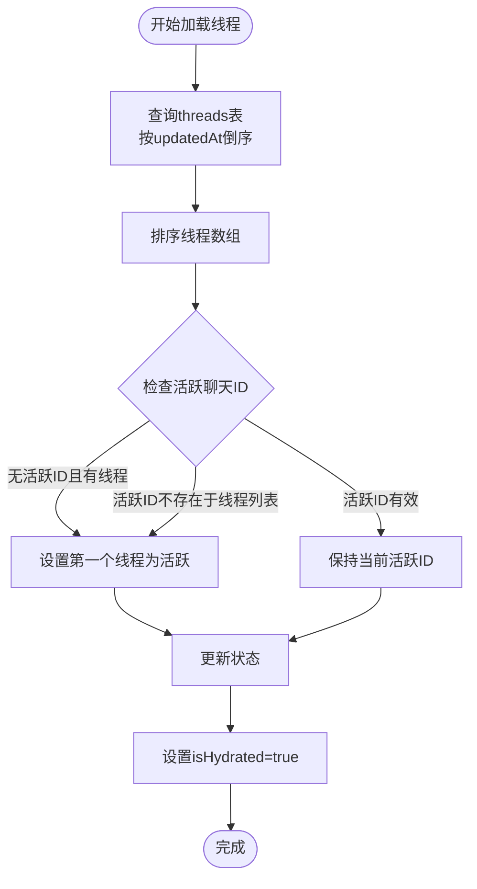
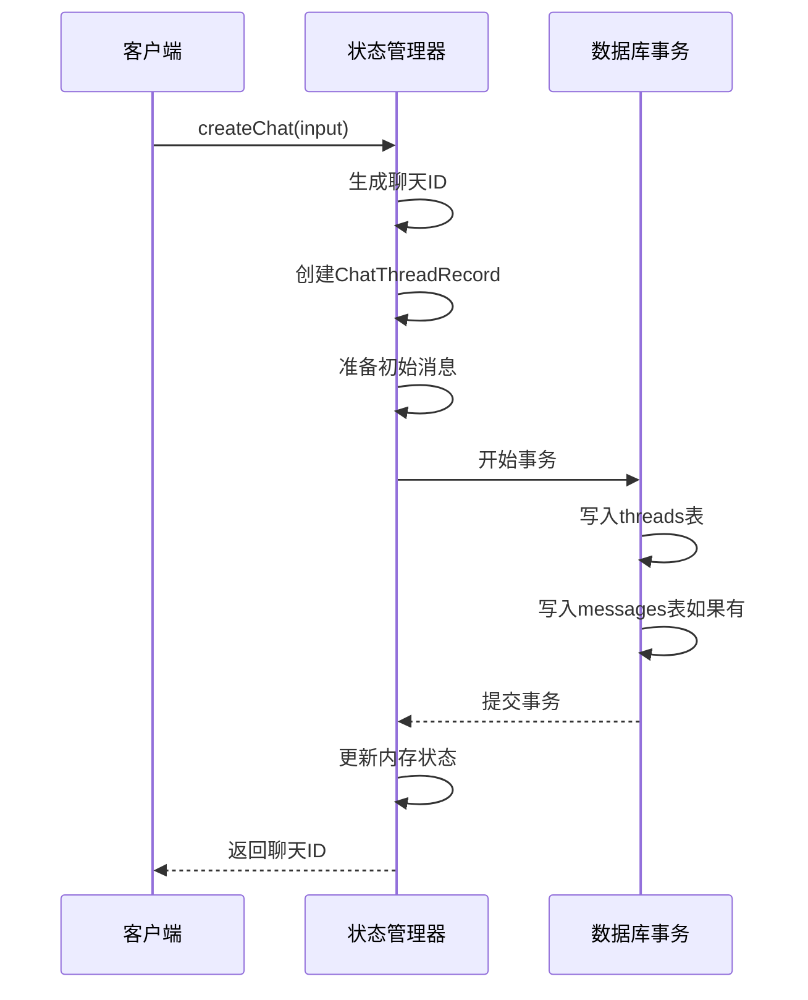
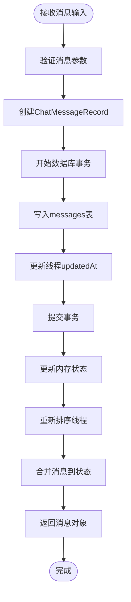
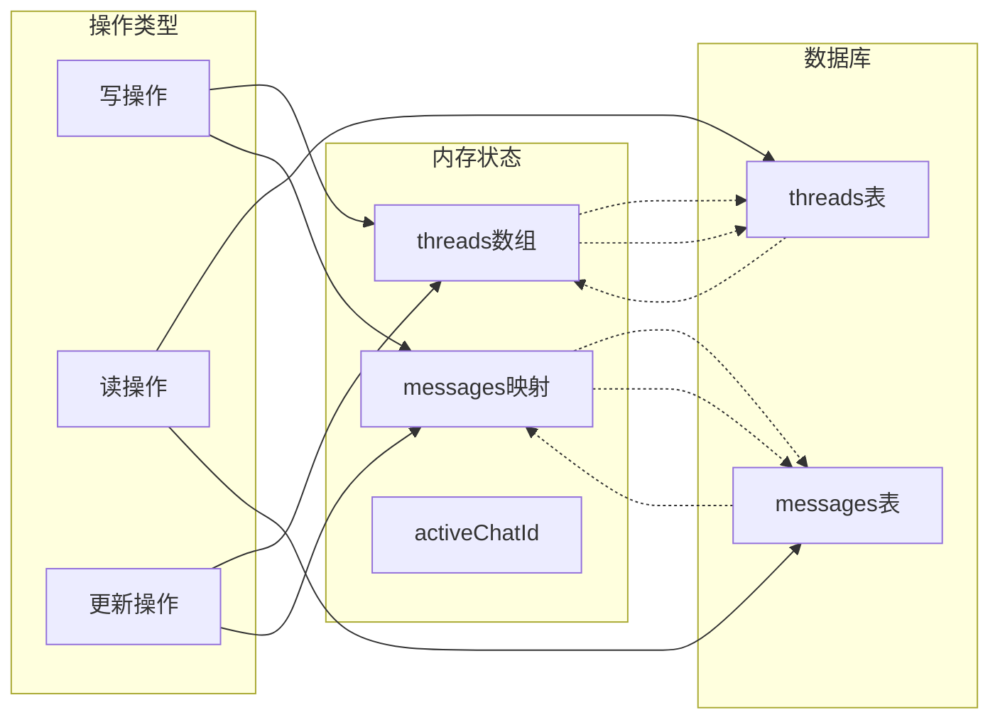
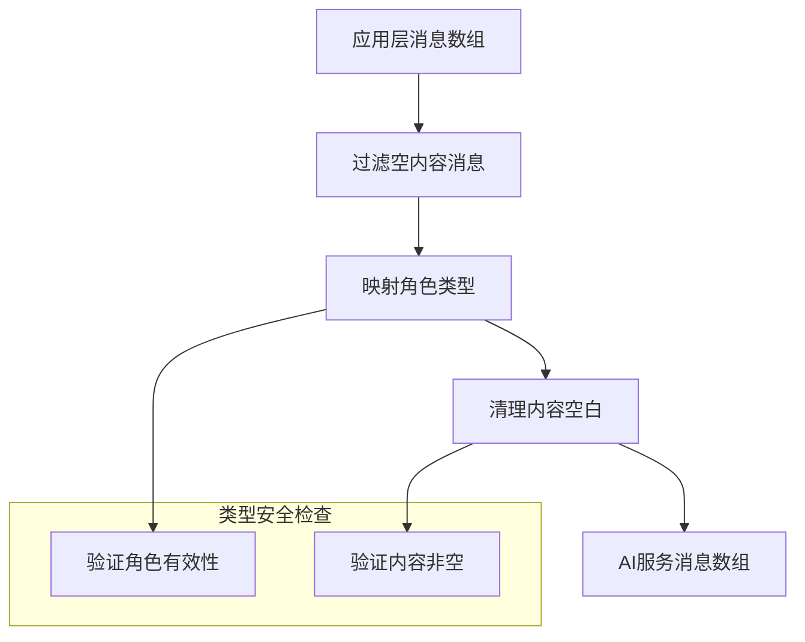
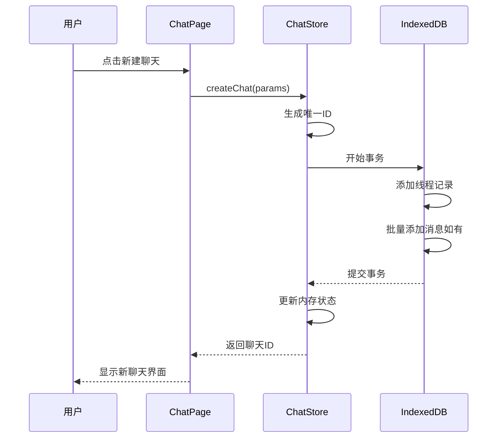
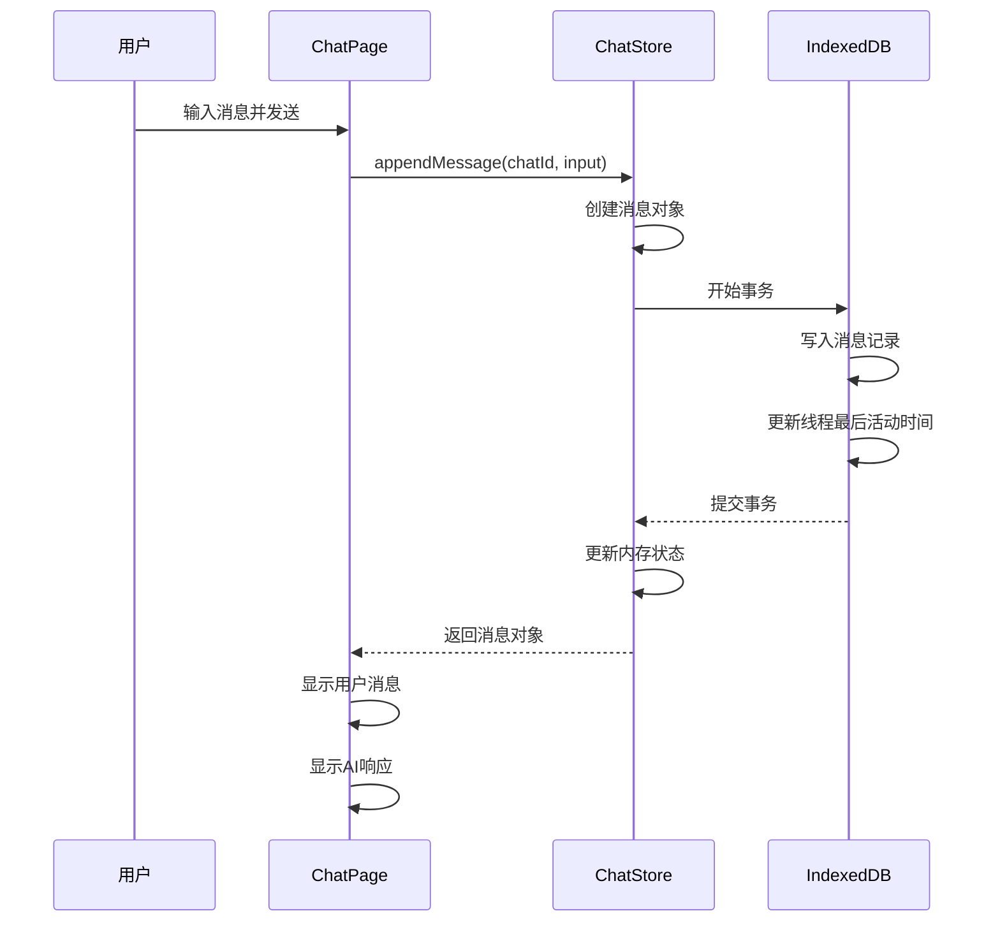
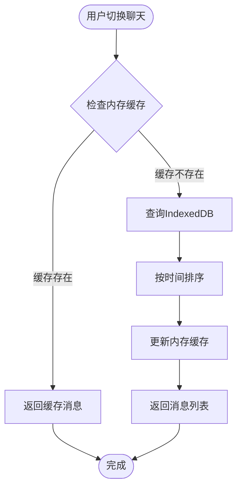

# 聊天状态模型

<cite>
**本文档引用的文件**
- [chat-store.ts](file://src/store/chat-store.ts)
- [chat-db.ts](file://src/store/chat-db.ts)
- [chat-types.ts](file://src/ai/chat-types.ts)
- [ChatPage.tsx](file://src/components/pages/ChatPage.tsx)
- [request.ts](file://src/ai/request.ts)
- [response.ts](file://src/ai/response.ts)
- [openai.ts](file://src/ai/openai.ts)
- [gemini.ts](file://src/ai/gemini.ts)
</cite>

## 目录
1. [简介](#简介)
2. [项目结构概览](#项目结构概览)
3. [核心数据结构](#核心数据结构)
4. [架构概览](#架构概览)
5. [详细组件分析](#详细组件分析)
6. [数据持久化机制](#数据持久化机制)
7. [AI服务集成](#ai服务集成)
8. [状态管理流程](#状态管理流程)
9. [性能考虑](#性能考虑)
10. [故障排除指南](#故障排除指南)
11. [总结](#总结)

## 简介

聊天状态模型是Skid Homework项目中负责管理聊天会话数据的核心系统。该系统采用Zustand状态管理库，结合Dexie IndexedDB数据库，实现了完整的聊天功能，包括会话创建、消息管理、历史记录保存和AI服务集成。

本文档深入解析`chat-store.ts`中管理的聊天会话数据结构，重点说明`ChatState`接口定义的`threads`和`messages`状态，以及`ChatThreadRecord`和`ChatMessageRecord`在内存与IndexedDB中的双重存储机制。

## 项目结构概览

聊天状态模型涉及以下核心文件：



**图表来源**
- [chat-store.ts](file://src/store/chat-store.ts#L1-L302)
- [chat-db.ts](file://src/store/chat-db.ts#L1-L45)
- [chat-types.ts](file://src/ai/chat-types.ts#L1-L7)

## 核心数据结构

### ChatState接口定义

`ChatState`接口是整个聊天状态模型的核心，定义了以下关键属性：

| 属性名 | 类型 | 描述 |
|--------|------|------|
| `threads` | `ChatThreadRecord[]` | 所有聊天线程的数组，按更新时间降序排列 |
| `messages` | `Record<string, ChatMessageRecord[]>` | 嵌套结构：以聊天ID为键的消息数组映射 |
| `activeChatId` | `string?` | 当前激活的聊天会话ID |
| `isHydrated` | `boolean` | 数据是否已从数据库加载完成的标志 |

### 数据记录类型

#### ChatThreadRecord
代表单个聊天线程的基本信息：

| 字段名 | 类型 | 描述 |
|--------|------|------|
| `id` | `string` | 唯一标识符（UUID） |
| `title` | `string` | 聊天标题 |
| `sourceId` | `string` | AI服务源标识符 |
| `model` | `string` | 使用的AI模型名称 |
| `createdAt` | `number` | 创建时间戳 |
| `updatedAt` | `number` | 最后更新时间戳 |
| `metadata` | `Record<string, unknown>?` | 可选的元数据对象 |

#### ChatMessageRecord  
代表单条聊天消息：

| 字段名 | 类型 | 描述 |
|--------|------|------|
| `id` | `string` | 消息唯一标识符（UUID） |
| `chatId` | `string` | 关联的聊天线程ID |
| `role` | `ChatRole` | 消息角色（user/assistant/system） |
| `content` | `string` | 消息内容 |
| `createdAt` | `number` | 创建时间戳 |

**章节来源**
- [chat-store.ts](file://src/store/chat-store.ts#L25-L49)
- [chat-db.ts](file://src/store/chat-db.ts#L5-L21)

## 架构概览

聊天状态模型采用分层架构设计，确保数据的一致性和持久化：



**图表来源**
- [chat-store.ts](file://src/store/chat-store.ts#L122-L165)
- [chat-store.ts](file://src/store/chat-store.ts#L167-L196)

## 详细组件分析

### Zustand状态管理器

`useChatStore`是基于Zustand的状态管理器，提供了完整的聊天功能：

#### 核心方法分析

##### loadThreads方法
异步加载所有聊天线程，按更新时间降序排序：



**图表来源**
- [chat-store.ts](file://src/store/chat-store.ts#L75-L95)

##### createChat方法
创建新的聊天会话，包含事务性数据持久化：



**图表来源**
- [chat-store.ts](file://src/store/chat-store.ts#L122-L165)

##### appendMessage方法
向指定聊天添加新消息：



**图表来源**
- [chat-store.ts](file://src/store/chat-store.ts#L167-L196)

### IndexedDB数据库设计

#### 表结构设计

Dexie数据库定义了两个主要表：

| 表名 | 主键 | 索引 | 描述 |
|------|------|------|------|
| `threads` | `id` | `updatedAt`, `createdAt` | 存储聊天线程基本信息 |
| `messages` | `id` | `chatId`, `createdAt`, `chatId+createdAt` | 存储聊天消息内容 |

#### 索引优化策略

- **threads表**：按`updatedAt`倒序索引，支持快速获取最新线程
- **messages表**：复合索引`[chatId+createdAt]`，优化按聊天ID和时间查询

**章节来源**
- [chat-db.ts](file://src/store/chat-db.ts#L23-L33)

## 数据持久化机制

### 内存与数据库的双重存储

聊天状态采用内存优先的双重存储策略：

#### 内存状态结构
```typescript
{
  threads: ChatThreadRecord[],           // 线程列表（内存缓存）
  messages: Record<string, ChatMessageRecord[]>,  // 按聊天ID组织的消息映射
  activeChatId: string?,                 // 当前活跃聊天ID
  isHydrated: boolean                    // 数据加载状态标志
}
```

#### 数据同步机制



**图表来源**
- [chat-store.ts](file://src/store/chat-store.ts#L69-L301)

### 事务保证

所有写操作都封装在Dexie事务中，确保数据一致性：

```typescript
await chatDb.transaction("rw", chatDb.threads, chatDb.messages, async () => {
  await chatDb.threads.add(thread);
  await chatDb.messages.bulkAdd(preparedMessages);
});
```

**章节来源**
- [chat-store.ts](file://src/store/chat-store.ts#L144-L149)

## AI服务集成

### 消息类型转换

聊天状态模型与AI服务之间的消息转换通过`mapMessagesToAi`函数实现：

#### 类型映射关系

| 应用层类型 | AI服务类型 | 角色转换 |
|------------|------------|----------|
| `"user"` | `"user"` | 直接映射 |
| `"assistant"` | `"assistant"` | 直接映射 |
| `"system"` | `"system"` | 直接映射 |

#### 转换流程



**图表来源**
- [ChatPage.tsx](file://src/components/pages/ChatPage.tsx#L45-L57)

### AI客户端集成

系统支持多种AI服务提供商：

#### OpenAI集成
- 支持GPT系列模型
- 流式响应处理
- 系统提示词管理

#### Gemini集成
- 支持Gemini系列模型
- 多模态内容处理
- 思考预算配置

**章节来源**
- [openai.ts](file://src/ai/openai.ts#L170-L227)
- [gemini.ts](file://src/ai/gemini.ts#L160-L178)

## 状态管理流程

### 创建新聊天流程



**图表来源**
- [chat-store.ts](file://src/store/chat-store.ts#L122-L165)
- [ChatPage.tsx](file://src/components/pages/ChatPage.tsx#L89)

### 发送消息流程



**图表来源**
- [chat-store.ts](file://src/store/chat-store.ts#L167-L196)

### 加载历史记录流程



**图表来源**
- [chat-store.ts](file://src/store/chat-store.ts#L98-L109)

## 性能考虑

### 内存优化策略

1. **懒加载机制**：只在需要时加载聊天消息
2. **消息去重**：使用`mergeMessage`函数避免重复消息
3. **及时清理**：删除聊天时自动清理相关消息

### 数据库优化

1. **批量操作**：使用`bulkAdd`进行批量消息插入
2. **索引利用**：合理使用复合索引加速查询
3. **事务控制**：确保操作原子性

### 网络优化

1. **消息过滤**：发送前过滤空消息
2. **内容压缩**：对大文本内容进行适当处理
3. **并发控制**：限制同时进行的操作数量

## 故障排除指南

### 常见问题及解决方案

#### 数据不一致
**症状**：内存状态与数据库状态不同步
**原因**：事务未正确提交或异常中断
**解决**：检查事务边界，确保所有操作都在事务内执行

#### 性能问题
**症状**：大量消息加载缓慢
**原因**：一次性加载过多消息
**解决**：实现分页加载或虚拟滚动

#### 内存泄漏
**症状**：长时间使用后内存占用过高
**原因**：未及时清理不再使用的聊天数据
**解决**：定期清理过期聊天记录

**章节来源**
- [chat-store.ts](file://src/store/chat-store.ts#L288-L301)

## 总结

聊天状态模型通过精心设计的分层架构，实现了高效、可靠、可扩展的聊天功能。其核心特点包括：

1. **双层存储机制**：内存状态提供快速访问，IndexedDB确保数据持久化
2. **类型安全保障**：严格的类型定义防止运行时错误
3. **事务保证**：确保数据一致性
4. **性能优化**：懒加载、批量操作、索引优化
5. **扩展性强**：支持多种AI服务提供商

该模型为现代Web应用提供了完整的聊天解决方案，具有良好的开发体验和用户体验。