# UI选择状态

<cite>
**本文档中引用的文件**
- [problems-store.ts](file://src/store/problems-store.ts)
- [SolutionsArea.tsx](file://src/components/areas/SolutionsArea.tsx)
- [ProblemList.tsx](file://src/components/ProblemList.tsx)
- [SolutionViewer.tsx](file://src/components/SolutionViewer.tsx)
- [ActionsArea.tsx](file://src/components/areas/ActionsArea.tsx)
- [UploadArea.tsx](file://src/components/areas/UploadArea.tsx)
</cite>

## 目录
1. [简介](#简介)
2. [状态架构概览](#状态架构概览)
3. [核心状态变量](#核心状态变量)
4. [状态操作详解](#状态操作详解)
5. [组件间同步机制](#组件间同步机制)
6. [使用场景分析](#使用场景分析)
7. [边界情况处理](#边界情况处理)
8. [性能优化考虑](#性能优化考虑)
9. [故障排除指南](#故障排除指南)
10. [总结](#总结)

## 简介

UI选择状态系统是skid-homework应用的核心状态管理模块，负责跟踪用户在解题界面中的交互状态。该系统通过两个关键状态变量`selectedImage`和`selectedProblem`，实现了图像和问题级别的精确导航控制，为用户提供流畅的多图像、多问题浏览体验。

## 状态架构概览

UI选择状态系统采用基于Zustand的状态管理模式，通过集中化的状态存储来协调多个组件之间的交互。整个系统围绕着用户在解题界面中的浏览行为设计，确保状态的一致性和响应性。

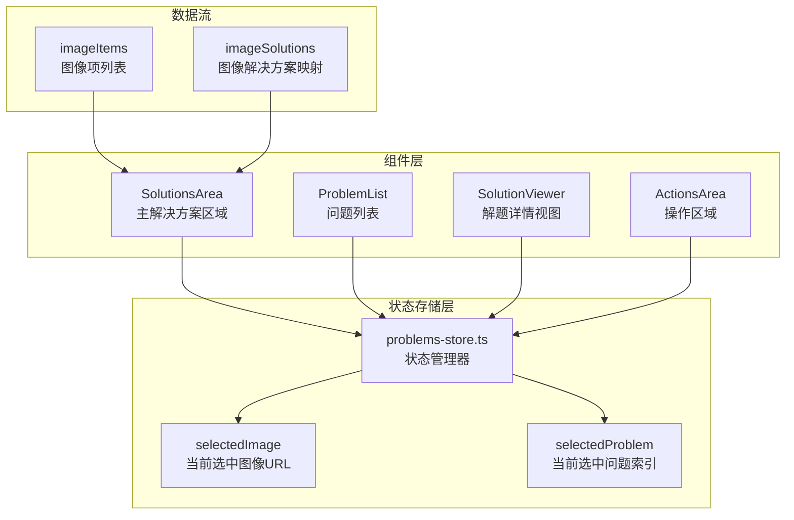

**图表来源**
- [problems-store.ts](file://src/store/problems-store.ts#L32-L71)
- [SolutionsArea.tsx](file://src/components/areas/SolutionsArea.tsx#L55-L65)

**章节来源**
- [problems-store.ts](file://src/store/problems-store.ts#L32-L71)
- [SolutionsArea.tsx](file://src/components/areas/SolutionsArea.tsx#L47-L96)

## 核心状态变量

### selectedImage状态变量

`selectedImage`是一个可选字符串类型的状态变量，用于跟踪当前在界面上查看的图像URL。该状态具有以下特性：

- **类型定义**: `string | undefined`
- **初始值**: `undefined`
- **用途**: 标识当前激活的图像项，作为图像解决方案映射的键值
- **约束**: 必须存在于`imageSolutions`映射中，否则会被重置为第一个可用图像

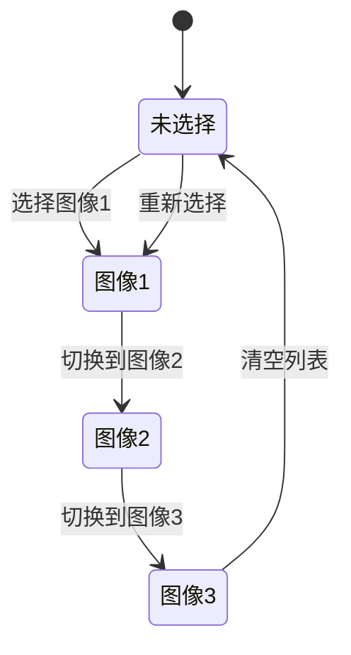

**图表来源**
- [problems-store.ts](file://src/store/problems-store.ts#L38-L39)
- [SolutionsArea.tsx](file://src/components/areas/SolutionsArea.tsx#L85-L91)

### selectedProblem状态变量

`selectedProblem`是一个数字类型的状态变量，用于记录在当前图像的解题列表中当前选中的问题索引。该状态具有以下特性：

- **类型定义**: `number`
- **初始值**: `0`
- **用途**: 指定当前显示的问题在问题列表中的位置
- **约束**: 必须在有效范围内（0 ≤ index < problems.length）

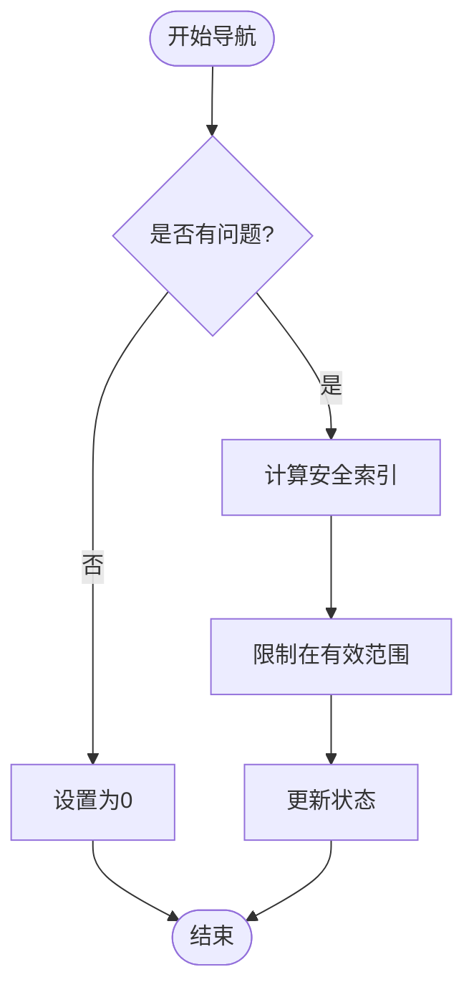

**图表来源**
- [problems-store.ts](file://src/store/problems-store.ts#L39)
- [SolutionsArea.tsx](file://src/components/areas/SolutionsArea.tsx#L246-L255)

**章节来源**
- [problems-store.ts](file://src/store/problems-store.ts#L38-L39)
- [SolutionsArea.tsx](file://src/components/areas/SolutionsArea.tsx#L85-L91)

## 状态操作详解

### setSelectedImage操作

`setSelectedImage`函数负责更新当前选中的图像状态，其实现逻辑如下：

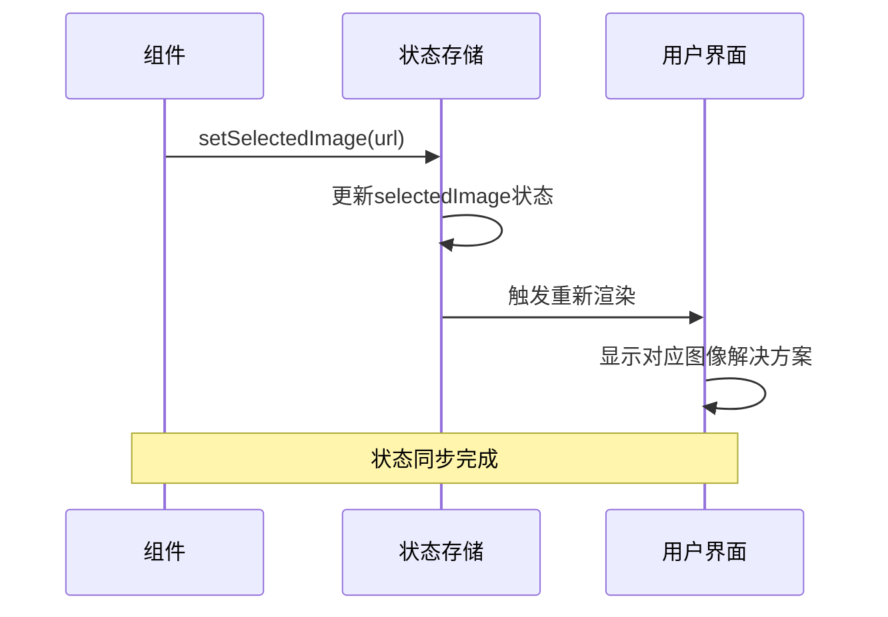

**图表来源**
- [problems-store.ts](file://src/store/problems-store.ts#L266-L269)
- [SolutionsArea.tsx](file://src/components/areas/SolutionsArea.tsx#L392-L396)

#### 实现特点

1. **直接赋值**: 状态更新采用直接赋值方式，确保响应性
2. **类型安全**: 接受可选字符串参数，支持undefined值
3. **即时生效**: 状态变更立即触发组件重新渲染

### setSelectedProblem操作

`setSelectedProblem`函数负责更新当前选中的问题索引，其边界检查逻辑确保状态的有效性：

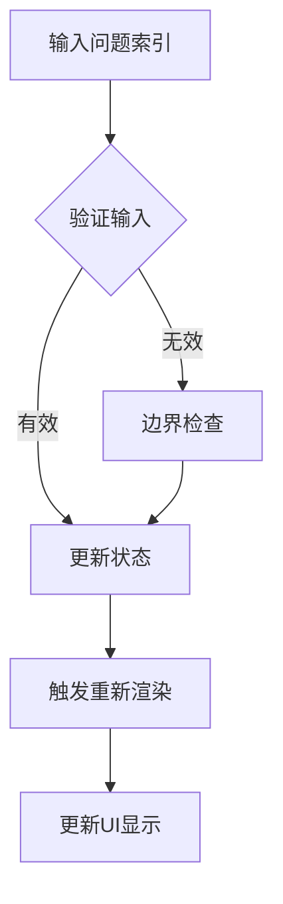

**图表来源**
- [problems-store.ts](file://src/store/problems-store.ts#L271-L274)
- [SolutionsArea.tsx](file://src/components/areas/SolutionsArea.tsx#L218-L229)

#### 边界检查机制

系统实现了多层次的边界检查来确保问题索引的有效性：

1. **导航边界**: 使用`Math.min`和`Math.max`限制索引范围
2. **数据依赖**: 基于当前图像的问题数量动态调整边界
3. **自动修正**: 当前状态超出范围时自动修正到有效值

**章节来源**
- [problems-store.ts](file://src/store/problems-store.ts#L266-L274)
- [SolutionsArea.tsx](file://src/components/areas/SolutionsArea.tsx#L218-L255)

## 组件间同步机制

### 状态订阅模式

各个组件通过不同的订阅模式来响应状态变化：

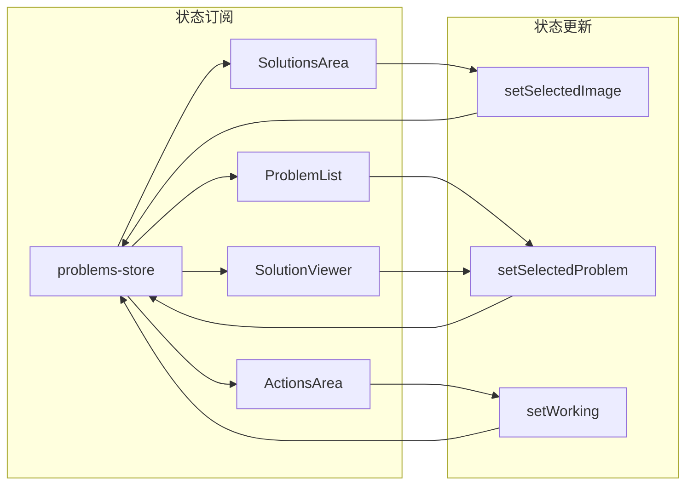

**图表来源**
- [SolutionsArea.tsx](file://src/components/areas/SolutionsArea.tsx#L55-L65)
- [ProblemList.tsx](file://src/components/ProblemList.tsx#L11-L11)
- [SolutionViewer.tsx](file://src/components/SolutionViewer.tsx#L44-L44)

### 自动同步机制

系统实现了多种自动同步机制来维护状态一致性：

#### 图像状态同步

当图像列表发生变化时，系统会自动同步选中状态：

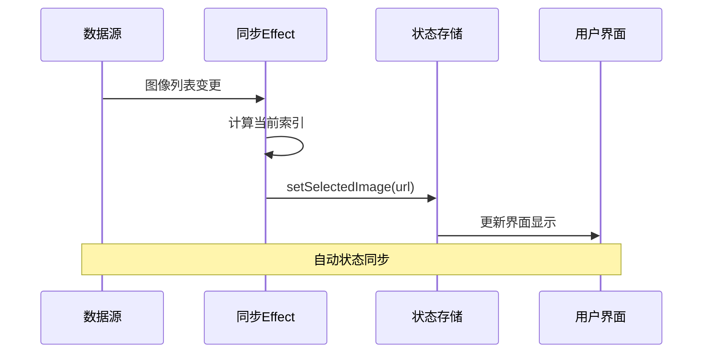

**图表来源**
- [SolutionsArea.tsx](file://src/components/areas/SolutionsArea.tsx#L206-L216)

#### 问题状态同步

当图像切换时，问题索引会自动重置：

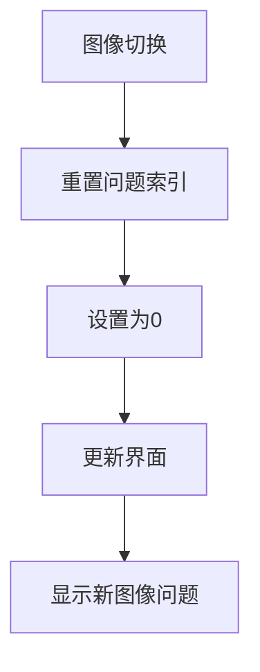

**图表来源**
- [SolutionsArea.tsx](file://src/components/areas/SolutionsArea.tsx#L394-L396)
- [SolutionsArea.tsx](file://src/components/areas/SolutionsArea.tsx#L234-L236)

**章节来源**
- [SolutionsArea.tsx](file://src/components/areas/SolutionsArea.tsx#L206-L216)
- [SolutionsArea.tsx](file://src/components/areas/SolutionsArea.tsx#L394-L396)

## 使用场景分析

### 场景一：用户点击缩略图切换图像

当用户在图像标签页或导航按钮上点击时，会发生以下状态流转：

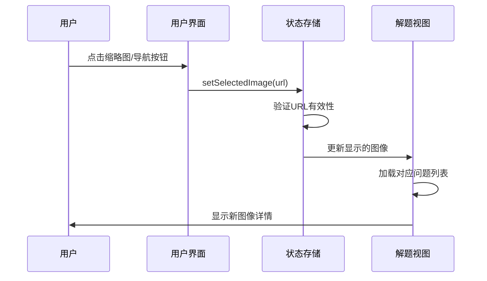

**图表来源**
- [SolutionsArea.tsx](file://src/components/areas/SolutionsArea.tsx#L392-L396)
- [SolutionsArea.tsx](file://src/components/areas/SolutionsArea.tsx#L231-L236)

#### 具体流程

1. **事件捕获**: 组件监听点击事件
2. **状态更新**: 调用`setSelectedImage`更新当前图像
3. **问题重置**: 自动将`selectedProblem`重置为0
4. **界面刷新**: 相关组件重新渲染显示新内容

### 场景二：在解题列表中切换不同问题

当用户在问题列表中选择不同问题时：

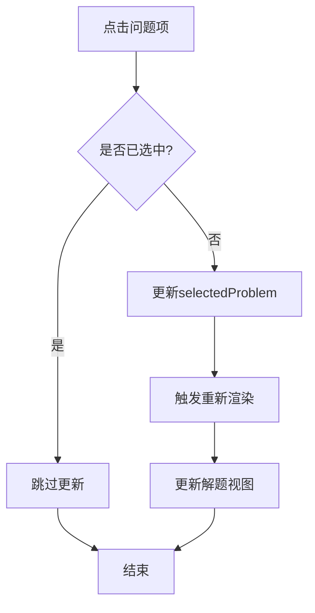

**图表来源**
- [ProblemList.tsx](file://src/components/ProblemList.tsx#L21-L22)
- [SolutionViewer.tsx](file://src/components/SolutionViewer.tsx#L52-L58)

#### 状态变化

- **视觉反馈**: 已选中问题项变为次要样式
- **内容更新**: 解题视图显示对应问题的详细信息
- **导航状态**: 问题计数器反映当前选中位置

### 场景三：键盘快捷键导航

系统支持多种键盘快捷键来导航图像和问题：

| 快捷键组合 | 功能 | 状态影响 |
|------------|------|----------|
| `Tab` / `←` | 上一张图像 | `selectedImage`更新，`selectedProblem`重置为0 |
| `Shift+Tab` / `→` | 下一张图像 | `selectedImage`更新，`selectedProblem`重置为0 |
| `Space` | 下一个问题 | `selectedProblem`递增 |
| `Shift+Space` | 上一个问题 | `selectedProblem`递减 |

**章节来源**
- [SolutionsArea.tsx](file://src/components/areas/SolutionsArea.tsx#L270-L291)
- [ProblemList.tsx](file://src/components/ProblemList.tsx#L21-L22)

## 边界情况处理

### 空状态处理

系统针对各种空状态提供了完善的处理机制：

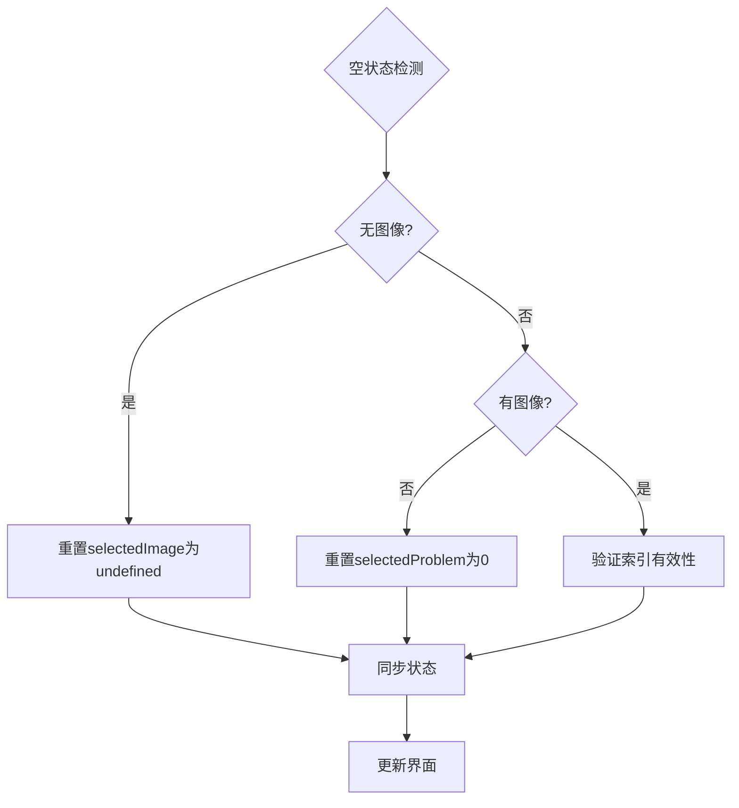

**图表来源**
- [SolutionsArea.tsx](file://src/components/areas/SolutionsArea.tsx#L208-L216)
- [SolutionsArea.tsx](file://src/components/areas/SolutionsArea.tsx#L248-L255)

#### 具体处理策略

1. **图像列表为空**: 将`selectedImage`重置为`undefined`
2. **问题列表为空**: 将`selectedProblem`重置为`0`
3. **索引超出范围**: 使用`Math.min`和`Math.max`进行边界限制
4. **数据不一致**: 通过effect自动修复状态

### 错误恢复机制

系统实现了多层次的错误恢复机制：

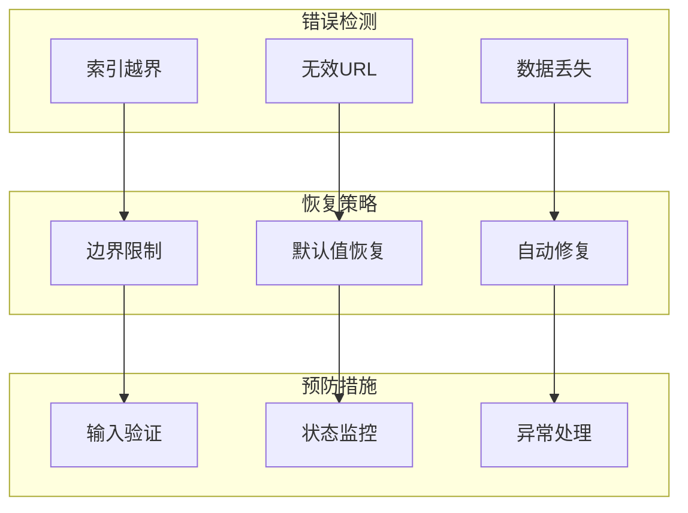

**图表来源**
- [SolutionsArea.tsx](file://src/components/areas/SolutionsArea.tsx#L248-L255)
- [SolutionsArea.tsx](file://src/components/areas/SolutionsArea.tsx#L208-L216)

**章节来源**
- [SolutionsArea.tsx](file://src/components/areas/SolutionsArea.tsx#L208-L216)
- [SolutionsArea.tsx](file://src/components/areas/SolutionsArea.tsx#L248-L255)

## 性能优化考虑

### 状态更新优化

系统采用了多种性能优化策略：

1. **批量更新**: 使用Zustand的原子更新避免不必要的重渲染
2. **记忆化**: 通过`useMemo`缓存计算结果
3. **防抖处理**: 在复杂状态变更时使用防抖机制

### 渲染性能

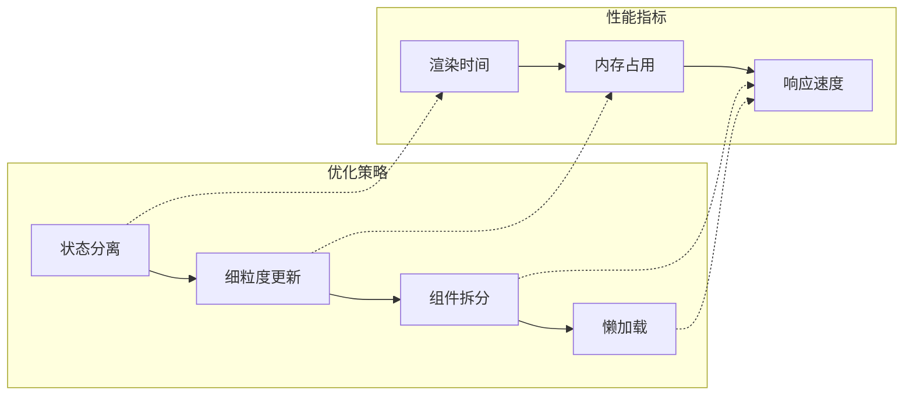

**图表来源**
- [problems-store.ts](file://src/store/problems-store.ts#L73-L280)
- [SolutionsArea.tsx](file://src/components/areas/SolutionsArea.tsx#L73-L83)

### 内存管理

系统通过以下方式优化内存使用：

- **及时清理**: 在移除图像时同步清理相关状态
- **弱引用**: 对大型数据结构使用弱引用模式
- **垃圾回收**: 定期清理不再使用的状态快照

## 故障排除指南

### 常见问题诊断

| 问题症状 | 可能原因 | 解决方案 |
|----------|----------|----------|
| 图像无法切换 | `selectedImage`值无效 | 检查图像URL是否存在于`imageSolutions`中 |
| 问题索引错误 | `selectedProblem`超出范围 | 系统自动边界检查，无需手动干预 |
| 界面卡顿 | 状态更新过于频繁 | 检查是否有循环依赖或过度渲染 |
| 状态不一致 | 多个组件同时更新 | 使用统一的状态更新入口 |

### 调试技巧

1. **状态检查**: 使用浏览器开发工具监控状态变化
2. **日志记录**: 在关键状态更新点添加日志
3. **断点调试**: 在状态更新函数中设置断点
4. **单元测试**: 编写状态更新的单元测试

### 性能监控

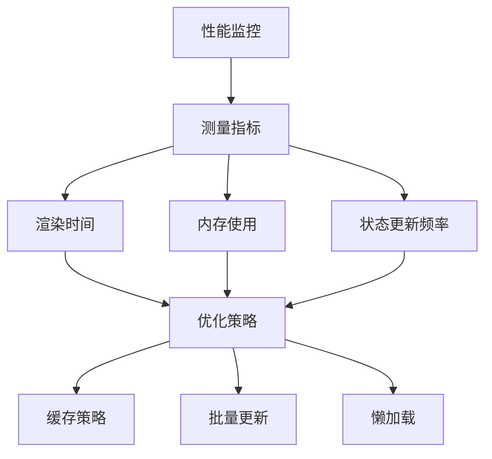

**章节来源**
- [problems-store.ts](file://src/store/problems-store.ts#L155-L164)
- [SolutionsArea.tsx](file://src/components/areas/SolutionsArea.tsx#L206-L216)

## 总结

UI选择状态系统通过精心设计的状态管理和组件同步机制，为用户提供了直观、响应式的解题界面体验。系统的核心优势包括：

1. **状态一致性**: 通过自动同步机制确保状态始终有效
2. **边界保护**: 完善的边界检查防止状态异常
3. **性能优化**: 多层次的优化策略保证流畅体验
4. **扩展性**: 模块化设计便于功能扩展

该系统的设计充分体现了现代React应用的最佳实践，为复杂的多图像、多问题界面提供了稳定可靠的状态管理基础。通过合理的抽象和封装，开发者可以专注于业务逻辑的实现，而不必担心状态管理的复杂性。