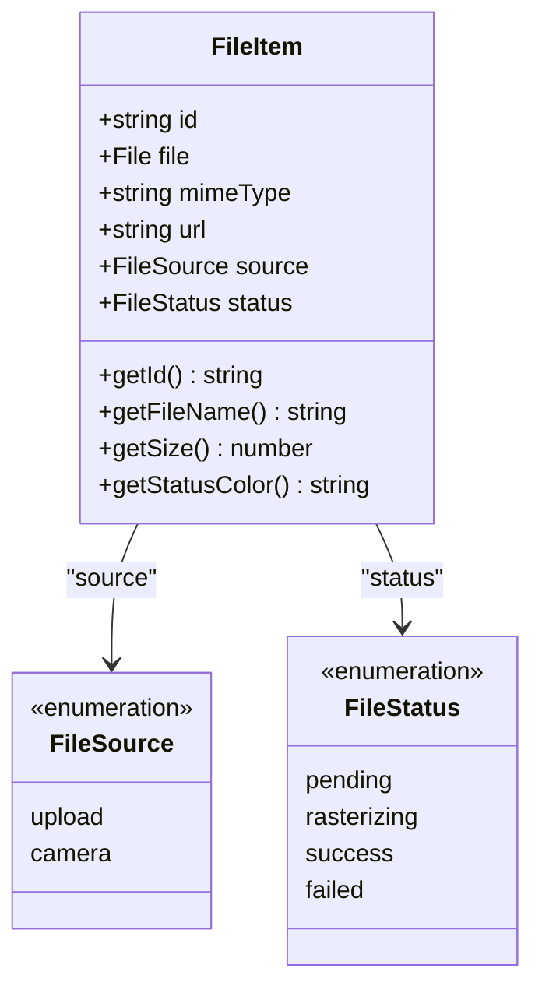
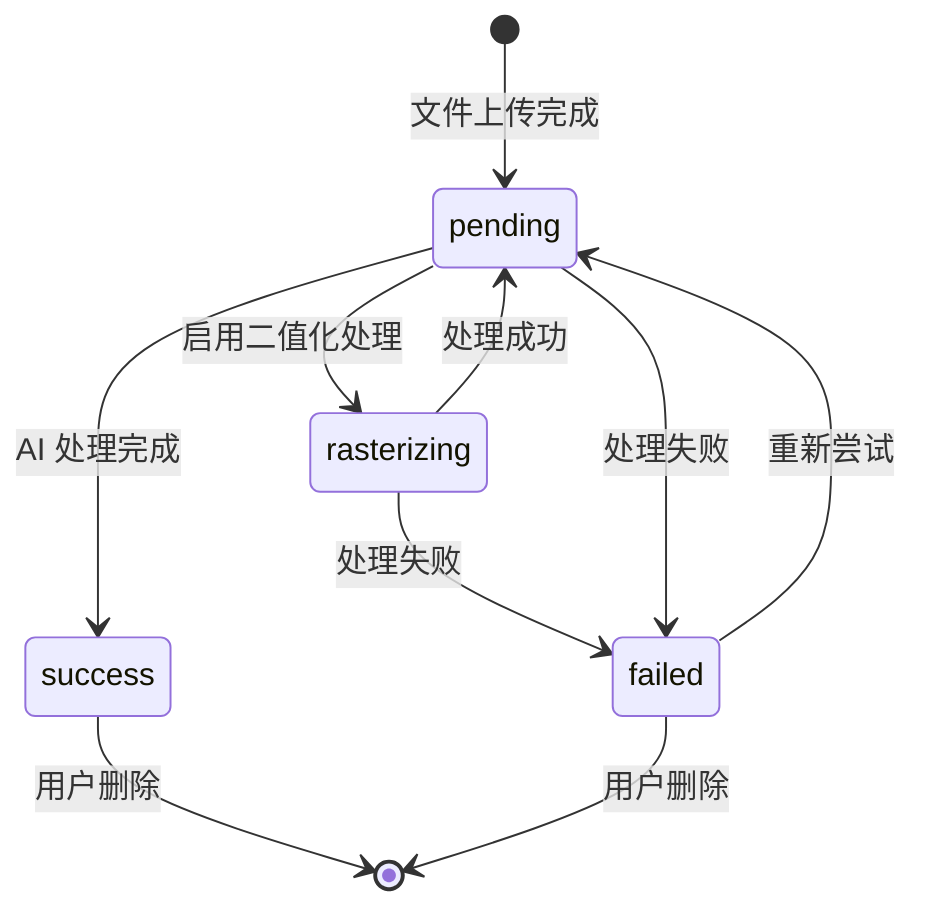
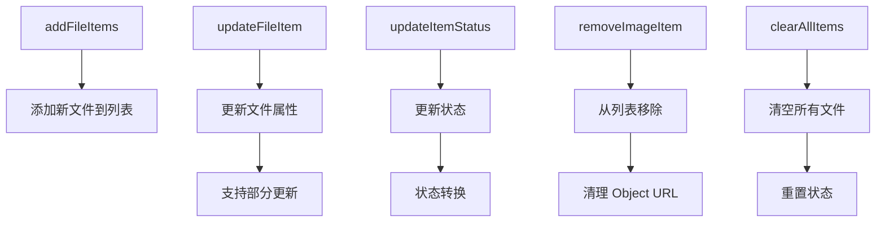
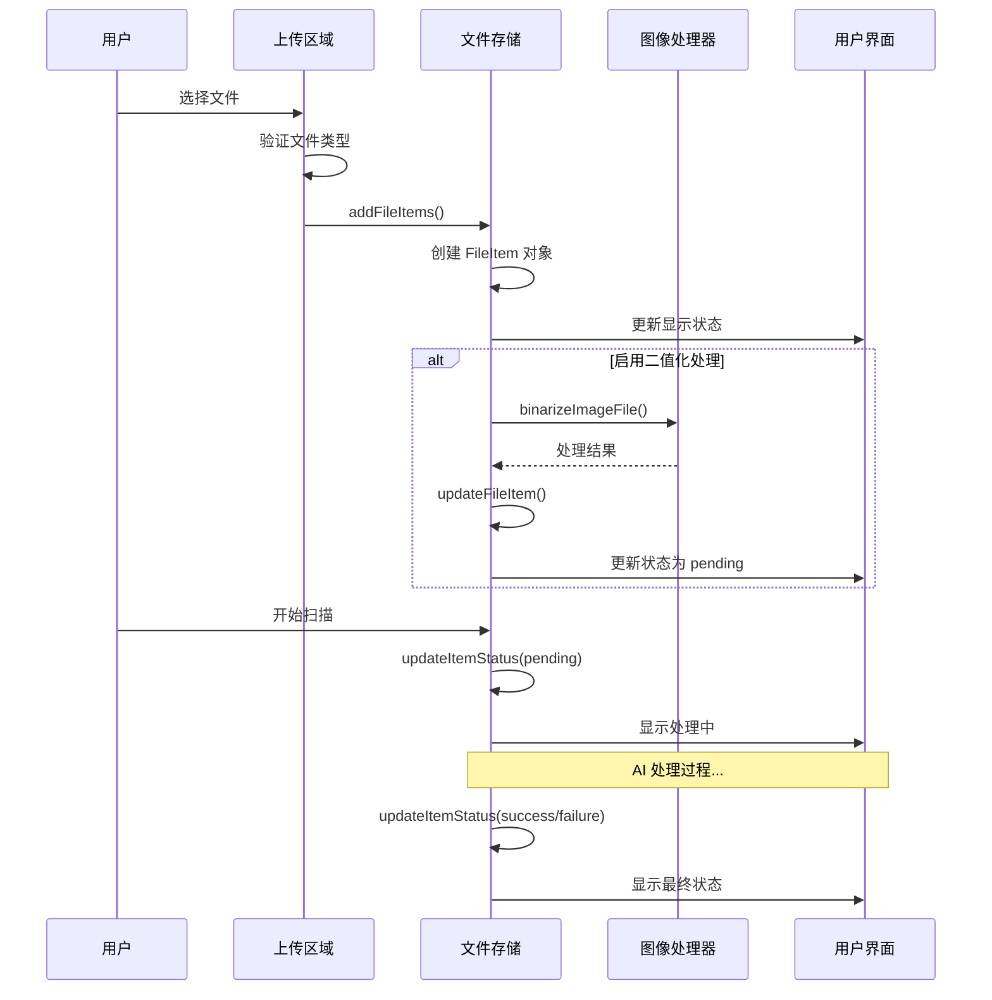
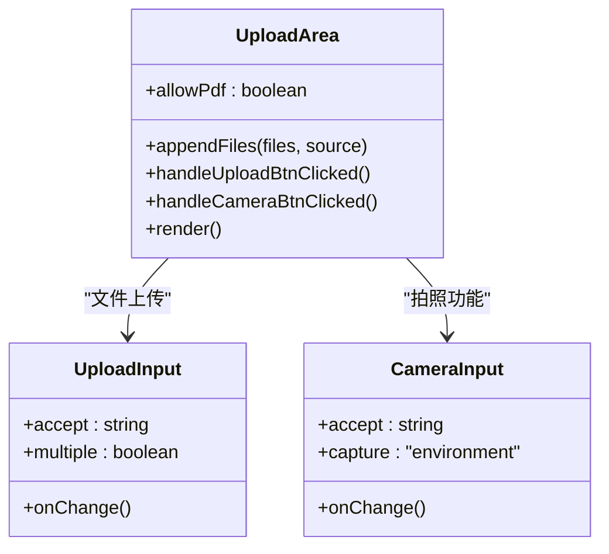
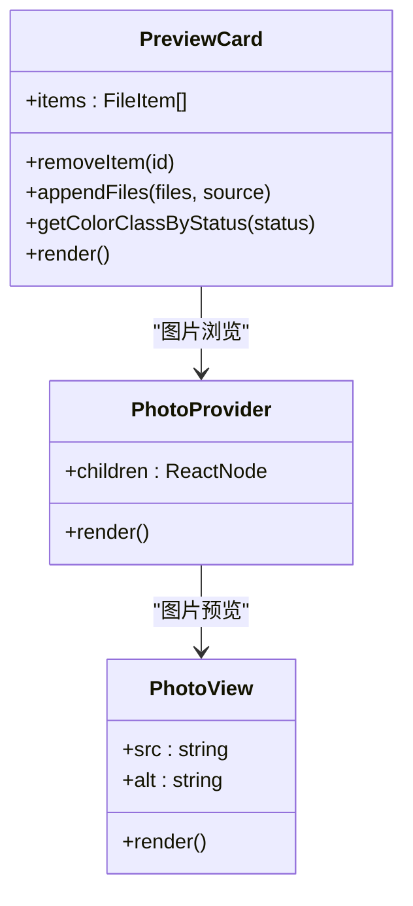
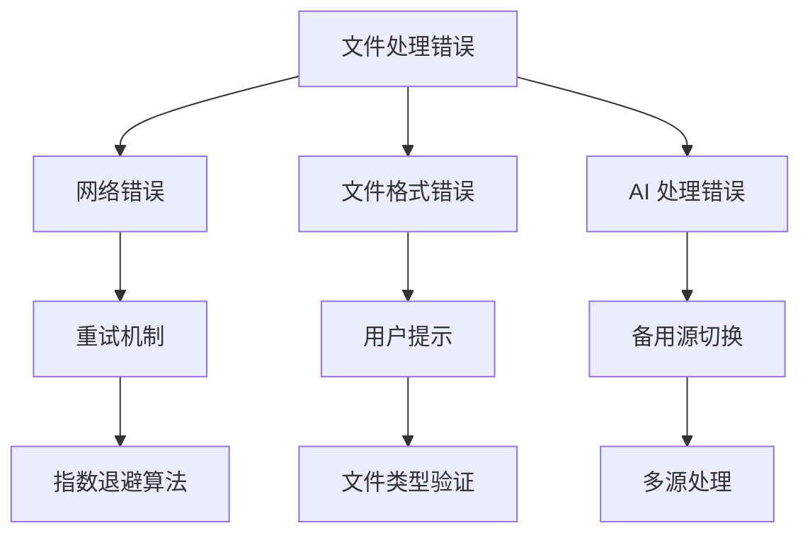

# 文件项管理

<cite>
**本文档中引用的文件**
- [problems-store.ts](file://src/store/problems-store.ts)
- [ScanPage.tsx](file://src/components/pages/ScanPage.tsx)
- [UploadArea.tsx](file://src/components/areas/UploadArea.tsx)
- [PreviewCard.tsx](file://src/components/cards/PreviewCard.tsx)
- [UploadsInfo.tsx](file://src/components/UploadsInfo.tsx)
- [image-post-processing.ts](file://src/utils/image-post-processing.ts)
</cite>

## 目录
1. [简介](#简介)
2. [FileItem 类型定义](#fileitem-类型定义)
3. [文件项状态生命周期](#文件项状态生命周期)
4. [核心操作函数](#核心操作函数)
5. [文件上传流程](#文件上传流程)
6. [UI 组件集成](#ui-组件集成)
7. [错误处理与用户反馈](#错误处理与用户反馈)
8. [最佳实践](#最佳实践)
9. [总结](#总结)

## 简介

文件项管理系统是 SkidHomework 应用的核心功能之一，负责管理用户上传的图片和 PDF 文件。该系统通过 `FileItem` 类型定义文件的基本属性，并提供了完整的 CRUD 操作来管理文件的状态和生命周期。系统支持多种文件来源（上传或拍照），并具备完善的错误处理和用户反馈机制。

## FileItem 类型定义

`FileItem` 是文件项管理的核心数据结构，定义了每个上传文件的所有必要属性：



**图表来源**
- [problems-store.ts](file://src/store/problems-store.ts#L5-L13)

### 字段详解

| 字段名 | 类型 | 描述 | 使用场景 |
|--------|------|------|----------|
| `id` | `string` | 唯一标识符，使用 `crypto.randomUUID()` 生成 | 文件项的唯一识别码，用于状态更新和删除操作 |
| `file` | `File` | 实际的文件对象 | 存储原始文件数据，用于后续处理和上传 |
| `mimeType` | `string` | 文件的 MIME 类型 | 用于文件类型验证和格式识别 |
| `url` | `string` | 客户端预览的 Object URL | 提供文件的临时访问链接，支持图片预览 |
| `source` | `"upload" \| "camera"` | 文件来源 | 区分用户是从文件选择器还是相机拍摄上传的文件 |
| `status` | `"success" \| "pending" \| "failed" \| "rasterizing"` | 当前状态 | 控制 UI 显示和业务逻辑流程 |

**章节来源**
- [problems-store.ts](file://src/store/problems-store.ts#L5-L13)

## 文件项状态生命周期

文件项在系统中有四个主要状态，形成了完整的状态转换图：



**图表来源**
- [problems-store.ts](file://src/store/problems-store.ts#L90-L108)
- [image-post-processing.ts](file://src/utils/image-post-processing.ts#L9-L113)

### 状态详解

#### 1. `pending`（待处理）
- **触发条件**: 文件上传完成，等待 AI 处理
- **UI 表现**: 显示为琥珀色边框，表示正在处理中
- **用户交互**: 可以取消或重新处理

#### 2. `rasterizing`（二值化处理中）
- **触发条件**: 启用了图像二值化功能，文件需要预处理
- **处理过程**: 将彩色图像转换为黑白扫描效果
- **UI 表现**: 显示为青色边框，表示正在执行后处理

#### 3. `success`（处理成功）
- **触发条件**: AI 处理完成，问题识别成功
- **UI 表现**: 显示为绿色边框，表示处理完成
- **可用功能**: 可以查看解决方案、导出结果

#### 4. `failed`（处理失败）
- **触发条件**: 处理过程中发生错误
- **错误类型**: 网络错误、AI 处理失败、文件格式不支持等
- **UI 表现**: 显示为红色边框，表示处理失败

**章节来源**
- [PreviewCard.tsx](file://src/components/cards/PreviewCard.tsx#L20-L32)
- [ScanPage.tsx](file://src/components/pages/ScanPage.tsx#L139-L142)

## 核心操作函数

系统提供了五个核心操作函数来管理文件项：



**图表来源**
- [problems-store.ts](file://src/store/problems-store.ts#L45-L55)

### addFileItems

**功能**: 批量添加新的文件项到上传列表

**实现逻辑**:
- 接收 `FileItem[]` 数组参数
- 使用不可变更新模式合并到现有列表
- 保持原有顺序的同时添加新项目

**使用场景**:
- 用户通过文件选择器上传多个文件
- 通过相机拍摄照片后添加到列表
- 批量导入文件时使用

### updateFileItem

**功能**: 更新单个文件项的任意属性

**实现逻辑**:
- 接收文件 ID 和部分更新对象
- 使用 `map` 方法找到目标文件项
- 合并现有属性和更新内容
- 返回新的文件列表

**使用场景**:
- 更新文件处理后的结果
- 添加错误消息或额外元数据
- 修改文件的 MIME 类型或大小信息

### updateItemStatus

**功能**: 更新文件项的处理状态

**实现逻辑**:
- 接收文件 ID 和新的状态值
- 使用 `map` 方法定位目标文件项
- 替换状态属性并返回更新后的列表

**使用场景**:
- 开始处理文件时设置为 `pending`
- 处理成功后设置为 `success`
- 处理失败时设置为 `failed`

### removeImageItem

**功能**: 从列表中移除指定的文件项

**实现逻辑**:
- 接收文件 ID 参数
- 使用 `filter` 方法排除目标文件项
- 自动清理对应的 Object URL 资源

**使用场景**:
- 用户手动删除不需要的文件
- 清理处理失败的文件
- 批量删除操作

### clearAllItems

**功能**: 清空所有文件项并重置状态

**实现逻辑**:
- 清空 `imageItems` 数组
- 自动清理所有 Object URL
- 重置相关状态变量

**使用场景**:
- 用户点击"清除全部"按钮
- 重新开始新的扫描任务
- 错误恢复时的清理操作

**章节来源**
- [problems-store.ts](file://src/store/problems-store.ts#L83-L148)

## 文件上传流程

文件上传是一个多步骤的复杂流程，涉及文件验证、预处理和状态管理：



**图表来源**
- [ScanPage.tsx](file://src/components/pages/ScanPage.tsx#L106-L170)
- [UploadArea.tsx](file://src/components/areas/UploadArea.tsx#L78-L82)

### 上传步骤详解

#### 1. 文件选择与验证
- 支持多种文件类型：图片（PNG、JPG、GIF等）和 PDF
- 可选的 PDF 支持需要启用 Gemini AI 源
- 自动过滤不支持的文件类型

#### 2. FileItem 创建
```typescript
const initialItems: FileItem[] = arr.map((file) => ({
  id: crypto.randomUUID(),
  file,
  mimeType: file.type,
  url: URL.createObjectURL(file),
  source,
  status: file.type.startsWith("image/") && imageBinarizingRef.current
    ? "rasterizing"
    : "pending",
}));
```

#### 3. 图像后处理（可选）
对于图片文件，系统会自动执行二值化处理：
- 转换为灰度图像
- 增加对比度形成黑白效果
- 生成新的 File 对象和 URL

#### 4. 状态更新与 UI 反馈
- 实时更新文件状态
- 提供视觉反馈（颜色变化）
- 显示处理进度和结果

**章节来源**
- [ScanPage.tsx](file://src/components/pages/ScanPage.tsx#L133-L143)
- [image-post-processing.ts](file://src/utils/image-post-processing.ts#L9-L113)

## UI 组件集成

文件项管理系统与多个 UI 组件紧密集成，提供完整的用户体验：

### UploadArea 组件

负责文件上传入口，支持拖拽和点击两种方式：



**图表来源**
- [UploadArea.tsx](file://src/components/areas/UploadArea.tsx#L34-L114)

### PreviewCard 组件

提供文件预览和管理功能：



**图表来源**
- [PreviewCard.tsx](file://src/components/cards/PreviewCard.tsx#L35-L227)

### UploadsInfo 组件

显示上传文件的统计信息：

| 属性 | 类型 | 描述 |
|------|------|------|
| `itemsLength` | `number` | 已上传文件数量 |
| `totalBytes` | `number` | 总文件大小（字节） |

**章节来源**
- [UploadsInfo.tsx](file://src/components/UploadsInfo.tsx#L14-L17)

## 错误处理与用户反馈

系统实现了完善的错误处理机制和用户反馈体系：

### 错误类型分类



**图表来源**
- [ScanPage.tsx](file://src/components/pages/ScanPage.tsx#L188-L214)

### 错误处理策略

#### 1. 文件验证错误
- **PDF 不支持**: 显示友好的提示信息
- **文件过大**: 限制文件大小，提供压缩建议
- **格式不支持**: 过滤不支持的文件类型

#### 2. 处理过程错误
- **二值化失败**: 记录错误日志，设置为失败状态
- **AI 处理超时**: 实现重试机制，最多 5 次重试
- **网络中断**: 自动重连，保持处理状态

#### 3. 用户交互错误
- **重复删除**: 防止意外删除，提供确认机制
- **并发操作**: 防止状态冲突，使用原子更新
- **资源泄漏**: 自动清理 Object URL，防止内存泄漏

### 用户反馈机制

#### 1. 视觉反馈
- **状态颜色**: 不同状态对应不同颜色边框
- **加载动画**: 处理过程中显示旋转图标
- **进度指示**: 显示处理百分比和剩余时间

#### 2. 文本提示
- **成功提示**: "All done!" - 处理完成
- **错误提示**: 具体的错误描述和解决建议
- **状态提示**: "Processing..." - 正在处理中

#### 3. 声音反馈
- **成功音效**: 处理完成时播放提示音
- **错误音效**: 发生错误时播放警告音
- **进度音效**: 关键节点播放提示音

**章节来源**
- [ScanPage.tsx](file://src/components/pages/ScanPage.tsx#L125-L129)
- [ScanPage.tsx](file://src/components/pages/ScanPage.tsx#L268-L272)

## 最佳实践

基于对系统的深入分析，以下是文件项管理的最佳实践建议：

### 1. 状态管理优化

#### 使用不可变更新
```typescript
// 推荐：使用不可变更新模式
updateItemStatus: (id, status) =>
  set((state) => ({
    imageItems: state.imageItems.map((item) =>
      item.id === id ? { ...item, status } : item,
    ),
  })),
```

#### 批量操作优化
- 使用 `Map` 结构存储解决方案，提供 O(1) 查找性能
- 批量更新时避免多次重新渲染
- 使用 `useMemo` 缓存计算结果

### 2. 内存管理

#### Object URL 清理
```typescript
// 在组件卸载时清理
useEffect(() => {
  return () => {
    items.forEach((it) => URL.revokeObjectURL(it.url));
  };
}, [items]);
```

#### 文件大小控制
- 设置合理的文件大小上限
- 提供文件压缩选项
- 监控内存使用情况

### 3. 错误恢复

#### 指数退避算法
```typescript
const retryAsyncOperation = async (
  asyncFn: () => Promise<string>,
  maxRetries: number = 5,
  initialDelayMs: number = 5000,
): Promise<string> => {
  let delay = initialDelayMs;
  for (let attempt = 1; attempt <= maxRetries; attempt++) {
    try {
      return await asyncFn();
    } catch (error) {
      if (attempt < maxRetries) {
        await new Promise((resolve) => setTimeout(resolve, delay));
        delay *= 2;
      }
    }
  }
  throw new Error("All retries failed");
};
```

### 4. 用户体验优化

#### 加载状态管理
- 显示全局加载指示器
- 提供处理进度条
- 支持取消当前操作

#### 批量操作支持
- 支持批量选择和删除
- 提供全选/反选功能
- 显示批量操作统计

#### 响应式设计
- 移动端适配触摸操作
- 桌面端支持键盘快捷键
- 自适应布局调整

**章节来源**
- [ScanPage.tsx](file://src/components/pages/ScanPage.tsx#L92-L97)
- [ScanPage.tsx](file://src/components/pages/ScanPage.tsx#L188-L214)

## 总结

文件项管理系统是 SkidHomework 应用的核心功能，通过精心设计的 `FileItem` 类型和完整的一套操作函数，实现了高效的文件管理和处理流程。系统的主要优势包括：

### 技术优势
- **类型安全**: 完整的 TypeScript 类型定义确保类型安全
- **性能优化**: 使用 `Map` 结构提供 O(1) 查找性能
- **内存管理**: 自动清理 Object URL，防止内存泄漏
- **错误恢复**: 完善的重试机制和错误处理

### 用户体验
- **直观的视觉反馈**: 不同状态对应的颜色和图标
- **流畅的操作流程**: 支持拖拽、批量操作等功能
- **友好的错误提示**: 清晰的错误信息和解决建议

### 扩展性
- **模块化设计**: 清晰的职责分离，易于维护和扩展
- **插件化架构**: 支持不同的 AI 处理源
- **国际化支持**: 完整的多语言支持

这套文件项管理系统不仅满足了当前的功能需求，还为未来的功能扩展奠定了坚实的基础。通过持续的优化和改进，可以进一步提升系统的性能和用户体验。