# 解题数据结构

<cite>
**本文档引用的文件**
- [problems-store.ts](file://src/store/problems-store.ts)
- [response.ts](file://src/ai/response.ts)
- [request.ts](file://src/ai/request.ts)
- [ScanPage.tsx](file://src/components/pages/ScanPage.tsx)
- [SolutionsArea.tsx](file://src/components/areas/SolutionsArea.tsx)
- [SolutionViewer.tsx](file://src/components/SolutionViewer.tsx)
- [StreamingOutputDisplay.tsx](file://src/components/StreamingOutputDisplay.tsx)
- [prompts.ts](file://src/ai/prompts.ts)
</cite>

## 目录
1. [简介](#简介)
2. [核心数据结构](#核心数据结构)
3. [数据结构详解](#数据结构详解)
4. [状态管理架构](#状态管理架构)
5. [操作方法详解](#操作方法详解)
6. [流式处理机制](#流式处理机制)
7. [实际应用场景](#实际应用场景)
8. [性能优化考量](#性能优化考量)
9. [最佳实践指南](#最佳实践指南)
10. [总结](#总结)

## 简介

本文档详细解析了skid-homework项目中的解题数据结构系统，重点关注`problems-store.ts`中定义的`Solution`和`ProblemSolution`类型及其管理逻辑。该系统采用Zustand状态管理库，通过Map数据结构实现高效的解题结果存储和管理，支持流式AI响应处理、实时状态更新和多源AI模型集成。

## 核心数据结构

### 类型定义概览

系统的核心数据结构围绕以下三个主要类型构建：


**图表来源**
- [problems-store.ts](file://src/store/problems-store.ts#L15-L40)

**章节来源**
- [problems-store.ts](file://src/store/problems-store.ts#L15-L40)

## 数据结构详解

### Solution类型详解

`Solution`类型是整个解题系统的核心数据结构，负责封装单张图片的所有解题信息：

#### 核心字段分析

| 字段名 | 类型 | 描述 | 用途 |
|--------|------|------|------|
| `imageUrl` | `string` | 图片的唯一标识符 | 作为Map的键值，用于快速查找和更新 |
| `status` | `"success" \| "processing" \| "failed"` | 处理状态 | 控制UI显示和流程控制 |
| `streamedOutput` | `string \| null` | 流式输出内容 | 实时显示AI生成的内容 |
| `problems` | `ProblemSolution[]` | 问题解答对数组 | 存储所有识别到的问题及其解答 |
| `aiSourceId` | `string \| undefined` | AI提供商标识 | 跟踪使用哪个AI模型生成结果 |

#### 字段作用机制

**imageUrl字段**：
- 作为Map的键，确保O(1)的查找和更新性能
- 唯一标识每张处理过的图片
- 支持并发处理多个图片而不产生冲突

**status字段**：
- `"processing"`：AI正在处理中
- `"success"`：处理成功完成
- `"failed"`：处理过程中发生错误

**streamedOutput字段**：
- 存储AI生成的实时文本内容
- 支持增量更新，无需重新渲染整个内容
- 在处理完成后自动清空

**problems数组**：
- 每个元素是一个完整的`ProblemSolution`对象
- 包含问题描述、答案和详细解释
- 支持数学公式、代码片段等多种格式

**章节来源**
- [problems-store.ts](file://src/store/problems-store.ts#L15-L22)

### ProblemSolution类型详解

`ProblemSolution`代表一个完整的问题解答三元组：


**图表来源**
- [problems-store.ts](file://src/store/problems-store.ts#L24-L29)

#### 三元组结构详解

**problem字段**：
- 包含原始问题的完整描述
- 支持LaTeX数学公式语法
- 可能包含代码片段和特殊符号

**answer字段**：
- 问题的最终解答
- 格式化良好的数学表达式
- 可能包含多个解的情况

**explanation字段**：
- 详细的解题思路和步骤
- 使用Markdown格式支持富文本
- 包含数学推导过程和概念解释

**章节来源**
- [problems-store.ts](file://src/store/problems-store.ts#L24-L29)

## 状态管理架构

### Zustand Store设计

系统采用Zustand实现状态管理，具有以下特点：


**图表来源**
- [problems-store.ts](file://src/store/problems-store.ts#L32-L71)

### Map vs Array选择

**Map的优势**：
- O(1)的查找、插入和删除性能
- 维护插入顺序，适合列表渲染
- 键值对结构天然适合以URL为索引的场景

**Array的使用场景**：
- `imageItems`数组维护上传文件列表
- 保持文件的原始上传顺序
- 支持简单的数组操作如过滤、映射

**章节来源**
- [problems-store.ts](file://src/store/problems-store.ts#L35-L40)

## 操作方法详解

### 添加解决方案

`addSolution`方法用于初始化新的解决方案：


**图表来源**
- [problems-store.ts](file://src/store/problems-store.ts#L150-L168)

**关键特性**：
- 预防性检查，避免意外覆盖现有解决方案
- 创建Map副本确保不可变性
- 提供清晰的错误日志

**章节来源**
- [problems-store.ts](file://src/store/problems-store.ts#L150-L168)

### 更新解决方案

`updateSolution`方法支持对现有解决方案的任意字段更新：


**图表来源**
- [problems-store.ts](file://src/store/problems-store.ts#L178-L203)

**自动行为**：
- 当status变为"success"时自动清空streamedOutput
- 支持部分更新，只修改指定字段
- 提供错误处理和日志记录

**章节来源**
- [problems-store.ts](file://src/store/problems-store.ts#L178-L203)

### 流式输出处理

`appendStreamedOutput`方法实现了高效的增量文本追加：


**图表来源**
- [problems-store.ts](file://src/store/problems-store.ts#L210-L222)

**性能优势**：
- O(1)时间复杂度的字符串拼接
- 避免不必要的状态重建
- 支持连续的增量更新

**章节来源**
- [problems-store.ts](file://src/store/problems-store.ts#L210-L222)

### 批量操作

`removeSolutionsByUrls`方法支持批量删除解决方案：


**图表来源**
- [problems-store.ts](file://src/store/problems-store.ts#L248-L259)

**章节来源**
- [problems-store.ts](file://src/store/problems-store.ts#L248-L259)

## 流式处理机制

### 流式输出架构

系统实现了完整的流式AI响应处理机制：


**图表来源**
- [ScanPage.tsx](file://src/components/pages/ScanPage.tsx#L285-L335)
- [StreamingOutputDisplay.tsx](file://src/components/StreamingOutputDisplay.tsx#L45-L53)

### 流式处理实现细节

**实时更新机制**：
- 每个文本块通过`appendStreamedOutput`增量添加
- 使用React的响应式更新触发UI重绘
- 自动滚动到底部显示最新内容

**错误处理**：
- 处理AI响应中断的情况
- 支持手动清除流式输出
- 保留原始错误信息用于调试

**章节来源**
- [ScanPage.tsx](file://src/components/pages/ScanPage.tsx#L285-L335)
- [StreamingOutputDisplay.tsx](file://src/components/StreamingOutputDisplay.tsx#L30-L81)

## 实际应用场景

### 图片扫描处理流程

系统在图片扫描页面实现了完整的解题处理流程：


**图表来源**
- [ScanPage.tsx](file://src/components/pages/ScanPage.tsx#L282-L358)

### AI响应数据构建

AI响应数据通过XML格式逐步构建并更新到状态中：

**初始状态创建**：
- 调用`addSolution`创建处理占位符
- 设置初始状态为"processing"
- 准备空的problems数组

**流式数据处理**：
- AI服务回调`appendStreamedOutput`传递文本块
- 系统实时更新streamedOutput字段
- UI组件自动显示增量内容

**最终结果固化**：
- AI完成处理后调用`updateSolution`
- 设置status为"success"
- 替换problems数组为解析的解答
- 自动清空streamedOutput

**章节来源**
- [ScanPage.tsx](file://src/components/pages/ScanPage.tsx#L285-L346)

### 多源AI模型支持

系统支持多个AI提供者的并行处理：

```mermaid
graph LR
subgraph "AI处理流程"
Image[图片输入] --> Retry[重试机制]
Retry --> OpenAI[OpenAI]
Retry --> Gemini[Gemini]
Retry --> Others[其他AI]
OpenAI --> Success{成功?}
Gemini --> Success
Others --> Success
Success --> |是| Final[最终结果]
Success --> |否| Next[下一个AI]
Next --> OpenAI
Next --> Gemini
Next --> Others
end
```



**图表来源**
- [ScanPage.tsx](file://src/components/pages/ScanPage.tsx#L296-L357)

**章节来源**
- [ScanPage.tsx](file://src/components/pages/ScanPage.tsx#L296-L357)

## 性能优化考量

### 时间复杂度分析

| 操作 | 时间复杂度 | 空间复杂度 | 优化策略 |
|------|------------|------------|----------|
| 查找解决方案 | O(1) | O(1) | 使用Map替代Object |
| 添加解决方案 | O(1) | O(n) | 预防性检查避免重复添加 |
| 更新解决方案 | O(1) | O(n) | 浅拷贝减少内存分配 |
| 流式输出追加 | O(1) | O(1) | 字符串拼接优化 |
| 批量删除 | O(m) | O(n) | m为待删除URL数量 |

### 内存管理优化

**Map的使用优势**：
- 避免频繁的对象重建
- 维护插入顺序提高渲染性能
- 支持高效的键值查找

**字符串处理优化**：
- 使用模板字符串而非字符串连接
- 避免不必要的字符串复制
- 及时清理不再需要的流式输出

**章节来源**
- [problems-store.ts](file://src/store/problems-store.ts#L150-L259)

### UI渲染优化

**React性能优化**：
- 使用useMemo缓存计算结果
- 避免不必要的重新渲染
- 合理的依赖数组设置

**流式显示优化**：
- 自动滚动到底部
- 防抖处理大量更新
- 智能的空白状态处理

**章节来源**
- [StreamingOutputDisplay.tsx](file://src/components/StreamingOutputDisplay.tsx#L45-L53)

## 最佳实践指南

### 数据结构使用建议

**Solution对象创建**：
```typescript
// 推荐：使用addSolution创建初始状态
addSolution({
  imageUrl: image.url,
  status: "processing",
  problems: []
});

// 不推荐：直接修改状态
setState(prev => ({
  imageSolutions: new Map(prev.imageSolutions).set(image.url, {
    imageUrl: image.url,
    status: "processing",
    problems: []
  })
}));
```

**状态更新策略**：
- 优先使用专门的更新方法
- 避免直接修改Map内部结构
- 利用partial更新减少不必要的重渲染

### 错误处理最佳实践

**AI响应解析错误**：
```typescript
try {
  const res = parseSolveResponse(aiResponse);
  updateSolution(imageUrl, {
    status: "success",
    problems: res.problems
  });
} catch (error) {
  updateSolution(imageUrl, {
    status: "failed",
    problems: [{
      problem: "解析失败",
      answer: "无法解析AI响应",
      explanation: error.message
    }]
  });
}
```

**网络错误处理**：
```typescript
try {
  const response = await aiService.processImage(base64);
  // 正常处理流程
} catch (networkError) {
  clearStreamedOutput(imageUrl);
  updateSolution(imageUrl, {
    status: "failed",
    problems: [{
      problem: "网络错误",
      answer: "请检查网络连接",
      explanation: networkError.message
    }]
  });
}
```

### 流式处理最佳实践

**实时反馈机制**：
- 及时更新处理状态
- 提供有意义的进度指示
- 支持用户取消操作

**用户体验优化**：
- 避免UI闪烁和不一致
- 提供清晰的操作反馈
- 支持断点续传功能

## 总结

skid-homework项目的解题数据结构系统展现了现代前端应用中复杂状态管理的最佳实践。通过精心设计的TypeScript类型系统、高效的Map数据结构和完善的Zustand状态管理模式，系统实现了：

**技术优势**：
- O(1)的查找和更新性能
- 完整的流式处理支持
- 强类型的开发体验
- 并发处理能力

**架构特点**：
- 单一数据源管理
- 响应式状态更新
- 清晰的操作边界
- 完善的错误处理

**扩展性考虑**：
- 支持多种AI模型集成
- 可插拔的状态管理
- 灵活的数据格式支持
- 丰富的UI交互模式

这套解题数据结构不仅满足了当前的功能需求，更为未来的功能扩展和性能优化奠定了坚实的基础。通过合理的抽象和模块化设计，系统能够在保持代码简洁性的同时，提供强大的功能和优秀的用户体验。