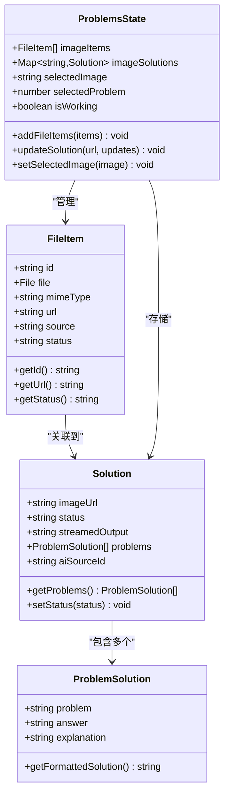
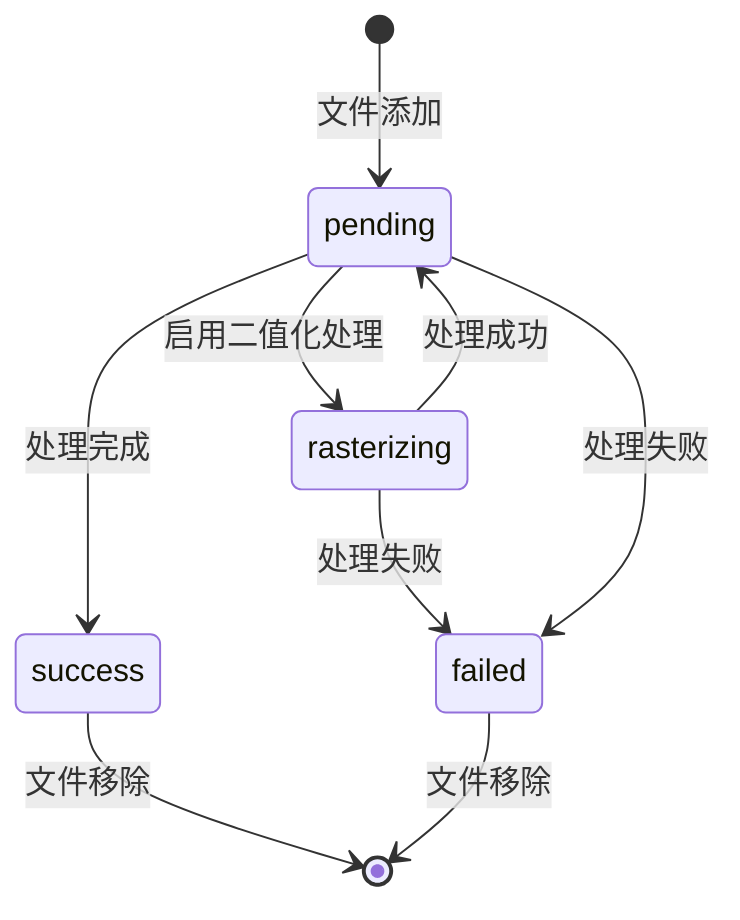
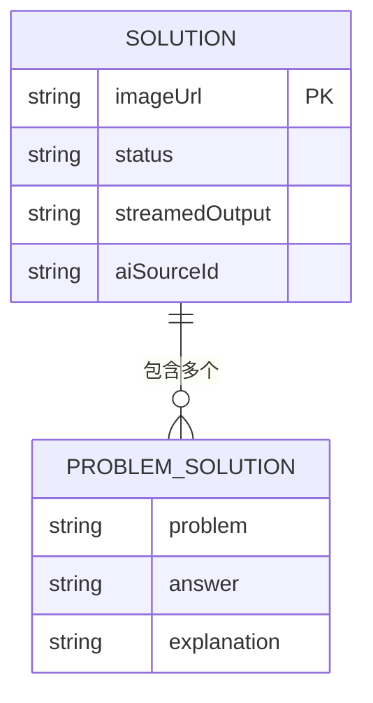
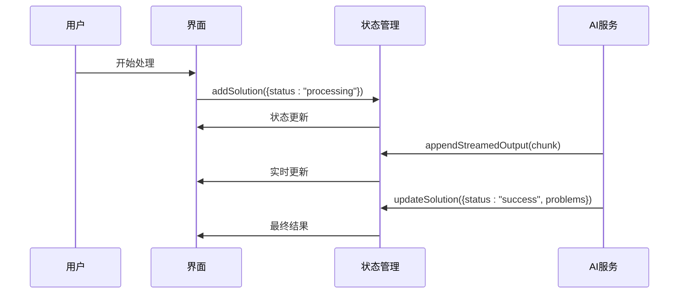
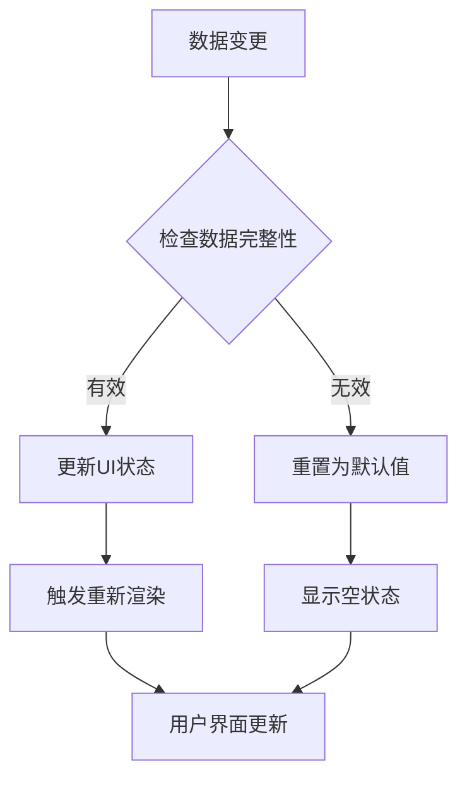
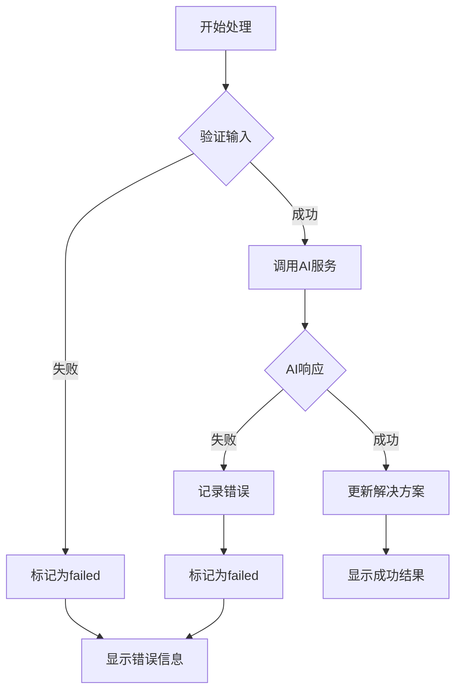
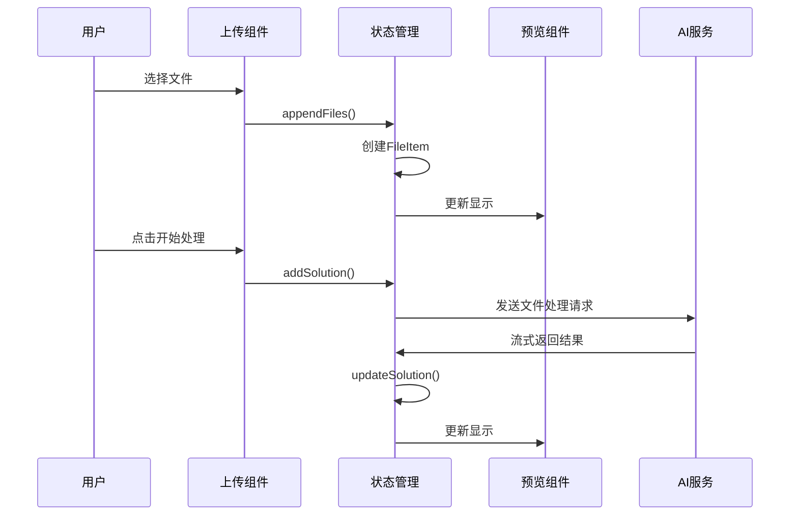
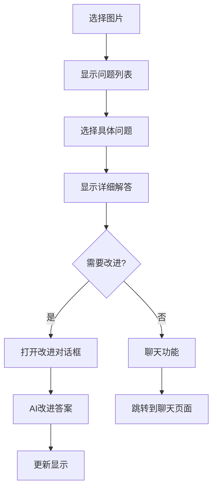

# 问题状态模型

<cite>
**本文档引用的文件**
- [problems-store.ts](file://src/store/problems-store.ts)
- [ScanPage.tsx](file://src/components/pages/ScanPage.tsx)
- [SolutionsArea.tsx](file://src/components/areas/SolutionsArea.tsx)
- [PreviewCard.tsx](file://src/components/cards/PreviewCard.tsx)
- [ProblemList.tsx](file://src/components/ProblemList.tsx)
- [SolutionViewer.tsx](file://src/components/SolutionViewer.tsx)
- [response.ts](file://src/ai/response.ts)
- [chat-types.ts](file://src/ai/chat-types.ts)
</cite>

## 目录
1. [简介](#简介)
2. [核心数据结构](#核心数据结构)
3. [FileItem 类型详解](#fileitem-类型详解)
4. [解决方案数据结构](#解决方案数据结构)
5. [状态管理架构](#状态管理架构)
6. [UI 状态同步机制](#ui-状态同步机制)
7. [数据流分析](#数据流分析)
8. [操作流程图](#操作流程图)
9. [性能优化策略](#性能优化策略)
10. [总结](#总结)

## 简介

问题状态模型是 skid-homework 应用的核心数据管理架构，负责处理作业问题的上传、识别、分析和解决方案生成的完整生命周期。该模型基于 Zustand 状态管理库构建，采用 Map 数据结构优化性能，并提供了完整的响应式状态更新机制。

## 核心数据结构

问题状态模型定义了三个主要的数据类型，构成了完整的作业问题处理体系：



**图表来源**
- [problems-store.ts](file://src/store/problems-store.ts#L6-L29)

**章节来源**
- [problems-store.ts](file://src/store/problems-store.ts#L1-L30)

## FileItem 类型详解

`FileItem` 是系统中最重要的基础数据结构，代表单个上传或拍摄的图片文件。它包含了文件的所有元信息和状态信息：

### 字段语义分析

| 字段名 | 类型 | 描述 | 生命周期 |
|--------|------|------|----------|
| `id` | `string` | 唯一标识符，使用 `crypto.randomUUID()` 生成 | 创建时分配，永久不变 |
| `file` | `File` | 实际的文件对象，包含文件内容和元数据 | 从上传到删除 |
| `mimeType` | `string` | 文件的 MIME 类型，如 `image/jpeg` | 从文件选择到处理完成 |
| `url` | `string` | 对象 URL，用于客户端预览 | 从文件添加到组件卸载 |
| `source` | `"upload" \| "camera"` | 图像来源：上传或相机拍摄 | 创建时确定 |
| `status` | `"success" \| "pending" \| "failed" \| "rasterizing"` | 处理状态 | 动态变化 |

### 状态转换机制



**图表来源**
- [ScanPage.tsx](file://src/components/pages/ScanPage.tsx#L133-L167)

### 生命周期管理

FileItem 的生命周期严格遵循以下模式：
1. **创建阶段**：通过 `appendFiles` 方法创建新的 FileItem
2. **状态监控**：实时更新状态以反映处理进度
3. **清理阶段**：组件卸载时自动清理对象 URL

**章节来源**
- [ScanPage.tsx](file://src/components/pages/ScanPage.tsx#L106-L170)

## 解决方案数据结构

### Solution 类型

Solution 类型封装了单张图片的完整解决方案信息，是整个系统的核心数据载体：



**图表来源**
- [problems-store.ts](file://src/store/problems-store.ts#L16-L22)

### ProblemSolution 类型

每个 ProblemSolution 包含问题描述、答案和详细解释：

| 字段 | 类型 | 用途 | 更新频率 |
|------|------|------|----------|
| `problem` | `string` | 数学问题的文本描述 | AI 处理时生成 |
| `answer` | `string` | 问题的答案 | AI 处理时生成 |
| `explanation` | `string` | 解题过程的详细说明 | AI 处理时生成 |

### 流式输出机制

系统支持 AI 处理过程中的流式输出，通过 `streamedOutput` 字段实现实时反馈：



**图表来源**
- [ScanPage.tsx](file://src/components/pages/ScanPage.tsx#L285-L357)

**章节来源**
- [problems-store.ts](file://src/store/problems-store.ts#L16-L29)
- [response.ts](file://src/ai/response.ts#L1-L160)

## 状态管理架构

### Zustand Store 设计

问题状态模型基于 Zustand 构建，采用函数式更新模式：

```mermaid
graph TB
subgraph "状态层"
A[imageItems: FileItem[]]
B[imageSolutions: Map<string, Solution>]
C[selectedImage: string?]
D[selectedProblem: number]
E[isWorking: boolean]
end
subgraph "动作层"
F[addFileItems]
G[updateSolution]
H[setSelectedImage]
I[updateProblem]
J[clearAllItems]
end
subgraph "依赖关系"
A --> F
B --> G
C --> H
B --> I
A --> J
end
```

**图表来源**
- [problems-store.ts](file://src/store/problems-store.ts#L32-L71)

### Map 数据结构优势

系统使用 Map 存储解决方案，具有以下优势：

1. **O(1) 查找性能**：通过 `imageUrl` 快速定位解决方案
2. **插入顺序保持**：确保渲染顺序与用户上传顺序一致
3. **内存效率**：避免数组查找的线性复杂度

### 并发处理支持

系统支持并发处理多个文件，通过以下机制实现：

- **工作状态管理**：全局 `isWorking` 状态控制加载指示器
- **批量操作**：支持同时处理多个文件
- **错误隔离**：单个文件处理失败不影响其他文件

**章节来源**
- [problems-store.ts](file://src/store/problems-store.ts#L34-L40)

## UI 状态同步机制

### 自动同步逻辑

系统实现了智能的状态同步机制，确保 UI 层面的一致性：



**图表来源**
- [SolutionsArea.tsx](file://src/components/areas/SolutionsArea.tsx#L206-L216)

### 选择状态管理

系统维护两个关键的选择状态：

| 状态 | 类型 | 同步规则 | 用途 |
|------|------|----------|------|
| `selectedImage` | `string?` | 自动同步到第一个可用图片 | 控制当前显示的图片 |
| `selectedProblem` | `number` | 限制在有效范围内 | 导航到特定问题 |

### 响应式更新

UI 组件通过 React Hooks 实现响应式更新：

```typescript
// 从状态中提取所需的数据
const {
  imageItems: items,
  imageSolutions,
  selectedImage,
  selectedProblem,
  setSelectedImage,
  setSelectedProblem
} = useProblemsStore((s) => s);
```

**章节来源**
- [SolutionsArea.tsx](file://src/components/areas/SolutionsArea.tsx#L56-L64)

## 数据流分析

### 完整数据流

从文件上传到解题完成的完整数据流如下：


**图表来源**
- [ScanPage.tsx](file://src/components/pages/ScanPage.tsx#L282-L357)

### 错误处理流程

系统实现了完善的错误处理机制：



**图表来源**
- [ScanPage.tsx](file://src/components/pages/ScanPage.tsx#L356-L384)

### 性能监控

系统内置性能监控机制：

- **处理时间统计**：记录每个文件的处理耗时
- **成功率跟踪**：统计处理成功的文件比例
- **错误分类**：按类型分类处理失败原因

**章节来源**
- [ScanPage.tsx](file://src/components/pages/ScanPage.tsx#L220-L404)

## 操作流程图

### 文件上传流程



**图表来源**
- [ScanPage.tsx](file://src/components/pages/ScanPage.tsx#L106-L170)

### 解题过程流程



**图表来源**
- [SolutionsArea.tsx](file://src/components/areas/SolutionsArea.tsx#L42-L527)
- [SolutionViewer.tsx](file://src/components/SolutionViewer.tsx#L1-L302)

**章节来源**
- [ScanPage.tsx](file://src/components/pages/ScanPage.tsx#L220-L404)
- [SolutionsArea.tsx](file://src/components/areas/SolutionsArea.tsx#L218-L244)

## 性能优化策略

### 内存管理

系统采用多种策略优化内存使用：

1. **及时清理**：组件卸载时自动清理对象 URL
2. **懒加载**：只在需要时加载解决方案内容
3. **缓存策略**：合理缓存处理结果，避免重复计算

### 渲染优化

- **React.memo**：对组件进行记忆化处理
- **useMemo/useCallback**：避免不必要的重新计算
- **虚拟滚动**：大量数据时使用虚拟化技术

### 网络优化

- **并发控制**：限制同时处理的文件数量
- **重试机制**：智能重试失败的请求
- **超时处理**：设置合理的请求超时时间

**章节来源**
- [ScanPage.tsx](file://src/components/pages/ScanPage.tsx#L92-L98)
- [SolutionsArea.tsx](file://src/components/areas/SolutionsArea.tsx#L204-L216)

## 总结

问题状态模型通过精心设计的数据结构和状态管理机制，实现了高效、可靠的作业问题处理系统。其核心特点包括：

1. **类型安全**：完整的 TypeScript 类型定义确保数据一致性
2. **高性能**：Map 数据结构和函数式更新提供优异性能
3. **响应式**：自动化的状态同步确保 UI 与数据同步
4. **可扩展**：模块化设计支持功能扩展和维护
5. **用户体验**：流畅的交互和实时反馈提升使用体验

该模型不仅满足了当前的功能需求，还为未来的功能扩展奠定了坚实的基础。通过持续的优化和改进，系统能够适应不断变化的用户需求和技术发展。