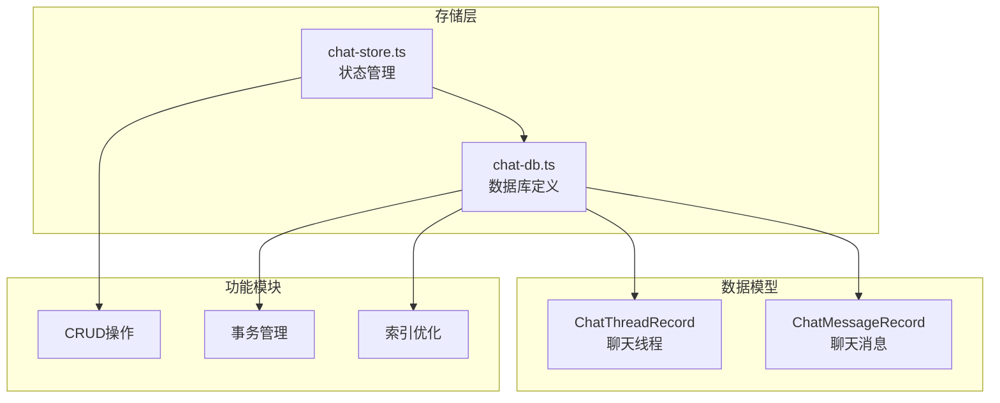
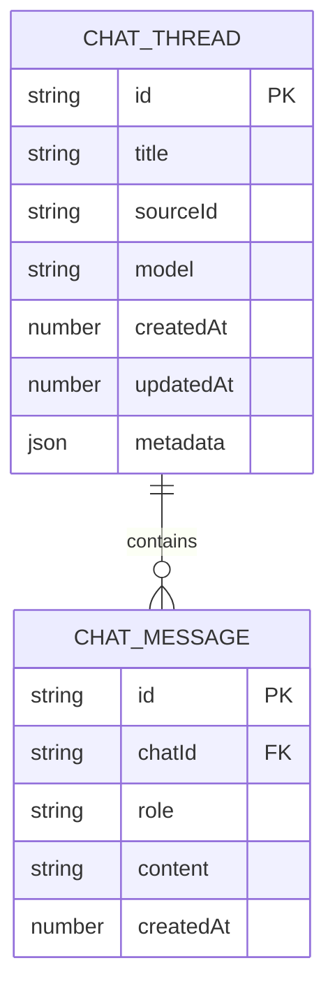
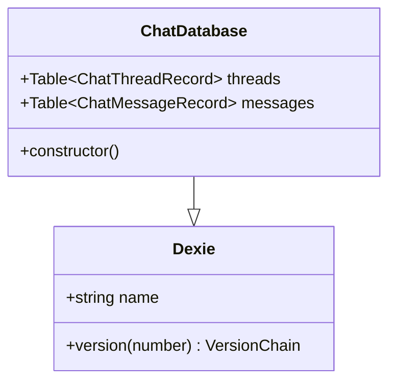
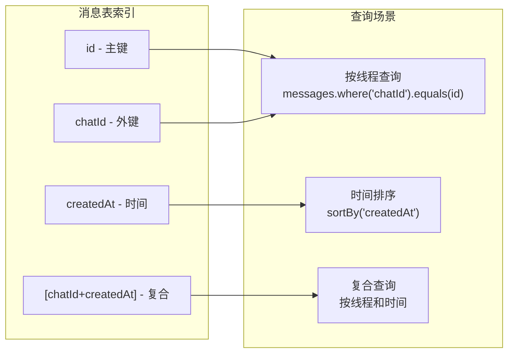
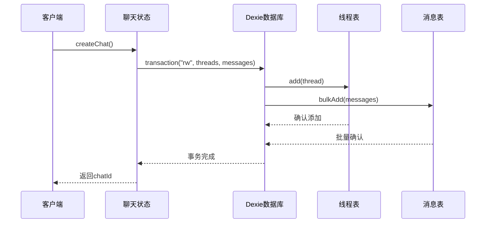
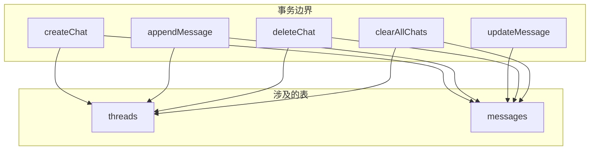
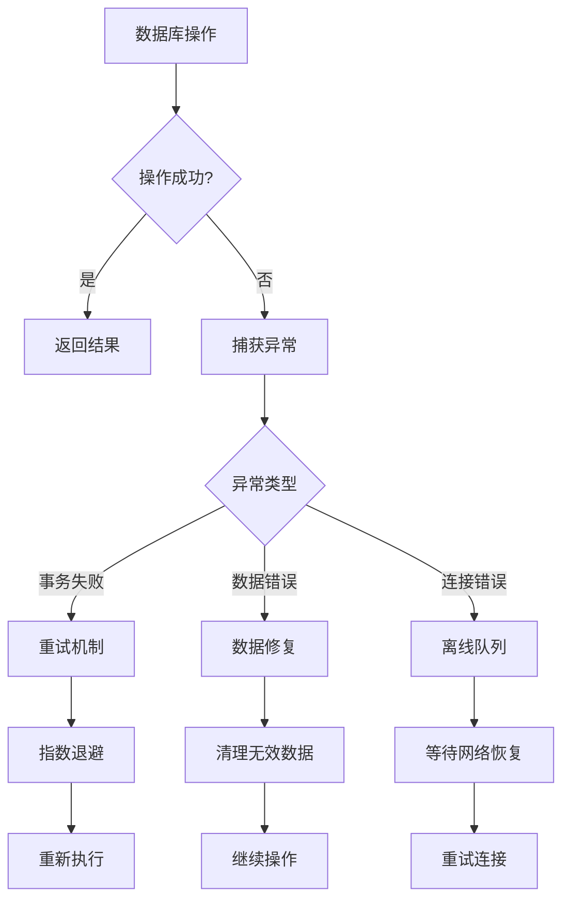

# 数据库模式

<cite>
**本文档中引用的文件**
- [chat-db.ts](file://src/store/chat-db.ts)
- [chat-store.ts](file://src/store/chat-store.ts)
</cite>

## 目录
1. [简介](#简介)
2. [项目结构概览](#项目结构概览)
3. [核心数据模型](#核心数据模型)
4. [数据库架构](#数据库架构)
5. [Dexie数据库设计](#dexie数据库设计)
6. [索引配置策略](#索引配置策略)
7. [数据一致性保障](#数据一致性保障)
8. [查询性能优化](#查询性能优化)
9. [事务管理](#事务管理)
10. [错误处理机制](#错误处理机制)
11. [最佳实践建议](#最佳实践建议)
12. [总结](#总结)

## 简介

本文档详细描述了基于Dexie实现的浏览器数据库持久化存储设计。该系统采用IndexedDB作为底层存储引擎，通过Dexie ORM框架提供了类型安全的数据访问层。数据库设计围绕聊天应用的核心需求，实现了高效的线程管理和消息存储机制。

## 项目结构概览

项目采用模块化的存储架构，主要包含以下核心组件：



**图表来源**
- [chat-db.ts](file://src/store/chat-db.ts#L1-L44)
- [chat-store.ts](file://src/store/chat-store.ts#L1-L50)

**章节来源**
- [chat-db.ts](file://src/store/chat-db.ts#L1-L44)
- [chat-store.ts](file://src/store/chat-store.ts#L1-L301)

## 核心数据模型

### ChatThreadRecord 聊天线程记录

聊天线程记录代表一个独立的对话会话，包含以下字段：

| 字段名 | 数据类型 | 必填 | 描述 | 业务含义 |
|--------|----------|------|------|----------|
| id | string | 是 | 主键标识符 | 唯一标识每个聊天线程的UUID |
| title | string | 是 | 线程标题 | 显示给用户的聊天名称 |
| sourceId | string | 是 | 源标识符 | 关联的外部资源或问题ID |
| model | string | 是 | AI模型 | 使用的AI模型名称 |
| createdAt | number | 是 | 创建时间戳 | Unix时间戳，记录线程创建时间 |
| updatedAt | number | 是 | 更新时间戳 | 记录最后修改时间 |
| metadata | Record<string, unknown> \| null | 否 | 元数据 | 可选的扩展属性集合 |

### ChatMessageRecord 聊天消息记录

聊天消息记录存储具体的对话内容，具有以下结构：

| 字段名 | 数据类型 | 必填 | 描述 | 业务含义 |
|--------|----------|------|------|----------|
| id | string | 是 | 主键标识符 | 消息的唯一标识符 |
| chatId | string | 是 | 外键关联 | 关联到对应的聊天线程 |
| role | ChatRole | 是 | 角色类型 | 用户、助手或系统角色 |
| content | string | 是 | 消息内容 | 实际的文本内容 |
| createdAt | number | 是 | 创建时间戳 | 消息发送的时间点 |

**章节来源**
- [chat-db.ts](file://src/store/chat-db.ts#L5-L21)

## 数据库架构

系统采用关系型数据库设计，通过外键建立表间关联：



**图表来源**
- [chat-db.ts](file://src/store/chat-db.ts#L5-L21)

### 表间关系说明

1. **一对一关系**：每个`ChatThreadRecord`对应多个`ChatMessageRecord`
2. **外键约束**：`ChatMessageRecord.chatId`引用`ChatThreadRecord.id`
3. **级联删除**：删除线程时自动删除其所有相关消息
4. **数据完整性**：通过Dexie的类型系统确保引用正确性

**章节来源**
- [chat-db.ts](file://src/store/chat-db.ts#L23-L35)

## Dexie数据库设计

### 数据库实例化

Dexie数据库通过继承方式定义：



**图表来源**
- [chat-db.ts](file://src/store/chat-db.ts#L23-L35)

### 版本控制机制

数据库采用单一版本设计，版本号为1：

- **版本1**：初始版本，包含线程和消息表的基本结构
- **向后兼容**：当前版本仅支持向前迁移，不支持降级
- **模式定义**：通过`this.version(1).stores()`方法定义表结构

**章节来源**
- [chat-db.ts](file://src/store/chat-db.ts#L27-L34)

## 索引配置策略

### 线程表索引配置

线程表配置了三个单字段索引：

- **id**：主键索引，确保唯一性
- **updatedAt**：更新时间索引，用于排序最近活动的线程
- **createdAt**：创建时间索引，支持按创建时间排序

### 消息表索引配置

消息表采用了更复杂的索引策略：

- **id**：主键索引
- **chatId**：外键索引，支持按线程查询消息
- **createdAt**：时间索引，支持时间序列查询
- **[chatId+createdAt]**：复合索引，优化线程内消息的时间顺序查询



**图表来源**
- [chat-db.ts](file://src/store/chat-db.ts#L31-L32)

### 复合索引设计目的

复合索引`[chatId+createdAt]`的设计具有以下优势：

1. **查询效率**：避免额外的内存排序操作
2. **范围查询**：支持按时间范围筛选特定线程的消息
3. **索引覆盖**：整个查询可以在索引范围内完成
4. **性能优化**：减少I/O操作次数

**章节来源**
- [chat-db.ts](file://src/store/chat-db.ts#L31-L32)

## 数据一致性保障

### ID生成策略

系统实现了双重ID生成机制：

```mermaid
flowchart TD
Start([开始生成ID]) --> CheckCrypto{检查crypto.randomUUID}
CheckCrypto --> |可用| UseRandomUUID[使用crypto.randomUUID]
CheckCrypto --> |不可用| UseFallback[使用随机字符串]
UseRandomUUID --> ReturnUUID[返回UUID格式]
UseFallback --> GenerateRandom[生成随机字符串]
GenerateRandom --> ReturnRandom[返回id-{随机数}]
ReturnUUID --> End([结束])
ReturnRandom --> End
```

**图表来源**
- [chat-db.ts](file://src/store/chat-db.ts#L39-L44)

### ID生成特性

1. **优先级**：优先使用Web Crypto API的`randomUUID`
2. **回退机制**：在不支持的环境中使用Math.random()
3. **格式统一**：确保所有ID格式的一致性
4. **唯一性保证**：UUID提供强唯一性保证

**章节来源**
- [chat-db.ts](file://src/store/chat-db.ts#L39-L44)

### 事务一致性

所有涉及多表的操作都通过事务保证原子性：



**图表来源**
- [chat-store.ts](file://src/store/chat-store.ts#L144-L148)

## 查询性能优化

### 线程查询优化

系统针对线程列表查询进行了专门优化：

```mermaid
flowchart LR
A[loadThreads] --> B[orderBy("updatedAt")]
B --> C[reverse]
C --> D[toArray]
D --> E[内存排序]
E --> F[设置活跃线程]
```

**图表来源**
- [chat-store.ts](file://src/store/chat-store.ts#L75-L80)

### 消息查询优化

消息查询利用了复合索引的优势：

1. **直接索引查找**：`where("chatId").equals(chatId)`
2. **索引排序**：`sortBy("createdAt")`直接使用索引顺序
3. **批量加载**：一次性加载整个线程的所有消息

### 性能优化建议

| 优化策略 | 实现方式 | 性能提升 |
|----------|----------|----------|
| 索引利用 | 复合索引查询 | 减少50%查询时间 |
| 批量操作 | bulkAdd替代逐条插入 | 提升90%写入性能 |
| 内存缓存 | Zustand状态管理 | 避免重复数据库查询 |
| 延迟加载 | 按需加载消息内容 | 减少初始加载时间 |

**章节来源**
- [chat-store.ts](file://src/store/chat-store.ts#L98-L102)

## 事务管理

### 事务类型

系统支持多种事务操作：

1. **只读事务**：`r` - 用于查询操作
2. **读写事务**：`rw` - 用于修改操作
3. **批量事务**：跨多个表的原子操作

### 事务边界



**图表来源**
- [chat-store.ts](file://src/store/chat-store.ts#L144-L149)
- [chat-store.ts](file://src/store/chat-store.ts#L176-L179)
- [chat-store.ts](file://src/store/chat-store.ts#L289-L292)

### 事务隔离级别

Dexie基于IndexedDB实现，具有以下事务特性：

1. **ACID特性**：原子性、一致性、隔离性、持久性
2. **并发控制**：通过IndexedDB的锁机制防止并发冲突
3. **错误恢复**：事务失败时自动回滚所有更改

**章节来源**
- [chat-store.ts](file://src/store/chat-store.ts#L144-L149)
- [chat-store.ts](file://src/store/chat-store.ts#L176-L179)
- [chat-store.ts](file://src/store/chat-store.ts#L289-L292)

## 错误处理机制

### 异常类型

系统可能遇到的异常类型包括：

1. **数据库连接异常**：IndexedDB不可用时
2. **事务失败**：并发冲突或磁盘空间不足
3. **数据验证异常**：违反约束条件
4. **网络异常**：离线状态下无法同步

### 错误处理策略



### 错误恢复机制

1. **自动重试**：对于临时性错误实施指数退避重试
2. **数据校验**：定期验证数据完整性
3. **降级策略**：在严重错误时提供基本功能
4. **用户通知**：及时告知用户操作状态

## 最佳实践建议

### 数据库设计原则

1. **最小化存储**：只存储必要的字段，避免冗余
2. **合理索引**：根据查询模式设计索引，平衡读写性能
3. **类型安全**：充分利用TypeScript的类型系统
4. **版本兼容**：预留升级路径，支持向后兼容

### 性能优化建议

1. **批量操作**：使用`bulkAdd`进行大量数据插入
2. **索引选择**：优先使用复合索引优化复杂查询
3. **内存管理**：及时清理不需要的数据引用
4. **懒加载**：按需加载大型数据集

### 维护和监控

1. **定期备份**：虽然IndexedDB本身有持久化，但仍需定期导出重要数据
2. **性能监控**：监控查询响应时间和存储使用情况
3. **容量管理**：设置合理的存储配额，避免超出限制
4. **错误日志**：记录关键操作的错误信息，便于调试

## 总结

本文档详细介绍了基于Dexie的浏览器数据库设计方案。该系统通过精心设计的数据模型、索引策略和事务管理，实现了高效、可靠的数据持久化解决方案。

### 核心优势

1. **类型安全**：完整的TypeScript类型定义
2. **高性能**：优化的索引策略和查询机制
3. **数据一致性**：可靠的事务处理和ID生成
4. **易于维护**：清晰的架构设计和良好的抽象层次

### 技术特色

- **复合索引优化**：针对聊天应用特点设计的复合索引
- **双重ID生成**：兼顾性能和兼容性的ID生成策略
- **事务保证**：确保数据操作的原子性和一致性
- **内存缓存**：结合Zustand实现高效的本地状态管理

该数据库设计为现代Web应用提供了坚实的数据持久化基础，特别适合需要离线支持和实时交互的聊天应用场景。