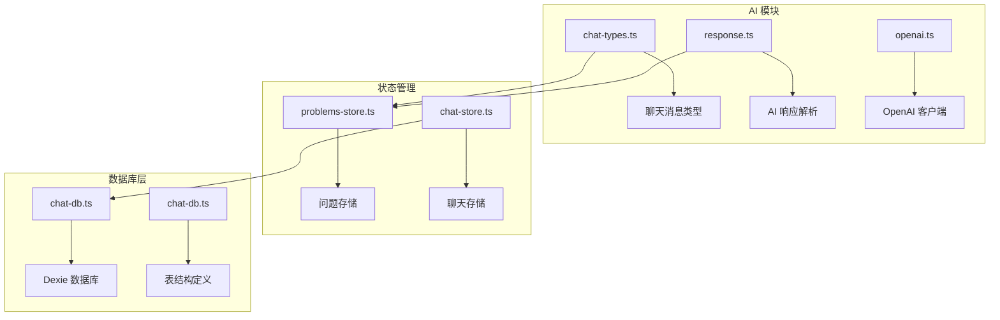
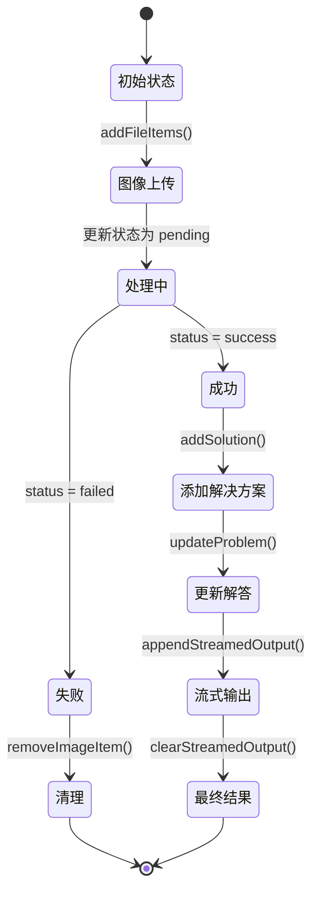
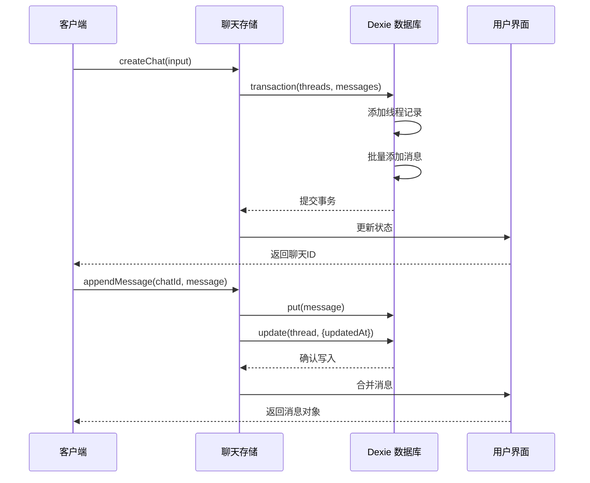
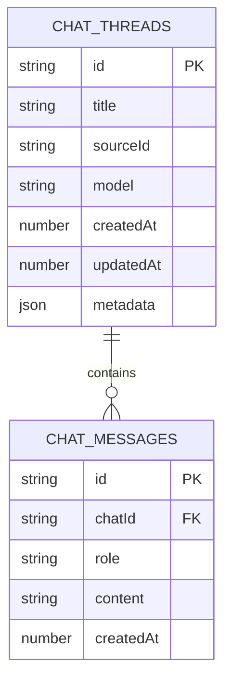
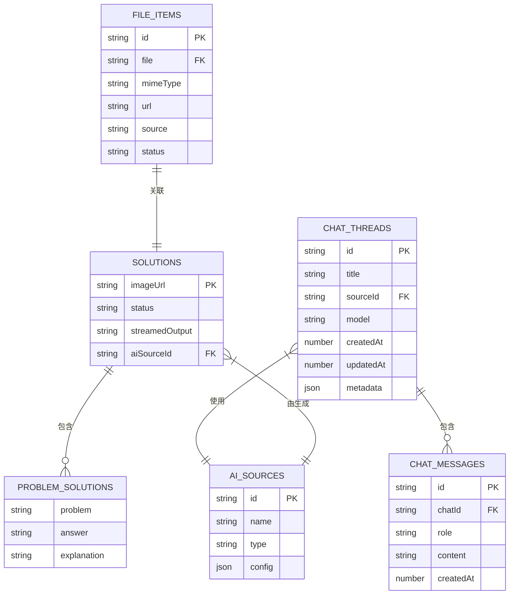
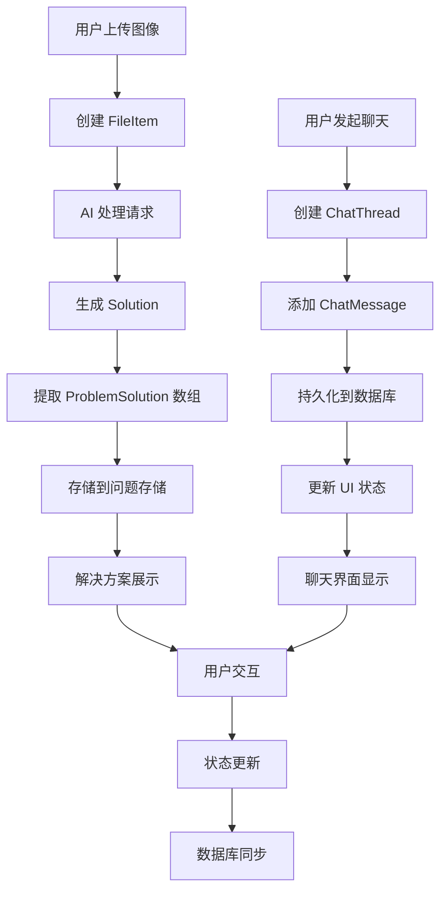
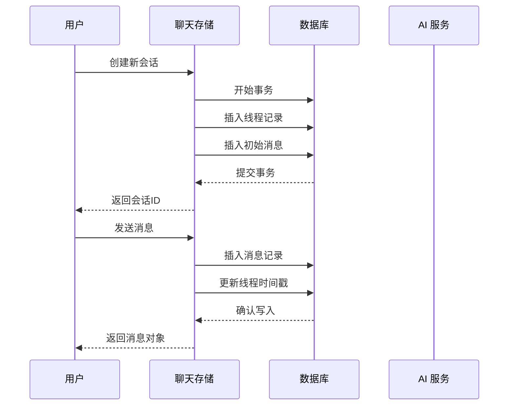

# 数据模型

<cite>
**本文档中引用的文件**
- [chat-types.ts](file://src/ai/chat-types.ts)
- [problems-store.ts](file://src/store/problems-store.ts)
- [chat-db.ts](file://src/store/chat-db.ts)
- [chat-store.ts](file://src/store/chat-store.ts)
- [response.ts](file://src/ai/response.ts)
- [SolutionsArea.tsx](file://src/components/areas/SolutionsArea.tsx)
</cite>

## 目录
1. [简介](#简介)
2. [项目结构概览](#项目结构概览)
3. [核心数据类型](#核心数据类型)
4. [问题-解决方案数据模型](#问题-解决方案数据模型)
5. [聊天数据模型](#聊天数据模型)
6. [数据库架构设计](#数据库架构设计)
7. [实体关系图](#实体关系图)
8. [数据生命周期](#数据生命周期)
9. [性能优化考虑](#性能优化考虑)
10. [总结](#总结)

## 简介

本文档详细描述了 Skid Homework 应用的核心数据模型，包括对话系统、问题-解决方案处理以及基于 Dexie 的浏览器数据库设计。该应用采用现代化的前端架构，使用 Zustand 状态管理、Dexie IndexedDB 数据库和 React 组件系统来构建一个功能完整的 AI 辅助学习平台。

## 项目结构概览

应用的数据模型主要分布在以下关键模块中：



**图表来源**
- [chat-types.ts](file://src/ai/chat-types.ts#L1-L7)
- [problems-store.ts](file://src/store/problems-store.ts#L1-L281)
- [chat-db.ts](file://src/store/chat-db.ts#L1-L45)

## 核心数据类型

### 聊天角色类型

应用定义了标准的 AI 聊天角色类型，用于区分不同来源的消息：

| 类型 | 描述 | 使用场景 |
|------|------|----------|
| `system` | 系统消息 | 系统提示、上下文设置 |
| `user` | 用户消息 | 用户输入内容 |
| `assistant` | 助手消息 | AI 回复内容 |

**章节来源**
- [chat-types.ts](file://src/ai/chat-types.ts#L1-L7)

### AI 聊天消息结构

```typescript
export type AiChatMessage = {
  role: AiChatRole;      // 消息角色
  content: string;       // 消息内容
};
```

该结构支持基本的文本消息传递，为 AI 对话提供了标准化的数据格式。

**章节来源**
- [chat-types.ts](file://src/ai/chat-types.ts#L3-L6)

## 问题-解决方案数据模型

### 文件项类型 (FileItem)

文件项类型表示上传或相机拍摄的图像文件：

| 字段名 | 类型 | 描述 | 约束 |
|--------|------|------|------|
| `id` | `string` | 唯一标识符 | 主键 |
| `file` | `File` | 实际文件对象 | 必需 |
| `mimeType` | `string` | MIME 类型 | 必需 |
| `url` | `string` | 客户端预览 URL | 必需 |
| `source` | `"upload" \| "camera"` | 来源类型 | 必需 |
| `status` | `"success" \| "pending" \| "failed" \| "rasterizing"` | 处理状态 | 必需 |

### 解决方案类型 (Solution)

解决方案类型封装了单个图像的 AI 分析结果：

| 字段名 | 类型 | 描述 | 约束 |
|--------|------|------|------|
| `imageUrl` | `string` | 源图像 URL | 主键 |
| `status` | `"success" \| "processing" \| "failed"` | 处理状态 | 必需 |
| `streamedOutput` | `string \| null` | 流式输出 | 可选 |
| `problems` | `ProblemSolution[]` | 问题-解答数组 | 必需 |
| `aiSourceId` | `string` | AI 源标识符 | 可选 |

### 问题-解答类型 (ProblemSolution)

单个问题-解答对的数据结构：

| 字段名 | 类型 | 描述 | 约束 |
|--------|------|------|------|
| `problem` | `string` | 问题描述 | 必需 |
| `answer` | `string` | 解答内容 | 必需 |
| `explanation` | `string` | 解释说明 | 必需 |

**章节来源**
- [problems-store.ts](file://src/store/problems-store.ts#L6-L29)

### 状态管理模式

应用使用 Zustand 构建了一个复杂的状态管理系统：



**图表来源**
- [problems-store.ts](file://src/store/problems-store.ts#L82-L280)

**章节来源**
- [problems-store.ts](file://src/store/problems-store.ts#L32-L71)

## 聊天数据模型

### 聊天线程记录 (ChatThreadRecord)

聊天线程代表一个完整的对话会话：

| 字段名 | 类型 | 描述 | 索引 |
|--------|------|------|------|
| `id` | `string` | 唯一标识符 | 主键 |
| `title` | `string` | 会话标题 | - |
| `sourceId` | `string` | AI 源标识符 | - |
| `model` | `string` | 使用的模型 | - |
| `createdAt` | `number` | 创建时间戳 | createdAt |
| `updatedAt` | `number` | 更新时间戳 | updatedAt |
| `metadata` | `Record<string, unknown> \| null` | 元数据 | - |

### 聊天消息记录 (ChatMessageRecord)

聊天消息记录单条对话消息：

| 字段名 | 类型 | 描述 | 索引 |
|--------|------|------|------|
| `id` | `string` | 唯一标识符 | 主键 |
| `chatId` | `string` | 所属聊天线程 ID | chatId |
| `role` | `ChatRole` | 消息角色 | - |
| `content` | `string` | 消息内容 | - |
| `createdAt` | `number` | 创建时间戳 | createdAt |

### 聊天状态管理

聊天状态管理器提供了完整的 CRUD 操作：



**图表来源**
- [chat-store.ts](file://src/store/chat-store.ts#L122-L165)
- [chat-store.ts](file://src/store/chat-store.ts#L167-L196)

**章节来源**
- [chat-db.ts](file://src/store/chat-db.ts#L5-L21)
- [chat-store.ts](file://src/store/chat-store.ts#L25-L50)

## 数据库架构设计

### Dexie 数据库配置

应用使用 Dexie 作为 IndexedDB 的抽象层，提供了简洁而强大的数据库操作接口。

#### 表结构定义



**图表来源**
- [chat-db.ts](file://src/store/chat-db.ts#L5-L21)

#### 索引设计

| 表名 | 索引字段 | 类型 | 用途 |
|------|----------|------|------|
| `threads` | `id` | 主键 | 唯一标识 |
| `threads` | `updatedAt` | 单字段索引 | 排序查询 |
| `threads` | `createdAt` | 单字段索引 | 时间范围查询 |
| `messages` | `id` | 主键 | 唯一标识 |
| `messages` | `chatId` | 单字段索引 | 关联查询 |
| `messages` | `createdAt` | 单字段索引 | 时间排序 |
| `messages` | `[chatId+createdAt]` | 复合索引 | 高效分页查询 |

#### 数据库版本控制

```typescript
this.version(1).stores({
  threads: "id, updatedAt, createdAt",
  messages: "id, chatId, createdAt, [chatId+createdAt]",
});
```

这种设计确保了：
- **高性能查询**：通过索引优化常见查询模式
- **数据一致性**：使用事务保证操作原子性
- **扩展性**：支持未来版本升级

**章节来源**
- [chat-db.ts](file://src/store/chat-db.ts#L23-L34)

### ID 生成策略

应用实现了跨平台的 UUID 生成机制：

```typescript
export const createId = () => {
  if (typeof crypto !== "undefined" && crypto.randomUUID) {
    return crypto.randomUUID();
  }
  return `id-${Math.random().toString(36).slice(2, 10)}`;
};
```

该实现提供了：
- **现代浏览器支持**：优先使用 `crypto.randomUUID()`
- **兼容性保证**：回退到随机字符串生成
- **唯一性保障**：确保每个 ID 的唯一性

**章节来源**
- [chat-db.ts](file://src/store/chat-db.ts#L39-L44)

## 实体关系图

### 完整数据模型关系



**图表来源**
- [problems-store.ts](file://src/store/problems-store.ts#L6-L29)
- [chat-db.ts](file://src/store/chat-db.ts#L5-L21)
- [response.ts](file://src/ai/response.ts#L5-L12)

### 数据流关系



**图表来源**
- [problems-store.ts](file://src/store/problems-store.ts#L82-L280)
- [chat-store.ts](file://src/store/chat-store.ts#L75-L301)

## 数据生命周期

### 问题-解决方案数据流程

#### 创建阶段
1. **文件上传**：用户上传图像文件，创建 `FileItem`
2. **状态初始化**：设置初始状态为 `pending`
3. **AI 请求**：发送图像到 AI 服务进行分析

#### 处理阶段
1. **流式处理**：接收 AI 的流式响应
2. **中间状态**：更新 `streamedOutput` 字段
3. **错误处理**：处理处理失败的情况

#### 完成阶段
1. **最终结果**：AI 返回完整的问题-解答对
2. **状态更新**：设置 `status = success`
3. **数据持久化**：存储到问题存储中

#### 删除阶段
1. **清理请求**：用户删除图像或解决方案
2. **状态移除**：从内存状态中移除
3. **数据库清理**：删除相关记录

### 聊天数据生命周期

#### 会话创建


**图表来源**
- [chat-store.ts](file://src/store/chat-store.ts#L122-L165)

#### 消息管理
1. **消息创建**：验证消息格式，生成唯一 ID
2. **持久化**：使用事务确保数据一致性
3. **状态同步**：更新内存状态和 UI
4. **时间戳维护**：自动更新线程最后修改时间

#### 会话管理
1. **加载恢复**：启动时从数据库加载所有会话
2. **活跃状态**：维护当前活跃的会话
3. **清理机制**：定期清理过期或无效的会话

**章节来源**
- [chat-store.ts](file://src/store/chat-store.ts#L75-L301)

### 数据持久化策略

#### 写入优化
- **批量操作**：使用 `bulkAdd()` 进行批量插入
- **事务保证**：所有写入操作都在事务中执行
- **异步处理**：非阻塞的数据库操作

#### 读取优化
- **索引利用**：充分利用数据库索引
- **分页查询**：支持大量数据的高效查询
- **缓存策略**：内存中的状态缓存减少数据库访问

## 性能优化考虑

### 内存管理

#### Map 数据结构
问题存储使用 `Map` 而不是数组来存储解决方案：
- **O(1)** 查找性能
- **保持插入顺序**：对于渲染至关重要
- **避免重复遍历**：直接通过 URL 访问

#### 状态更新优化
- **不可变更新**：使用 Zustand 的不可变更新模式
- **选择性更新**：只更新变化的部分
- **批量操作**：合并多个状态变更

### 数据库性能

#### 索引策略
- **主键索引**：确保唯一性约束
- **复合索引**：优化多字段查询
- **时间戳索引**：支持高效的排序和过滤

#### 查询优化
- **范围查询**：使用时间戳进行范围查询
- **关联查询**：通过外键建立关系
- **事务批处理**：减少数据库往返次数

### 缓存策略

#### 内存缓存
- **即时状态**：保持最新状态在内存中
- **懒加载**：按需加载聊天消息
- **状态快照**：保存重要状态的快照

#### 数据库缓存
- **本地存储**：利用 IndexedDB 的持久化能力
- **增量同步**：只同步变化的数据
- **离线支持**：支持离线操作和后续同步

## 总结

Skid Homework 的数据模型设计体现了现代前端应用的最佳实践：

### 设计优势

1. **模块化架构**：清晰分离关注点，便于维护和扩展
2. **类型安全**：完整的 TypeScript 类型定义
3. **性能优化**：多层次的性能优化策略
4. **用户体验**：流畅的交互和响应式设计

### 技术特色

- **Dexie 抽象**：简化 IndexedDB 操作
- **Zustand 状态管理**：轻量级且高效的全局状态
- **流式处理**：支持实时数据更新
- **事务保证**：确保数据一致性

### 扩展性考虑

该数据模型为未来的功能扩展奠定了良好的基础：
- **多 AI 源支持**：可轻松添加新的 AI 服务
- **多媒体支持**：可扩展支持音频、视频等其他媒体类型
- **协作功能**：可添加多人协作和共享功能
- **数据分析**：可集成更复杂的数据分析和可视化功能

通过这种精心设计的数据模型，应用能够提供稳定、高效且用户友好的 AI 辅助学习体验。