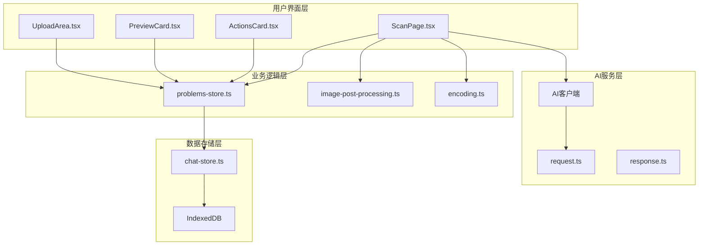
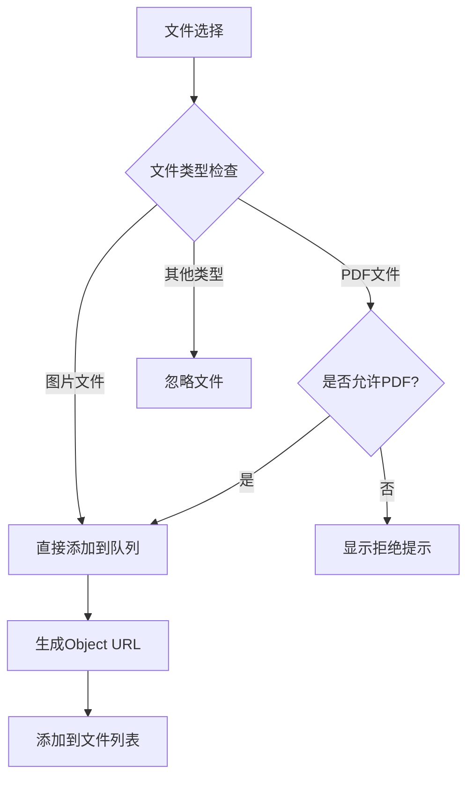
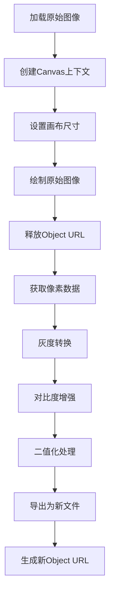
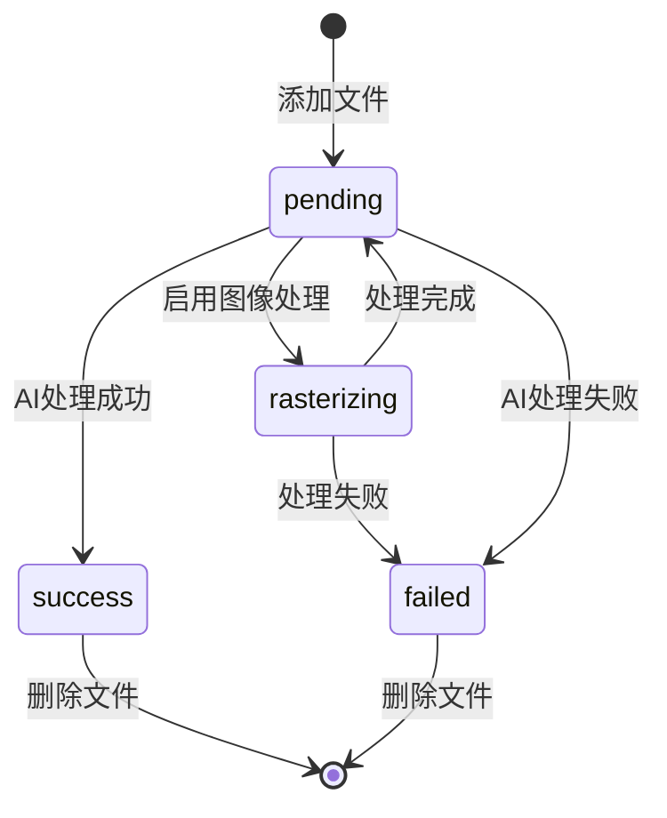
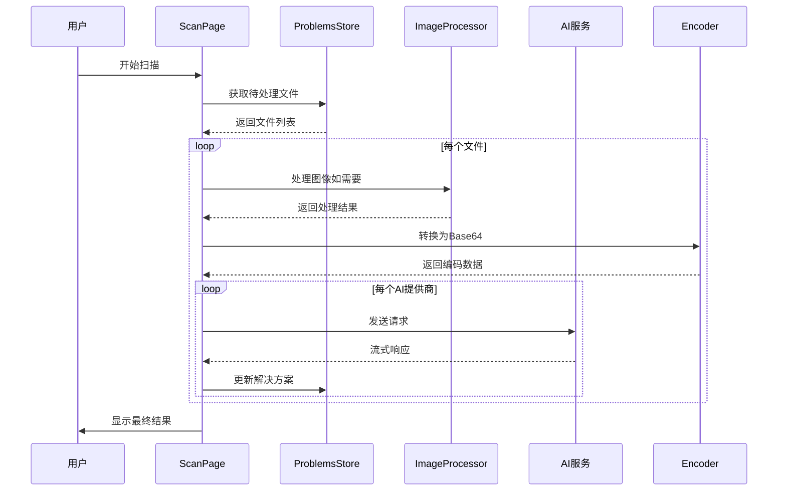

# 文件处理流程文档

<cite>
**本文档中引用的文件**
- [UploadArea.tsx](file://src/components/areas/UploadArea.tsx)
- [image-post-processing.ts](file://src/utils/image-post-processing.ts)
- [problems-store.ts](file://src/store/problems-store.ts)
- [ScanPage.tsx](file://src/components/pages/ScanPage.tsx)
- [PreviewCard.tsx](file://src/components/cards/PreviewCard.tsx)
- [ActionsCard.tsx](file://src/components/cards/ActionsCard.tsx)
- [request.ts](file://src/ai/request.ts)
- [encoding.ts](file://src/utils/encoding.ts)
- [chat-store.ts](file://src/store/chat-store.ts)
</cite>

## 目录
1. [概述](#概述)
2. [项目架构](#项目架构)
3. [文件上传组件分析](#文件上传组件分析)
4. [图像预处理算法](#图像预处理算法)
5. [多文件管理机制](#多文件管理机制)
6. [文件元数据存储](#文件元数据存储)
7. [AI处理流程](#ai处理流程)
8. [性能优化策略](#性能优化策略)
9. [错误处理机制](#错误处理机制)
10. [总结](#总结)

## 概述

该系统实现了一个完整的文件处理流程，从用户上传到AI可读格式的转换。核心功能包括：
- 支持图片和PDF文件的上传（通过`UploadArea.tsx`）
- 实时预览功能（通过`PreviewCard.tsx`）
- 图像预处理算法（通过`image-post-processing.ts`）
- 多文件管理和状态跟踪（通过`problems-store.ts`）
- AI服务集成和结果处理（通过`ScanPage.tsx`）

## 项目架构

系统采用模块化架构设计，主要分为以下几个层次：



**图表来源**
- [UploadArea.tsx](file://src/components/areas/UploadArea.tsx#L1-L176)
- [problems-store.ts](file://src/store/problems-store.ts#L1-L281)
- [ScanPage.tsx](file://src/components/pages/ScanPage.tsx#L1-L552)

## 文件上传组件分析

### UploadArea.tsx 组件功能

`UploadArea.tsx`是文件上传的核心组件，提供以下功能：

#### 核心特性
- **双输入支持**：同时支持文件上传和相机拍摄
- **类型过滤**：根据配置允许或禁止PDF文件上传
- **快捷键支持**：集成键盘快捷键功能
- **响应式设计**：适配移动端和桌面端布局

#### 文件类型支持



**图表来源**
- [UploadArea.tsx](file://src/components/areas/UploadArea.tsx#L57-L82)
- [ScanPage.tsx](file://src/components/pages/ScanPage.tsx#L108-L132)

#### 状态管理

组件通过`appendFiles`回调函数与父组件通信，支持两种文件来源：
- `"upload"`：来自文件系统的上传
- `"camera"`：来自设备相机的拍摄

**章节来源**
- [UploadArea.tsx](file://src/components/areas/UploadArea.tsx#L18-L22)
- [ScanPage.tsx](file://src/components/pages/ScanPage.tsx#L106-L170)

### 预览卡片功能

`PreviewCard.tsx`提供文件预览和管理功能：

#### 显示模式
- **桌面端**：网格布局，支持拖拽操作
- **移动端**：滑动布局，简化交互

#### 文件状态指示器
- `success`：处理成功
- `failed`：处理失败  
- `pending`：等待处理
- `rasterizing`：正在处理

**章节来源**
- [PreviewCard.tsx](file://src/components/cards/PreviewCard.tsx#L13-L40)

## 图像预处理算法

### binarizeImageFile 函数详解

`image-post-processing.ts`实现了图像二值化处理算法，优化AI识别准确率：

#### 处理流程



**图表来源**
- [image-post-processing.ts](file://src/utils/image-post-processing.ts#L14-L112)

#### 关键算法参数

| 参数 | 值 | 说明 |
|------|-----|------|
| 灰度公式 | 0.299*R + 0.587*G + 0.114*B | 标准亮度感知公式 |
| 阈值 | 150 | 可调参数，影响黑白分割点 |
| 输出格式 | PNG/JPEG | 支持多种输出格式 |
| 质量 | 可选(0-1) | 仅JPEG格式有效 |

#### 性能优化

- 使用非透明画布减少内存占用
- 及时释放Object URL避免内存泄漏
- 异步处理避免阻塞主线程

**章节来源**
- [image-post-processing.ts](file://src/utils/image-post-processing.ts#L1-L113)

## 多文件管理机制

### 文件状态跟踪

系统使用`FileItem`接口定义文件对象结构：

```typescript
interface FileItem {
  id: string;           // 唯一标识符
  file: File;           // 原始文件对象
  mimeType: string;     // MIME类型
  url: string;          // 对象URL用于预览
  source: "upload" | "camera"; // 来源类型
  status: "success" | "pending" | "failed" | "rasterizing"; // 处理状态
}
```

### 状态转换图



**图表来源**
- [problems-store.ts](file://src/store/problems-store.ts#L6-L12)

### 文件操作功能

#### 列表展示
- **排序**：按时间顺序排列
- **筛选**：按状态和类型筛选
- **搜索**：基于文件名搜索

#### 切换操作
- **单选**：点击预览特定文件
- **全选**：批量操作多个文件
- **拖拽**：重新排序文件顺序

#### 删除操作
- **单个删除**：移除指定文件
- **批量删除**：清空所有文件
- **清理机制**：自动释放Object URL

**章节来源**
- [problems-store.ts](file://src/store/problems-store.ts#L45-L67)
- [PreviewCard.tsx](file://src/components/cards/PreviewCard.tsx#L170-L202)

## 文件元数据存储

### 存储结构设计

系统采用分层存储架构：

#### 内存状态管理
- **Zustand Store**：实时状态管理
- **Map结构**：O(1)解决方案查找
- **响应式更新**：自动UI同步

#### 数据持久化
- **IndexedDB**：长期存储聊天记录
- **文件缓存**：临时保存处理结果

### 元数据字段

| 字段 | 类型 | 描述 |
|------|------|------|
| id | string | 文件唯一标识 |
| name | string | 文件名称 |
| size | number | 文件大小（字节） |
| type | string | MIME类型 |
| createdAt | number | 创建时间戳 |
| status | string | 处理状态 |
| source | string | 来源类型 |

**章节来源**
- [problems-store.ts](file://src/store/problems-store.ts#L5-L29)
- [chat-store.ts](file://src/store/chat-store.ts#L1-L302)

## AI处理流程

### 请求处理管道



**图表来源**
- [ScanPage.tsx](file://src/components/pages/ScanPage.tsx#L220-L403)
- [encoding.ts](file://src/utils/encoding.ts#L1-L9)

### 并发控制

系统实现智能并发处理：

#### 工作线程池
- **最大并发数**：4个并发请求
- **负载均衡**：轮询分配任务
- **错误恢复**：自动重试机制

#### 错误处理策略
- **指数退避**：重试间隔递增
- **故障转移**：切换到备用AI提供商
- **降级处理**：提供默认错误信息

**章节来源**
- [ScanPage.tsx](file://src/components/pages/ScanPage.tsx#L388-L403)

### 结果解析

AI响应经过多层解析：

1. **流式处理**：实时显示生成内容
2. **结构化解析**：提取问题-答案对
3. **格式验证**：确保数据完整性
4. **缓存存储**：保存处理结果

**章节来源**
- [ScanPage.tsx](file://src/components/pages/ScanPage.tsx#L337-L346)

## 性能优化策略

### 内存管理

#### Object URL生命周期
- **创建时机**：文件添加时立即创建
- **使用时机**：渲染预览时使用
- **销毁时机**：组件卸载或文件删除时清理

#### 缓存策略
- **图像缓存**：处理后图像本地缓存
- **文本缓存**：AI响应结果缓存
- **清理机制**：定期清理过期缓存

### 网络优化

#### 请求合并
- **批量处理**：多个文件打包发送
- **压缩传输**：Base64编码优化
- **断点续传**：大文件分块处理

#### 连接复用
- **HTTP/2**：多路复用支持
- **连接池**：保持长连接
- **DNS缓存**：减少解析延迟

**章节来源**
- [ScanPage.tsx](file://src/components/pages/ScanPage.tsx#L92-L97)

## 错误处理机制

### 分层错误处理

#### 用户界面层
- **友好提示**：清晰的错误信息
- **重试按钮**：快速重新尝试
- **进度反馈**：显示处理状态

#### 业务逻辑层
- **异常捕获**：全面的try-catch包装
- **状态回滚**：错误时恢复到之前状态
- **日志记录**：详细错误追踪

#### 系统层面
- **网络监控**：检测连接状态
- **资源限制**：防止内存溢出
- **超时控制**：避免长时间无响应

### 常见错误类型

| 错误类型 | 处理方式 | 用户体验 |
|----------|----------|----------|
| 网络超时 | 自动重试 | 显示加载动画 |
| 文件过大 | 提示限制 | 显示文件大小 |
| 格式不支持 | 优雅降级 | 提供替代方案 |
| AI服务不可用 | 切换提供商 | 显示备用选项 |

**章节来源**
- [ScanPage.tsx](file://src/components/pages/ScanPage.tsx#L350-L384)

## 总结

该文件处理系统实现了完整的端到端流程，从用户上传到AI分析的全过程优化：

### 核心优势
- **用户体验**：直观的界面和实时反馈
- **技术先进**：采用现代Web技术栈
- **性能优异**：智能缓存和并发处理
- **扩展性强**：模块化设计便于维护

### 技术亮点
- **图像预处理**：专门优化AI识别效果
- **流式处理**：实时显示AI生成内容
- **错误恢复**：完善的容错机制
- **响应式设计**：适配各种设备

### 应用价值
该系统为教育领域提供了强大的作业扫描和分析能力，通过AI技术辅助教师批改作业，提高教学效率，减轻工作负担。