# AI配置管理

<cite>
**本文档引用的文件**
- [ai-store.ts](file://src/store/ai-store.ts)
- [gemini.ts](file://src/ai/gemini.ts)
- [openai.ts](file://src/ai/openai.ts)
- [SettingsPage.tsx](file://src/components/pages/SettingsPage.tsx)
- [ChatPage.tsx](file://src/components/pages/ChatPage.tsx)
- [RequireAiKey.tsx](file://src/components/guards/RequireAiKey.tsx)
- [InitPage.tsx](file://src/components/pages/InitPage.tsx)
- [App.tsx](file://src/App.tsx)
- [settings-store.ts](file://src/store/settings-store.ts)
- [shortcuts.ts](file://src/utils/shortcuts.ts)
</cite>

## 目录
1. [简介](#简介)
2. [项目结构](#项目结构)
3. [核心组件](#核心组件)
4. [架构概览](#架构概览)
5. [详细组件分析](#详细组件分析)
6. [依赖关系分析](#依赖关系分析)
7. [性能考虑](#性能考虑)
8. [故障排除指南](#故障排除指南)
9. [结论](#结论)

## 简介

ai-store模块是skid-homework项目的核心AI配置管理系统，负责管理多个AI服务提供商的配置、客户端实例创建以及用户界面的状态同步。该模块支持Gemini和OpenAI两大主流AI服务提供商，提供了灵活的多源配置管理和智能的激活状态控制机制。

系统采用Zustand状态管理库实现全局状态持久化，通过localStorage存储用户配置，并提供响应式的UI更新机制。主要功能包括AI源的添加、删除、启用/禁用管理，客户端实例的动态创建，以及基于配置的智能路由保护。

## 项目结构

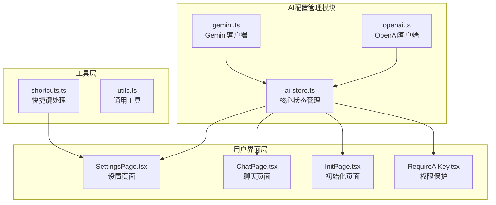

**图表来源**
- [ai-store.ts](file://src/store/ai-store.ts#L1-L275)
- [SettingsPage.tsx](file://src/components/pages/SettingsPage.tsx#L1-L935)
- [ChatPage.tsx](file://src/components/pages/ChatPage.tsx#L1-L976)

**章节来源**
- [ai-store.ts](file://src/store/ai-store.ts#L1-L275)
- [SettingsPage.tsx](file://src/components/pages/SettingsPage.tsx#L1-L935)

## 核心组件

### AiSource接口设计

AiSource接口是整个AI配置系统的核心数据结构，定义了每个AI源的基本属性和行为特征：

| 字段名 | 类型 | 描述 | 默认值 |
|--------|------|------|--------|
| id | string | 唯一标识符，使用crypto.randomUUID()生成 | 自动生成 |
| name | string | 用户可见的源名称 | "Gemini"/"OpenAI" |
| provider | AiProvider | AI服务提供商类型 | "gemini"/"openai" |
| apiKey | string \| null | API密钥，支持null表示未配置 | null |
| baseUrl | string | 自定义基础URL地址 | 默认提供商地址 |
| model | string | 默认使用的模型名称 | "models/gemini-2.5-flash" |
| traits | string | 用户定义的特性配置 | undefined |
| thinkingBudget | number | Gemini特有的思考预算令牌数 | 8192 |
| enabled | boolean | 启用状态标志 | true/false |
| pollIntervalMs | number | 轮询间隔（毫秒） | 1000 |
| maxPollMs | number | 最大轮询时间（毫秒） | 30000 |

### AiClient接口抽象

AiClient接口定义了所有AI客户端的统一行为契约：

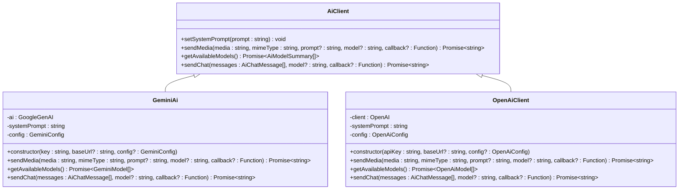

**图表来源**
- [ai-store.ts](file://src/store/ai-store.ts#L28-L43)
- [gemini.ts](file://src/ai/gemini.ts#L17-L205)
- [openai.ts](file://src/ai/openai.ts#L53-L267)

**章节来源**
- [ai-store.ts](file://src/store/ai-store.ts#L14-L43)
- [gemini.ts](file://src/ai/gemini.ts#L17-L205)
- [openai.ts](file://src/ai/openai.ts#L53-L267)

## 架构概览

ai-store模块采用分层架构设计，从底层的AI客户端实现到顶层的用户界面组件，形成了清晰的职责分离：

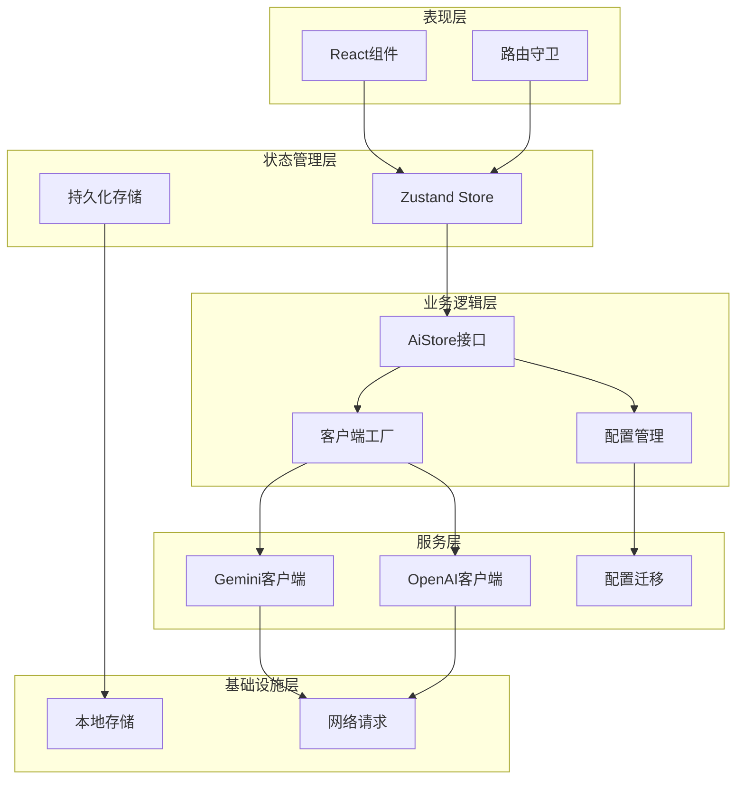

**图表来源**
- [ai-store.ts](file://src/store/ai-store.ts#L149-L271)
- [SettingsPage.tsx](file://src/components/pages/SettingsPage.tsx#L61-L91)
- [ChatPage.tsx](file://src/components/pages/ChatPage.tsx#L67-L95)

## 详细组件分析

### 配置管理操作

#### addSource操作
addSource方法负责向系统中添加新的AI源配置：

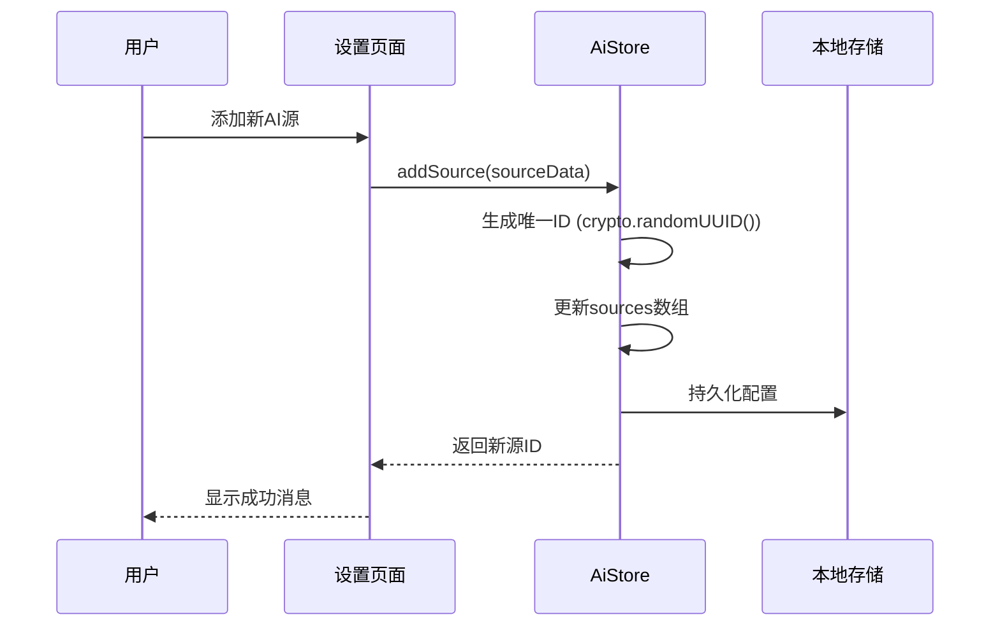

**图表来源**
- [ai-store.ts](file://src/store/ai-store.ts#L155-L167)

#### updateSource操作
updateSource方法允许修改现有AI源的配置参数：

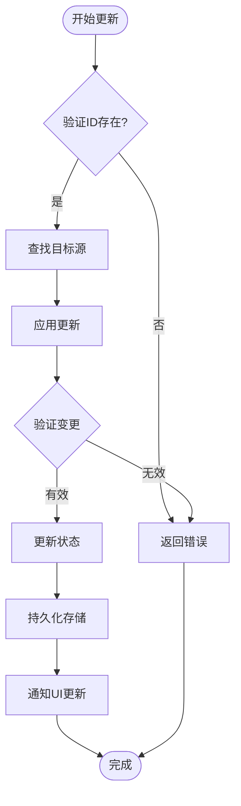

**图表来源**
- [ai-store.ts](file://src/store/ai-store.ts#L169-L174)

#### removeSource操作
removeSource方法处理AI源的删除逻辑，包括激活状态的自动调整：

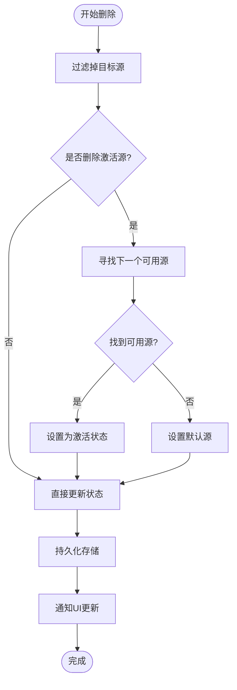

**图表来源**
- [ai-store.ts](file://src/store/ai-store.ts#L176-L193)

#### toggleSource操作
toggleSource方法控制AI源的启用/禁用状态：

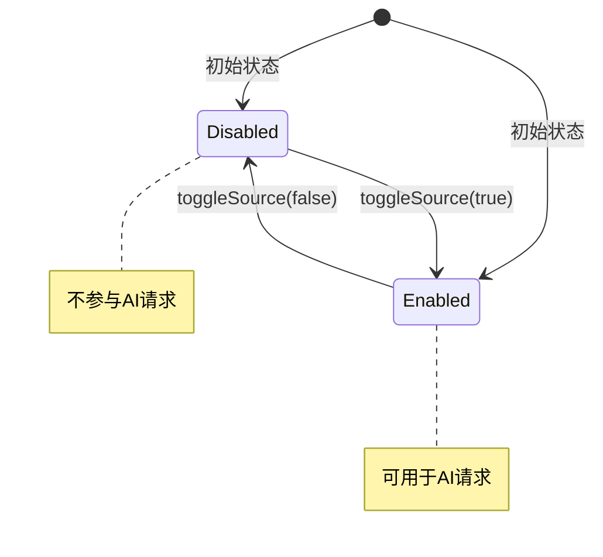

**图表来源**
- [ai-store.ts](file://src/store/ai-store.ts#L195-L199)

### 激活状态控制

#### setActiveSource逻辑
setActiveSource方法确保激活的AI源存在于系统中：

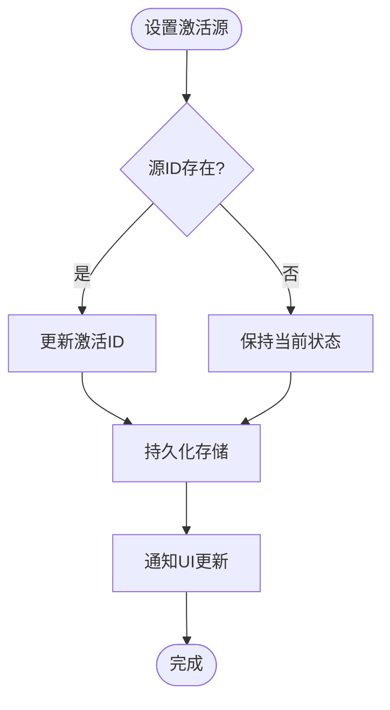

**图表来源**
- [ai-store.ts](file://src/store/ai-store.ts#L202-L206)

#### getActiveSource优先级策略
getActiveSource方法实现了复杂的优先级选择逻辑：

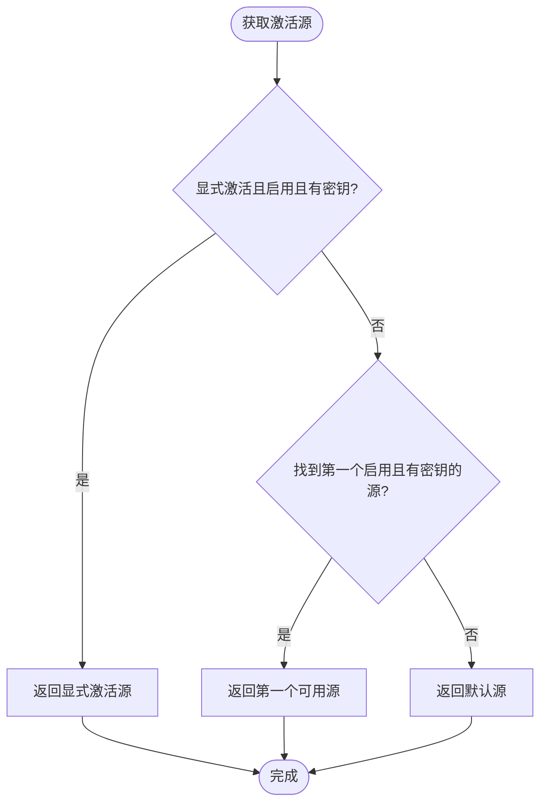

**图表来源**
- [ai-store.ts](file://src/store/ai-store.ts#L208-L228)

### 客户端实例创建

#### getClientForSource机制
getClientForSource方法根据指定ID或当前激活源创建相应的AI客户端：

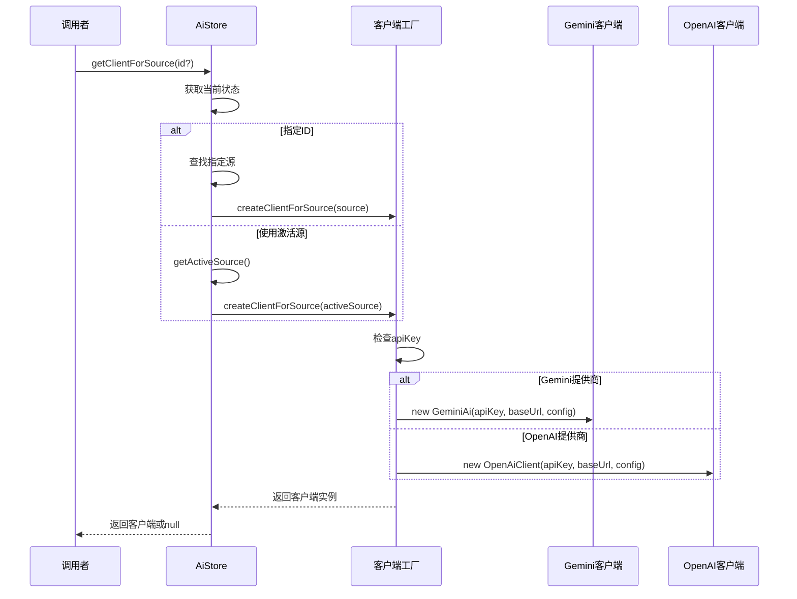

**图表来源**
- [ai-store.ts](file://src/store/ai-store.ts#L245-L259)

#### createClientForSource工厂函数
工厂函数根据AI源的提供商类型创建对应的客户端实例：

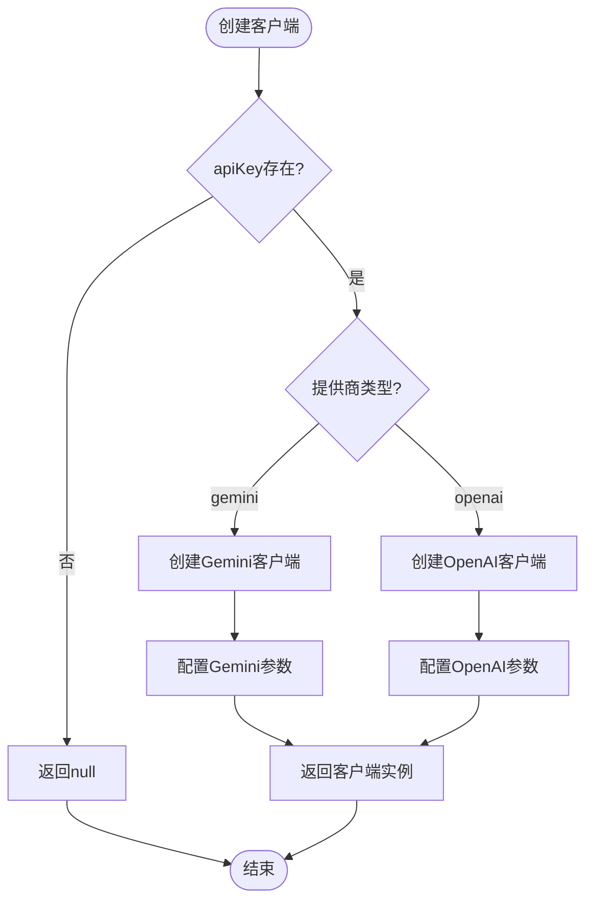

**图表来源**
- [ai-store.ts](file://src/store/ai-store.ts#L112-L129)

### 配置迁移机制

#### loadLegacyGemini函数
系统支持从旧版本配置格式迁移到新格式：

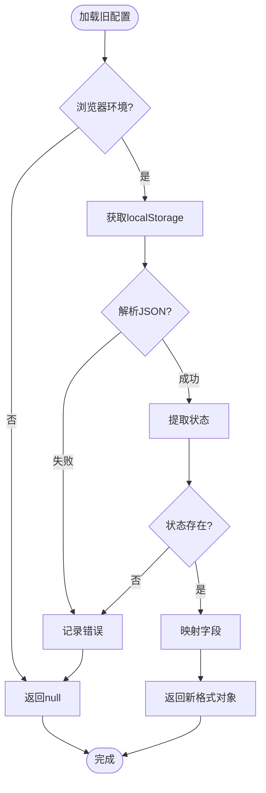

**图表来源**
- [ai-store.ts](file://src/store/ai-store.ts#L51-L78)

### UI响应式集成

#### useHasActiveAiKey Hook
useHasActiveAiKey Hook提供了响应式的AI密钥状态检测：

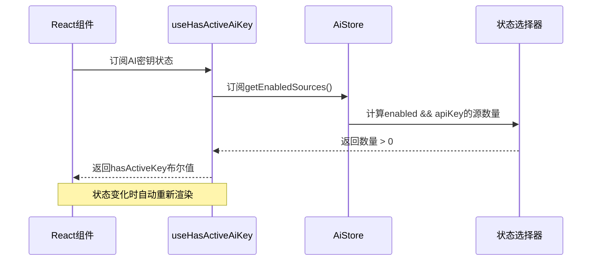

**图表来源**
- [ai-store.ts](file://src/store/ai-store.ts#L273-L275)

#### RequireAiKey路由守卫
RequireAiKey组件实现了基于AI密钥的路由保护：

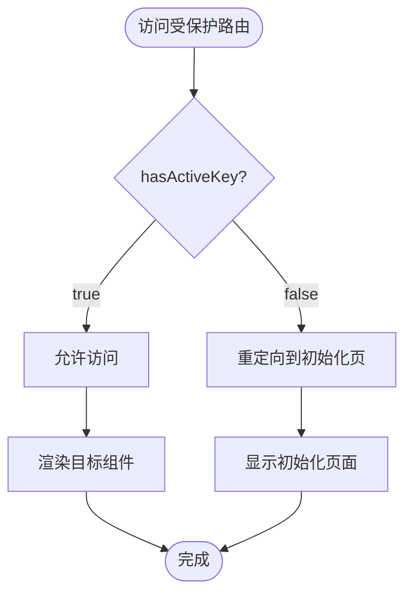

**图表来源**
- [RequireAiKey.tsx](file://src/components/guards/RequireAiKey.tsx#L1-L21)
- [App.tsx](file://src/App.tsx#L25-L41)

### 功能特性

#### PDF上传支持检测
allowPdfUpload方法通过检查启用的AI源类型来决定是否支持PDF上传：

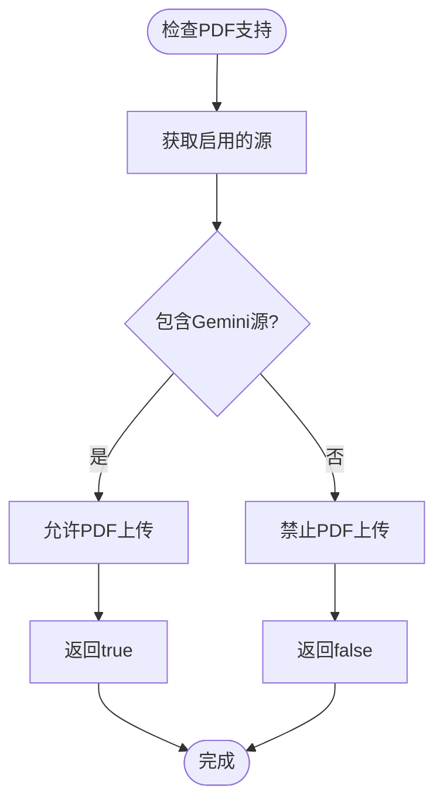

**图表来源**
- [ai-store.ts](file://src/store/ai-store.ts#L239-L243)

**章节来源**
- [ai-store.ts](file://src/store/ai-store.ts#L131-L275)
- [SettingsPage.tsx](file://src/components/pages/SettingsPage.tsx#L61-L935)
- [ChatPage.tsx](file://src/components/pages/ChatPage.tsx#L67-L976)

## 依赖关系分析

### 模块间依赖图

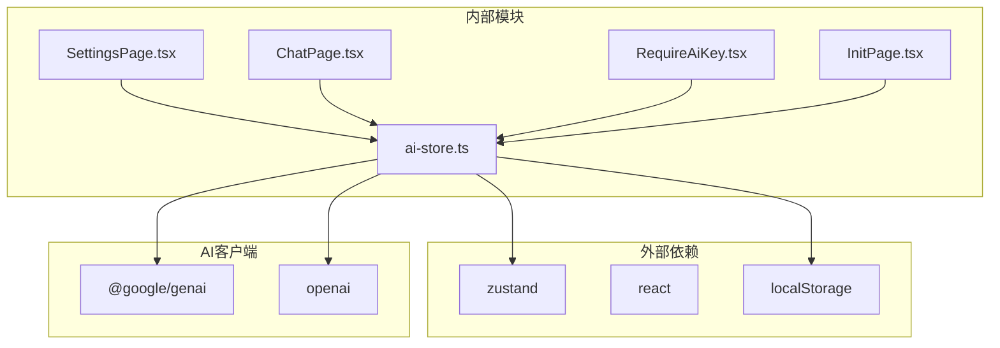

**图表来源**
- [ai-store.ts](file://src/store/ai-store.ts#L1-L6)
- [SettingsPage.tsx](file://src/components/pages/SettingsPage.tsx#L1-L10)
- [ChatPage.tsx](file://src/components/pages/ChatPage.tsx#L1-L10)

### 数据流分析

系统的数据流向遵循单向数据流原则，从用户交互到状态更新再到UI响应：

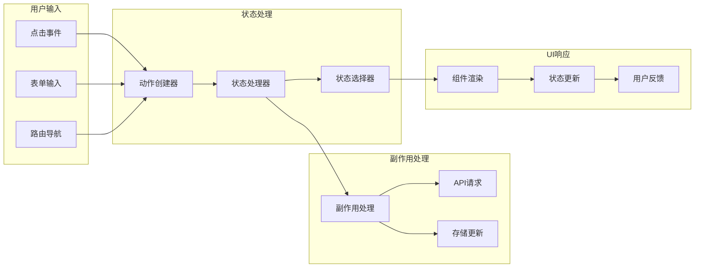

**图表来源**
- [ai-store.ts](file://src/store/ai-store.ts#L149-L271)
- [SettingsPage.tsx](file://src/components/pages/SettingsPage.tsx#L61-L935)

**章节来源**
- [ai-store.ts](file://src/store/ai-store.ts#L1-L275)
- [SettingsPage.tsx](file://src/components/pages/SettingsPage.tsx#L1-L935)

## 性能考虑

### 状态管理优化

1. **选择性订阅**: 组件只订阅必要的状态部分，避免不必要的重新渲染
2. **记忆化计算**: 使用useMemo缓存计算结果，减少重复计算开销
3. **批量更新**: 批量执行状态更新操作，减少渲染次数

### 客户端实例管理

1. **按需创建**: 只在需要时创建AI客户端实例，节省内存资源
2. **实例复用**: 相同配置的客户端实例可以被复用
3. **延迟初始化**: 在首次使用时才初始化客户端连接

### 存储优化

1. **增量持久化**: 只持久化发生变化的状态部分
2. **版本控制**: 支持配置格式的版本迁移
3. **压缩存储**: 对大型配置对象进行适当的压缩存储

## 故障排除指南

### 常见问题及解决方案

#### AI密钥验证失败
- **症状**: 提示"缺少API密钥"错误
- **原因**: AI源的apiKey字段为空或无效
- **解决**: 在设置页面正确配置API密钥并保存

#### 客户端创建失败
- **症状**: 无法创建AI客户端实例
- **原因**: 网络连接问题或API限制
- **解决**: 检查网络连接，确认API配额状态

#### 激活源切换异常
- **症状**: 激活的AI源无法正常工作
- **原因**: 源配置不完整或已禁用
- **解决**: 检查源的启用状态和密钥配置

#### 配置迁移失败
- **症状**: 旧版本配置无法正常加载
- **原因**: 配置格式不兼容或损坏
- **解决**: 清除localStorage中的配置数据

**章节来源**
- [ai-store.ts](file://src/store/ai-store.ts#L235-L243)
- [SettingsPage.tsx](file://src/components/pages/SettingsPage.tsx#L280-L295)

## 结论

ai-store模块为skid-homework项目提供了强大而灵活的AI配置管理能力。通过精心设计的接口抽象、智能的状态管理和完善的迁移机制，系统能够优雅地处理多种AI服务提供商的配置需求。

模块的主要优势包括：
- **统一的接口设计**: AiClient接口抽象使得不同AI服务提供商的集成变得简单
- **智能的激活策略**: 复杂的优先级算法确保最佳的用户体验
- **完善的迁移支持**: 从旧版本配置的平滑迁移保证了用户数据的安全
- **响应式的UI集成**: 与React生态系统的深度集成提供了流畅的用户体验

未来的发展方向可以考虑：
- 支持更多的AI服务提供商
- 增强配置验证和错误处理机制
- 优化客户端实例的生命周期管理
- 提供更丰富的配置模板和预设选项