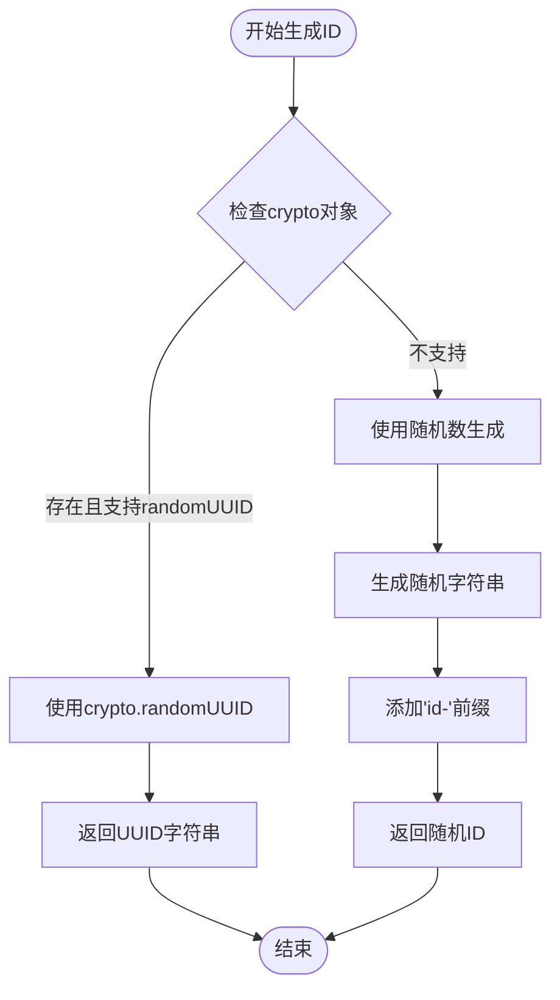
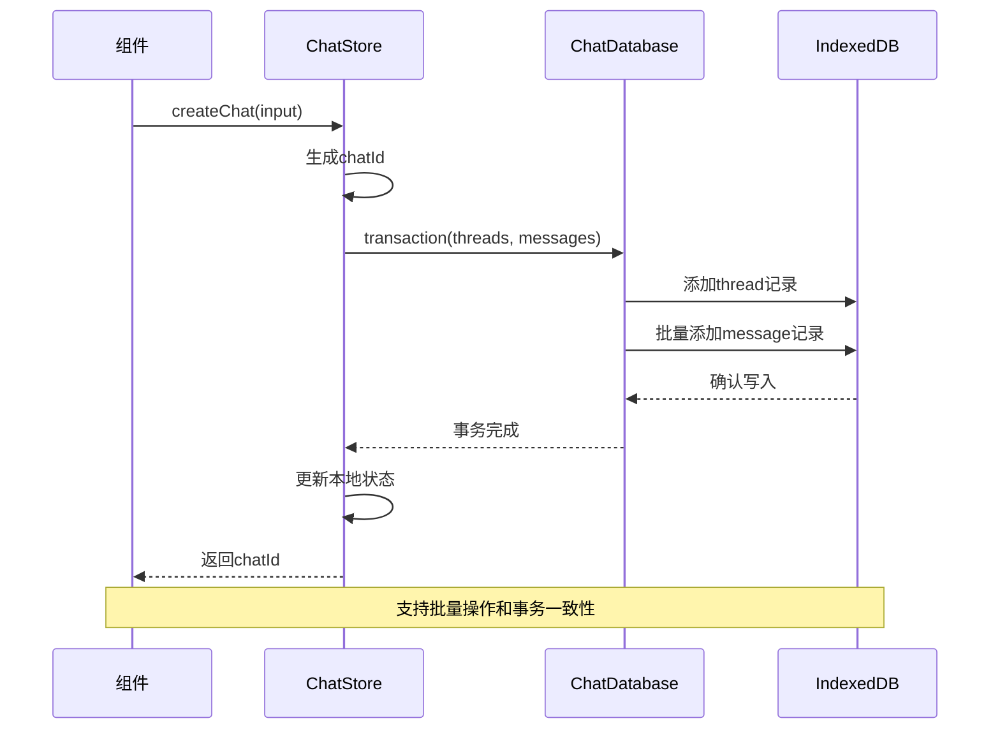
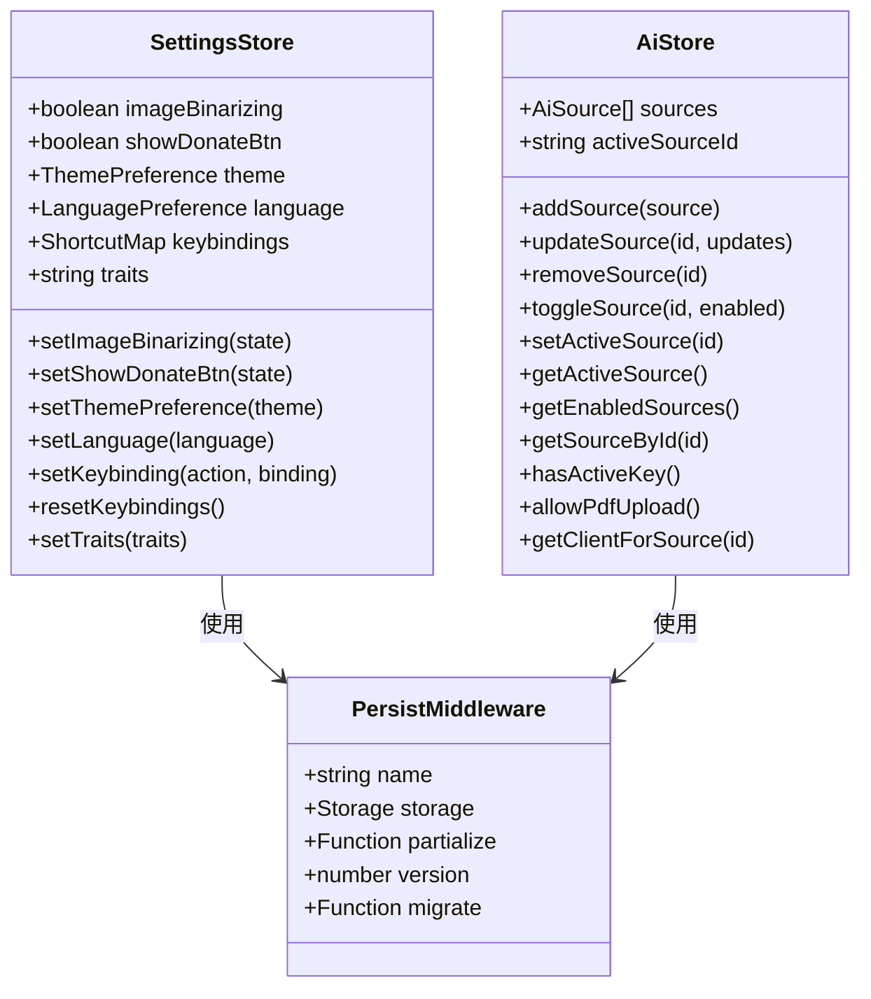
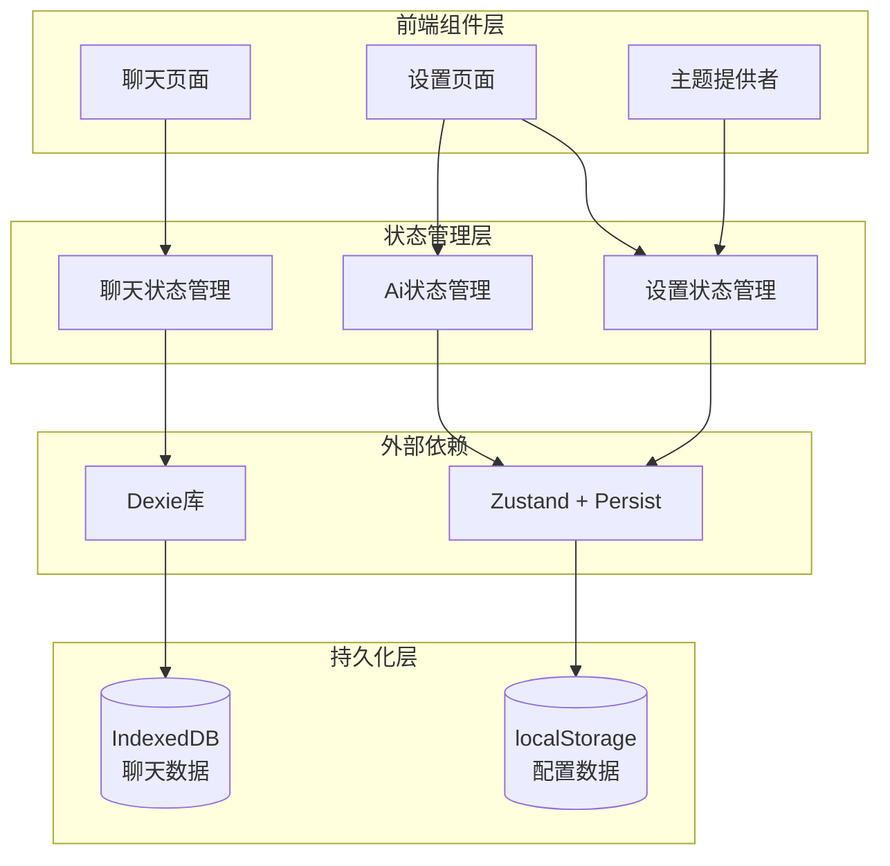
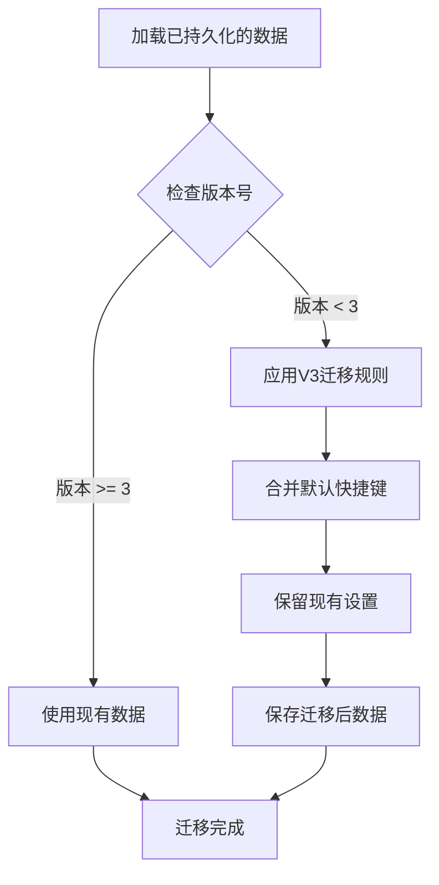
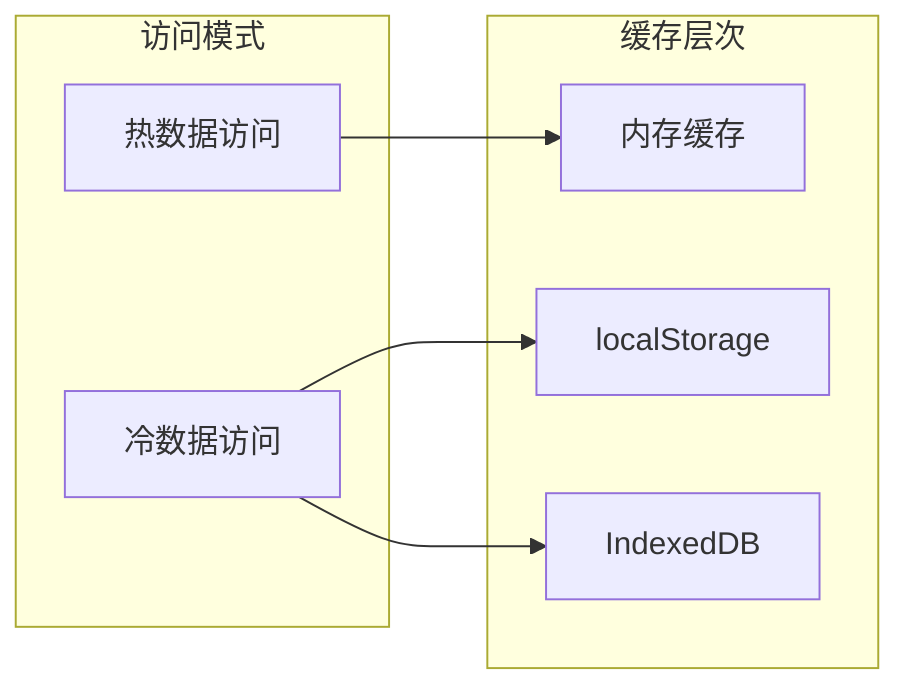

# 数据持久化机制

<cite>
**本文档中引用的文件**
- [chat-db.ts](file://src/store/chat-db.ts)
- [ai-store.ts](file://src/store/ai-store.ts)
- [settings-store.ts](file://src/store/settings-store.ts)
- [chat-store.ts](file://src/store/chat-store.ts)
- [ChatPage.tsx](file://src/components/pages/ChatPage.tsx)
- [SettingsPage.tsx](file://src/components/pages/SettingsPage.tsx)
- [theme-provider.tsx](file://src/components/theme-provider.tsx)
</cite>

## 目录
1. [概述](#概述)
2. [聊天数据持久化](#聊天数据持久化)
3. [配置和偏好数据持久化](#配置和偏好数据持久化)
4. [持久化策略对比](#持久化策略对比)
5. [数据流架构](#数据流架构)
6. [版本迁移机制](#版本迁移机制)
7. [性能考虑](#性能考虑)
8. [故障排除指南](#故障排除指南)
9. [总结](#总结)

## 概述

该项目采用双重数据持久化策略，针对不同类型的数据使用不同的存储方案。聊天数据采用IndexedDB进行结构化存储，而用户配置和偏好设置则使用localStorage进行简单键值对存储。这种设计既保证了数据的完整性，又优化了不同场景下的访问效率。

## 聊天数据持久化

### IndexedDB数据库架构

项目使用Dexie库创建名为'skid-homework-chat-db'的IndexedDB数据库，专门用于存储聊天相关的结构化数据。

```mermaid
erDiagram
CHAT_DATABASE {
string name "skid-homework-chat-db"
number version 1
}
THREADS_TABLE {
string id PK
string title
string sourceId
string model
number createdAt
number updatedAt
json metadata
}
MESSAGES_TABLE {
string id PK
string chatId FK
string role
string content
number createdAt
}
CHAT_DATABASE ||--o{ THREADS_TABLE : contains
CHAT_DATABASE ||--o{ MESSAGES_TABLE : contains
THREADS_TABLE ||--o{ MESSAGES_TABLE : has_messages
```

**图表来源**
- [chat-db.ts](file://src/store/chat-db.ts#L23-L34)

### 数据库表结构

#### ChatThreadRecord 表
- **主键**: `id` (字符串类型)
- **索引**: `updatedAt`, `createdAt` (时间戳索引)
- **用途**: 存储聊天会话的基本信息，包括标题、模型、创建时间和更新时间等元数据

#### ChatMessageRecord 表  
- **主键**: `id` (字符串类型)
- **索引**: `chatId`, `createdAt`, `[chatId+createdAt]` (复合索引)
- **用途**: 存储具体的聊天消息内容，支持按会话ID查询和时间排序

### ID生成机制

项目实现了跨平台的UUID生成器，优先使用浏览器的crypto.randomUUID方法，确保在现代浏览器环境下的安全性：



**图表来源**
- [chat-db.ts](file://src/store/chat-db.ts#L39-L44)

### 聊天数据操作流程

聊天数据的CRUD操作通过专门的store实现，支持事务处理以保证数据一致性：



**图表来源**
- [chat-store.ts](file://src/store/chat-store.ts#L122-L164)

**章节来源**
- [chat-db.ts](file://src/store/chat-db.ts#L1-L45)
- [chat-store.ts](file://src/store/chat-store.ts#L1-L301)

## 配置和偏好数据持久化

### Zustand + Persist 中间件架构

项目使用zustand结合persist中间件来管理用户配置和应用偏好设置。这种方案适用于小量、简单的键值对数据存储。



**图表来源**
- [settings-store.ts](file://src/store/settings-store.ts#L32-L51)
- [ai-store.ts](file://src/store/ai-store.ts#L131-L147)

### 设置存储配置

#### SettingsStore 配置
- **存储名称**: `"skidhw-storage"`
- **存储位置**: localStorage
- **持久化字段**: 包含所有用户可配置的设置项
- **版本号**: 3

#### AiStore 配置  
- **存储名称**: `"ai-storage"`
- **存储位置**: localStorage
- **持久化字段**: AI源配置和当前激活的AI源ID
- **版本号**: 1

### Partialize 选项详解

项目使用partialize选项精确控制哪些状态字段需要持久化，避免不必要的数据存储：

#### SettingsStore 的 partialize 实现
```typescript
partialize: (state) => ({
  imageBinarizing: state.imageBinarizing,
  showDonateBtn: state.showDonateBtn,
  theme: state.theme,
  language: state.language,
  keybindings: state.keybindings,
  traits: state.traits,
})
```

#### AiStore 的 partialize 实现
```typescript
partialize: (state) => ({
  sources: state.sources,
  activeSourceId: state.activeSourceId,
})
```

这种设计确保只有必要的状态会被保存，减少存储空间占用并提高性能。

**章节来源**
- [settings-store.ts](file://src/store/settings-store.ts#L53-L116)
- [ai-store.ts](file://src/store/ai-store.ts#L149-L271)

## 持久化策略对比

| 特性 | IndexedDB (聊天数据) | localStorage (配置数据) |
|------|---------------------|------------------------|
| **存储容量** | 大容量，适合大量数据 | 小容量，适合少量数据 |
| **数据结构** | 结构化，支持复杂查询 | 键值对，简单直接 |
| **查询能力** | 支持索引和复杂查询 | 基本读写操作 |
| **事务支持** | 完整事务支持 | 无事务支持 |
| **性能特点** | 异步操作，非阻塞 | 同步操作，快速 |
| **适用场景** | 聊天记录、历史数据 | 用户设置、偏好配置 |

### 选择原则

1. **IndexedDB 适用场景**:
   - 大量结构化数据存储
   - 需要复杂查询和索引
   - 数据一致性要求高
   - 长期历史数据保存

2. **localStorage 适用场景**:
   - 小量配置数据
   - 简单的键值对存储
   - 快速读取需求
   - 用户偏好设置

## 数据流架构



**图表来源**
- [ChatPage.tsx](file://src/components/pages/ChatPage.tsx#L83-L109)
- [SettingsPage.tsx](file://src/components/pages/SettingsPage.tsx#L64-L85)
- [theme-provider.tsx](file://src/components/theme-provider.tsx#L30-L31)

## 版本迁移机制

### SettingsStore 迁移策略

项目实现了智能的版本迁移机制，确保设置数据在版本升级时的安全性和兼容性：



**图表来源**
- [settings-store.ts](file://src/store/settings-store.ts#L89-L109)

### 迁移规则详解

#### 版本 3 迁移逻辑
1. **默认快捷键合并**: 如果快捷键设置不存在，则使用默认快捷键配置
2. **部分覆盖**: 只有当快捷键设置存在时才进行合并，否则完全使用默认值
3. **向后兼容**: 确保新版本不会破坏旧版本的数据格式

### AiStore 迁移策略

虽然AiStore目前版本为1，但其设计已经考虑了未来的扩展性，特别是对于AI源配置的迁移和兼容性处理。

**章节来源**
- [settings-store.ts](file://src/store/settings-store.ts#L89-L110)

## 性能考虑

### IndexedDB 性能优化

1. **索引策略**: 为常用查询字段建立索引，提高查询效率
2. **事务批处理**: 使用事务批量操作，减少I/O次数
3. **异步操作**: 所有数据库操作都是异步的，避免阻塞主线程
4. **内存管理**: 及时清理不需要的查询结果，防止内存泄漏

### localStorage 性能优化

1. **即时读取**: localStorage操作是同步的，适合快速读取
2. **数据压缩**: 对于较大的配置对象，考虑序列化时的优化
3. **访问频率**: 频繁访问的设置项优先级更高

### 缓存策略



## 故障排除指南

### 常见问题及解决方案

#### IndexedDB 相关问题

1. **数据库版本冲突**
   - 症状：数据库初始化失败或数据丢失
   - 解决：检查数据库版本号，必要时清理浏览器缓存

2. **存储空间不足**
   - 症状：无法保存新的聊天记录
   - 解决：定期清理旧的聊天记录，或增加存储配额

3. **事务失败**
   - 症状：部分数据保存成功，部分失败
   - 解决：检查网络连接，确保事务完整性

#### localStorage 相关问题

1. **存储配额超限**
   - 症状：设置无法保存
   - 解决：清理不必要的本地存储数据

2. **数据损坏**
   - 症状：设置重置为默认值
   - 解决：检查数据序列化格式，必要时重置为默认配置

3. **跨域访问问题**
   - 症状：设置在不同域名下不共享
   - 解决：使用相同的存储键名，或考虑服务器端存储

### 调试工具

1. **浏览器开发者工具**: 检查IndexedDB和localStorage的存储状态
2. **控制台日志**: 监控数据持久化过程中的错误信息
3. **性能监控**: 跟踪数据库操作的响应时间

**章节来源**
- [chat-db.ts](file://src/store/chat-db.ts#L23-L34)
- [settings-store.ts](file://src/store/settings-store.ts#L78-L87)

## 总结

该项目采用了精心设计的双重数据持久化策略，针对不同类型的数据需求选择了最适合的存储方案：

1. **聊天数据**使用IndexedDB，提供了强大的结构化存储能力和复杂的查询功能，适合处理大量的聊天记录和历史数据。

2. **配置和偏好数据**使用localStorage，简化了存储逻辑，提高了访问速度，适合存储用户设置和应用偏好。

3. **智能的版本迁移机制**确保了数据的长期兼容性和稳定性。

4. **精确的partialize配置**避免了不必要的数据存储，优化了性能和存储空间。

这种混合策略不仅满足了当前的功能需求，也为未来的扩展提供了良好的基础。通过合理的架构设计和性能优化，系统能够在各种使用场景下提供稳定可靠的数据持久化服务。