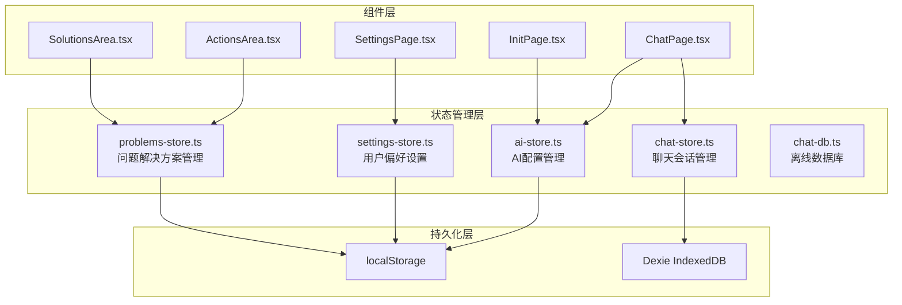
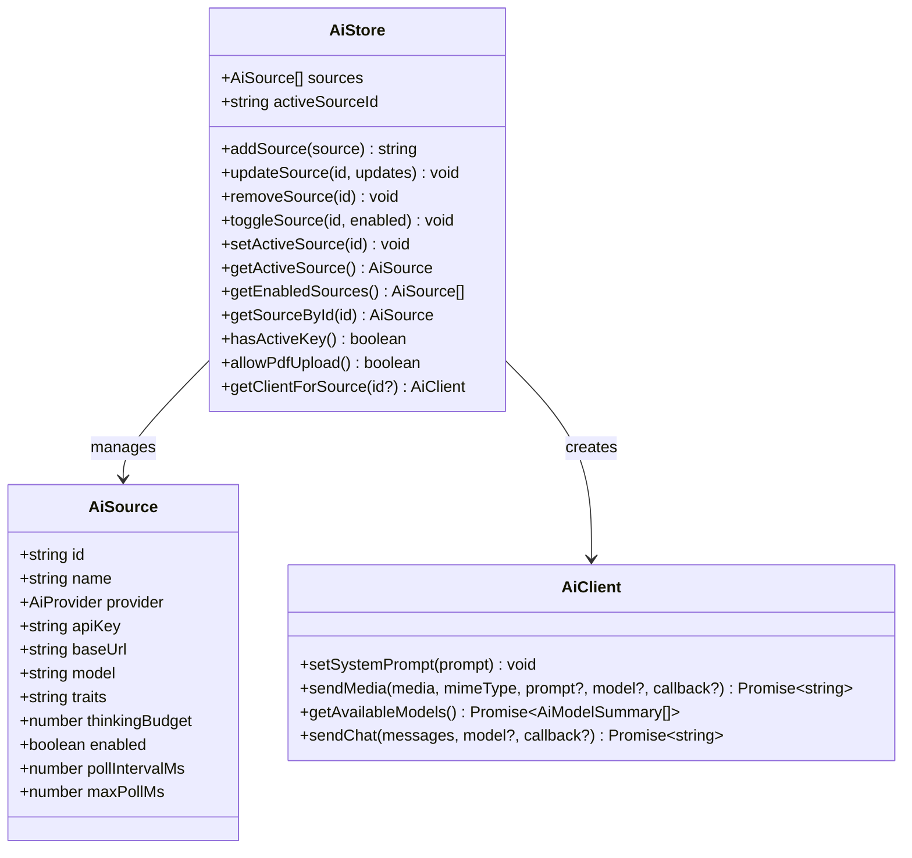
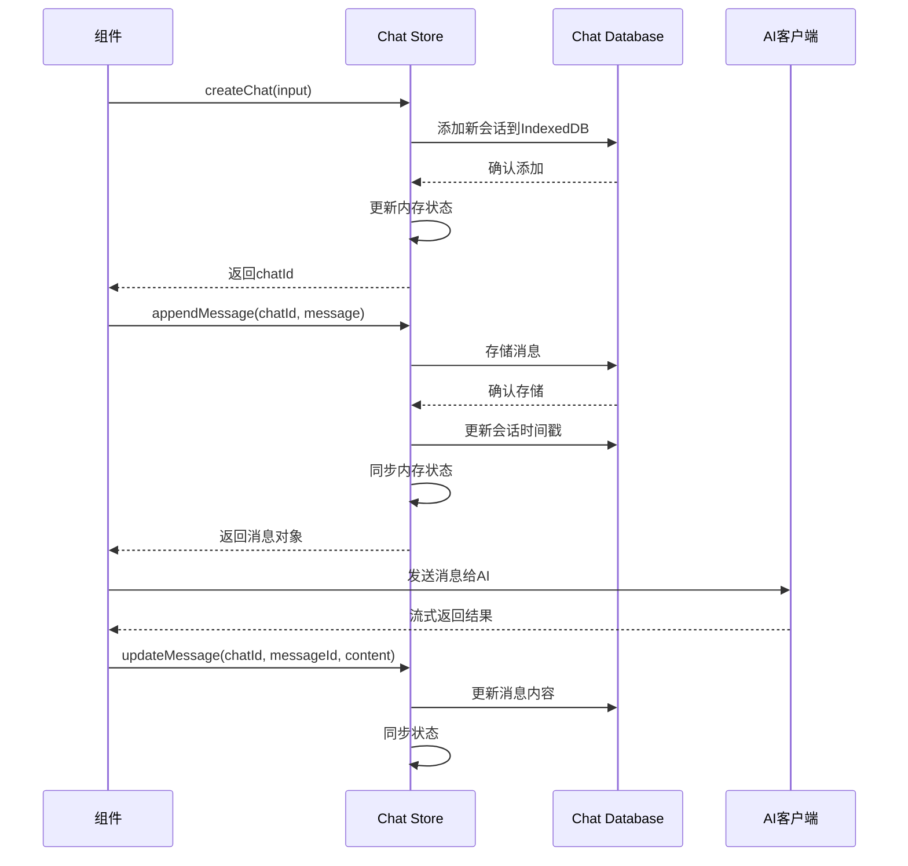
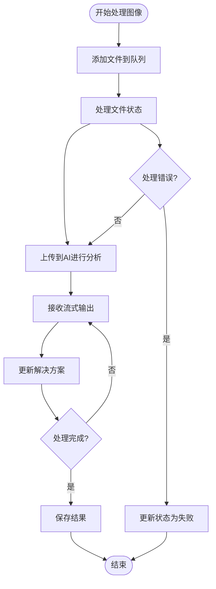
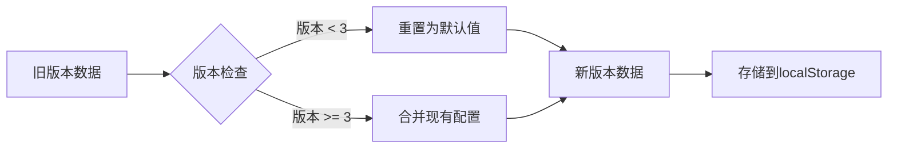
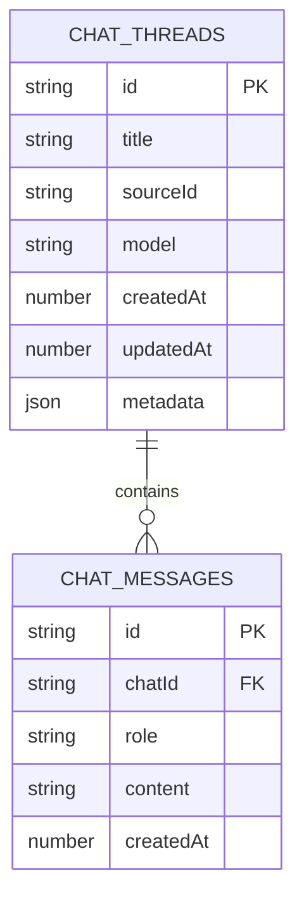
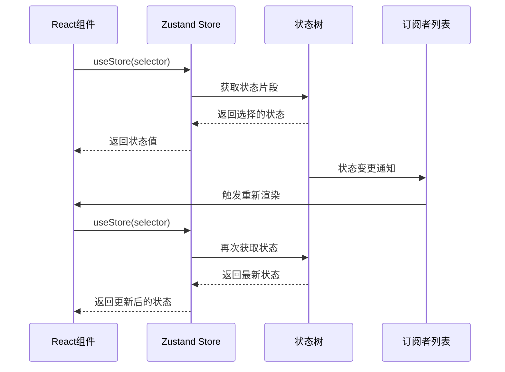
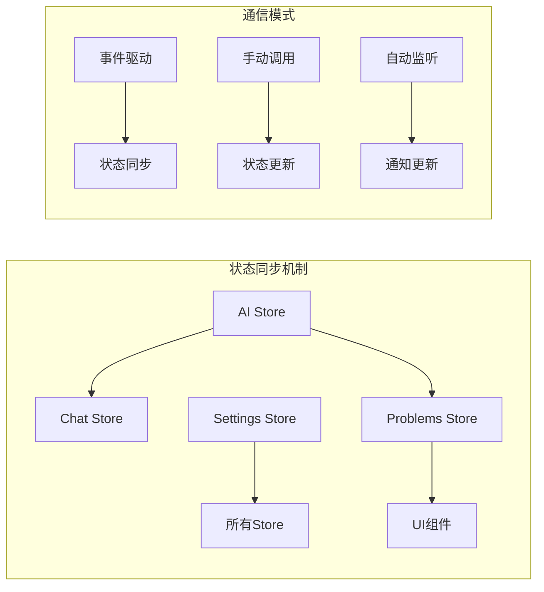
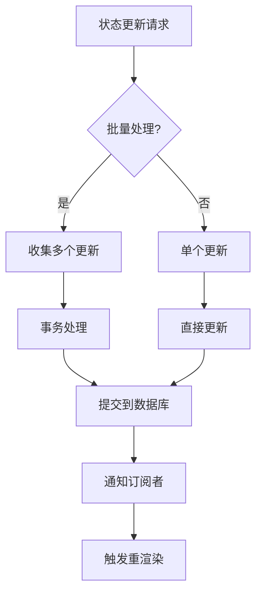
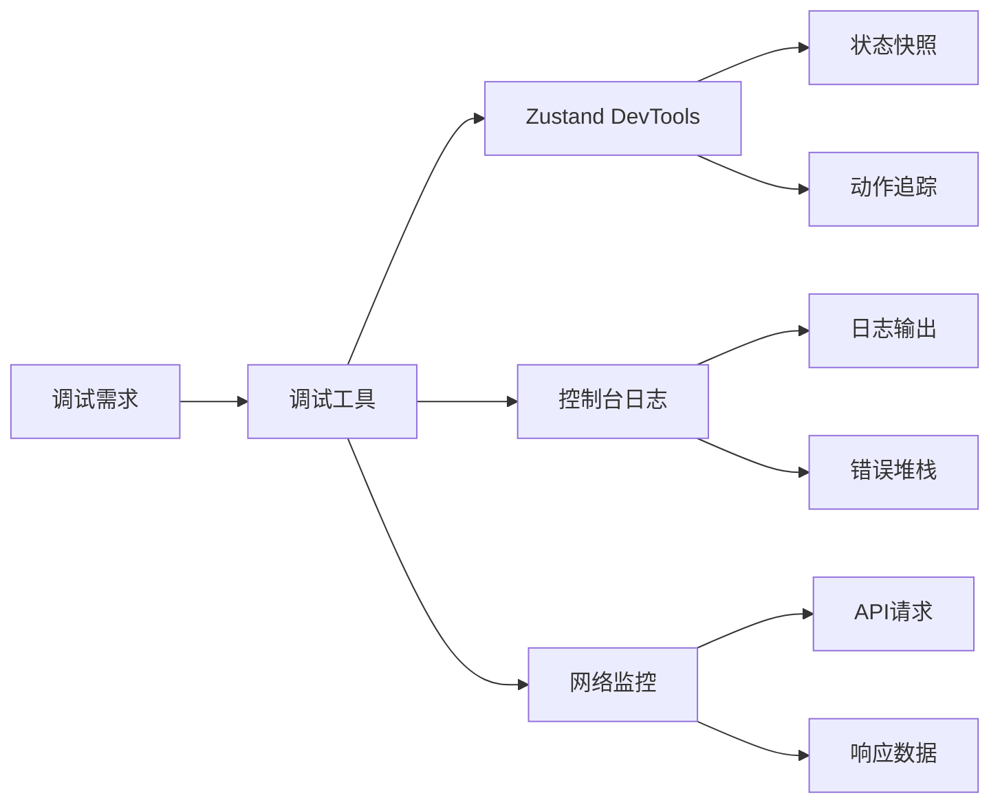

# 状态管理

<cite>
**本文档中引用的文件**
- [ai-store.ts](file://src/store/ai-store.ts)
- [chat-store.ts](file://src/store/chat-store.ts)
- [problems-store.ts](file://src/store/problems-store.ts)
- [settings-store.ts](file://src/store/settings-store.ts)
- [chat-db.ts](file://src/store/chat-db.ts)
- [ChatPage.tsx](file://src/components/pages/ChatPage.tsx)
- [SettingsPage.tsx](file://src/components/pages/SettingsPage.tsx)
- [InitPage.tsx](file://src/components/pages/InitPage.tsx)
- [ActionsArea.tsx](file://src/components/areas/ActionsArea.tsx)
- [ImproveSolutionDialog.tsx](file://src/components/dialogs/ImproveSolutionDialog.tsx)
- [SolutionsArea.tsx](file://src/components/areas/SolutionsArea.tsx)
</cite>

## 目录
1. [概述](#概述)
2. [项目架构](#项目架构)
3. [核心Store模块](#核心store模块)
4. [持久化机制](#持久化机制)
5. [离线数据存储](#离线数据存储)
6. [状态订阅模式](#状态订阅模式)
7. [跨组件通信](#跨组件通信)
8. [性能优化策略](#性能优化策略)
9. [最佳实践](#最佳实践)
10. [总结](#总结)

## 概述

本项目采用Zustand作为核心状态管理解决方案，构建了一个完整且高效的状态管理系统。该系统通过四个主要的store模块实现不同功能域的状态管理，支持持久化存储、离线数据处理和跨组件通信，为整个应用程序提供了统一、一致的状态管理体验。

## 项目架构

**图表来源**
- [ai-store.ts](file://src/store/ai-store.ts#L1-L275)
- [chat-store.ts](file://src/store/chat-store.ts#L1-L302)
- [problems-store.ts](file://src/store/problems-store.ts#L1-L281)
- [settings-store.ts](file://src/store/settings-store.ts#L1-L116)
- [chat-db.ts](file://src/store/chat-db.ts#L1-L45)

## 核心Store模块

### AI Store - AI配置和密钥管理

AI Store负责管理所有与AI服务相关的配置信息，包括API密钥、模型选择、提供商设置等。

**图表来源**
- [ai-store.ts](file://src/store/ai-store.ts#L131-L275)

**节来源**
- [ai-store.ts](file://src/store/ai-store.ts#L1-L275)

### Chat Store - 聊天会话状态管理

Chat Store专门处理聊天功能相关的状态，包括对话历史、消息管理和会话操作。

**图表来源**
- [chat-store.ts](file://src/store/chat-store.ts#L69-L301)

**节来源**
- [chat-store.ts](file://src/store/chat-store.ts#L1-L302)

### Problems Store - 问题和解决方案管理

Problems Store管理图像上传、问题识别和解决方案生成的整个流程。

**图表来源**
- [problems-store.ts](file://src/store/problems-store.ts#L73-L280)

**节来源**
- [problems-store.ts](file://src/store/problems-store.ts#L1-L281)

### Settings Store - 用户偏好设置管理

Settings Store负责管理用户的个性化设置，包括主题、语言、快捷键等配置。

**节来源**
- [settings-store.ts](file://src/store/settings-store.ts#L1-L116)

## 持久化机制

### localStorage持久化

所有需要在浏览器重启后保持的数据都通过localStorage进行持久化：

| Store模块 | 持久化字段 | 描述 |
|-----------|------------|------|
| AI Store | sources, activeSourceId | AI提供商配置和当前选中项 |
| Settings Store | imageBinarizing, showDonateBtn, theme, language, keybindings, traits | 用户界面设置和个人化配置 |

### 版本迁移机制

系统实现了智能的版本迁移功能，确保数据格式的兼容性：

**图表来源**
- [settings-store.ts](file://src/store/settings-store.ts#L89-L109)

**节来源**
- [settings-store.ts](file://src/store/settings-store.ts#L89-L116)

## 离线数据存储

### IndexedDB集成

Chat Store使用Dexie库实现IndexedDB数据库，提供强大的离线数据存储能力：

**图表来源**
- [chat-db.ts](file://src/store/chat-db.ts#L5-L21)

### 数据库操作特性

| 功能 | 实现方式 | 性能特点 |
|------|----------|----------|
| 原子事务 | transaction()方法 | 确保数据一致性 |
| 批量操作 | bulkAdd(), bulkUpdate() | 提高批量处理效率 |
| 索引查询 | 复合索引[chatId+createdAt] | 快速消息检索 |
| 异步操作 | Promise-based API | 非阻塞用户体验 |

**节来源**
- [chat-db.ts](file://src/store/chat-db.ts#L1-L45)

## 状态订阅模式

### useSelector模式

组件通过useSelector模式订阅特定的状态片段：

### 订阅优化策略

| 优化技术 | 应用场景 | 效果 |
|----------|----------|------|
| selector函数 | 只订阅需要的状态 | 减少不必要的重渲染 |
| useMemo缓存 | 复杂计算结果 | 避免重复计算 |
| 组件级分割 | 大型组件拆分 | 局部状态变更不影响整体 |

**节来源**
- [ChatPage.tsx](file://src/components/pages/ChatPage.tsx#L77-L109)
- [SettingsPage.tsx](file://src/components/pages/SettingsPage.tsx#L62-L85)

## 跨组件通信

### 全局状态同步

不同store模块之间通过以下方式进行协调：

### 组件间数据流转

| 数据流向 | 实现方式 | 使用场景 |
|----------|----------|----------|
| 单向数据流 | Store → Component | 显示型数据展示 |
| 双向绑定 | Component → Store → Component | 表单输入处理 |
| 事件回调 | Store → Component → Store | 用户交互响应 |
| 状态派生 | Selector函数 | 计算属性生成 |

**节来源**
- [ImproveSolutionDialog.tsx](file://src/components/dialogs/ImproveSolutionDialog.tsx#L30-L35)
- [ActionsArea.tsx](file://src/components/areas/ActionsArea.tsx#L27-L31)

## 性能优化策略

### 状态更新优化

### 内存管理

| 优化技术 | 实现位置 | 效果 |
|----------|----------|------|
| 状态切片 | Selector函数 | 减少订阅范围 |
| 对象引用缓存 | useMemo/useCallback | 避免不必要的比较 |
| 清理机制 | useEffect清理函数 | 防止内存泄漏 |
| 延迟加载 | 懒初始化 | 减少初始内存占用 |

**节来源**
- [SolutionsArea.tsx](file://src/components/areas/SolutionsArea.tsx#L204-L216)

## 最佳实践

### 状态设计原则

1. **单一职责**：每个store专注于特定的功能领域
2. **不可变更新**：使用纯函数更新状态
3. **类型安全**：完整的TypeScript类型定义
4. **可测试性**：清晰的接口和副作用分离

### 开发规范

| 规范类别 | 具体要求 | 示例 |
|----------|----------|------|
| 命名规范 | 动词开头的动作函数 | `addSource()`, `updateMessage()` |
| 类型定义 | 完整的接口声明 | `AiSource`, `ChatMessageRecord` |
| 错误处理 | 优雅的降级机制 | API密钥缺失时的提示 |
| 文档注释 | 清晰的函数说明 | 参数、返回值、异常情况 |

### 调试技巧

## 总结

本项目的状态管理系统通过Zustand实现了以下核心价值：

1. **模块化设计**：四个独立的store模块各司其职，职责清晰
2. **持久化保障**：localStorage和IndexedDB双重保障数据持久性
3. **性能优化**：智能的订阅机制和状态更新策略
4. **开发体验**：TypeScript类型安全和良好的开发工具支持
5. **扩展性**：模块化架构便于功能扩展和维护

这套状态管理系统为应用程序提供了稳定、高效的状态管理基础设施，支持复杂的业务逻辑和良好的用户体验。通过合理的架构设计和最佳实践的应用，确保了系统的可维护性和可扩展性。