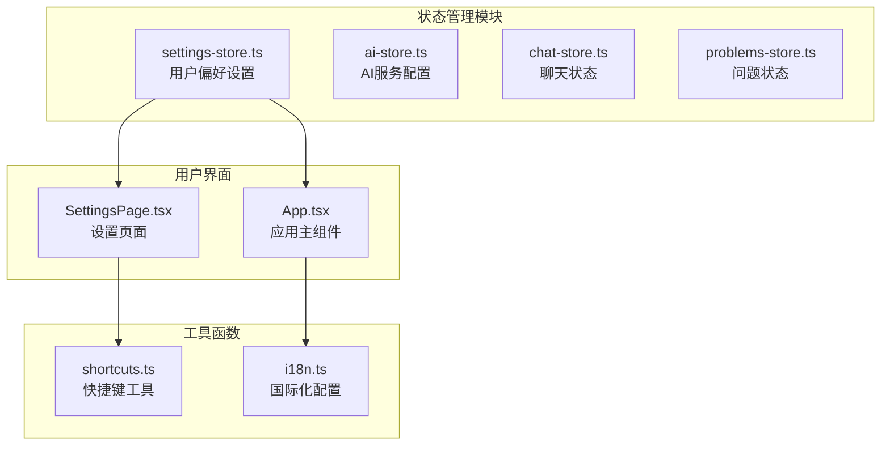
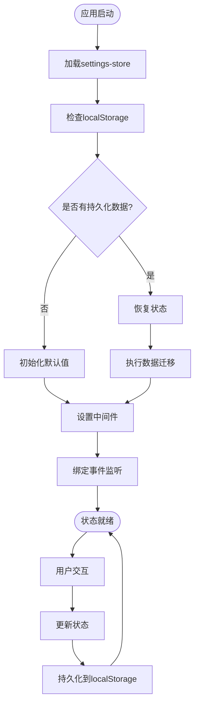
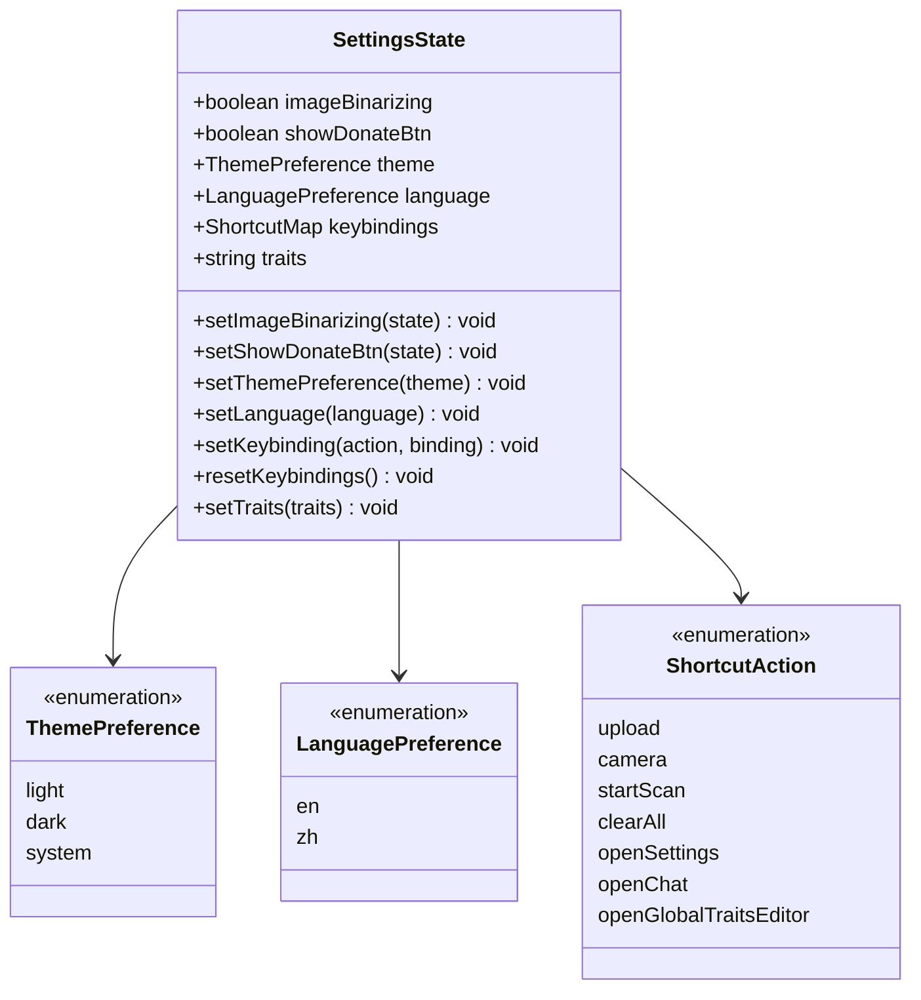
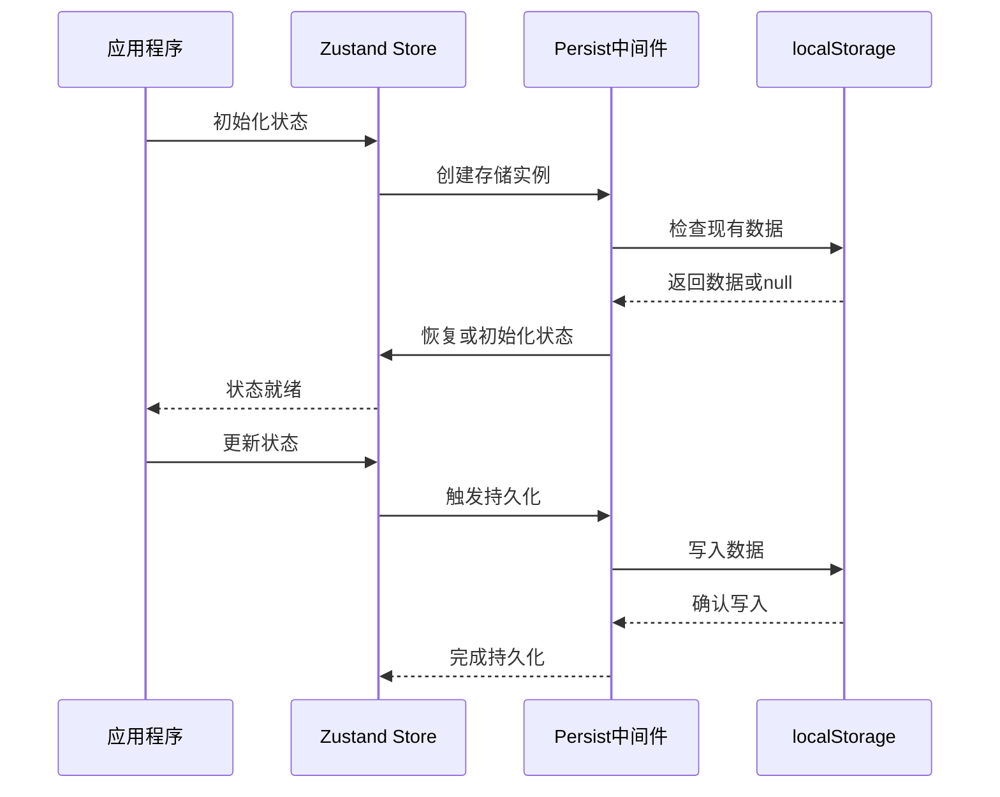
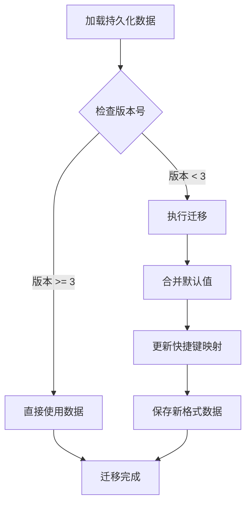
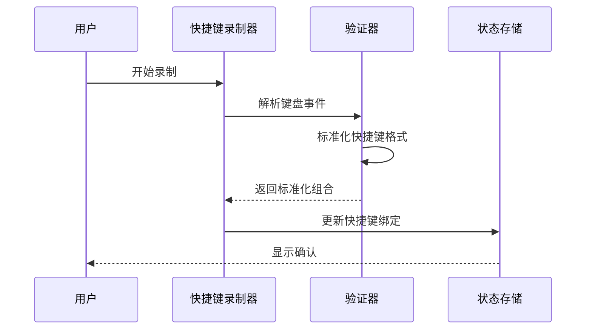
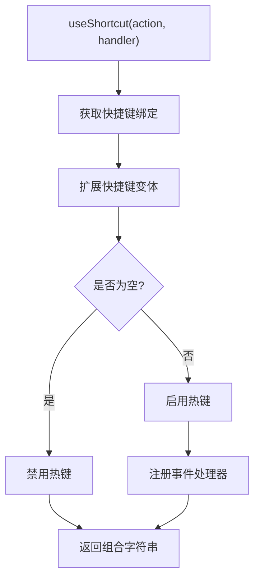
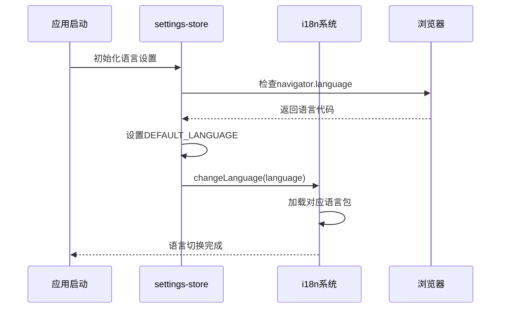
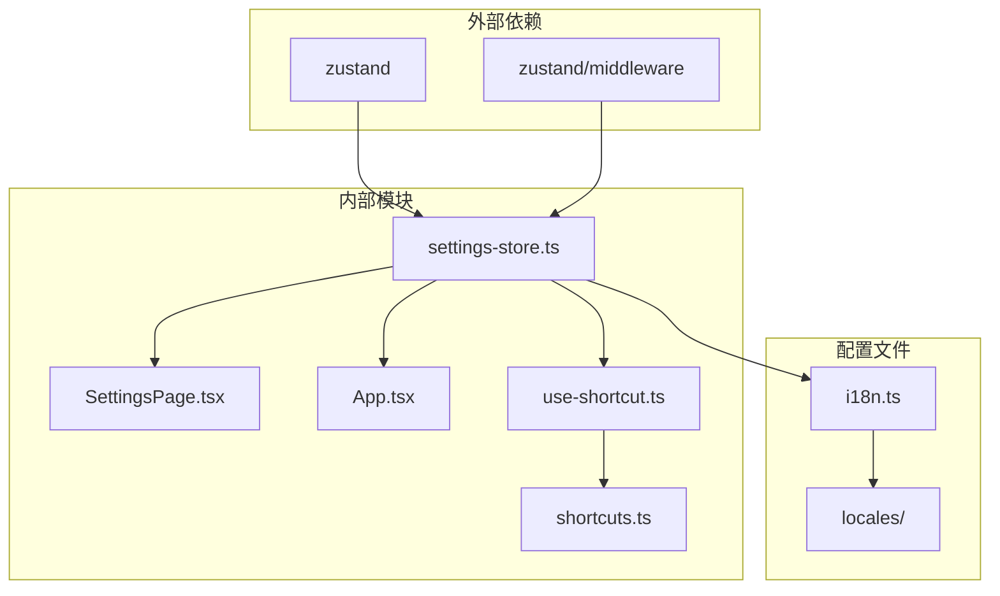

# 用户偏好设置

<cite>
**本文档中引用的文件**
- [settings-store.ts](file://src/store/settings-store.ts)
- [shortcuts.ts](file://src/utils/shortcuts.ts)
- [SettingsPage.tsx](file://src/components/pages/SettingsPage.tsx)
- [use-shortcut.ts](file://src/hooks/use-shortcut.ts)
- [App.tsx](file://src/App.tsx)
- [i18n.ts](file://src/i18n.ts)
- [commons.json](file://public/locales/en/commons.json)
- [commons.json](file://public/locales/zh/commons.json)
</cite>

## 目录
1. [简介](#简介)
2. [项目结构](#项目结构)
3. [核心组件](#核心组件)
4. [架构概览](#架构概览)
5. [详细组件分析](#详细组件分析)
6. [依赖关系分析](#依赖关系分析)
7. [性能考虑](#性能考虑)
8. [故障排除指南](#故障排除指南)
9. [结论](#结论)

## 简介

settings-store模块是SkidHomework应用程序的核心状态管理模块，负责持久化存储用户的个性化偏好设置。该模块使用zustand库结合persist中间件实现状态的本地存储，确保用户在不同会话间能够保持一致的个性化体验。

该模块主要管理以下类型的用户偏好：
- 主题设置（亮色/暗色/系统跟随）
- 语言设置（英语/中文）
- 快捷键绑定
- 图像后处理设置
- 捐赠按钮显示控制
- 全局提示词（系统提示）

## 项目结构

settings-store模块位于`src/store/`目录下，与其他状态管理模块协同工作：

**图表来源**
- [settings-store.ts](file://src/store/settings-store.ts#L1-L116)
- [SettingsPage.tsx](file://src/components/pages/SettingsPage.tsx#L1-L50)
- [App.tsx](file://src/App.tsx#L1-L53)

**章节来源**
- [settings-store.ts](file://src/store/settings-store.ts#L1-L116)

## 核心组件

### 枚举类型定义

settings-store模块定义了两个核心的枚举类型：

#### ThemePreference（主题偏好）
- `"light"`：亮色主题
- `"dark"`：暗色主题  
- `"system"`：跟随系统主题

#### LanguagePreference（语言偏好）
- `"en"`：英语
- `"zh"`：中文

### 快捷键系统

#### ShortcutAction（快捷键动作）
定义了应用程序中可用的快捷键动作：
- `"upload"`：上传文件
- `"camera"`：拍照
- `"startScan"`：开始扫描
- `"clearAll"`：清空所有
- `"openSettings"`：打开设置
- `"openChat"`：打开聊天
- `"openGlobalTraitsEditor"`：打开全局提示词编辑器

#### ShortcutMap（快捷键映射）
使用Record类型将快捷键动作映射到具体的键盘组合字符串。

**章节来源**
- [settings-store.ts](file://src/store/settings-store.ts#L4-L15)

## 架构概览

settings-store采用zustand状态管理库，结合persist中间件实现持久化存储：

**图表来源**
- [settings-store.ts](file://src/store/settings-store.ts#L53-L113)

## 详细组件分析

### 状态接口定义

settings-store定义了完整的SettingsState接口，包含所有可持久化的用户偏好：

**图表来源**
- [settings-store.ts](file://src/store/settings-store.ts#L32-L51)

### 默认值配置

#### 默认快捷键映射
系统提供了一套完整的默认快捷键配置：

| 动作 | 默认快捷键 | 功能描述 |
|------|------------|----------|
| upload | Ctrl+1 | 打开文件选择器 |
| camera | Ctrl+2 | 启动相机拍摄 |
| startScan | Ctrl+3 | 开始AI识别 |
| clearAll | Ctrl+4 | 清空所有文件 |
| openSettings | Ctrl+5 | 打开设置页面 |
| openChat | Ctrl+E | 打开聊天界面 |
| openGlobalTraitsEditor | Ctrl+X | 打开全局提示词编辑器 |

#### 默认语言检测
系统根据浏览器语言自动设置默认语言：
- 如果navigator.language以"zh"开头，则设置为中文（"zh"）
- 否则设置为英语（"en"）

**章节来源**
- [settings-store.ts](file://src/store/settings-store.ts#L17-L30)

### 持久化机制

#### zustand/persist中间件配置

settings-store使用zustand的persist中间件实现状态持久化：

**图表来源**
- [settings-store.ts](file://src/store/settings-store.ts#L53-L113)

#### 数据迁移策略

系统实现了版本化的数据迁移机制，确保向后兼容性：

**图表来源**
- [settings-store.ts](file://src/store/settings-store.ts#L88-L109)

**章节来源**
- [settings-store.ts](file://src/store/settings-store.ts#L88-L113)

### 快捷键管理系统

#### 快捷键录制与验证

系统提供了完整的快捷键录制和验证功能：

**图表来源**
- [shortcuts.ts](file://src/utils/shortcuts.ts#L150-L191)
- [SettingsPage.tsx](file://src/components/pages/SettingsPage.tsx#L663-L666)

#### 快捷键钩子函数

useShortcut钩子提供了便捷的快捷键绑定功能：

**图表来源**
- [use-shortcut.ts](file://src/hooks/use-shortcut.ts#L11-L27)

**章节来源**
- [use-shortcut.ts](file://src/hooks/use-shortcut.ts#L1-L28)
- [shortcuts.ts](file://src/utils/shortcuts.ts#L1-L308)

### 国际化集成

#### 语言自动检测

settings-store与i18n系统深度集成，实现语言的自动检测和切换：

**图表来源**
- [App.tsx](file://src/App.tsx#L13-L20)
- [i18n.ts](file://src/i18n.ts#L1-L52)

**章节来源**
- [App.tsx](file://src/App.tsx#L13-L20)
- [i18n.ts](file://src/i18n.ts#L1-L52)

## 依赖关系分析

settings-store模块与其他模块存在以下依赖关系：

**图表来源**
- [settings-store.ts](file://src/store/settings-store.ts#L1-L3)
- [SettingsPage.tsx](file://src/components/pages/SettingsPage.tsx#L1-L15)

**章节来源**
- [settings-store.ts](file://src/store/settings-store.ts#L1-L3)

## 性能考虑

### 状态更新优化

settings-store采用了多种性能优化策略：

1. **选择性状态更新**：只更新发生变化的部分状态
2. **记忆化计算**：使用useMemo缓存计算结果
3. **防抖处理**：避免频繁的状态更新触发不必要的重新渲染

### 存储效率

1. **部分化存储**：只持久化必要的状态字段
2. **版本控制**：通过版本号管理数据结构变更
3. **增量更新**：支持状态的增量更新而非全量替换

## 故障排除指南

### 常见问题及解决方案

#### 快捷键失效
- **原因**：快捷键绑定格式错误或冲突
- **解决**：使用resetKeybindings恢复默认设置

#### 语言切换不生效
- **原因**：i18n系统未正确初始化
- **解决**：检查App.tsx中的语言同步逻辑

#### 主题切换异常
- **原因**：CSS变量未正确更新
- **解决**：检查theme-provider的实现

**章节来源**
- [settings-store.ts](file://src/store/settings-store.ts#L74-L75)

## 结论

settings-store模块作为SkidHomework应用的核心状态管理组件，成功实现了以下目标：

1. **完整的用户偏好管理**：涵盖主题、语言、快捷键等所有个性化设置
2. **可靠的持久化机制**：通过zustand/persist确保设置的持久保存
3. **智能的数据迁移**：支持从旧版本到新版本的平滑升级
4. **良好的用户体验**：提供直观的设置界面和即时的反馈
5. **国际化支持**：无缝集成多语言环境

该模块的设计体现了现代前端应用的最佳实践，为用户提供了一致、可靠且个性化的使用体验。其模块化的设计也便于未来的功能扩展和维护。