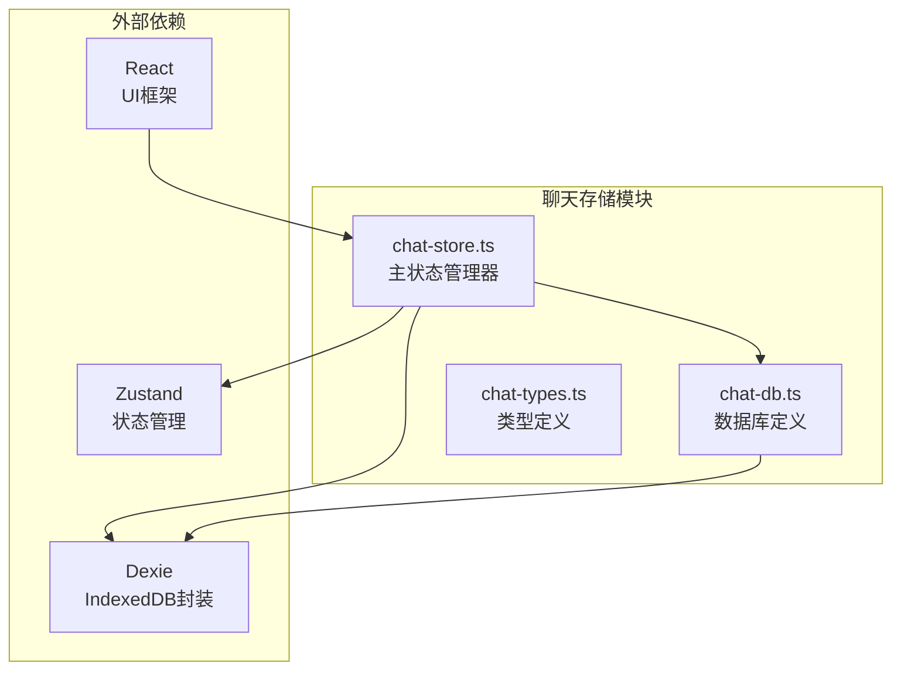
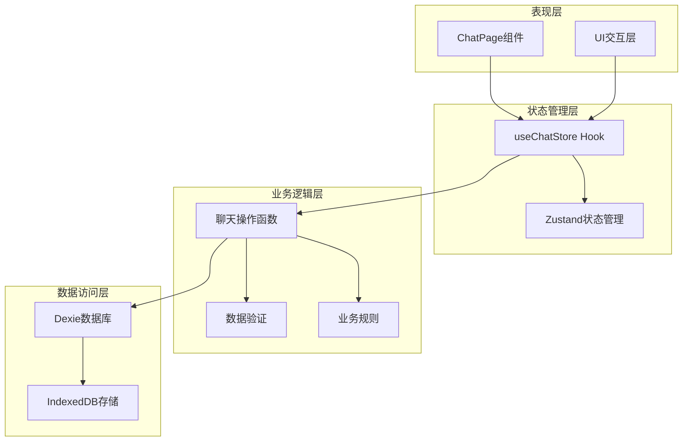
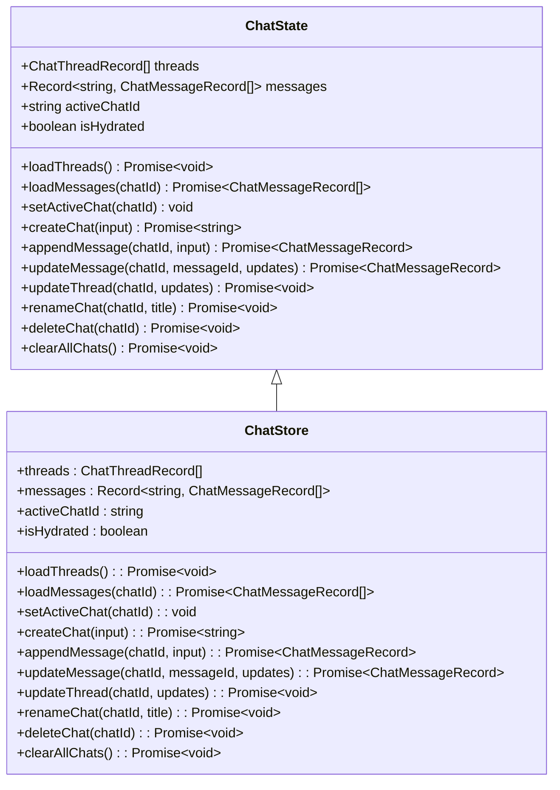
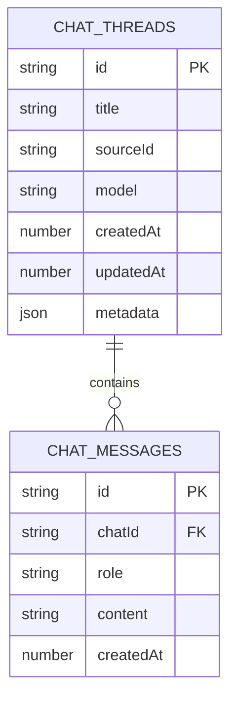
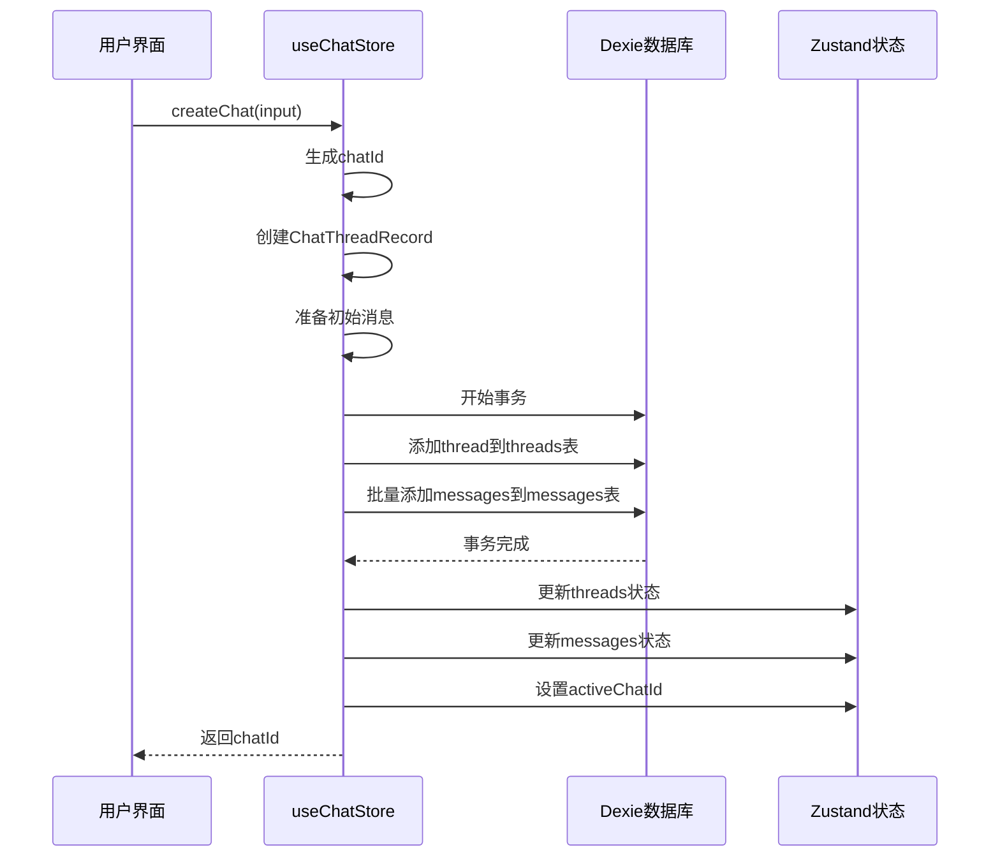
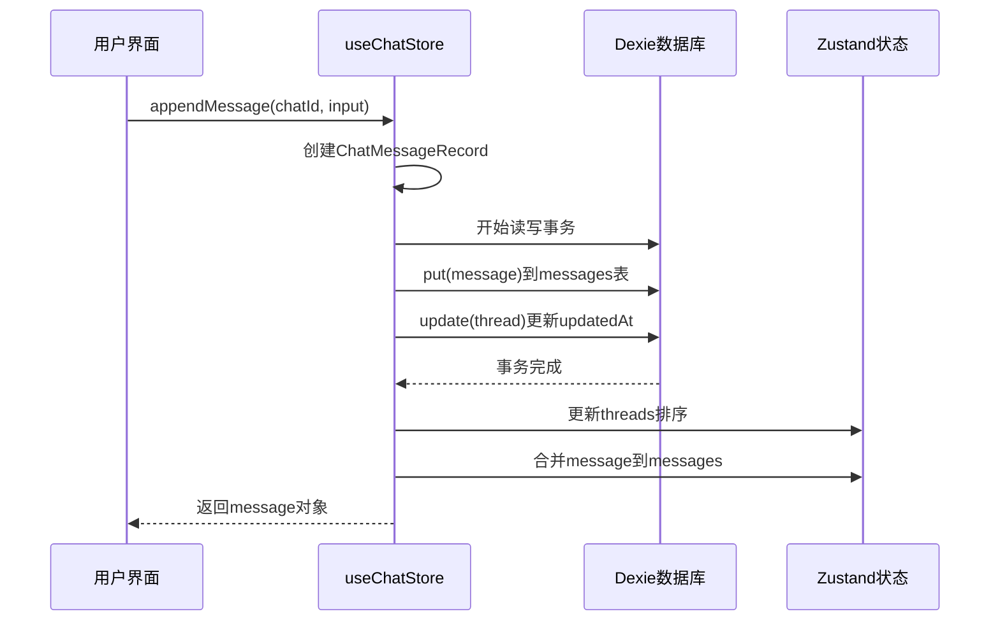
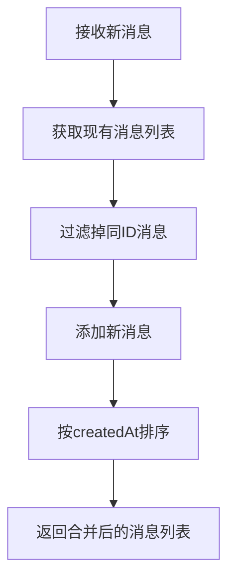
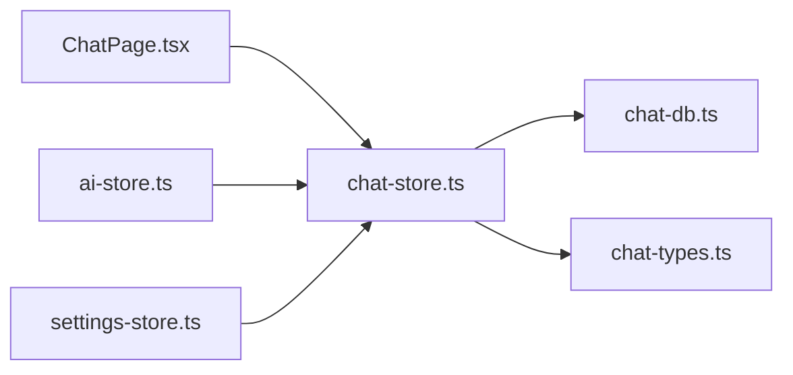

# 聊天会话管理

<cite>
**本文档中引用的文件**
- [chat-store.ts](file://src/store/chat-store.ts)
- [chat-db.ts](file://src/store/chat-db.ts)
- [chat-types.ts](file://src/ai/chat-types.ts)
- [ChatPage.tsx](file://src/components/pages/ChatPage.tsx)
- [settings-store.ts](file://src/store/settings-store.ts)
</cite>

## 目录
1. [简介](#简介)
2. [项目结构](#项目结构)
3. [核心数据结构](#核心数据结构)
4. [架构概览](#架构概览)
5. [详细组件分析](#详细组件分析)
6. [依赖关系分析](#依赖关系分析)
7. [性能考虑](#性能考虑)
8. [故障排除指南](#故障排除指南)
9. [结论](#结论)

## 简介

chat-store模块是一个基于Zustand状态管理和Dexie IndexedDB数据库的聊天会话管理系统。该模块负责管理用户的聊天会话（threads）和消息（messages），提供完整的CRUD操作功能，支持实时更新和离线存储。

系统采用现代前端架构模式，结合了状态管理的最佳实践和高效的数据持久化策略，为用户提供流畅的聊天体验。

## 项目结构

chat-store模块位于项目的`src/store/`目录下，包含以下核心文件：

**图表来源**
- [chat-store.ts](file://src/store/chat-store.ts#L1-L302)
- [chat-db.ts](file://src/store/chat-db.ts#L1-L45)

**章节来源**
- [chat-store.ts](file://src/store/chat-store.ts#L1-L302)
- [chat-db.ts](file://src/store/chat-db.ts#L1-L45)

## 核心数据结构

### ChatThreadRecord 数据结构

ChatThreadRecord是聊天会话的核心数据模型，定义了每个聊天会话的基本属性：

| 字段名 | 类型 | 描述 | 必需 |
|--------|------|------|------|
| id | string | 唯一标识符，使用UUID生成 | 是 |
| title | string | 会话标题，显示在聊天历史中 | 是 |
| sourceId | string | AI服务源标识符，关联AI提供商 | 是 |
| model | string | 使用的AI模型名称 | 是 |
| createdAt | number | 创建时间戳（毫秒） | 是 |
| updatedAt | number | 最后更新时间戳（毫秒） | 是 |
| metadata | Record\<string, unknown\> \| null | 扩展元数据，可选字段 | 否 |

### ChatMessageRecord 数据结构

ChatMessageRecord表示单条聊天消息的数据模型：

| 字段名 | 类型 | 描述 | 必需 |
|--------|------|------|------|
| id | string | 消息唯一标识符，使用UUID生成 | 是 |
| chatId | string | 关联的聊天会话ID | 是 |
| role | ChatRole | 消息角色：user、assistant或system | 是 |
| content | string | 消息内容文本 | 是 |
| createdAt | number | 消息创建时间戳（毫秒） | 是 |

### ChatRole 枚举

系统支持三种消息角色：
- `"user"`：用户发送的消息
- `"assistant"`：AI助手回复的消息  
- `"system"`：系统生成的提示消息

**章节来源**
- [chat-db.ts](file://src/store/chat-db.ts#L5-L21)
- [chat-types.ts](file://src/ai/chat-types.ts#L1-L7)

## 架构概览

chat-store模块采用分层架构设计，清晰分离关注点：

**图表来源**
- [chat-store.ts](file://src/store/chat-store.ts#L69-L302)
- [ChatPage.tsx](file://src/components/pages/ChatPage.tsx#L83-L94)

## 详细组件分析

### Zustand状态管理器

useChatStore是整个聊天系统的状态管理核心，使用Zustand实现：

**图表来源**
- [chat-store.ts](file://src/store/chat-store.ts#L25-L67)

### 数据库架构设计

Dexie数据库提供了高效的离线存储解决方案：

**图表来源**
- [chat-db.ts](file://src/store/chat-db.ts#L23-L33)

### 核心操作流程

#### 创建聊天会话流程

**图表来源**
- [chat-store.ts](file://src/store/chat-store.ts#L122-L165)

#### 追加消息流程

**图表来源**
- [chat-store.ts](file://src/store/chat-store.ts#L167-L196)

### 数据操作函数详解

#### loadThreads - 加载会话列表

loadThreads函数从数据库加载所有聊天会话并按更新时间降序排序：

- 查询条件：按`updatedAt`字段逆序排序
- 自动激活逻辑：如果没有活动会话则激活最新会话
- 状态更新：同时设置`threads`和`activeChatId`

#### loadMessages - 加载消息列表

loadMessages函数加载指定会话的所有消息：

- 查询条件：按`createdAt`字段升序排序
- 缓存机制：避免重复加载相同会话的消息
- 排序保证：确保消息按时间顺序显示

#### setActiveChat - 设置活跃会话

setActiveChat函数管理当前激活的聊天会话：

- 存在性检查：验证会话ID是否存在于threads列表中
- 自动切换：当删除活动会话时自动切换到下一个会话
- 状态同步：保持与UI组件的状态一致性

#### mergeMessage - 消息合并算法

mergeMessage函数确保消息按时间顺序排列：

**图表来源**
- [chat-store.ts](file://src/store/chat-store.ts#L55-L67)

**章节来源**
- [chat-store.ts](file://src/store/chat-store.ts#L75-L302)
- [chat-db.ts](file://src/store/chat-db.ts#L23-L45)

## 依赖关系分析

### 外部依赖

系统依赖以下关键包：

| 包名 | 版本 | 用途 | 重要性 |
|------|------|------|--------|
| zustand | ^4.4.1 | 状态管理库 | 核心 |
| dexie | ^4.2.1 | IndexedDB封装库 | 核心 |
| react | ^18.2.0 | UI框架 | 基础 |

### 内部依赖

**图表来源**
- [chat-store.ts](file://src/store/chat-store.ts#L1-L10)
- [ChatPage.tsx](file://src/components/pages/ChatPage.tsx#L30-L32)

### 数据库索引优化

Dexie数据库配置了以下索引以优化查询性能：

- **threads表**：主键索引（id）、复合索引（updatedAt）
- **messages表**：主键索引（id）、复合索引（chatId+createdAt）

这些索引设计支持：
- 快速会话查找（通过ID）
- 高效的会话列表排序
- 快速的消息查询和排序

**章节来源**
- [chat-db.ts](file://src/store/chat-db.ts#L30-L33)
- [chat-store.ts](file://src/store/chat-store.ts#L1-L10)

## 性能考虑

### 数据库事务处理

系统使用Dexie的事务机制确保数据一致性：

- **批量操作**：使用`bulkAdd`进行大量消息的高效插入
- **原子性**：事务保证要么全部成功，要么全部失败
- **并发控制**：避免数据竞争和不一致状态

### 状态更新优化

- **选择性更新**：只更新发生变化的数据
- **批量状态更新**：减少不必要的重新渲染
- **记忆化**：使用`useMemo`优化派生状态计算

### 内存管理

- **懒加载**：只在需要时加载消息数据
- **及时清理**：删除会话时同步清理相关消息
- **缓存策略**：合理缓存常用数据避免重复查询

## 故障排除指南

### 常见问题及解决方案

#### 数据同步问题

**症状**：UI显示与数据库状态不一致
**原因**：状态更新时机问题
**解决方案**：确保在事务完成后才更新状态

#### 性能问题

**症状**：大量消息加载缓慢
**原因**：未使用适当的索引或查询条件
**解决方案**：使用复合索引优化查询，实施分页加载

#### 数据丢失

**症状**：会话或消息意外消失
**原因**：事务处理不当或异常中断
**解决方案**：加强错误处理，实施数据备份机制

### 调试技巧

1. **启用Dexie调试**：设置环境变量查看SQL语句
2. **状态监控**：使用React DevTools检查状态变化
3. **数据库检查**：直接查询IndexedDB验证数据完整性

**章节来源**
- [chat-store.ts](file://src/store/chat-store.ts#L144-L149)
- [chat-store.ts](file://src/store/chat-store.ts#L270-L273)

## 结论

chat-store模块展现了现代前端应用的最佳实践，通过Zustand和Dexie的完美结合，实现了高性能、可靠且易于维护的聊天会话管理系统。

### 主要优势

1. **架构清晰**：分层设计使代码易于理解和维护
2. **性能优异**：合理的索引设计和事务处理确保高效运行
3. **用户体验**：实时更新和离线支持提供流畅体验
4. **扩展性强**：模块化设计便于功能扩展

### 技术亮点

- **状态管理**：Zustand的轻量级和高性能
- **数据持久化**：Dexie简化了IndexedDB的复杂性
- **类型安全**：完整的TypeScript类型定义
- **响应式设计**：自动化的状态同步机制

该模块为构建高质量的聊天应用奠定了坚实的基础，其设计理念和实现方式值得在类似项目中借鉴和应用。