# 问题与解决方案管理

<cite>
**本文档引用的文件**
- [problems-store.ts](file://src/store/problems-store.ts)
- [ScanPage.tsx](file://src/components/pages/ScanPage.tsx)
- [SolutionsArea.tsx](file://src/components/areas/SolutionsArea.tsx)
- [PreviewCard.tsx](file://src/components/cards/PreviewCard.tsx)
- [request.ts](file://src/ai/request.ts)
- [response.ts](file://src/ai/response.ts)
- [openai.ts](file://src/ai/openai.ts)
- [gemini.ts](file://src/ai/gemini.ts)
- [image-post-processing.ts](file://src/utils/image-post-processing.ts)
- [ImproveSolutionDialog.tsx](file://src/components/dialogs/ImproveSolutionDialog.tsx)
- [ActionsArea.tsx](file://src/components/areas/ActionsArea.tsx)
</cite>

## 目录
1. [简介](#简介)
2. [项目结构概览](#项目结构概览)
3. [核心数据类型](#核心数据类型)
4. [状态架构](#状态架构)
5. [详细组件分析](#详细组件分析)
6. [状态管理机制](#状态管理机制)
7. [AI处理流程](#ai处理流程)
8. [性能优化策略](#性能优化策略)
9. [故障排除指南](#故障排除指南)
10. [总结](#总结)

## 简介

problems-store模块是skid-homework项目的核心状态管理模块，专门负责管理用户上传的作业图片（FileItem）及其AI解析结果（Solution）。该模块采用Zustand状态管理库构建，提供了高效的状态更新机制和复杂的业务逻辑处理能力。

该模块的主要职责包括：
- 管理上传文件列表的状态
- 处理AI解析过程中的流式输出
- 维护问题-答案对的数据结构
- 提供全局状态清理功能
- 支持多种AI服务提供商的集成

## 项目结构概览

problems-store模块位于`src/store/`目录下，与其他状态管理模块协同工作，形成完整的应用状态管理体系。

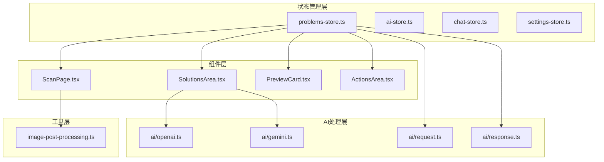
```mermaid
graph TB
subgraph "状态管理层"
PS[problems-store.ts]
AS[ai-store.ts]
CS[chat-store.ts]
SS[settings-store.ts]
end
subgraph "组件层"
SP[ScanPage.tsx]
SA[SolutionsArea.tsx]
PC[PreviewCard.tsx]
AA[ActionsArea.tsx]
end
subgraph "AI处理层"
AR[ai/request.ts]
AY[ai/response.ts]
AO[ai/openai.ts]
AG[ai/gemini.ts]
end
subgraph "工具层"
IP[image-post-processing.ts]
end
PS --> SP
PS --> SA
PS --> PC
PS --> AA
PS --> AR
PS --> AY
SP --> IP
SA --> AO
SA --> AG
```

**图表来源**
- [problems-store.ts](file://src/store/problems-store.ts#L1-L281)
- [ScanPage.tsx](file://src/components/pages/ScanPage.tsx#L1-L185)
- [SolutionsArea.tsx](file://src/components/areas/SolutionsArea.tsx#L1-L200)

## 核心数据类型

### FileItem类型详解

FileItem是系统中最重要的数据结构之一，代表单个上传的图片文件。

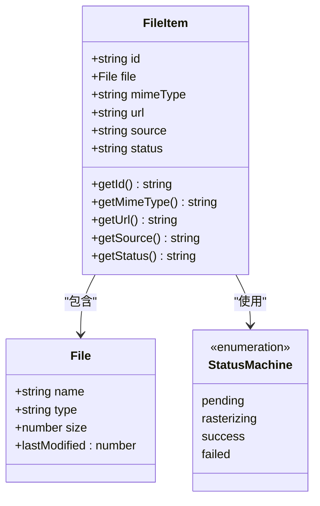
```mermaid
classDiagram
class FileItem {
+string id
+File file
+string mimeType
+string url
+string source
+string status
+getId() string
+getMimeType() string
+getUrl() string
+getSource() string
+getStatus() string
}
class File {
+string name
+string type
+number size
+lastModified : number
}
class StatusMachine {
<<enumeration>>
pending
rasterizing
success
failed
}
FileItem --> File : "包含"
FileItem --> StatusMachine : "使用"
```

**图表来源**
- [problems-store.ts](file://src/store/problems-store.ts#L6-L12)

#### 字段详细说明

| 字段名 | 类型 | 描述 | 用途 |
|--------|------|------|------|
| `id` | `string` | 唯一标识符 | 用于快速定位和更新特定文件项 |
| `file` | `File` | 实际的图片文件对象 | 包含文件内容、元数据等信息 |
| `mimeType` | `string` | 文件的MIME类型 | 如'image/jpeg', 'image/png'等 |
| `url` | `string` | 客户端预览用的对象URL | 通过`URL.createObjectURL()`生成 |
| `source` | `"upload" \| "camera"` | 图片来源 | 区分用户上传或相机拍摄 |
| `status` | `"success" \| "pending" \| "failed" \| "rasterizing"` | 当前状态 | 控制UI显示和处理流程 |

#### 状态机流转

FileItem的状态机设计体现了系统的渐进式处理理念：

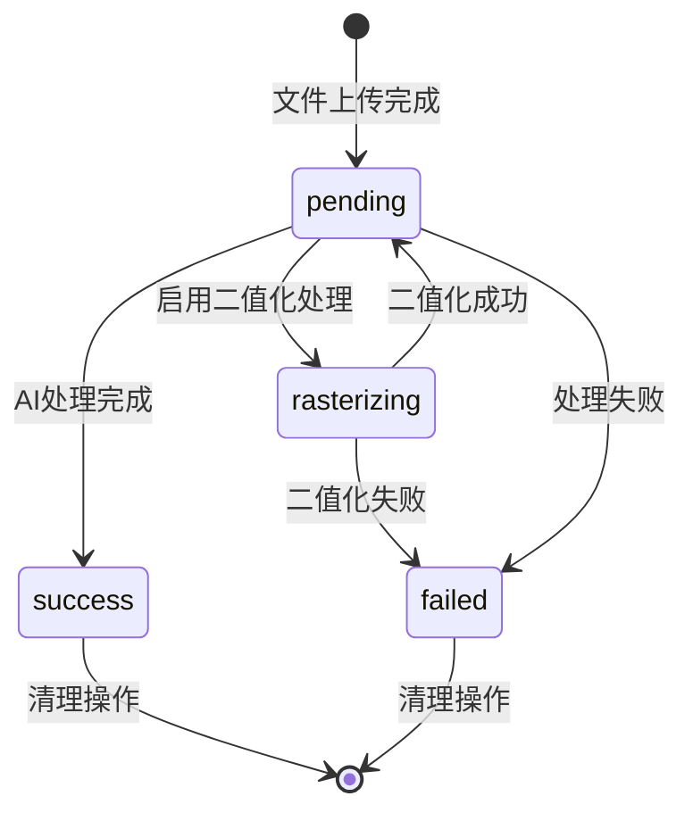
```mermaid
stateDiagram-v2
[*] --> pending : 文件上传完成
pending --> rasterizing : 启用二值化处理
rasterizing --> pending : 二值化成功
rasterizing --> failed : 二值化失败
pending --> success : AI处理完成
pending --> failed : 处理失败
success --> [*] : 清理操作
failed --> [*] : 清理操作
```

**图表来源**
- [ScanPage.tsx](file://src/components/pages/ScanPage.tsx#L139-L142)
- [image-post-processing.ts](file://src/utils/image-post-processing.ts#L1-L112)

**节来源**
- [problems-store.ts](file://src/store/problems-store.ts#L6-L12)
- [ScanPage.tsx](file://src/components/pages/ScanPage.tsx#L133-L143)

### Solution类型详解

Solution类型封装了AI解析后的完整结果，是系统的核心输出结构。

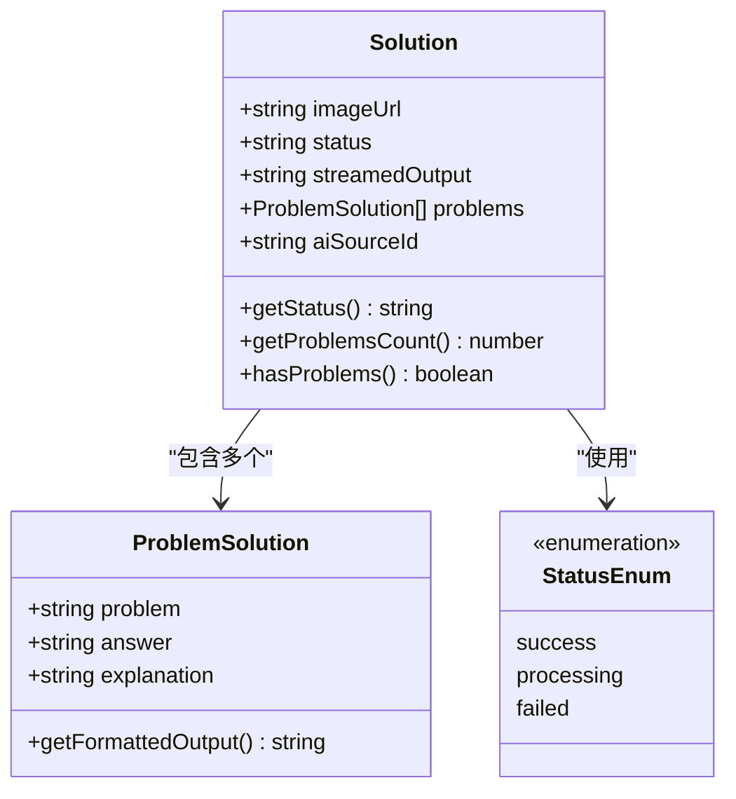
```mermaid
classDiagram
class Solution {
+string imageUrl
+string status
+string streamedOutput
+ProblemSolution[] problems
+string aiSourceId
+getStatus() string
+getProblemsCount() number
+hasProblems() boolean
}
class ProblemSolution {
+string problem
+string answer
+string explanation
+getFormattedOutput() string
}
class StatusEnum {
<<enumeration>>
success
processing
failed
}
Solution --> ProblemSolution : "包含多个"
Solution --> StatusEnum : "使用"
```

**图表来源**
- [problems-store.ts](file://src/store/problems-store.ts#L16-L22)

#### 关键字段说明

| 字段名 | 类型 | 描述 | 重要性 |
|--------|------|------|--------|
| `imageUrl` | `string` | 源图片的URL，作为解决方案的唯一键 | O(1)查找的关键 |
| `status` | `"success" \| "processing" \| "failed"` | AI处理状态 | 决定UI显示和后续流程 |
| `streamedOutput` | `string \| null` | AI流式输出的中间结果 | 实时显示处理进度 |
| `problems` | `ProblemSolution[]` | 解析出的问题-答案对数组 | 主要业务数据 |
| `aiSourceId` | `string` | 产生解决方案的AI服务标识 | 调试和统计需要 |

**节来源**
- [problems-store.ts](file://src/store/problems-store.ts#L16-L22)

### ProblemSolution类型

每个ProblemSolution代表一个独立的问题-答案对，包含完整的解析结果。

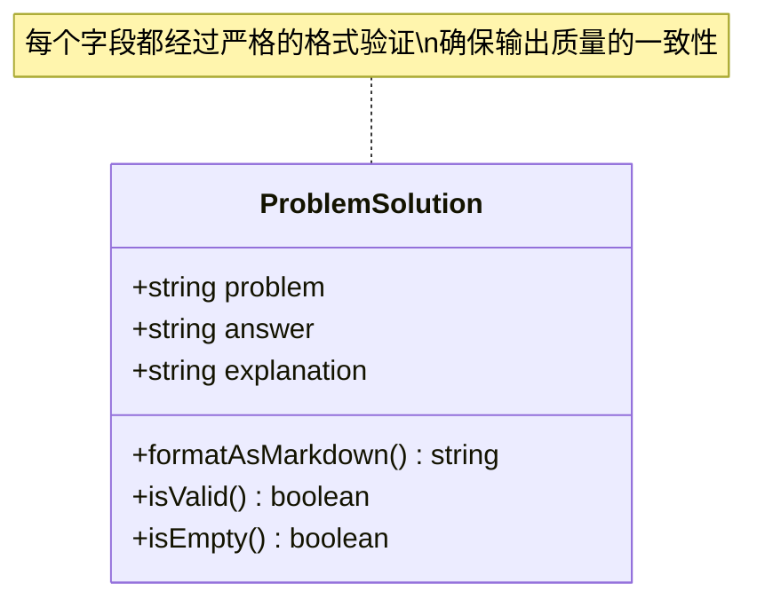
```mermaid
classDiagram
class ProblemSolution {
+string problem
+string answer
+string explanation
+formatAsMarkdown() string
+isValid() boolean
+isEmpty() boolean
}
note for ProblemSolution "每个字段都经过严格的格式验证\n确保输出质量的一致性"
```

**图表来源**
- [problems-store.ts](file://src/store/problems-store.ts#L25-L29)

**节来源**
- [problems-store.ts](file://src/store/problems-store.ts#L25-L29)

## 状态架构

### Store接口设计

problems-store采用函数式编程范式，通过Zustand创建状态管理器：

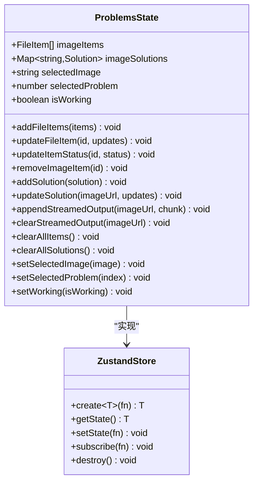
```mermaid
classDiagram
class ProblemsState {
+FileItem[] imageItems
+Map~string,Solution~ imageSolutions
+string selectedImage
+number selectedProblem
+boolean isWorking
+addFileItems(items) void
+updateFileItem(id, updates) void
+updateItemStatus(id, status) void
+removeImageItem(id) void
+addSolution(solution) void
+updateSolution(imageUrl, updates) void
+appendStreamedOutput(imageUrl, chunk) void
+clearStreamedOutput(imageUrl) void
+clearAllItems() void
+clearAllSolutions() void
+setSelectedImage(image) void
+setSelectedProblem(index) void
+setWorking(isWorking) void
}
class ZustandStore {
+create~T~(fn) T
+getState() T
+setState(fn) void
+subscribe(fn) void
+destroy() void
}
ProblemsState --> ZustandStore : "实现"
```

**图表来源**
- [problems-store.ts](file://src/store/problems-store.ts#L32-L71)

### 数据结构选择

#### imageSolutions使用Map的优势

系统选择使用`Map<string, Solution>`而非数组来存储解决方案，这是经过深思熟虑的设计决策：

```mermaid
graph LR
subgraph "Map优势"
A[O(1)查找性能]
B[保持插入顺序]
C[键值对结构清晰]
D[内存使用优化]
end
subgraph "数组劣势"
E[O(n)查找复杂度]
F[需要额外索引]
G[维护成本高]
end
A --> H[渲染性能提升]
B --> H
C --> H
D --> H
```

**图表来源**
- [problems-store.ts](file://src/store/problems-store.ts#L35-L37)

#### 性能对比分析

| 操作类型 | 数组实现 | Map实现 | 性能优势 |
|----------|----------|---------|----------|
| 查找解决方案 | O(n) | O(1) | 显著提升 |
| 更新解决方案 | O(n) | O(1) | 显著提升 |
| 删除解决方案 | O(n) | O(1) | 显著提升 |
| 遍历所有解决方案 | O(n) | O(n) | 相同 |
| 内存占用 | 中等 | 较低 | Map更优 |

**节来源**
- [problems-store.ts](file://src/store/problems-store.ts#L35-L37)

## 详细组件分析

### 文件操作管理

#### addFileItems - 批量添加文件

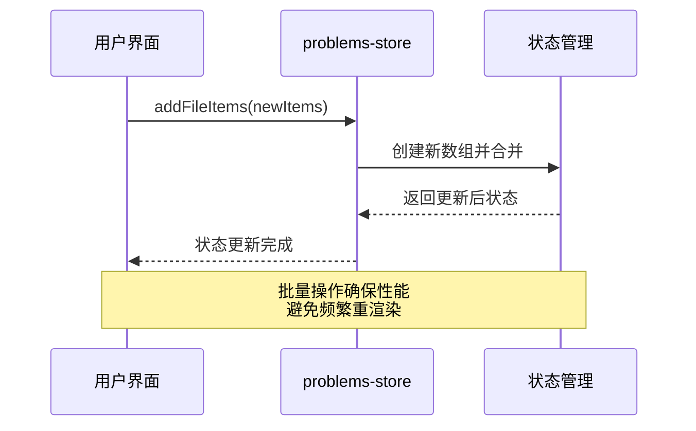
```mermaid
sequenceDiagram
participant UI as 用户界面
participant Store as problems-store
participant State as 状态管理
UI->>Store : addFileItems(newItems)
Store->>State : 创建新数组并合并
State-->>Store : 返回更新后状态
Store-->>UI : 状态更新完成
Note over UI,State : 批量操作确保性能<br/>避免频繁重渲染
```

**图表来源**
- [problems-store.ts](file://src/store/problems-store.ts#L86-L87)

#### updateFileItem - 灵活更新机制

updateFileItem方法提供了比updateItemStatus更灵活的更新方式：

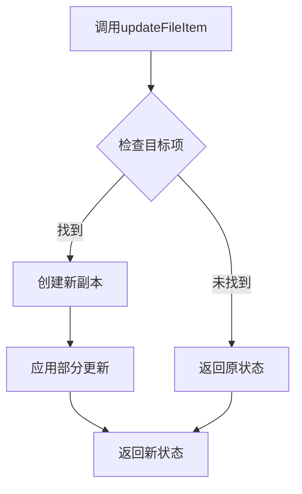
```mermaid
flowchart TD
A[调用updateFileItem] --> B{检查目标项}
B --> |找到| C[创建新副本]
B --> |未找到| D[返回原状态]
C --> E[应用部分更新]
E --> F[返回新状态]
D --> F
```

**图表来源**
- [problems-store.ts](file://src/store/problems-store.ts#L104-L108)

#### removeImageItem - 单项删除

单项删除操作展示了函数式更新的最佳实践：

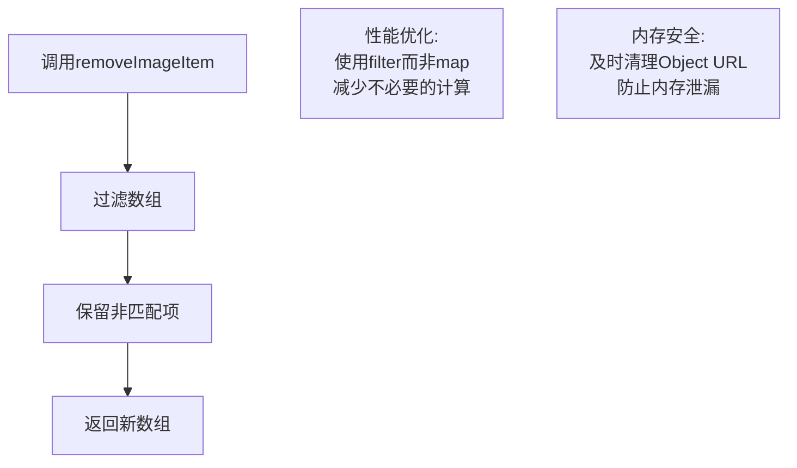
```mermaid
flowchart TD
A[调用removeImageItem] --> B[过滤数组]
B --> C[保留非匹配项]
C --> D[返回新数组]
Note1[性能优化:<br/>使用filter而非map<br/>减少不必要的计算]
Note2[内存安全:<br/>及时清理Object URL<br/>防止内存泄漏]
```

**图表来源**
- [problems-store.ts](file://src/store/problems-store.ts#L114-L117)

**节来源**
- [problems-store.ts](file://src/store/problems-store.ts#L86-L117)

### 解决方案管理

#### addSolution - 初始占位符创建

addSolution方法确保不会意外覆盖现有解决方案：

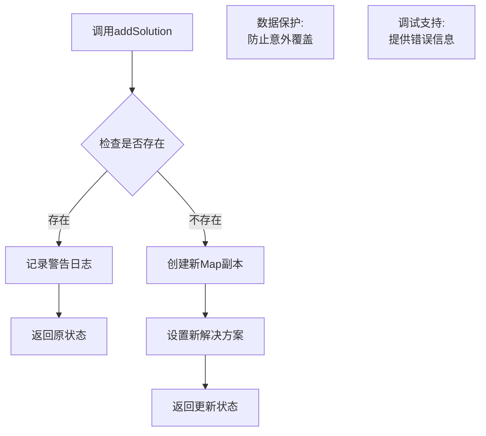
```mermaid
flowchart TD
A[调用addSolution] --> B{检查是否存在}
B --> |存在| C[记录警告日志]
B --> |不存在| D[创建新Map副本]
C --> E[返回原状态]
D --> F[设置新解决方案]
F --> G[返回更新状态]
Note1[数据保护:<br/>防止意外覆盖]
Note2[调试支持:<br/>提供错误信息]
```

**图表来源**
- [problems-store.ts](file://src/store/problems-store.ts#L156-L167)

#### updateSolution - 主要更新机制

updateSolution是系统中最复杂的更新操作，具有智能的流式输出管理：

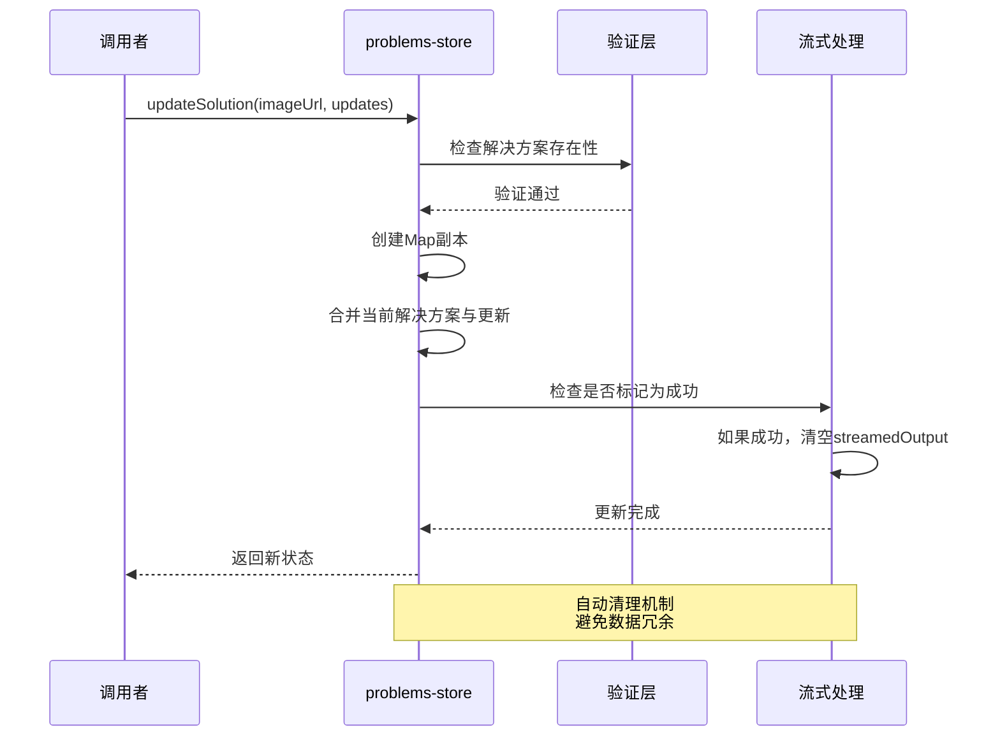
```mermaid
sequenceDiagram
participant Caller as 调用者
participant Store as problems-store
participant Validation as 验证层
participant Stream as 流式处理
Caller->>Store : updateSolution(imageUrl, updates)
Store->>Validation : 检查解决方案存在性
Validation-->>Store : 验证通过
Store->>Store : 创建Map副本
Store->>Store : 合并当前解决方案与更新
Store->>Stream : 检查是否标记为成功
Stream->>Stream : 如果成功，清空streamedOutput
Stream-->>Store : 更新完成
Store-->>Caller : 返回新状态
Note over Store,Stream : 自动清理机制<br/>避免数据冗余
```

**图表来源**
- [problems-store.ts](file://src/store/problems-store.ts#L178-L202)

#### updateSolution的自动清理逻辑

当解决方案状态变为'success'时，系统会自动清空streamedOutput：

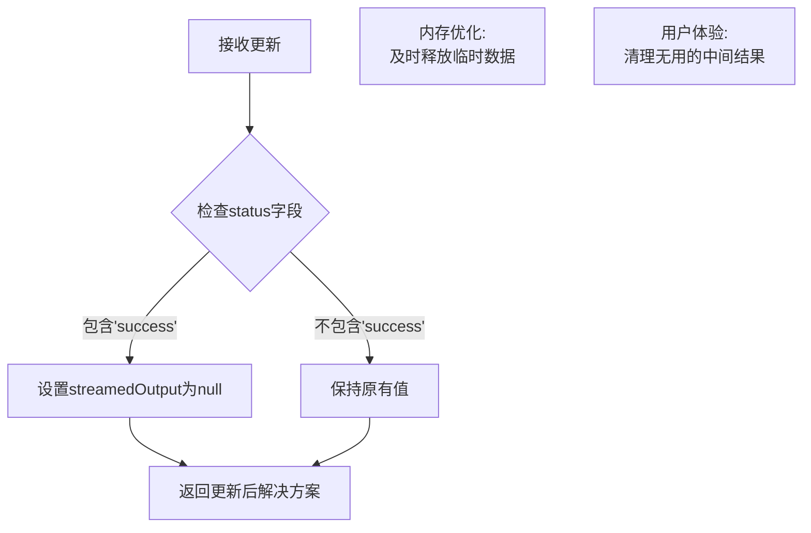
```mermaid
flowchart TD
A[接收更新] --> B{检查status字段}
B --> |包含'success'| C[设置streamedOutput为null]
B --> |不包含'success'| D[保持原有值]
C --> E[返回更新后解决方案]
D --> E
Note1[内存优化:<br/>及时释放临时数据]
Note2[用户体验:<br/>清理无用的中间结果]
```

**图表来源**
- [problems-store.ts](file://src/store/problems-store.ts#L195-L198)

**节来源**
- [problems-store.ts](file://src/store/problems-store.ts#L156-L202)

### 流式输出管理

#### appendStreamedOutput - 高效拼接

流式输出管理展示了系统对实时性的重视：

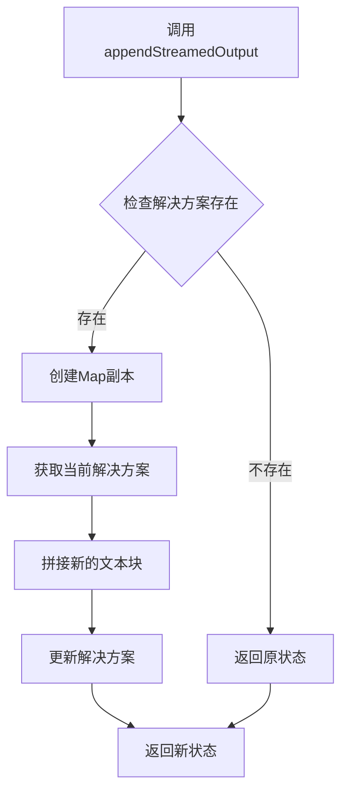
```mermaid
flowchart TD
A[调用appendStreamedOutput] --> B{检查解决方案存在}
B --> |存在| C[创建Map副本]
B --> |不存在| D[返回原状态]
C --> E[获取当前解决方案]
E --> F[拼接新的文本块]
F --> G[更新解决方案]
G --> H[返回新状态]
D --> H
```

**图表来源**
- [problems-store.ts](file://src/store/problems-store.ts#L210-L221)

#### clearStreamedOutput - 手动清理

手动清理功能为用户提供了控制权：

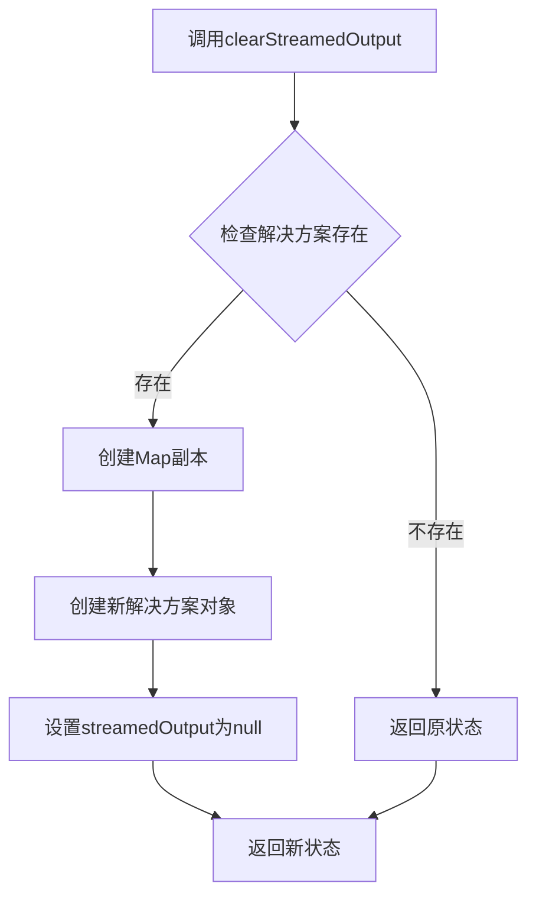
```mermaid
flowchart TD
A[调用clearStreamedOutput] --> B{检查解决方案存在}
B --> |存在| C[创建Map副本]
B --> |不存在| D[返回原状态]
C --> E[创建新解决方案对象]
E --> F[设置streamedOutput为null]
F --> G[返回新状态]
D --> G
```

**图表来源**
- [problems-store.ts](file://src/store/problems-store.ts#L230-L245)

**节来源**
- [problems-store.ts](file://src/store/problems-store.ts#L210-L245)

### 全局状态清理

#### clearAllItems - 清理文件列表

全局清理操作展示了系统的完整性：

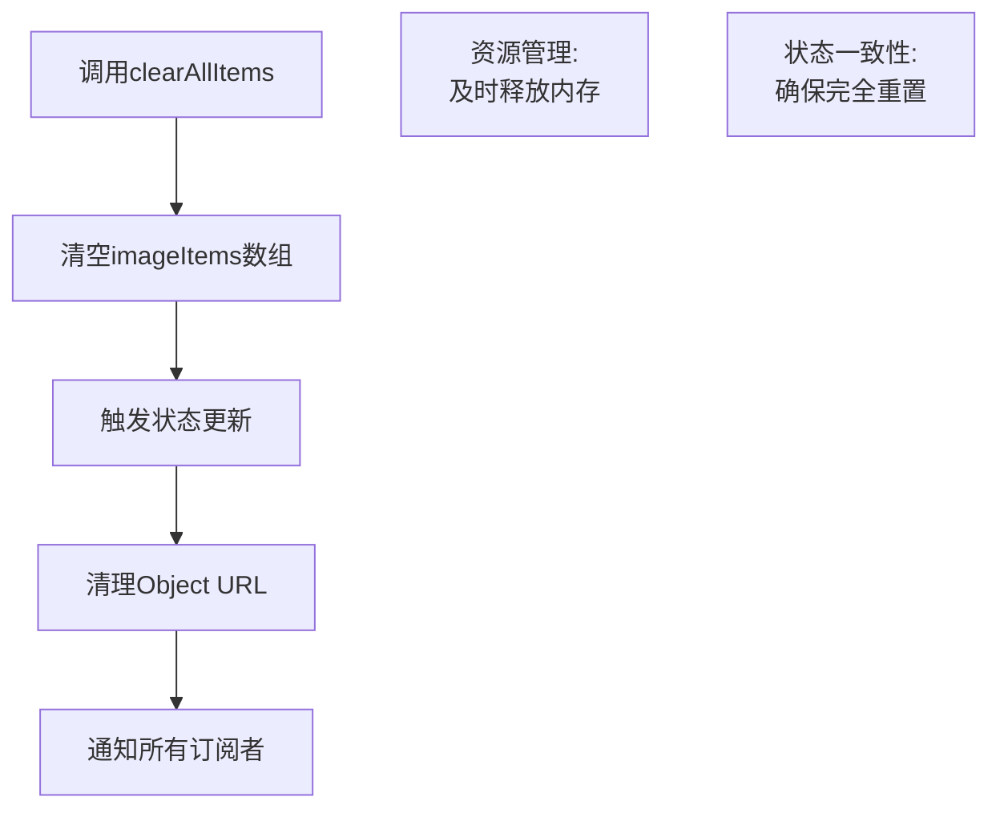
```mermaid
flowchart TD
A[调用clearAllItems] --> B[清空imageItems数组]
B --> C[触发状态更新]
C --> D[清理Object URL]
D --> E[通知所有订阅者]
Note1[资源管理:<br/>及时释放内存]
Note2[状态一致性:<br/>确保完全重置]
```

**图表来源**
- [problems-store.ts](file://src/store/problems-store.ts#L148-L148)

#### clearAllSolutions - 清理解决方案

解决方案的清理采用了Map的特殊处理：

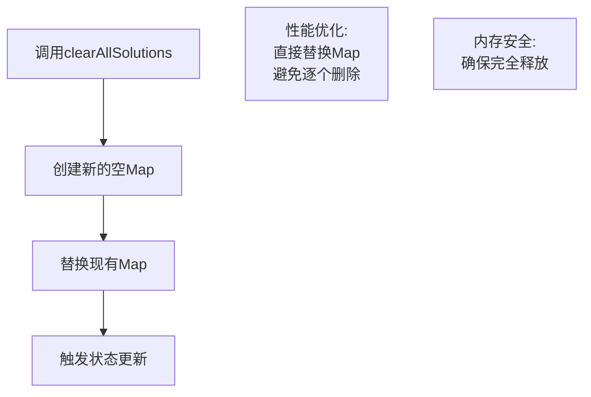
```mermaid
flowchart TD
A[调用clearAllSolutions] --> B[创建新的空Map]
B --> C[替换现有Map]
C --> D[触发状态更新]
Note1[性能优化:<br/>直接替换Map<br/>避免逐个删除]
Note2[内存安全:<br/>确保完全释放]
```

**图表来源**
- [problems-store.ts](file://src/store/problems-store.ts#L264-L264)

**节来源**
- [problems-store.ts](file://src/store/problems-store.ts#L148-L264)

## 状态管理机制

### 函数式更新模式

problems-store采用了纯函数式的更新模式，这是Zustand的核心设计理念：

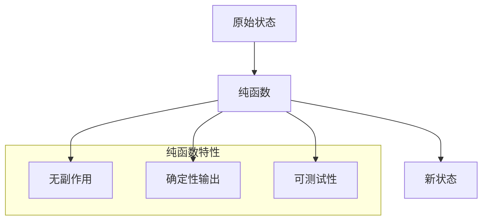
```mermaid
graph TD
A[原始状态] --> B[纯函数]
B --> C[新状态]
subgraph "纯函数特性"
D[无副作用]
E[确定性输出]
F[可测试性]
end
B --> D
B --> E
B --> F
```

### 不可变性原则

系统严格遵循不可变性原则，每次状态更新都返回全新的状态对象：

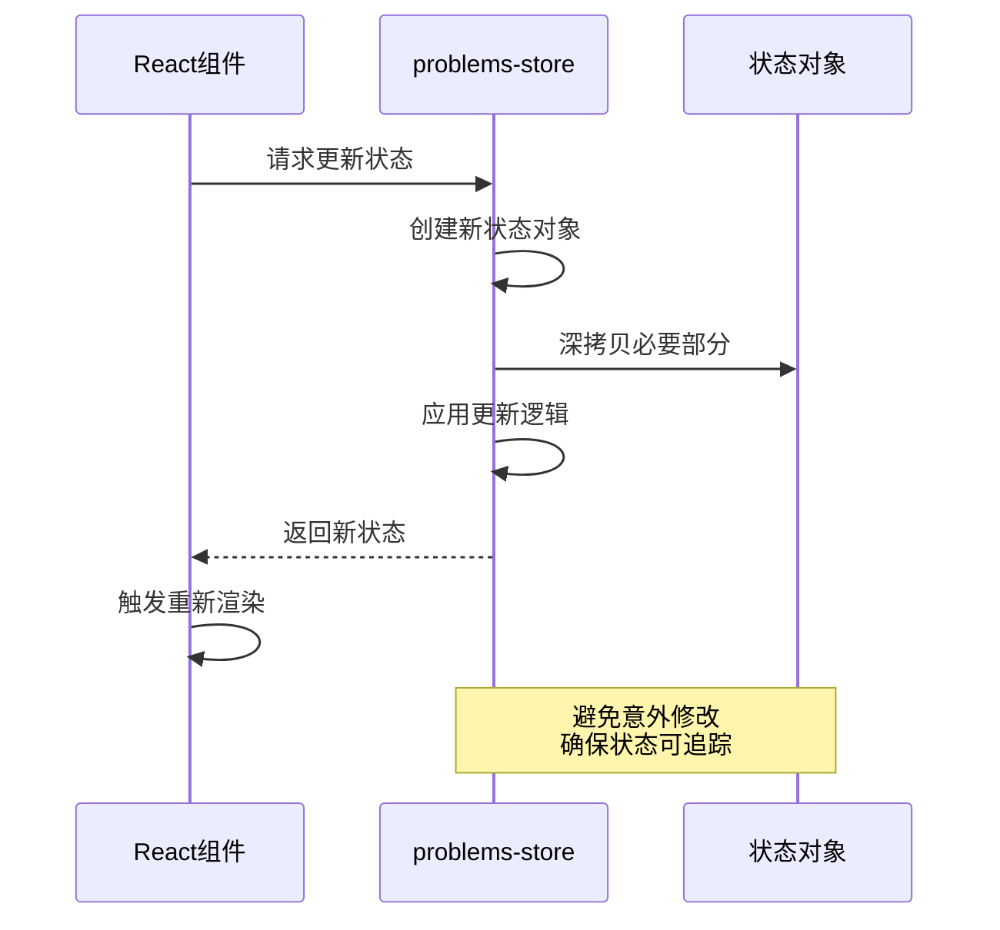
```mermaid
sequenceDiagram
participant Component as React组件
participant Store as problems-store
participant State as 状态对象
Component->>Store : 请求更新状态
Store->>Store : 创建新状态对象
Store->>State : 深拷贝必要部分
Store->>Store : 应用更新逻辑
Store-->>Component : 返回新状态
Component->>Component : 触发重新渲染
Note over Store,State : 避免意外修改<br/>确保状态可追踪
```

### 订阅机制

Zustand的订阅机制确保了组件能够及时响应状态变化：

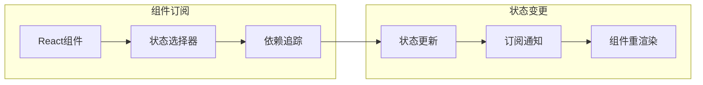
```mermaid
graph LR
subgraph "组件订阅"
A[React组件]
B[状态选择器]
C[依赖追踪]
end
subgraph "状态变更"
D[状态更新]
E[订阅通知]
F[组件重渲染]
end
A --> B
B --> C
C --> D
D --> E
E --> F
```

**节来源**
- [problems-store.ts](file://src/store/problems-store.ts#L73-L280)

## AI处理流程

### 流式处理架构

problems-store与AI服务的集成体现了现代Web应用的流式处理理念：

```mermaid
sequenceDiagram
participant UI as 用户界面
participant Store as problems-store
participant AI as AI服务
participant Parser as 响应解析器
UI->>Store : 开始AI处理
Store->>Store : 设置初始状态
Store->>AI : 发送请求并设置回调
AI->>Store : 流式返回数据块
Store->>Store : appendStreamedOutput
Store->>UI : 更新显示
AI->>Store : 最终响应
Store->>Parser : 解析最终结果
Parser-->>Store : 返回结构化数据
Store->>Store : updateSolution(status : 'success')
Store->>Store : 清理streamedOutput
Store-->>UI : 显示最终结果
```

**图表来源**
- [ScanPage.tsx](file://src/components/pages/ScanPage.tsx#L325-L358)
- [ImproveSolutionDialog.tsx](file://src/components/dialogs/ImproveSolutionDialog.tsx#L105-L118)

### 多AI提供商支持

系统设计支持多个AI服务提供商，展现了良好的扩展性：

```mermaid
graph TB
subgraph "AI提供商"
A[OpenAI]
B[Gemini]
C[其他提供商]
end
subgraph "统一接口"
D[AI客户端抽象]
E[流式处理接口]
F[错误处理机制]
end
subgraph "problems-store"
G[状态管理]
H[流式输出处理]
I[解决方案存储]
end
A --> D
B --> D
C --> D
D --> E
E --> F
F --> G
G --> H
H --> I
```

**图表来源**
- [openai.ts](file://src/ai/openai.ts#L118-L266)
- [gemini.ts](file://src/ai/gemini.ts#L90-L204)

### 错误处理与重试机制

AI处理过程中的错误处理体现了系统的健壮性：

```mermaid
flowchart TD
A[开始AI处理] --> B[尝试第一个提供商]
B --> C{处理成功?}
C --> |是| D[更新解决方案]
C --> |否| E[记录错误]
E --> F{还有其他提供商?}
F --> |是| G[尝试下一个提供商]
F --> |否| H[抛出最终错误]
G --> C
D --> I[清理流式输出]
H --> J[显示错误信息]
```

**图表来源**
- [ScanPage.tsx](file://src/components/pages/ScanPage.tsx#L349-L358)

**节来源**
- [ScanPage.tsx](file://src/components/pages/ScanPage.tsx#L325-L358)
- [ImproveSolutionDialog.tsx](file://src/components/dialogs/ImproveSolutionDialog.tsx#L105-L118)

## 性能优化策略

### O(1)查找性能

Map数据结构的选择是性能优化的核心：

```mermaid
graph LR
subgraph "查找性能对比"
A[数组查找: O(n)]
B[Map查找: O(1)]
end
subgraph "应用场景"
C[解决方案查找]
D[状态查询]
E[条件过滤]
end
B --> C
B --> D
B --> E
Note1[渲染性能:<br/>避免重复计算]
Note2[交互响应:<br/>即时状态更新]
```

### 内存管理优化

系统实现了多层次的内存管理策略：

```mermaid
flowchart TD
A[文件上传] --> B[创建Object URL]
B --> C[存储到状态]
C --> D[组件渲染]
D --> E[组件卸载]
E --> F[清理Object URL]
F --> G[从状态移除]
Note1[及时清理:<br/>防止内存泄漏]
Note2[批量处理:<br/>减少GC压力]
```

**图表来源**
- [ScanPage.tsx](file://src/components/pages/ScanPage.tsx#L174-L177)
- [ActionsArea.tsx](file://src/components/areas/ActionsArea.tsx#L39-L45)

### 渲染优化

组件级别的渲染优化通过精确的状态选择实现：

```mermaid
graph TD
subgraph "状态分割"
A[imageItems]
B[imageSolutions]
C[selectedImage]
D[selectedProblem]
E[isWorking]
end
subgraph "组件订阅"
F[PreviewCard]
G[SolutionsArea]
H[ActionsArea]
end
A --> F
B --> G
C --> G
D --> G
E --> H
Note1[最小化重渲染:<br/>只订阅必要状态]
Note2[提高响应速度:<br/>精确的状态更新]
```

**节来源**
- [problems-store.ts](file://src/store/problems-store.ts#L35-L40)
- [SolutionsArea.tsx](file://src/components/areas/SolutionsArea.tsx#L64-L64)

## 故障排除指南

### 常见问题诊断

#### 解决方案无法找到

当出现"Attempted to update a non-existent solution"错误时：

```mermaid
flowchart TD
A[错误发生] --> B{检查解决方案是否存在}
B --> |不存在| C[确认addSolution已调用]
B --> |存在| D[检查imageUrl是否正确]
C --> E[添加解决方案占位符]
D --> F[修正URL匹配逻辑]
E --> G[重新尝试更新]
F --> G
```

#### 流式输出异常

流式输出相关问题的排查步骤：

```mermaid
flowchart TD
A[流式输出异常] --> B{检查解决方案状态}
B --> |非processing| C[确认AI处理开始]
B --> |processing| D{检查网络连接}
D --> |正常| E[检查AI服务状态]
D --> |异常| F[网络重试机制]
E --> G[联系技术支持]
C --> H[等待处理完成]
F --> I[重新发起请求]
```

### 性能问题排查

#### 状态更新缓慢

当状态更新变得缓慢时，可能的原因和解决方案：

| 问题症状 | 可能原因 | 解决方案 |
|----------|----------|----------|
| 状态更新延迟 | 过多的订阅者 | 优化状态分割 |
| 组件重渲染频繁 | 状态粒度过细 | 合并相关状态 |
| 内存使用过高 | 对象URL未清理 | 添加清理逻辑 |
| 渲染性能差 | 复杂的计算逻辑 | 使用memo化 |

#### 内存泄漏检测

```mermaid
flowchart TD
A[发现内存使用持续增长] --> B[检查Object URL清理]
B --> C{是否及时清理?}
C --> |否| D[添加清理逻辑]
C --> |是| E[检查循环引用]
E --> F{是否有循环引用?}
F --> |是| G[重构数据结构]
F --> |否| H[检查第三方库]
D --> I[监控内存使用]
G --> I
H --> J[更新依赖版本]
```

**节来源**
- [problems-store.ts](file://src/store/problems-store.ts#L183-L188)
- [ScanPage.tsx](file://src/components/pages/ScanPage.tsx#L174-L177)

## 总结

problems-store模块展现了现代前端应用状态管理的最佳实践。通过精心设计的数据结构、高效的算法实现和完善的错误处理机制，该模块成功地解决了复杂的业务需求。

### 核心优势

1. **高性能设计**：使用Map数据结构实现O(1)查找性能
2. **函数式编程**：遵循纯函数更新模式，确保状态可预测性
3. **流式处理**：支持AI服务的实时响应和用户体验
4. **健壮性**：完善的错误处理和重试机制
5. **可扩展性**：支持多AI提供商和未来功能扩展

### 设计亮点

- **状态隔离**：清晰的职责分离，便于维护和测试
- **内存安全**：完善的资源清理机制
- **用户体验**：流畅的交互反馈和状态同步
- **开发体验**：类型安全和直观的API设计

该模块不仅满足了当前的功能需求，更为未来的功能扩展奠定了坚实的基础，是skid-homework项目中不可或缺的核心组件。