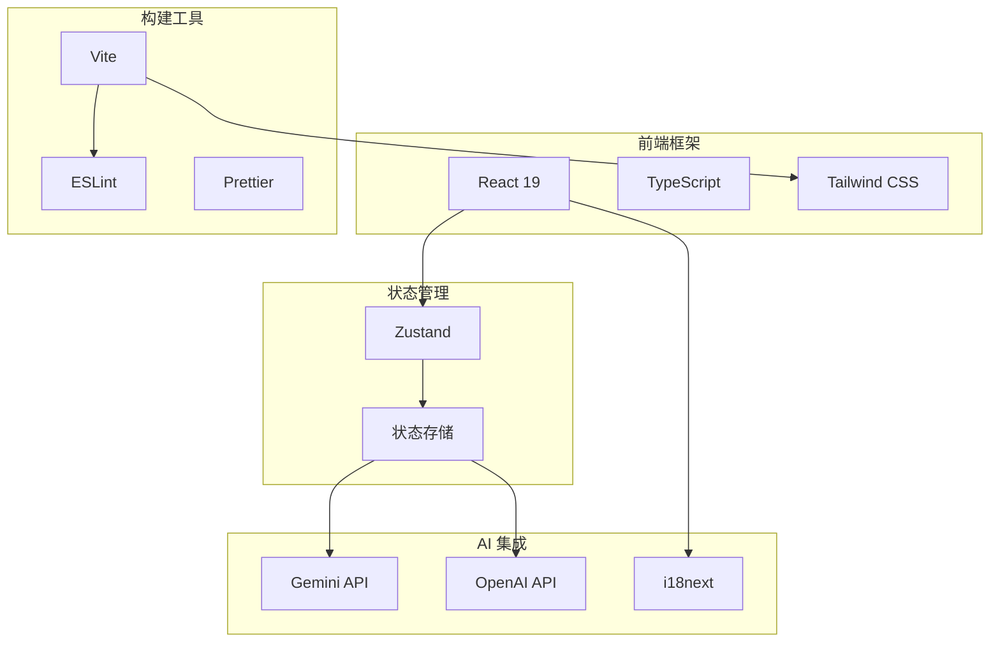
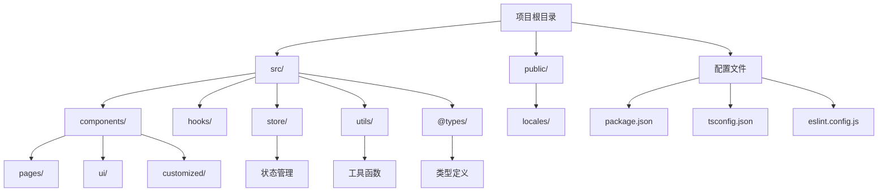
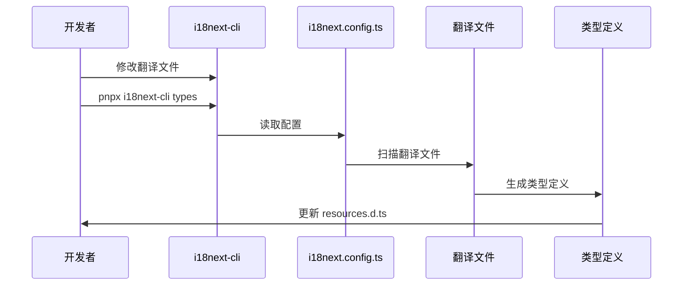

# 贡献指南

<cite>
**本文档中引用的文件**
- [package.json](file://package.json)
- [eslint.config.js](file://eslint.config.js)
- [tsconfig.json](file://tsconfig.json)
- [vite.config.ts](file://vite.config.ts)
- [i18next.config.ts](file://i18next.config.ts)
- [pnpm-workspace.yaml](file://pnpm-workspace.yaml)
- [tsconfig.app.json](file://tsconfig.app.json)
- [src/@types/resources.d.ts](file://src/@types/resources.d.ts)
- [src/@types/i18next.d.ts](file://src/@types/i18next.d.ts)
- [src/i18n.ts](file://src/i18n.ts)
- [README.md](file://README.md)
</cite>

## 目录
1. [项目简介](#项目简介)
2. [开发环境搭建](#开发环境搭建)
3. [项目架构概览](#项目架构概览)
4. [代码风格规范](#代码风格规范)
5. [国际化(I18N)类型生成](#国际化i18n类型生成)
6. [Pull Request 提交流程](#pull-request-提交流程)
7. [代码审查标准](#代码审查标准)
8. [社区参与指南](#社区参与指南)
9. [常见问题解答](#常见问题解答)
10. [贡献者支持](#贡献者支持)

## 项目简介

Skid-Homework 是一个开源的 AI 家庭作业解答器项目，旨在为自学者节省时间并提供高效的学习平台。该项目采用现代化的前端技术栈，支持多语言界面，并提供了丰富的 AI 功能来处理家庭作业问题。

### 核心特性
- **AI 集成**：支持 Google Gemini 和 OpenAI 等多个 AI 提供商
- **多语言支持**：内置国际化系统，支持英语和中文
- **响应式设计**：适配桌面、平板和手机设备
- **隐私保护**：所有数据处理在本地进行，不上传敏感信息
- **模块化架构**：基于 React 和 TypeScript 的现代前端架构

**章节来源**
- [README.md](file://README.md#L1-L146)
- [package.json](file://package.json#L1-L76)

## 开发环境搭建

### 系统要求

在开始开发之前，请确保您的系统满足以下要求：

- **Node.js**: 版本 18 或更高
- **pnpm**: 版本 10.20.0 或更高（推荐使用 pnpm 作为包管理器）
- **Git**: 用于版本控制和代码同步

### 安装步骤

#### 1. 克隆项目仓库

```bash
git clone https://github.com/cubewhy/skid-homework.git
cd skid-homework
```

#### 2. 安装依赖包

项目使用 pnpm 作为包管理器，这是推荐的方式：

```bash
pnpm install
```

该命令将安装所有必要的依赖项，包括开发依赖和生产依赖。

#### 3. 启动开发服务器

```bash
pnpm run dev
```

开发服务器将在 `http://localhost:5173` 启动，自动打开浏览器并显示应用界面。

#### 4. 构建项目

```bash
pnpm run build
```

该命令将编译项目并生成优化后的生产版本到 `dist` 目录。

#### 5. 预览构建结果

```bash
pnpm run preview
```

启动本地预览服务器来测试构建结果。

**章节来源**
- [package.json](file://package.json#L7-L10)
- [README.md](file://README.md#L125-L132)

## 项目架构概览

### 技术栈

项目采用现代化的前端技术栈：



**图表来源**
- [package.json](file://package.json#L12-L56)
- [vite.config.ts](file://vite.config.ts#L1-L16)

### 目录结构

项目采用功能导向的目录结构：



**图表来源**
- [tsconfig.json](file://tsconfig.json#L1-L14)
- [vite.config.ts](file://vite.config.ts#L10-L14)

### 核心模块说明

| 模块 | 描述 | 主要功能 |
|------|------|----------|
| `src/components/` | 组件库 | 页面组件、UI 组件、业务组件 |
| `src/store/` | 状态管理 | AI 设置、聊天记录、问题列表 |
| `src/hooks/` | 自定义钩子 | 响应式查询、快捷键处理 |
| `src/utils/` | 工具函数 | 图像处理、编码转换、快捷键管理 |
| `src/lib/` | 库函数 | 工具类和辅助函数 |
| `public/locales/` | 国际化资源 | 多语言翻译文件 |

**章节来源**
- [tsconfig.app.json](file://tsconfig.app.json#L1-L34)

## 代码风格规范

### ESLint 配置

项目使用严格的 ESLint 配置来确保代码质量和一致性：

#### 配置特点
- **TypeScript 支持**：完整的 TypeScript ESLint 配置
- **React Hooks 规则**：遵循 React Hooks 最佳实践
- **React Refresh**：支持热重载功能
- **现代 JavaScript**：使用 ES2020 标准

#### 支持的文件类型
- `.ts` - TypeScript 文件
- `.tsx` - TypeScript React 文件
- `.js` - JavaScript 文件
- `.jsx` - JavaScript React 文件

#### 代码检查命令

```bash
# 运行 ESLint 检查
pnpm run lint

# 自动修复可修复的问题
pnpm run lint --fix
```

**章节来源**
- [eslint.config.js](file://eslint.config.js#L1-L24)

### TypeScript 配置

项目使用严格的 TypeScript 配置来提高代码质量：

#### 编译选项
- **目标版本**：ES2022
- **模块系统**：ESNext + Bundler 模式
- **严格模式**：启用所有严格检查
- **JSX 支持**：React JSX 转换

#### 路径别名
- `@/*` → `./src/*`

#### 严格检查规则
- 未使用的局部变量和参数
- 开关语句中的遗漏情况
- 未经检查的副作用导入

**章节来源**
- [tsconfig.app.json](file://tsconfig.app.json#L2-L34)

### 代码格式化

虽然项目主要依赖 ESLint 进行代码检查，但建议配合使用 Prettier 进行代码格式化：

```bash
# 安装 Prettier（可选）
pnpm add -D prettier

# 使用 Prettier 格式化代码
npx prettier --write .
```

## 国际化(I18N)类型生成

### I18N 系统架构

项目使用 i18next 进行国际化处理，支持动态类型生成：



**图表来源**
- [i18next.config.ts](file://i18next.config.ts#L1-L10)
- [src/i18n.ts](file://src/i18n.ts#L1-L52)

### 类型生成流程

#### 1. 修改翻译文件
在 `public/locales/` 目录下修改相应的翻译文件：
- 英文：`public/locales/en/commons.json`
- 中文：`public/locales/zh/commons.json`

#### 2. 生成类型定义

```bash
# 生成类型定义
pnpx i18next-cli types
```

#### 3. 验证类型生成

生成的类型定义文件位于：
- `src/@types/resources.d.ts`
- `src/@types/i18next.d.ts`

这些文件包含完整的 TypeScript 类型定义，确保翻译键的安全性。

### 常见问题

#### 类型报错处理

如果遇到类型报错，请按照以下步骤操作：

1. **检查翻译文件语法**：确保 JSON 文件格式正确
2. **重新生成类型**：运行类型生成命令
3. **重启开发服务器**：确保 TypeScript 编译器获取最新类型定义

```bash
# 清理缓存并重新生成
rm -rf node_modules/.cache
pnpx i18next-cli types
pnpm run dev
```

**章节来源**
- [README.md](file://README.md#L133-L139)
- [src/@types/resources.d.ts](file://src/@types/resources.d.ts#L1-L504)
- [src/@types/i18next.d.ts](file://src/@types/i18next.d.ts#L1-L10)

## Pull Request 提交流程

### 准备阶段

#### 1. Fork 项目
在 GitHub 上 fork 项目到您的账户。

#### 2. 创建分支
为您的更改创建一个新的分支：

```bash
# 切换到主分支
git checkout main

# 创建新分支
git checkout -b feature/your-feature-name

# 或者为修复创建分支
git checkout -b fix/issue-description
```

#### 3. 提交前检查
确保您的更改符合以下要求：
- 代码通过 ESLint 检查
- 新增功能有相应的测试
- 文档已更新（如适用）

### 提交规范

#### Commit 消息格式
使用清晰、简洁的提交消息：

```bash
# 功能添加
git commit -m "feat: add camera capture feature"

# 错误修复
git commit -m "fix: resolve image upload issue"

# 文档更新
git commit -m "docs: update contribution guidelines"

# 性能优化
git commit -m "perf: improve image processing speed"
```

#### 提交前验证
```bash
# 运行代码检查
pnpm run lint

# 运行测试（如果有）
pnpm test

# 生成类型定义
pnpx i18next-cli types
```

### 创建 Pull Request

#### PR 描述模板
在创建 Pull Request 时，请使用以下模板：

```markdown
## 更改类型
- [ ] 新功能
- [ ] 错误修复
- [ ] 文档更新
- [ ] 代码重构
- [ ] 性能改进

## 更改描述
简要描述您所做的更改。

## 测试
- [ ] 单元测试已添加/更新
- [ ] 手动测试已完成
- [ ] 代码通过 ESLint 检查

## 截图（如有必要）
[插入相关截图]

## 相关 Issue
关闭 #123
```

#### PR 标题格式
使用以下格式命名 PR 标题：
```
[type]: brief description - [optional issue number]
```

示例：
- `feat: add camera capture feature - #42`
- `fix: resolve image upload issue`
- `docs: update installation guide`

### 提交后流程

#### 1. 自动化检查
PR 创建后，GitHub Actions 将自动运行：
- 代码检查
- 类型验证
- 构建测试

#### 2. 代码审查
维护者将审查您的代码，可能提出以下反馈：
- 代码风格改进
- 功能逻辑优化
- 测试覆盖率提升

#### 3. 合并条件
PR 只有在以下条件下才能合并：
- 所有自动化检查通过
- 至少一名维护者的批准
- 解决所有审查意见

**章节来源**
- [README.md](file://README.md#L131)

## 代码审查标准

### 代码质量标准

#### 1. 可读性
- 使用有意义的变量和函数名称
- 添加适当的注释（特别是复杂的逻辑）
- 遵循现有的代码风格

#### 2. 可维护性
- 避免重复代码
- 使用适当的设计模式
- 保持函数粒度适中

#### 3. 性能
- 避免不必要的计算
- 合理使用状态管理
- 优化渲染性能

### 安全性检查

#### 1. 输入验证
- 对用户输入进行验证
- 防止 XSS 攻击
- 验证文件类型和大小

#### 2. API 安全
- 不在客户端暴露敏感信息
- 使用 HTTPS 进行 API 调用
- 实现适当的错误处理

### 测试要求

#### 1. 单元测试
- 为新功能编写单元测试
- 测试边界条件
- 覆盖率达到项目要求

#### 2. 集成测试
- 测试组件间的交互
- 验证 API 集成
- 检查端到端流程

### 文档要求

#### 1. 代码注释
- 为复杂算法添加注释
- 说明重要的业务逻辑
- 记录已知限制

#### 2. README 更新
- 更新相关配置说明
- 添加新的使用示例
- 更新依赖版本信息

## 社区参与指南

### 欢迎参与

我们热烈欢迎各种形式的贡献：

#### 贡献方式
- **代码贡献**：修复 bug、添加新功能
- **文档改进**：完善 README、添加使用指南
- **问题报告**：发现并报告 bug
- **功能建议**：提出新想法和改进建议
- **翻译工作**：帮助项目国际化

#### 贡献者认可

项目维护者会根据贡献质量给予认可：
- **代码贡献者**：在 README 中列出 GitHub 用户名
- **文档贡献者**：在相关文档中标记贡献
- **问题报告者**：感谢发现问题的贡献

### 沟通渠道

#### 1. GitHub Issues
- Bug 报告
- 功能请求
- 技术讨论

#### 2. Pull Requests
- 代码审查
- 功能讨论
- 合作开发

#### 3. 社区讨论
- GitHub Discussions（如有）
- 相关技术论坛

### 行为准则

#### 基本原则
- **尊重他人**：保持友善和专业的态度
- **建设性反馈**：提供有用的建议而非批评
- **开放包容**：欢迎不同背景的贡献者
- **协作精神**：乐于帮助新手和初学者

#### 冲突解决
如果出现分歧，我们鼓励：
- 直接沟通解决问题
- 寻求第三方调解
- 遵循项目维护者的最终决定

**章节来源**
- [README.md](file://README.md#L131)

## 常见问题解答

### 开发环境问题

#### Q: 为什么安装依赖时出现网络错误？
A: 可能是由于网络连接问题或 npm/pnpm 镜像配置问题。尝试：
```bash
# 使用淘宝镜像
pnpm config set registry https://registry.npmmirror.com/

# 或者使用 cnpm
npm install -g cnpm
cnpm install
```

#### Q: 开发服务器启动失败怎么办？
A: 检查以下几点：
1. 端口是否被占用：`lsof -i :5173`
2. Node.js 版本是否符合要求
3. 依赖是否完整安装

### 代码质量问题

#### Q: ESLint 报错如何处理？
A: 根据具体的错误信息进行修复：
```bash
# 查看具体错误
pnpm run lint

# 自动修复可修复的问题
pnpm run lint --fix
```

#### Q: 类型检查失败怎么办？
A: 检查：
1. TypeScript 版本是否匹配
2. 类型定义是否正确生成
3. 导入路径是否正确

### 国际化问题

#### Q: 翻译文件修改后类型不更新？
A: 确保运行类型生成命令：
```bash
pnpx i18next-cli types
```

#### Q: 如何添加新的语言支持？
A: 
1. 在 `public/locales/` 目录下添加新语言文件夹
2. 修改 `i18next.config.ts` 配置
3. 运行类型生成命令
4. 更新 `src/i18n.ts` 中的语言检测配置

### 提交流程问题

#### Q: PR 被拒绝的原因有哪些？
A: 常见原因包括：
- 代码不符合风格规范
- 缺少必要的测试
- 功能实现不符合需求
- 文档不完整

#### Q: 如何处理 CI 失败？
A: 检查 CI 报告的具体错误，通常包括：
- 代码检查失败
- 测试用例失败
- 构建过程错误

**章节来源**
- [README.md](file://README.md#L133-L139)

## 贡献者支持

### 新手入门

#### 1. 从简单任务开始
- 查找标记为 "good first issue" 的问题
- 修复文档中的拼写错误
- 添加简单的测试用例

#### 2. 获取帮助
- 在 GitHub Issues 中提问
- 查阅现有文档
- 参与社区讨论

#### 3. 学习资源
- React 官方文档
- TypeScript 官方文档
- ESLint 配置指南
- i18next 国际化教程

### 高级贡献者

#### 1. 架构设计
- 参与项目架构决策
- 提出性能优化方案
- 设计新的功能模块

#### 2. 社区建设
- 帮助新贡献者
- 维护文档质量
- 组织技术分享

#### 3. 技术领导
- 代码审查指导
- 技术方案评估
- 项目路线规划

### 长期支持

#### 1. 持续改进
- 关注新技术发展
- 优化开发体验
- 提升项目质量

#### 2. 生态建设
- 开发相关工具
- 创建示例项目
- 分享最佳实践

#### 3. 社会影响
- 参与开源活动
- 技术演讲分享
- 项目推广宣传

我们相信，通过共同努力，Skid-Homework 项目能够为更多学习者提供价值，成为一个真正有益于教育的技术项目。无论您是经验丰富的开发者还是刚刚起步的新手，我们都欢迎您加入我们的社区，一起为更好的学习工具而努力！

**章节来源**
- [README.md](file://README.md#L1-L146)