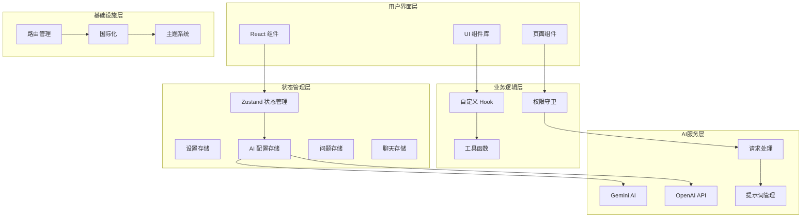
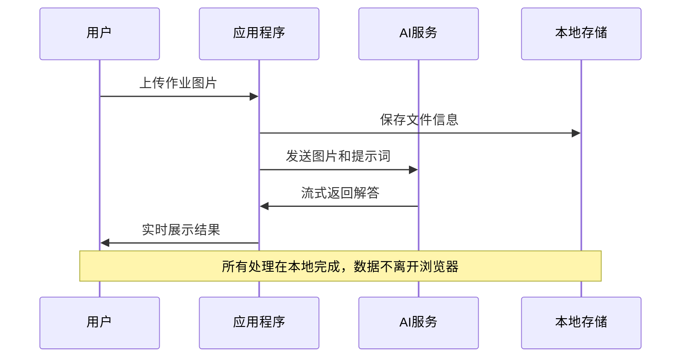

# Skid-Homework 项目概述

<cite>
**本文档引用的文件**
- [README.md](file://README.md)
- [package.json](file://package.json)
- [src/main.tsx](file://src/main.tsx)
- [src/App.tsx](file://src/App.tsx)
- [src/store/settings-store.ts](file://src/store/settings-store.ts)
- [src/ai/gemini.ts](file://src/ai/gemini.ts)
- [src/ai/openai.ts](file://src/ai/openai.ts)
- [src/components/pages/ScanPage.tsx](file://src/components/pages/ScanPage.tsx)
- [src/components/pages/ChatPage.tsx](file://src/components/pages/ChatPage.tsx)
- [src/components/pages/SettingsPage.tsx](file://src/components/pages/SettingsPage.tsx)
- [src/ai/prompts.ts](file://src/ai/prompts.ts)
- [src/store/ai-store.ts](file://src/store/ai-store.ts)
- [src/components/guards/RequireAiKey.tsx](file://src/components/guards/RequireAiKey.tsx)
- [public/locales/en/commons.json](file://public/locales/en/commons.json)
- [public/locales/zh/commons.json](file://public/locales/zh/commons.json)
</cite>

## 目录
1. [项目简介](#项目简介)
2. [核心价值主张](#核心价值主张)
3. [项目架构概览](#项目架构概览)
4. [核心技术特性](#核心技术特性)
5. [AI集成与支持](#ai集成与支持)
6. [用户界面与体验](#用户界面与体验)
7. [安全与隐私保护](#安全与隐私保护)
8. [目标用户群体](#目标用户群体)
9. [技术栈与依赖](#技术栈与依赖)
10. [项目许可与贡献](#项目许可与贡献)

## 项目简介

Skid-Homework 是一个开源的AI家庭作业解答平台，专为自学者和学生设计，旨在通过人工智能技术帮助用户高效解决作业问题。该项目采用纯浏览器运行的方式，确保用户数据的隐私安全，同时提供直观易用的操作界面。

项目的核心理念是"学生的时间很宝贵"，致力于通过技术创新减少学生在作业上的时间浪费，让他们能够专注于真正重要的学习内容。

**章节来源**
- [README.md](file://README.md#L1-L10)
- [package.json](file://package.json#L1-L10)

## 核心价值主张

### 1. 时间效率优化
- **高效工作流**：通过AI自动解析和解答作业，大幅减少手动查找答案的时间
- **批量处理**：支持多张图片/PDF文件的同时处理
- **实时反馈**：流式输出技术提供即时的解答过程展示

### 2. 隐私安全保障
- **纯浏览器运行**：所有处理过程在本地浏览器中完成，无需上传敏感数据
- **无遥测设计**：绝不收集用户使用数据或行为信息
- **本地存储**：API密钥等敏感信息仅存储在用户的浏览器本地

### 3. 开源透明
- **完全开源**：代码完全公开，接受社区审查和贡献
- **无黑盒操作**：用户可以查看和理解系统的每一个工作环节
- **GPLv3许可**：确保软件的自由使用和修改权利

### 4. 多平台兼容
- **跨设备支持**：可在电脑、平板、手机等多种设备上使用
- **人体工程学设计**：支持纯键盘操作，提升专业用户的工作效率
- **左撇子友好**：界面布局充分考虑不同用户的手部习惯

**章节来源**
- [README.md](file://README.md#L17-L31)

## 项目架构概览

Skid-Homework 采用现代化的前端架构，基于React和TypeScript构建，具有清晰的模块化设计。

**图表来源**
- [src/App.tsx](file://src/App.tsx#L1-L54)
- [src/main.tsx](file://src/main.tsx#L1-L12)
- [src/store/settings-store.ts](file://src/store/settings-store.ts#L1-L116)

### 核心模块说明

1. **路由系统**：基于React Router的单页应用架构
2. **状态管理**：使用Zustand实现轻量级的状态管理
3. **组件系统**：基于Radix UI的可访问性组件库
4. **AI集成**：支持Gemini和OpenAI两大主流AI平台
5. **国际化**：支持中英文双语界面

**章节来源**
- [src/App.tsx](file://src/App.tsx#L1-L54)
- [src/store/ai-store.ts](file://src/store/ai-store.ts#L1-L275)

## 核心技术特性

### 1. 文件处理能力
- **多格式支持**：支持JPG、PNG、PDF等多种文件格式
- **批量上传**：可同时上传多个文件进行处理
- **实时预览**：上传后立即显示文件预览
- **进度跟踪**：清晰的处理进度和状态显示

### 2. AI处理流程
- **OCR识别**：自动识别图片中的文字内容
- **问题提取**：智能提取和分类作业问题
- **解答生成**：基于AI生成详细的解答方案
- **流式输出**：实时展示AI的思考过程

### 3. 用户交互设计
- **键盘优先**：完整的键盘快捷键支持
- **手势操作**：移动端支持滑动手势导航
- **响应式设计**：适配各种屏幕尺寸
- **无障碍支持**：遵循Web可访问性标准

### 4. 数据管理
- **本地存储**：使用IndexedDB进行离线数据存储
- **会话持久化**：聊天记录和设置自动保存
- **导入导出**：支持Markdown格式的解答导出

**章节来源**
- [src/components/pages/ScanPage.tsx](file://src/components/pages/ScanPage.tsx#L1-L552)
- [src/components/pages/ChatPage.tsx](file://src/components/pages/ChatPage.tsx#L1-L976)

## AI集成与支持

### 支持的AI平台

Skid-Homework 支持两大主流AI平台，为用户提供灵活的选择：

#### Gemini AI集成
- **平台特性**：Google开发的先进AI模型
- **优势特点**：强大的视觉理解和推理能力
- **配置参数**：
  - 思考预算（Thinking Budget）：可调节的计算资源分配
  - 安全设置：多层次的内容过滤机制
  - 模型选择：支持多种Gemini模型变体

#### OpenAI集成
- **平台特性**：OpenAI的GPT系列模型
- **优势特点**：优秀的自然语言理解和对话能力
- **配置参数**：
  - 轮询间隔：控制响应状态检查频率
  - 超时设置：最大等待时间限制
  - 自定义基础URL：支持代理和自定义部署

**图表来源**
- [src/ai/gemini.ts](file://src/ai/gemini.ts#L1-L205)
- [src/ai/openai.ts](file://src/ai/openai.ts#L1-L267)

### 提示词系统

项目内置了完善的提示词管理系统：

- **系统提示词**：预设的专业解答模板
- **用户自定义**：支持个性化提示词配置
- **全局提示词**：影响所有AI交互的通用设置
- **模型特定**：针对不同模型的优化提示

**章节来源**
- [src/ai/prompts.ts](file://src/ai/prompts.ts#L1-L155)
- [src/store/ai-store.ts](file://src/store/ai-store.ts#L1-L275)

## 用户界面与体验

### 主要页面功能

#### 1. 扫描页面（ScanPage）
- **文件上传**：支持拖拽和点击上传
- **拍照功能**：集成设备相机进行作业拍摄
- **批量处理**：同时处理多个作业文件
- **实时反馈**：处理进度和状态实时显示

#### 2. 聊天页面（ChatPage）
- **对话管理**：支持多轮对话和上下文记忆
- **历史记录**：完整的聊天历史保存
- **模型切换**：可随时切换不同的AI模型
- **导出功能**：支持将对话导出为Markdown

#### 3. 设置页面（SettingsPage）
- **AI配置**：灵活的AI服务配置选项
- **外观设置**：主题和语言个性化
- **快捷键**：自定义键盘快捷键
- **高级选项**：深入的技术参数调整

### 交互设计原则

- **渐进式披露**：复杂功能隐藏在设置中，保持界面简洁
- **一致性设计**：统一的组件样式和交互模式
- **反馈机制**：及时的操作反馈和状态提示
- **错误处理**：友好的错误信息和恢复建议

**章节来源**
- [src/components/pages/ScanPage.tsx](file://src/components/pages/ScanPage.tsx#L1-L552)
- [src/components/pages/ChatPage.tsx](file://src/components/pages/ChatPage.tsx#L1-L976)
- [src/components/pages/SettingsPage.tsx](file://src/components/pages/SettingsPage.tsx#L1-L935)

## 安全与隐私保护

### 数据安全措施

#### 1. 本地处理
- **浏览器执行**：所有AI请求和处理都在用户浏览器中完成
- **数据隔离**：用户数据永远不会离开本地环境
- **临时存储**：处理完成后自动清理临时文件

#### 2. API密钥管理
- **本地存储**：API密钥存储在浏览器的加密本地存储中
- **内存保护**：密钥仅在内存中短暂存在
- **访问控制**：严格的权限验证机制

#### 3. 网络安全
- **HTTPS强制**：所有网络通信使用加密连接
- **CORS策略**：严格的跨域资源共享控制
- **输入验证**：全面的用户输入验证和清理

### 隐私保护承诺

- **无追踪**：绝不收集用户行为数据
- **无广告**：不包含任何第三方跟踪或广告服务
- **开源透明**：代码完全公开，接受社区监督

**章节来源**
- [src/components/guards/RequireAiKey.tsx](file://src/components/guards/RequireAiKey.tsx#L1-L22)

## 目标用户群体

### 主要用户类型

#### 1. 学生群体
- **基础教育学生**：从小学到高中的各个年级
- **大学生**：需要大量作业完成的本科生和研究生
- **自学者**：通过在线课程学习的自主学习者

#### 2. 教育工作者
- **教师**：需要快速批改作业或准备教学材料
- **家教**：为学生提供个性化辅导的教育工作者
- **培训师**：为企业员工提供技能培训的专业人士

#### 3. 专业人士
- **研究人员**：需要快速查阅相关知识的学生和学者
- **考试准备者**：准备各类资格考试的考生
- **终身学习者**：追求知识和个人发展的成年人

### 使用场景

#### 1. 日常学习
- **课后复习**：快速理解课堂内容和作业要求
- **知识点巩固**：通过练习加深对概念的理解
- **考试准备**：高效复习和模拟测试

#### 2. 项目研究
- **文献阅读**：快速理解学术论文中的数学公式和图表
- **实验设计**：辅助设计和分析科学实验
- **数据分析**：处理统计和数据分析作业

#### 3. 职业发展
- **技能提升**：通过实践练习掌握新技能
- **认证备考**：准备专业资格证书考试
- **知识更新**：跟上行业最新发展趋势

## 技术栈与依赖

### 前端框架

#### React 生态系统
- **React 19**：最新的React版本，提供更好的性能和开发体验
- **TypeScript**：强类型支持，提升代码质量和开发效率
- **Vite**：快速的构建工具和开发服务器

#### 状态管理
- **Zustand**：轻量级状态管理，替代Redux的现代选择
- **React Query**：用于数据获取和缓存管理

#### UI组件库
- **Radix UI**：可访问性优先的底层组件库
- **Tailwind CSS**：实用优先的CSS框架
- **Lucide React**：简洁的图标库

### 核心依赖包

#### AI集成
- **@google/genai**：Google Gemini API客户端
- **openai**：OpenAI API客户端

#### 开发工具
- **ESLint**：代码质量检查
- **Prettier**：代码格式化
- **TypeScript**：类型安全的JavaScript

#### 构建工具
- **Vite**：现代化的前端构建工具
- **pnpm**：快速的包管理器

**章节来源**
- [package.json](file://package.json#L1-L76)

## 项目许可与贡献

### 许可证信息

Skid-Homework 采用 **GPLv3** 开源许可证，这意味着：

#### 用户权利
- **自由使用**：可以自由运行软件用于任何目的
- **自由学习**：可以研究软件的工作原理并进行修改
- **自由分发**：可以重新分发软件给他人
- **自由改进**：可以改进软件并公开发布改进版本

#### 义务要求
- **源码开放**：任何衍生作品都必须开源
- **许可证保持**：分发时必须包含原许可证
- **修改标注**：必须明确标注对原软件的修改

### 贡献指南

#### 1. 代码贡献
- **Pull Request**：通过GitHub Pull Request提交代码
- **代码规范**：遵循项目既定的编码标准
- **测试覆盖**：新功能必须包含相应的测试
- **文档更新**：修改相关的文档说明

#### 2. 问题报告
- **Bug报告**：详细描述发现的问题和重现步骤
- **功能建议**：提出合理的功能改进建议
- **性能优化**：报告性能瓶颈和优化机会

#### 3. 社区参与
- **翻译贡献**：协助完善多语言支持
- **文档改进**：帮助完善项目文档
- **用户体验**：提供界面设计和交互优化建议

### 项目治理

- **核心维护者**：由项目创始人负责主要决策
- **社区协作**：欢迎社区成员参与项目发展
- **透明沟通**：通过GitHub Issues和Pull Requests保持透明沟通

**章节来源**
- [README.md](file://README.md#L140-L146)
- [package.json](file://package.json#L1-L76)

## 总结

Skid-Homework 作为一个开源的AI家庭作业解答平台，不仅提供了强大的技术功能，更重要的是体现了对用户时间和隐私的尊重。通过将AI技术与教育需求相结合，项目为学生和自学者提供了一个高效、安全、可靠的作业解决方案。

项目的开源性质确保了技术的透明度和社区的参与度，而GPLv3许可证则保障了软件的自由使用权。无论是作为学习工具还是技术参考，Skid-Homework 都展现了一个优秀开源项目的特质。

随着AI技术的不断发展，Skid-Homework 也在持续演进，为用户提供更加智能化和个性化的作业解答体验。项目的成功离不开开源社区的支持和贡献，期待更多开发者和用户的参与，共同推动这个项目的发展和完善。