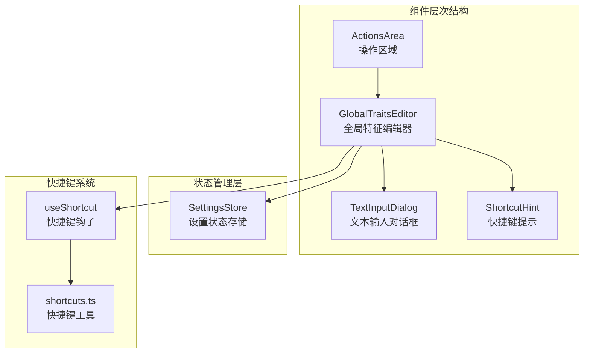
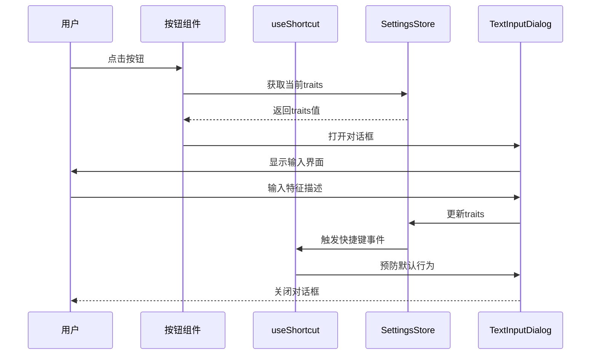
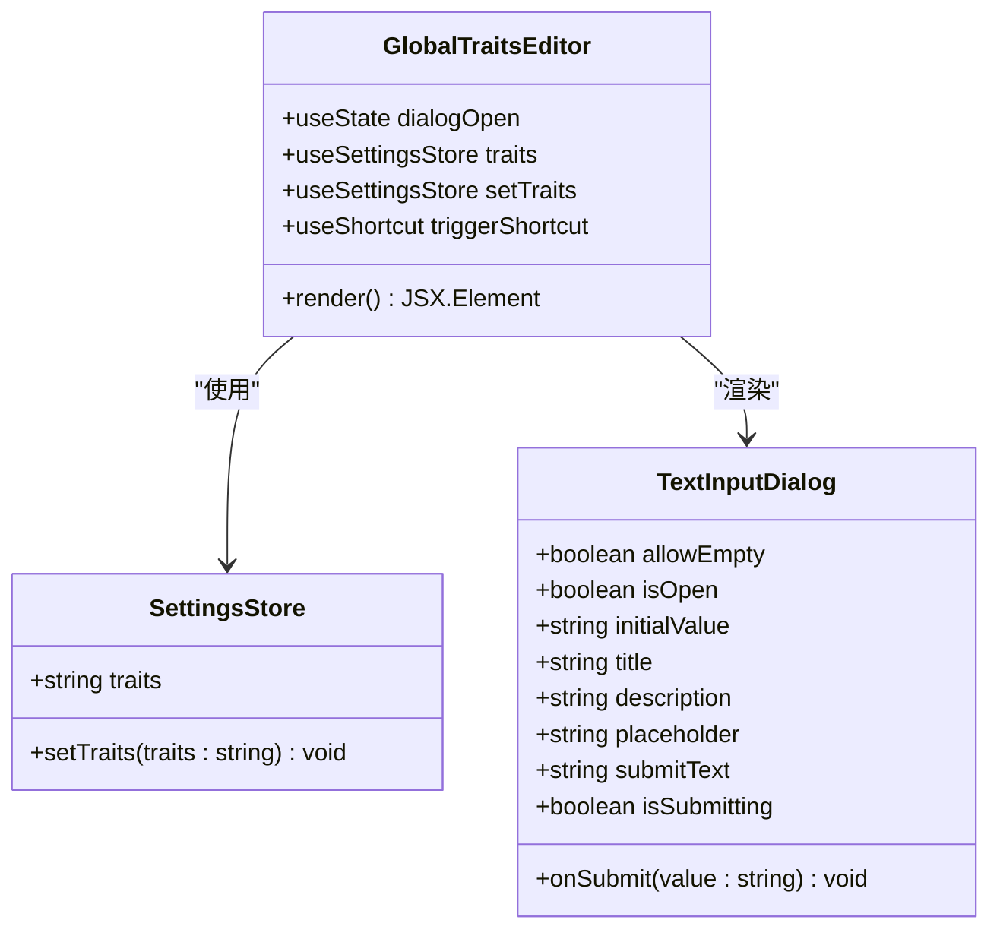
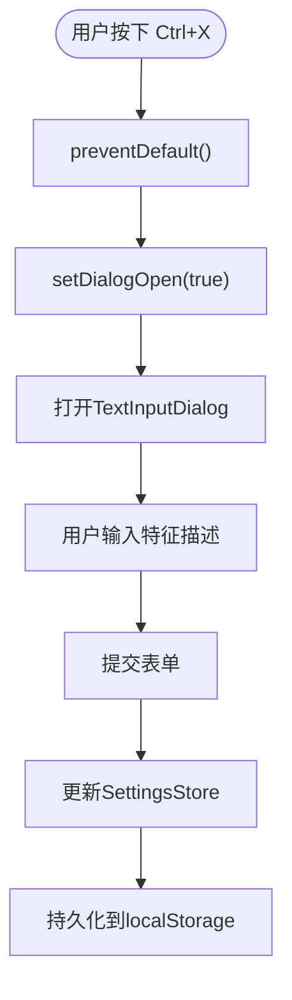
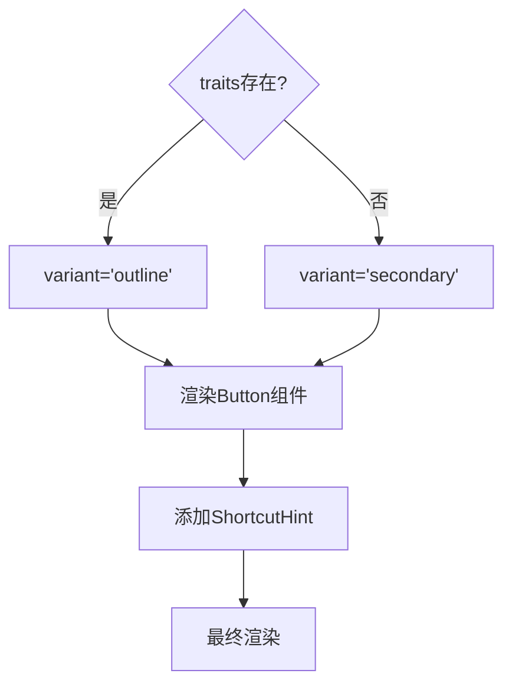
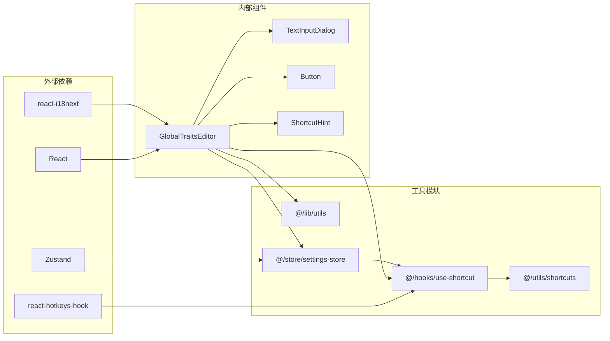
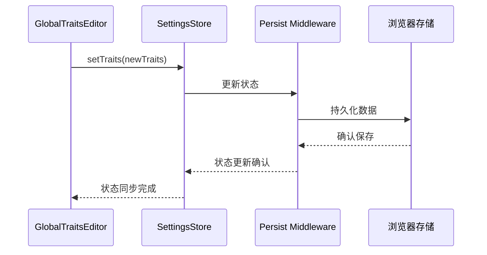

# 全局特征编辑器

<cite>
**本文档引用的文件**
- [GlobalTraitsEditor.tsx](file://src/components/GlobalTraitsEditor.tsx)
- [settings-store.ts](file://src/store/settings-store.ts)
- [use-shortcut.ts](file://src/hooks/use-shortcut.ts)
- [TextInputDialog.tsx](file://src/components/dialogs/TextInputDialog.tsx)
- [ShortcutHint.tsx](file://src/components/ShortcutHint.tsx)
- [ActionsArea.tsx](file://src/components/areas/ActionsArea.tsx)
- [shortcuts.ts](file://src/utils/shortcuts.ts)
- [commons.json](file://public/locales/zh/commons.json)
</cite>

## 目录
1. [简介](#简介)
2. [项目结构](#项目结构)
3. [核心组件](#核心组件)
4. [架构概览](#架构概览)
5. [详细组件分析](#详细组件分析)
6. [依赖关系分析](#依赖关系分析)
7. [性能考虑](#性能考虑)
8. [故障排除指南](#故障排除指南)
9. [结论](#结论)

## 简介

`GlobalTraitsEditor`是SkidHomework应用中的一个重要组件，它允许用户自定义AI助手的响应风格和行为特征。该组件通过`useSettingsStore`读取和持久化`traits`字段，为用户提供了一个直观的方式来配置AI助手的语气、格式和详细程度。

该组件的核心功能包括：
- 提供一个可点击的按钮界面，根据是否设置了特征值动态切换样式
- 内嵌`ShortcutHint`组件显示触发快捷键
- 集成快捷键系统，支持通过`Ctrl+X`快速打开编辑器
- 使用`TextInputDialog`提供完整的文本输入体验
- 将用户输入的自然语言描述转换为AI助手的行为特征

## 项目结构

`GlobalTraitsEditor`组件位于项目的组件层次结构中，作为用户界面的一部分，与其他核心组件协同工作：

**图表来源**
- [ActionsArea.tsx](file://src/components/areas/ActionsArea.tsx#L73-L78)
- [GlobalTraitsEditor.tsx](file://src/components/GlobalTraitsEditor.tsx#L1-L55)
- [TextInputDialog.tsx](file://src/components/dialogs/TextInputDialog.tsx#L1-L90)

**章节来源**
- [GlobalTraitsEditor.tsx](file://src/components/GlobalTraitsEditor.tsx#L1-L55)
- [ActionsArea.tsx](file://src/components/areas/ActionsArea.tsx#L1-L121)

## 核心组件

### GlobalTraitsEditor 组件

`GlobalTraitsEditor`是一个功能完整的React组件，提供了用户友好的界面来编辑全局AI助手特征。该组件的设计遵循了React的最佳实践，使用了现代的函数式组件模式和Hooks API。

#### 主要特性

1. **动态样式切换**：根据`traits`字段的存在与否，自动在`outline`和`secondary`样式之间切换
2. **国际化支持**：通过`react-i18next`提供多语言支持
3. **快捷键集成**：内置`Ctrl+X`快捷键支持
4. **状态管理**：通过`useSettingsStore`进行状态持久化
5. **无障碍设计**：提供完整的键盘导航支持

#### 组件属性

| 属性名 | 类型 | 描述 |
|--------|------|------|
| className | string | 可选的CSS类名，用于自定义样式 |
| ...props | ComponentProps<"button"> | 传递给底层Button组件的其他属性 |

**章节来源**
- [GlobalTraitsEditor.tsx](file://src/components/GlobalTraitsEditor.tsx#L10-L15)

## 架构概览

`GlobalTraitsEditor`组件采用了分层架构设计，将关注点清晰地分离：

**图表来源**
- [GlobalTraitsEditor.tsx](file://src/components/GlobalTraitsEditor.tsx#L32-L52)
- [use-shortcut.ts](file://src/hooks/use-shortcut.ts#L11-L27)
- [settings-store.ts](file://src/store/settings-store.ts#L49-L50)

## 详细组件分析

### 组件结构分析

`GlobalTraitsEditor`组件采用了简洁的结构设计，主要包含以下几个部分：

#### 1. 状态管理
组件使用`useState`管理对话框的打开状态，同时通过`useSettingsStore`访问全局状态：

**图表来源**
- [GlobalTraitsEditor.tsx](file://src/components/GlobalTraitsEditor.tsx#L19-L20)
- [settings-store.ts](file://src/store/settings-store.ts#L49-L50)
- [TextInputDialog.tsx](file://src/components/dialogs/TextInputDialog.tsx#L17-L29)

#### 2. 快捷键系统集成

组件通过`useShortcut`钩子集成了全局快捷键系统：

**图表来源**
- [GlobalTraitsEditor.tsx](file://src/components/GlobalTraitsEditor.tsx#L22-L29)
- [use-shortcut.ts](file://src/hooks/use-shortcut.ts#L21-L24)

#### 3. 国际化支持

组件通过`react-i18next`提供多语言支持，使用了特定的命名空间和键前缀：

| 键名 | 中文翻译 | 英文翻译 |
|------|----------|----------|
| trigger | 全局提示词编辑器 | Global Traits Editor |
| title | 编辑全局提示词 | Edit Global Traits |
| desc | 自定义提示词将被拼接到最终的AI查询中 | Custom prompts are appended to the final AI query |
| placeholder | 你是一个聪明的AI助手, 为作业求解而设计 | You are a smart AI assistant designed for homework solving |
| submit-btn | 提交 | Submit |

**章节来源**
- [GlobalTraitsEditor.tsx](file://src/components/GlobalTraitsEditor.tsx#L16-L18)
- [commons.json](file://public/locales/zh/commons.json#L10-L15)

### 交互逻辑分析

#### 点击按钮流程

1. **按钮渲染**：根据`traits`字段的值决定按钮样式
2. **点击事件**：打开`TextInputDialog`对话框
3. **数据绑定**：将当前`traits`值作为初始值传递给对话框
4. **用户输入**：用户在对话框中编辑特征描述
5. **提交处理**：调用`setTraits`更新全局状态

#### 快捷键触发流程

1. **快捷键监听**：`useShortcut`监听`Ctrl+X`组合键
2. **事件处理**：阻止默认行为并打开对话框
3. **焦点管理**：确保对话框正确获取焦点

**章节来源**
- [GlobalTraitsEditor.tsx](file://src/components/GlobalTraitsEditor.tsx#L38-L44)
- [use-shortcut.ts](file://src/hooks/use-shortcut.ts#L11-L27)

### UI组件集成

#### Button组件配置

组件内部使用了`Button`组件，根据条件动态设置样式：

**图表来源**
- [GlobalTraitsEditor.tsx](file://src/components/GlobalTraitsEditor.tsx#L39-L44)

#### TextInputDialog配置

对话框组件提供了完整的编辑体验：

| 配置项 | 值 | 说明 |
|--------|-----|------|
| allowEmpty | true | 允许空值提交 |
| isOpen | dialogOpen | 对话框可见状态 |
| initialValue | traits | 初始特征值 |
| title | t("title") | 对话框标题 |
| description | t("desc") | 描述文本 |
| placeholder | t("placeholder") | 占位符文本 |
| submitText | t("submit-btn") | 提交按钮文本 |

**章节来源**
- [TextInputDialog.tsx](file://src/components/dialogs/TextInputDialog.tsx#L32-L52)

## 依赖关系分析

### 组件依赖图

**图表来源**
- [GlobalTraitsEditor.tsx](file://src/components/GlobalTraitsEditor.tsx#L1-L9)
- [settings-store.ts](file://src/store/settings-store.ts#L1-L3)

### 状态持久化机制

组件通过`useSettingsStore`实现了状态的持久化，使用了Zustand的状态管理库和持久化中间件：

**图表来源**
- [settings-store.ts](file://src/store/settings-store.ts#L53-L76)
- [GlobalTraitsEditor.tsx](file://src/components/GlobalTraitsEditor.tsx#L51)

**章节来源**
- [GlobalTraitsEditor.tsx](file://src/components/GlobalTraitsEditor.tsx#L1-L9)
- [settings-store.ts](file://src/store/settings-store.ts#L1-L116)

## 性能考虑

### 渲染优化

1. **状态分离**：使用`useState`单独管理对话框状态，避免不必要的重新渲染
2. **记忆化**：`useMemo`用于处理快捷键变体，减少计算开销
3. **条件渲染**：根据`traits`值动态选择按钮样式，提高渲染效率

### 内存管理

1. **事件清理**：`useEffect`钩子正确清理定时器，防止内存泄漏
2. **依赖数组**：合理使用依赖数组，避免不必要的回调执行

### 存储优化

1. **增量持久化**：Zustand的`partialize`函数只持久化必要的状态字段
2. **版本迁移**：支持存储格式的向后兼容性

## 故障排除指南

### 常见问题及解决方案

#### 1. 快捷键不响应

**症状**：按下`Ctrl+X`但对话框未打开

**可能原因**：
- 快捷键被其他应用占用
- 浏览器安全设置限制
- 组件未正确挂载

**解决方案**：
- 检查快捷键冲突
- 确认浏览器权限设置
- 验证组件渲染状态

#### 2. 特征值未持久化

**症状**：关闭页面后特征设置丢失

**可能原因**：
- localStorage访问被阻止
- 存储空间不足
- 数据序列化失败

**解决方案**：
- 检查浏览器存储配额
- 清理过期的localStorage数据
- 验证数据格式有效性

#### 3. 国际化文本不显示

**症状**：界面显示英文而非中文

**可能原因**：
- i18n配置错误
- 语言包加载失败
- 键名拼写错误

**解决方案**：
- 检查语言设置
- 验证语言包完整性
- 确认键名正确性

**章节来源**
- [use-shortcut.ts](file://src/hooks/use-shortcut.ts#L11-L27)
- [settings-store.ts](file://src/store/settings-store.ts#L77-L112)

## 结论

`GlobalTraitsEditor`组件是一个设计精良、功能完整的React组件，它成功地将复杂的AI助手配置功能简化为直观的用户界面。该组件的主要优势包括：

### 设计优势

1. **用户体验一致性**：通过统一的样式和交互模式，提供了一致的用户体验
2. **可访问性友好**：支持键盘导航和屏幕阅读器，符合Web可访问性标准
3. **国际化支持**：内置多语言支持，适应全球化需求
4. **状态持久化**：自动保存用户设置，提升使用便利性
5. **快捷键集成**：提供高效的键盘操作方式

### 技术特点

1. **模块化设计**：清晰的组件分离和职责划分
2. **类型安全**：完整的TypeScript类型定义
3. **性能优化**：合理的状态管理和渲染优化
4. **错误处理**：健壮的边界情况处理

### 改进建议

1. **预设模板**：可以添加常用的特征模板供用户快速选择
2. **历史记录**：保存用户的特征编辑历史，便于回溯
3. **智能建议**：基于用户输入提供特征描述的智能建议
4. **可视化预览**：提供特征效果的实时预览功能

该组件展示了现代React应用开发的最佳实践，为AI助手的个性化配置提供了优秀的用户界面解决方案。