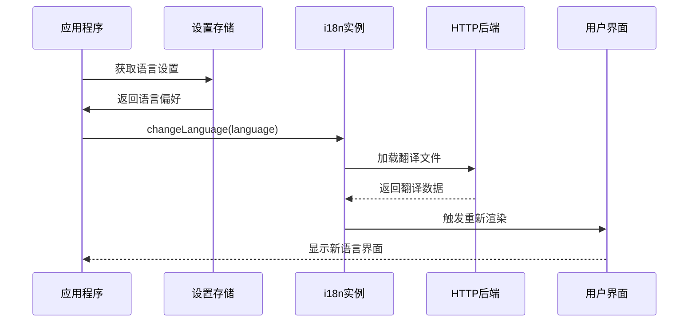
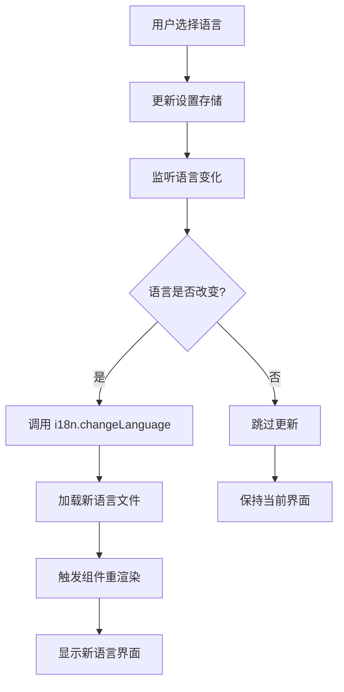
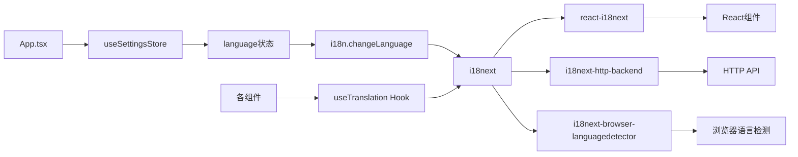

# 国际化支持

<cite>
**本文档中引用的文件**
- [src/i18n.ts](file://src/i18n.ts)
- [i18next.config.ts](file://i18next.config.ts)
- [public/locales/en/commons.json](file://public/locales/en/commons.json)
- [public/locales/zh/commons.json](file://public/locales/zh/commons.json)
- [src/@types/resources.d.ts](file://src/@types/resources.d.ts)
- [src/@types/i18next.d.ts](file://src/@types/i18next.d.ts)
- [src/components/GlobalTraitsEditor.tsx](file://src/components/GlobalTraitsEditor.tsx)
- [src/components/areas/ActionsArea.tsx](file://src/components/areas/ActionsArea.tsx)
- [src/components/pages/SettingsPage.tsx](file://src/components/pages/SettingsPage.tsx)
- [src/App.tsx](file://src/App.tsx)
- [src/store/settings-store.ts](file://src/store/settings-store.ts)
</cite>

## 目录
1. [简介](#简介)
2. [项目结构](#项目结构)
3. [核心组件](#核心组件)
4. [架构概览](#架构概览)
5. [详细组件分析](#详细组件分析)
6. [依赖关系分析](#依赖关系分析)
7. [性能考虑](#性能考虑)
8. [故障排除指南](#故障排除指南)
9. [结论](#结论)

## 简介

本项目采用 `i18next` 库实现国际化（i18n）支持，为用户提供中英文双语界面。系统基于 React 的 `react-i18next` 组件，实现了完整的国际化解决方案，包括动态语言切换、命名空间管理、类型安全和懒加载等功能。

## 项目结构

国际化系统的文件组织遵循标准的 i18next 结构：

```mermaid
graph TB
subgraph "国际化文件结构"
A[src/i18n.ts] --> B[配置初始化]
C[i18next.config.ts] --> D[CLI配置]
E[public/locales/] --> F[语言文件目录]
F --> G[en/]
F --> H[zh/]
G --> I[commons.json]
H --> J[commons.json]
K[src/@types/] --> L[类型定义]
L --> M[resources.d.ts]
L --> N[i18next.d.ts]
end
```

**图表来源**
- [src/i18n.ts](file://src/i18n.ts#L1-L52)
- [i18next.config.ts](file://i18next.config.ts#L1-L10)
- [public/locales/en/commons.json](file://public/locales/en/commons.json#L1-L503)
- [public/locales/zh/commons.json](file://public/locales/zh/commons.json#L1-L503)

**章节来源**
- [src/i18n.ts](file://src/i18n.ts#L1-L52)
- [i18next.config.ts](file://i18next.config.ts#L1-L10)

## 核心组件

### i18n 初始化配置

国际化系统的核心是 `src/i18n.ts` 中的初始化配置，它定义了整个国际化系统的运行机制：

#### 主要配置特性：
- **默认语言**：英语 (`en`) 作为回退语言
- **命名空间**：使用 `commons` 命名空间
- **资源加载**：通过 HTTP 后端插件实现懒加载
- **语言检测**：基于浏览器导航器的语言设置
- **插值处理**：禁用 XSS 防护（React 已内置保护）

#### 关键配置项：
- `fallbackLng`: `"en"` - 当目标语言缺少翻译时回退到英语
- `ns`: `["commons"]` - 定义使用的命名空间
- `defaultNS`: `"commons"` - 默认命名空间
- `backend.loadPath`: `"/locales/{{lng}}/{{ns}}.json"` - 翻译文件加载路径

**章节来源**
- [src/i18n.ts](file://src/i18n.ts#L23-L48)

### 类型安全系统

项目提供了完整的 TypeScript 类型定义，确保翻译键的类型安全：

#### 类型定义结构：
- `Resources` 接口定义了所有翻译键的结构
- 自动化的类型生成确保翻译文件与代码的一致性
- 支持嵌套对象结构的类型推断

**章节来源**
- [src/@types/resources.d.ts](file://src/@types/resources.d.ts#L1-L504)
- [src/@types/i18next.d.ts](file://src/@types/i18next.d.ts#L1-L10)

## 架构概览

国际化系统采用模块化架构，各组件职责明确：



**图表来源**
- [src/App.tsx](file://src/App.tsx#L14-L20)
- [src/store/settings-store.ts](file://src/store/settings-store.ts#L58-L66)

## 详细组件分析

### React 组件中的翻译使用

#### useTranslation Hook 的使用模式

项目中广泛使用 `useTranslation` Hook 进行文本翻译，采用多种使用模式：

##### 基础翻译模式
```typescript
const { t } = useTranslation("commons");
// 使用方式：t("key.subkey")
```

##### 带键前缀的翻译
```typescript
const { t } = useTranslation("commons", { keyPrefix: "actions" });
// 使用方式：t("scan"), t("clear-all")
```

##### 特定命名空间的翻译
```typescript
const { t } = useTranslation("commons", { keyPrefix: "actions.global-traits" });
// 使用方式：t("trigger"), t("title"), t("desc")
```

**章节来源**
- [src/components/GlobalTraitsEditor.tsx](file://src/components/GlobalTraitsEditor.tsx#L16-L18)
- [src/components/areas/ActionsArea.tsx](file://src/components/areas/ActionsArea.tsx#L24-L24)

### 动态语言切换机制

#### 语言切换流程



**图表来源**
- [src/App.tsx](file://src/App.tsx#L14-L20)
- [src/components/pages/SettingsPage.tsx](file://src/components/pages/SettingsPage.tsx#L177-L181)

#### 实现细节

语言切换通过以下步骤实现：

1. **状态管理**：在 `settings-store.ts` 中维护语言偏好
2. **副作用监听**：在 `App.tsx` 中使用 `useEffect` 监听语言变化
3. **API 调用**：通过 `i18n.changeLanguage()` 更新语言
4. **自动重渲染**：React 上下文自动触发相关组件重渲染

**章节来源**
- [src/App.tsx](file://src/App.tsx#L14-L20)
- [src/store/settings-store.ts](file://src/store/settings-store.ts#L58-L66)

### 翻译键命名规范

#### 命名约定
- **使用连字符分隔**：如 `global-traits`、`clear-all`
- **简洁明了**：使用简短的单词组合
- **层次结构**：通过点号分隔实现层次化组织
- **语义明确**：键名应能直观表达其用途

#### 示例键结构
```
actions.scan                 # 扫描按钮
actions.clear-all           # 清空所有
actions.global-traits.trigger  # 全局提示词编辑器触发器
```

**章节来源**
- [public/locales/en/commons.json](file://public/locales/en/commons.json#L1-L503)
- [public/locales/zh/commons.json](file://public/locales/zh/commons.json#L1-L503)

### 动态参数插值

#### 插值语法使用

项目支持复杂的动态参数插值，用于处理变量内容：

```typescript
// 基础插值
t("scan-page.errors.missing-key", { provider: "Gemini" })

// 数字插值
t("scan-page.mobile.status", { count: 3 })

// HTML 内容插值
t("init-page.form.api-hint", {
  link: '<a href="https://example.com">Google AI Studio</a>'
})
```

#### 插值配置
- **escapeValue**: `false` - 允许 HTML 内容插入
- **支持嵌套对象**：复杂数据结构的插值
- **类型安全**：通过 TypeScript 确保参数类型正确

**章节来源**
- [src/i18n.ts](file://src/i18n.ts#L36-L39)
- [src/components/pages/SettingsPage.tsx](file://src/components/pages/SettingsPage.tsx#L201-L204)

## 依赖关系分析

### 核心依赖关系图



**图表来源**
- [src/i18n.ts](file://src/i18n.ts#L1-L52)
- [src/App.tsx](file://src/App.tsx#L1-L54)

### 外部依赖

#### 必需依赖
- `i18next`: 核心国际化库
- `react-i18next`: React 绑定库
- `i18next-http-backend`: HTTP 后端插件
- `i18next-browser-languagedetector`: 浏览器语言检测

#### 可选依赖
- `i18next-cli`: 翻译提取和管理工具

**章节来源**
- [src/i18n.ts](file://src/i18n.ts#L1-L5)

## 性能考虑

### 懒加载策略

国际化系统采用懒加载机制优化性能：

#### 资源加载策略
- **按需加载**：只有在需要时才加载特定语言的翻译文件
- **命名空间隔离**：不同命名空间独立加载
- **缓存机制**：浏览器缓存已加载的翻译文件

#### 性能优化措施
- **HTTP 后端插件**：通过网络请求加载翻译文件
- **类型预编译**：TypeScript 类型提前生成，减少运行时开销
- **最小化传输**：只传输必要的翻译键

### 内存管理

- **单例模式**：i18n 实例在整个应用中共享
- **事件驱动**：通过 React 上下文管理组件更新
- **垃圾回收**：自动清理未使用的翻译资源

## 故障排除指南

### 常见问题及解决方案

#### 新添加的翻译键未生效

**问题症状**：添加新的翻译键后，界面仍显示键名而非翻译内容

**可能原因**：
1. 翻译文件路径错误
2. 命名空间配置不正确
3. 键名拼写错误
4. 缺少类型定义更新

**解决步骤**：
1. 检查翻译文件路径：`public/locales/{language}/{namespace}.json`
2. 验证命名空间配置：确保在 `i18n.ts` 中声明
3. 更新类型定义：运行 `i18next-cli` 生成最新类型
4. 清除浏览器缓存

#### 语言切换后组件未更新

**问题症状**：切换语言后某些组件仍显示旧语言

**可能原因**：
1. 组件未正确使用 `useTranslation` Hook
2. 缺少语言变化监听
3. 状态更新不及时

**解决步骤**：
1. 确保组件使用 `useTranslation` Hook
2. 检查 `App.tsx` 中的语言监听逻辑
3. 验证 `i18n.changeLanguage()` 调用
4. 强制组件重新渲染

#### 类型错误问题

**问题症状**：TypeScript 报告翻译键类型错误

**解决步骤**：
1. 运行 `i18next-cli` 更新类型定义
2. 检查翻译键拼写
3. 验证命名空间配置
4. 重启开发服务器

**章节来源**
- [src/i18n.ts](file://src/i18n.ts#L23-L30)
- [src/@types/resources.d.ts](file://src/@types/resources.d.ts#L1-L504)

### 最佳实践建议

#### 翻译文件组织
- **按功能模块划分**：将相关翻译键组织在同一命名空间
- **保持键名一致性**：使用统一的命名约定
- **避免深层嵌套**：限制对象嵌套层级，提高可读性

#### 开发工作流
- **自动化类型生成**：使用 `i18next-cli` 自动生成类型定义
- **持续集成检查**：在 CI 中验证翻译完整性
- **测试覆盖**：编写单元测试验证翻译功能

#### 维护策略
- **定期审查**：检查未使用的翻译键
- **版本控制**：跟踪翻译文件变更
- **社区贡献**：鼓励多语言社区参与翻译

## 结论

本项目的国际化系统展现了现代 Web 应用中 i18n 实践的最佳实践。通过 `i18next` 和 `react-i18next` 的结合使用，实现了：

- **完整的双语支持**：英语和中文界面无缝切换
- **类型安全保证**：通过 TypeScript 确保翻译键的正确性
- **高性能懒加载**：按需加载翻译资源，优化应用性能
- **灵活的扩展性**：易于添加新语言和新功能模块
- **良好的开发体验**：自动化工具链简化翻译管理工作

这套国际化解决方案不仅满足了当前的多语言需求，也为未来的功能扩展和语言支持奠定了坚实的基础。通过合理的架构设计和最佳实践的应用，确保了系统的可维护性和用户体验的连续性。