# 快捷键系统

<cite>
**本文档中引用的文件**
- [shortcuts.ts](file://src/utils/shortcuts.ts)
- [use-shortcut.ts](file://src/hooks/use-shortcut.ts)
- [settings-store.ts](file://src/store/settings-store.ts)
- [GlobalTraitsEditor.tsx](file://src/components/GlobalTraitsEditor.tsx)
- [ShortcutHint.tsx](file://src/components/ShortcutHint.tsx)
- [ShortcutRecorder.tsx](file://src/components/ShortcutRecorder.tsx)
- [ActionsArea.tsx](file://src/components/areas/ActionsArea.tsx)
- [UploadArea.tsx](file://src/components/areas/UploadArea.tsx)
- [ActionsCard.tsx](file://src/components/cards/ActionsCard.tsx)
</cite>

## 目录
1. [简介](#简介)
2. [系统架构概览](#系统架构概览)
3. [核心工具函数](#核心工具函数)
4. [Hook 实现机制](#hook-实现机制)
5. [状态管理集成](#状态管理集成)
6. [跨平台适配](#跨平台适配)
7. [实际应用示例](#实际应用示例)
8. [性能优化策略](#性能优化策略)
9. [故障排除指南](#故障排除指南)
10. [总结](#总结)

## 简介

快捷键系统是 Skid Homework 应用程序中的核心交互功能，提供了统一的快捷键管理、解析和绑定机制。该系统基于 React Hotkeys Hook 构建，支持跨平台显示适配、动态配置和智能变体处理。

系统的主要特点包括：
- 标准化的快捷键解析和序列化
- 跨平台修饰键符号适配（Mac 与 Windows）
- 动态用户配置支持
- 智能数字键变体处理
- 高性能的 React Hook 集成

## 系统架构概览

快捷键系统采用分层架构设计，包含工具函数层、Hook 层、状态管理层和组件层：

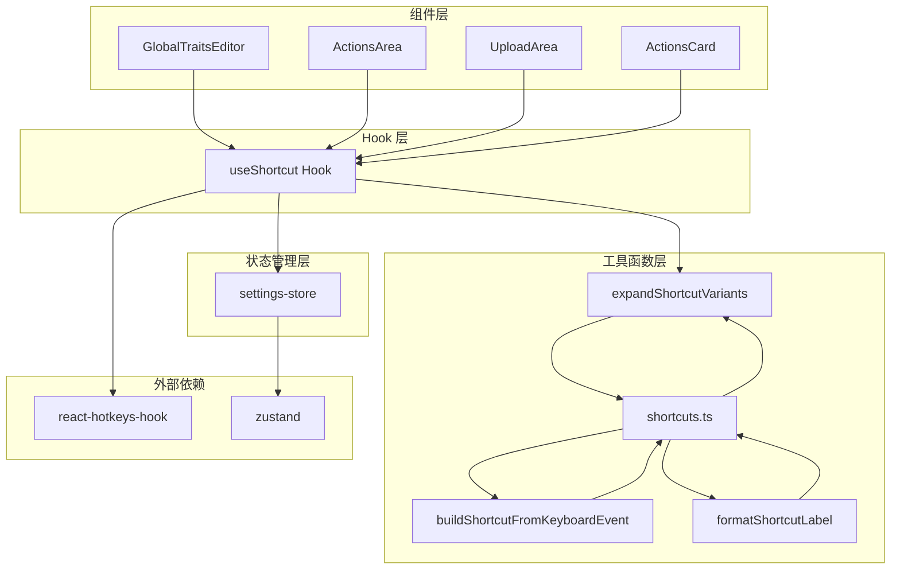

**图表来源**
- [use-shortcut.ts](file://src/hooks/use-shortcut.ts#L1-L28)
- [settings-store.ts](file://src/store/settings-store.ts#L1-L116)
- [shortcuts.ts](file://src/utils/shortcuts.ts#L1-L308)

## 核心工具函数

### 修饰键处理机制

系统定义了标准的修饰键处理顺序，确保一致性和可预测性：

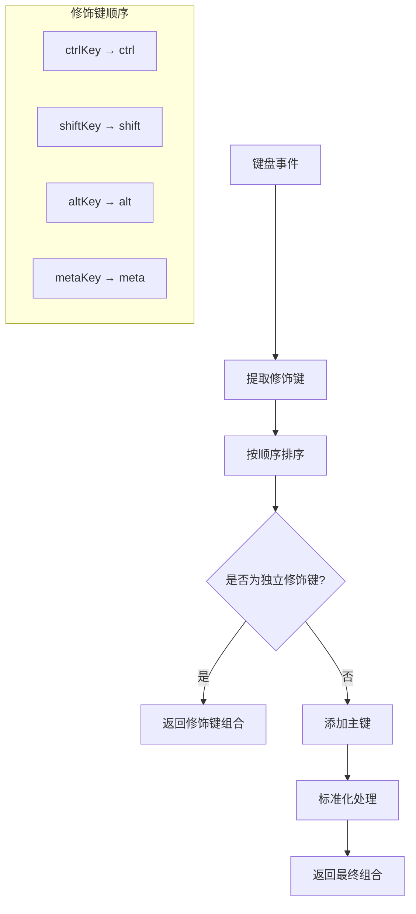

**图表来源**
- [shortcuts.ts](file://src/utils/shortcuts.ts#L1-L6)

### 键盘事件解析

`buildShortcutFromKeyboardEvent` 函数负责从原生键盘事件中提取和标准化快捷键信息：

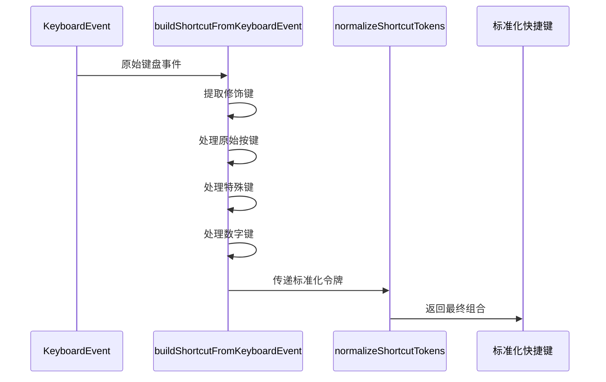

**图表来源**
- [shortcuts.ts](file://src/utils/shortcuts.ts#L150-L191)

### 特殊键映射

系统维护了完整的特殊键映射表，支持多种别名和标准化：

| 原始键名 | 映射值 | 用途 |
|---------|--------|------|
| ` ` | `space` | 空格键 |
| `escape` | `esc` | ESC 键 |
| `arrowup` | `up` | 上箭头 |
| `arrowdown` | `down` | 下箭头 |
| `arrowleft` | `left` | 左箭头 |
| `arrowright` | `right` | 右箭头 |
| `enter` | `enter` | 回车键 |
| `tab` | `tab` | Tab 键 |
| `backspace` | `backspace` | 退格键 |
| `delete` | `delete` | 删除键 |

**节来源**
- [shortcuts.ts](file://src/utils/shortcuts.ts#L57-L67)

### 数字键变体处理

系统智能处理数字键的 Shift 组合变体，提供更灵活的快捷键体验：

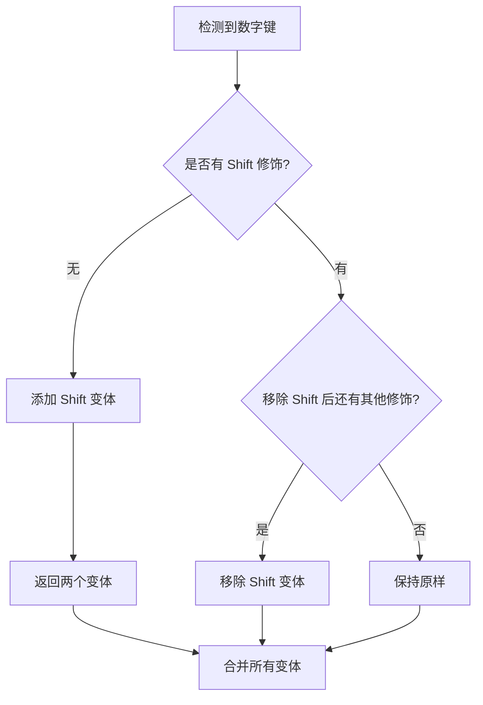

**图表来源**
- [shortcuts.ts](file://src/utils/shortcuts.ts#L238-L246)

**节来源**
- [shortcuts.ts](file://src/utils/shortcuts.ts#L220-L249)

## Hook 实现机制

### useShortcut Hook 设计

`useShortcut` Hook 是快捷键系统的核心抽象，它将用户配置与 React Hotkeys Hook 无缝集成：

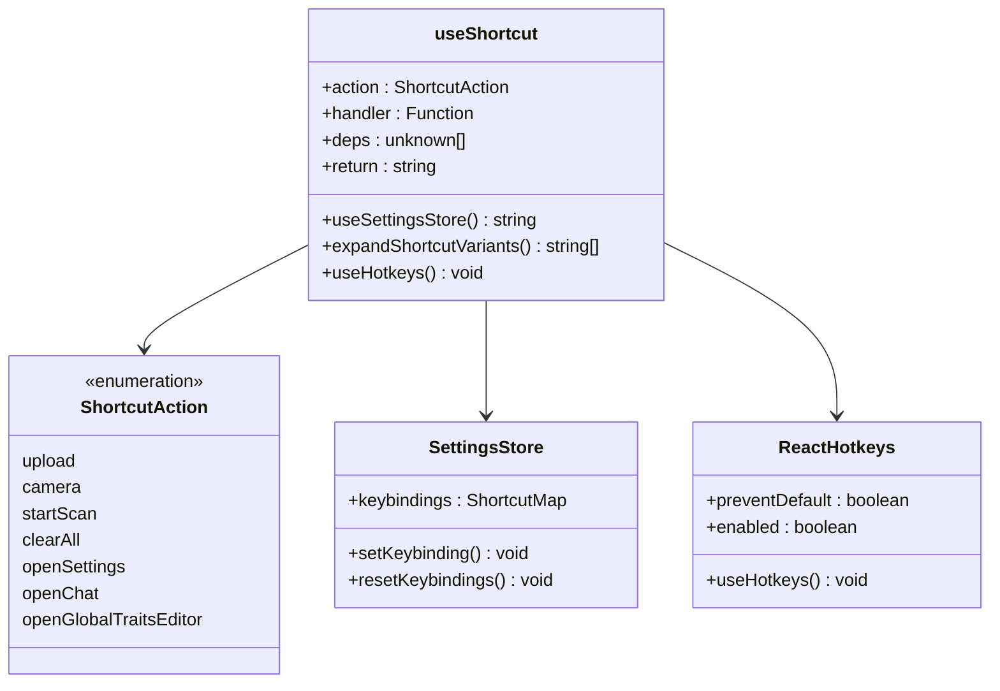

**图表来源**
- [use-shortcut.ts](file://src/hooks/use-shortcut.ts#L11-L27)
- [settings-store.ts](file://src/store/settings-store.ts#L6-L13)

### 动态依赖管理

Hook 使用 `useMemo` 缓存快捷键变体计算结果，避免不必要的重新计算：

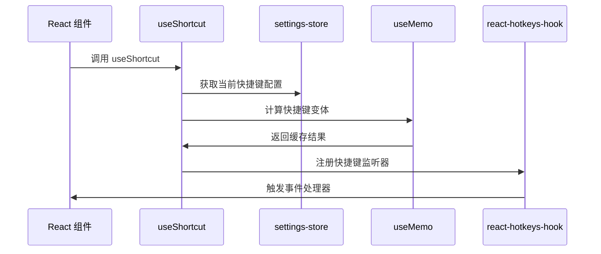

**图表来源**
- [use-shortcut.ts](file://src/hooks/use-shortcut.ts#L16-L27)

**节来源**
- [use-shortcut.ts](file://src/hooks/use-shortcut.ts#L1-L28)

## 状态管理集成

### 设置存储结构

系统使用 Zustand 进行状态管理，提供了持久化和类型安全的设置存储：

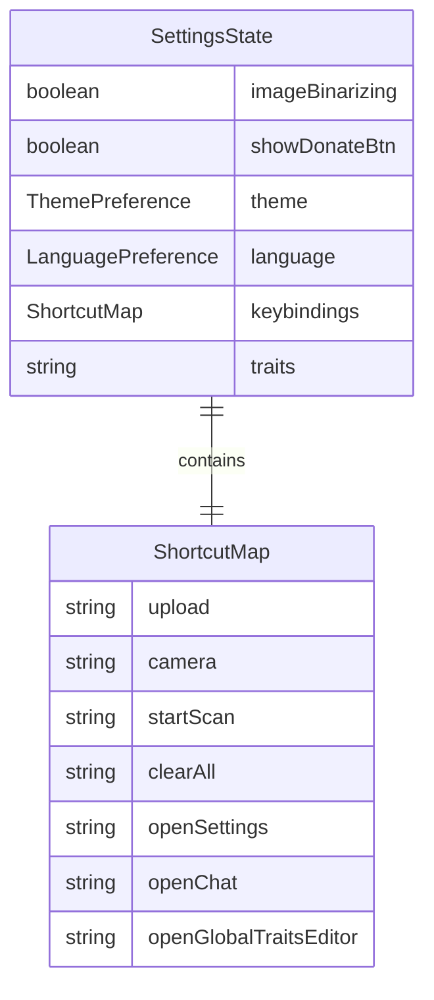

**图表来源**
- [settings-store.ts](file://src/store/settings-store.ts#L32-L76)

### 默认快捷键配置

系统预设了一套合理的默认快捷键组合：

| 功能 | 默认快捷键 | 说明 |
|------|-----------|------|
| 上传文件 | `ctrl+1` | 快速访问上传功能 |
| 拍照 | `ctrl+2` | 快速启动相机 |
| 开始扫描 | `ctrl+3` | 快速开始图像处理 |
| 清空所有 | `ctrl+4` | 快速清除所有项目 |
| 打开设置 | `ctrl+5` | 快速访问设置页面 |
| 打开聊天 | `ctrl+e` | 快速访问 AI 聊天 |
| 全局特性编辑器 | `ctrl+x` | 快速编辑全局特性 |

**节来源**
- [settings-store.ts](file://src/store/settings-store.ts#L17-L24)

## 跨平台适配

### 平台检测机制

系统自动检测运行环境并选择合适的显示映射：

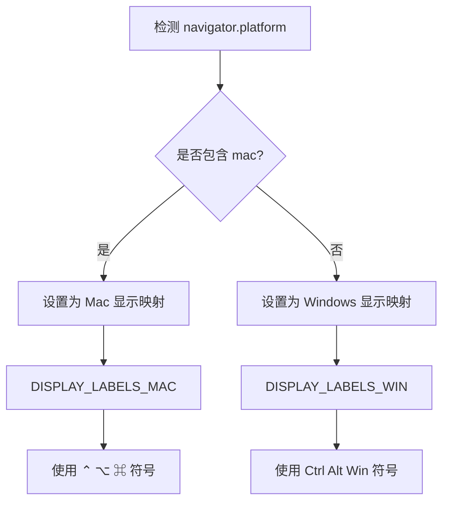

**图表来源**
- [shortcuts.ts](file://src/utils/shortcuts.ts#L104-L109)

### 修饰键符号对照表

| 修饰键 | Windows 符号 | Mac 符号 | 别名 |
|--------|-------------|----------|------|
| `ctrl` | `Ctrl` | `⌃` | `control` |
| `shift` | `Shift` | `⇧` | - |
| `alt` | `Alt` | `⌥` | `option` |
| `meta` | `Win` | `⌘` | `cmd`, `command`, `win`, `super` |

**节来源**
- [shortcuts.ts](file://src/utils/shortcuts.ts#L70-L102)
- [shortcuts.ts](file://src/utils/shortcuts.ts#L111-L122)

## 实际应用示例

### 全局特性编辑器快捷键

在 `GlobalTraitsEditor` 组件中，展示了最典型的快捷键使用模式：

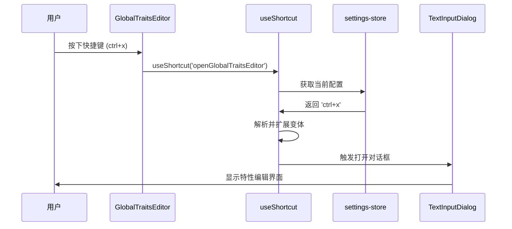

**图表来源**
- [GlobalTraitsEditor.tsx](file://src/components/GlobalTraitsEditor.tsx#L22-L27)

### 多功能区域快捷键

在 `ActionsArea` 中，系统同时管理多个快捷键：

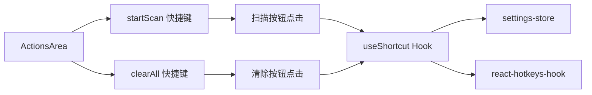

**图表来源**
- [ActionsArea.tsx](file://src/components/areas/ActionsArea.tsx#L56-L67)

### 快捷键录制器

`ShortcutRecorder` 组件提供了直观的快捷键录制功能：

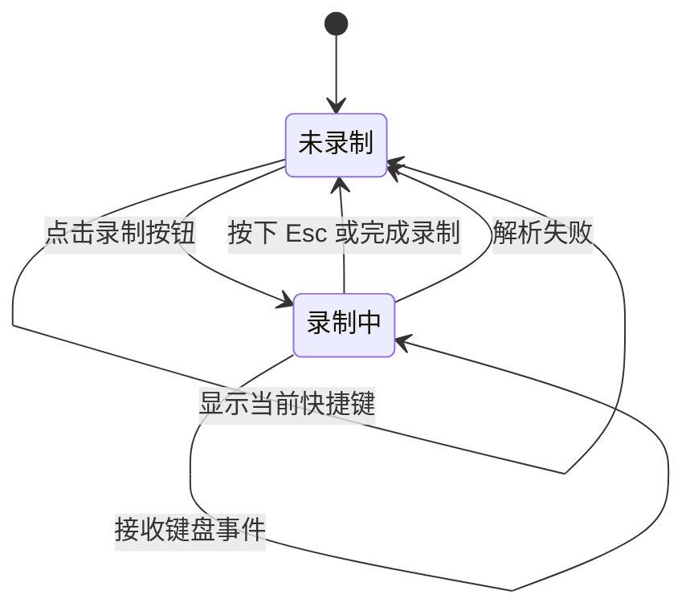

**图表来源**
- [ShortcutRecorder.tsx](file://src/components/ShortcutRecorder.tsx#L28-L51)

**节来源**
- [GlobalTraitsEditor.tsx](file://src/components/GlobalTraitsEditor.tsx#L1-L55)
- [ActionsArea.tsx](file://src/components/areas/ActionsArea.tsx#L1-L121)
- [ShortcutRecorder.tsx](file://src/components/ShortcutRecorder.tsx#L1-L134)

## 性能优化策略

### 缓存机制

系统在多个层面实现了性能优化：

1. **Hook 级别缓存**：`useMemo` 缓存快捷键变体计算结果
2. **组件级缓存**：避免在渲染过程中重复计算
3. **存储级缓存**：Zustand 的状态管理优化

### 最佳实践建议

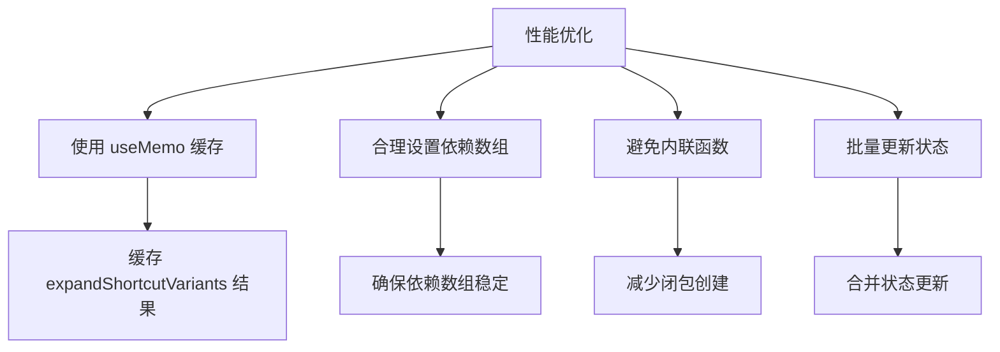

### 内存管理

系统通过以下方式优化内存使用：
- 使用 Set 数据结构去重快捷键变体
- 及时清理事件监听器
- 避免在渲染周期中创建新对象

## 故障排除指南

### 常见问题及解决方案

#### 快捷键不生效

**可能原因**：
1. 组合格式错误
2. 事件被阻止传播
3. 依赖项更新问题

**排查步骤**：
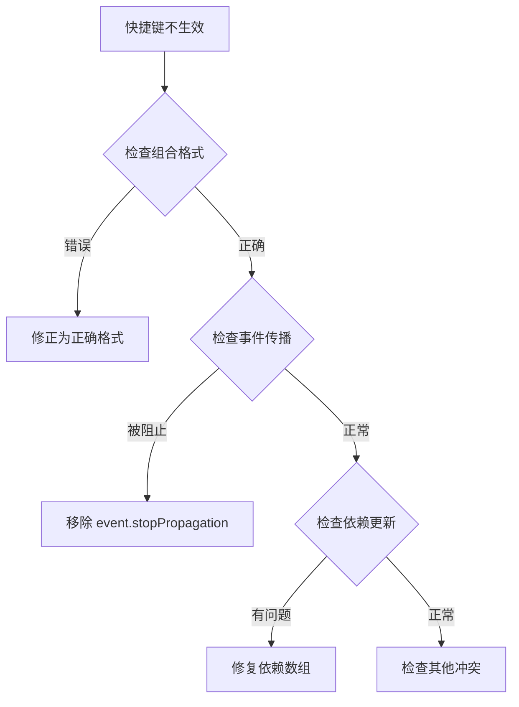

#### 组合格式验证

有效的快捷键格式包括：
- `ctrl+c` - 基础组合
- `ctrl+shift+s` - 多修饰键
- `ctrl+1` - 数字键
- `ctrl+enter` - 特殊键
- `ctrl+f1` - 功能键

#### 事件阻止问题

确保在快捷键处理器中正确处理事件：

```typescript
// 正确的做法
const handler = (event: KeyboardEvent) => {
  event.preventDefault(); // 防止默认行为
  // 处理逻辑
};

// 错误的做法
const handler = (event: KeyboardEvent) => {
  // 忘记阻止默认行为
  // 导致浏览器默认行为干扰
};
```

### 调试技巧

1. **启用开发模式日志**：在 `buildShortcutFromKeyboardEvent` 中添加调试输出
2. **检查状态同步**：确认 `settings-store` 中的配置与实际使用一致
3. **验证依赖更新**：使用 React DevTools 检查组件重新渲染频率

**节来源**
- [use-shortcut.ts](file://src/hooks/use-shortcut.ts#L16-L27)
- [shortcuts.ts](file://src/utils/shortcuts.ts#L150-L191)

## 总结

Skid Homework 的快捷键系统展现了现代 Web 应用中快捷键管理的最佳实践。通过分层架构设计、智能变体处理、跨平台适配和性能优化，系统提供了强大而灵活的快捷键解决方案。

### 关键优势

1. **统一的标准**：标准化的快捷键解析和序列化机制
2. **智能适配**：自动处理跨平台显示差异
3. **动态配置**：支持用户自定义快捷键
4. **高性能**：多层次的缓存和优化策略
5. **易用性**：简洁的 API 和直观的组件

### 技术亮点

- **修饰键处理顺序**：确保一致性的快捷键体验
- **数字键变体**：智能处理 Shift 组合的特殊情况
- **React Hook 集成**：无缝的 React 生态系统集成
- **状态持久化**：Zustand 提供的可靠状态管理

该系统不仅满足了当前的功能需求，还为未来的扩展提供了良好的架构基础，是现代前端应用中快捷键管理的优秀范例。