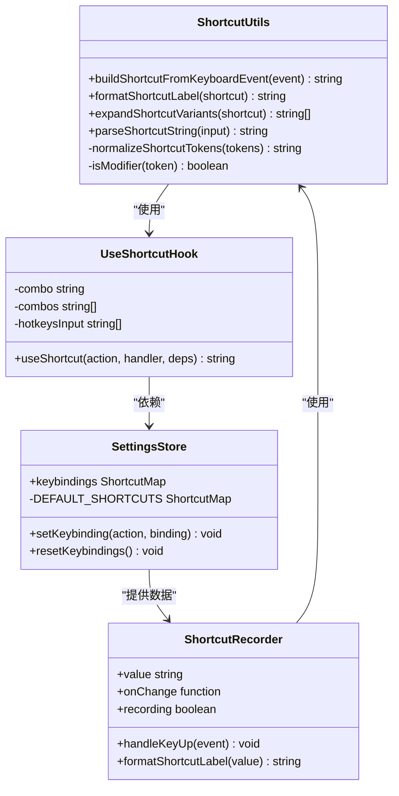
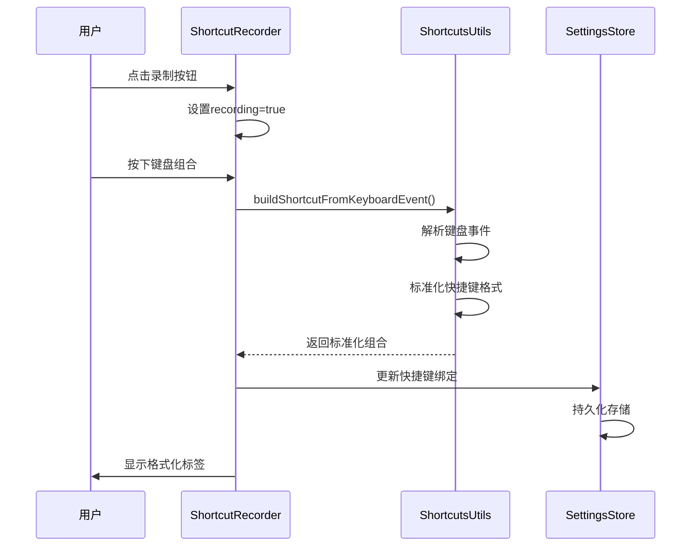
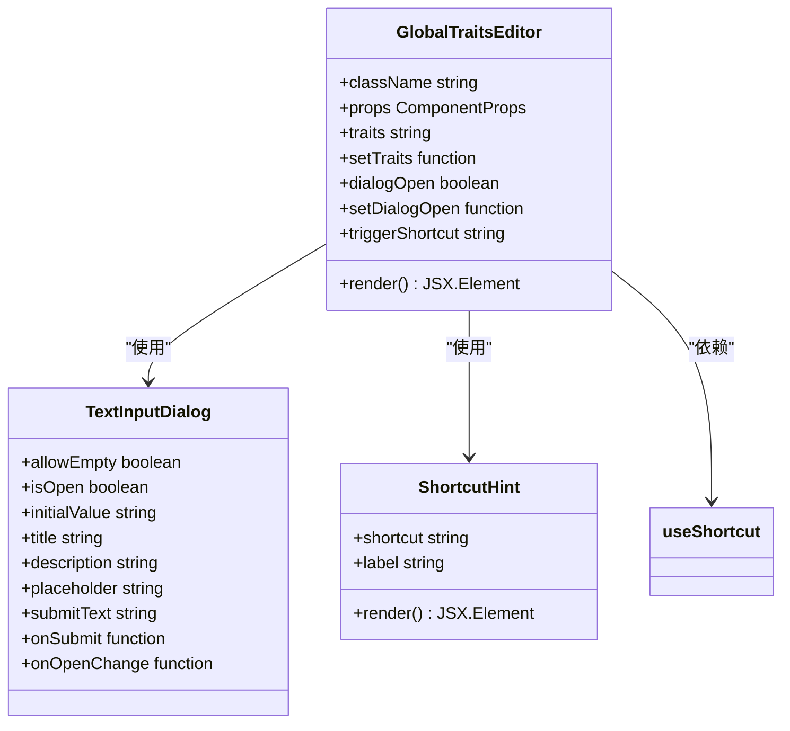
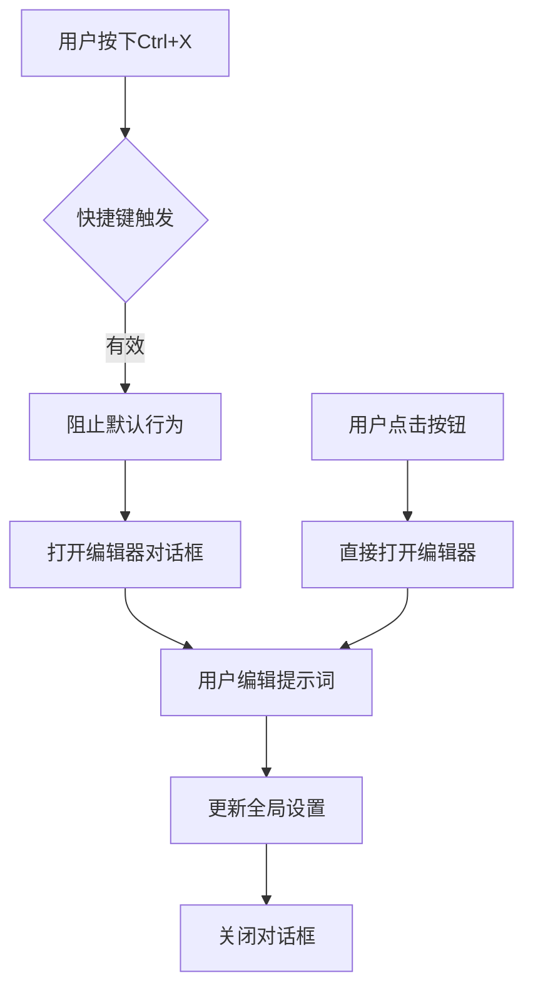
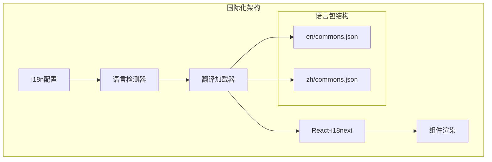
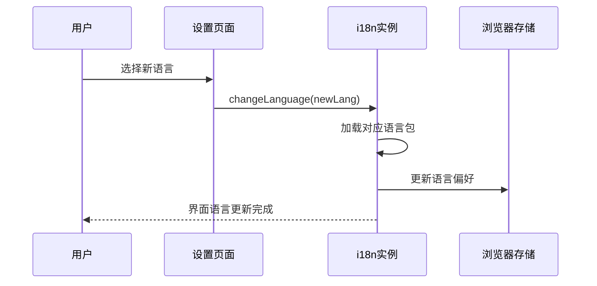
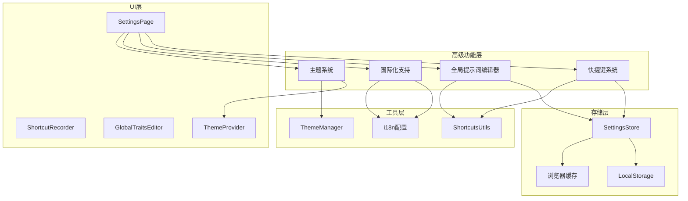
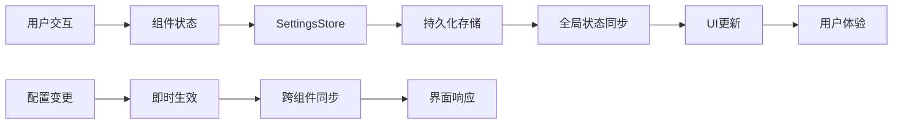

# 高级功能

<cite>
**本文档中引用的文件**
- [src/utils/shortcuts.ts](file://src/utils/shortcuts.ts)
- [src/hooks/use-shortcut.ts](file://src/hooks/use-shortcut.ts)
- [src/components/GlobalTraitsEditor.tsx](file://src/components/GlobalTraitsEditor.tsx)
- [src/store/settings-store.ts](file://src/store/settings-store.ts)
- [src/i18n.ts](file://src/i18n.ts)
- [public/locales/en/commons.json](file://public/locales/en/commons.json)
- [public/locales/zh/commons.json](file://public/locales/zh/commons.json)
- [src/components/ShortcutRecorder.tsx](file://src/components/ShortcutRecorder.tsx)
- [src/components/ShortcutHint.tsx](file://src/components/ShortcutHint.tsx)
- [src/components/pages/SettingsPage.tsx](file://src/components/pages/SettingsPage.tsx)
</cite>

## 目录
1. [简介](#简介)
2. [快捷键系统](#快捷键系统)
3. [全局提示词编辑器](#全局提示词编辑器)
4. [国际化支持](#国际化支持)
5. [高级功能架构](#高级功能架构)
6. [使用技巧与最佳实践](#使用技巧与最佳实践)
7. [故障排除指南](#故障排除指南)
8. [总结](#总结)

## 简介

SkidHomework 提供了一套完整的高级功能系统，旨在为高级用户提供更高效、个性化的使用体验。这些功能包括强大的快捷键系统、灵活的AI响应风格定制、完善的国际化支持，以及各种优化工作流程的特性。

## 快捷键系统

### 设计理念与架构

快捷键系统是SkidHomework的核心高级功能之一，它提供了一个统一的键盘导航框架，让用户能够通过键盘快速执行各种操作，大幅提升工作效率。

**图表来源**
- [src/utils/shortcuts.ts](file://src/utils/shortcuts.ts#L150-L307)
- [src/hooks/use-shortcut.ts](file://src/hooks/use-shortcut.ts#L11-L27)
- [src/store/settings-store.ts](file://src/store/settings-store.ts#L15-L25)

### 快捷键映射系统

系统定义了完整的快捷键映射表，涵盖了应用的所有核心功能：

| 功能类别 | 快捷键动作 | 默认组合 | 描述 |
|---------|-----------|----------|------|
| 文件操作 | upload | Ctrl+1 | 打开文件选择器 |
| 文件操作 | camera | Ctrl+2 | 启动相机拍摄 |
| 扫描操作 | startScan | Ctrl+3 | 开始AI识别 |
| 清空操作 | clearAll | Ctrl+4 | 清空所有文件 |
| 导航操作 | openSettings | Ctrl+5 | 打开设置页面 |
| 导航操作 | openChat | Ctrl+E | 打开聊天界面 |
| 编辑操作 | openGlobalTraitsEditor | Ctrl+X | 打开全局提示词编辑器 |

### 快捷键录制机制

快捷键录制系统提供了直观的用户体验，支持实时捕获键盘组合：

**图表来源**
- [src/components/ShortcutRecorder.tsx](file://src/components/ShortcutRecorder.tsx#L28-L46)
- [src/utils/shortcuts.ts](file://src/utils/shortcuts.ts#L150-L190)

### 平台适配与显示

系统自动检测操作系统平台，并提供相应的键盘符号显示：

- **Windows/Linux**: 使用标准键盘符号（Ctrl、Shift、Alt、Win）
- **macOS**: 使用Apple专用符号（⌃、⇧、⌥、⌘）

**节来源**
- [src/utils/shortcuts.ts](file://src/utils/shortcuts.ts#L104-L109)

### 错误处理与验证

快捷键系统具备完善的错误处理机制：

- **无效组合检测**: 自动过滤无效的键盘组合
- **冲突检测**: 防止快捷键与其他系统快捷键冲突
- **格式验证**: 确保快捷键格式符合规范
- **回退机制**: 提供默认快捷键作为备选

**节来源**
- [src/utils/shortcuts.ts](file://src/utils/shortcuts.ts#L251-L297)

## 全局提示词编辑器

### 组件架构设计

全局提示词编辑器是一个专门用于自定义AI响应风格的高级功能组件：

**图表来源**
- [src/components/GlobalTraitsEditor.tsx](file://src/components/GlobalTraitsEditor.tsx#L12-L54)

### 提示词定制功能

全局提示词编辑器允许用户定义AI助手的个性化特征：

#### 基本配置选项
- **空提示词处理**: 支持空提示词，提供默认行为
- **实时预览**: 实时显示提示词效果
- **格式化显示**: 在按钮中显示快捷键提示
- **状态反馈**: 根据提示词存在与否改变按钮样式

#### 提示词应用场景
- **角色设定**: 定义AI助手的角色特征（教师、导师、朋友等）
- **语气控制**: 调整回答的正式程度和友好度
- **专业领域**: 指定特定学科或领域的专业知识
- **教学方法**: 设定特定的教学策略和解释方式

### 快捷键集成

全局提示词编辑器集成了快捷键功能，提供一键访问：

**图表来源**
- [src/components/GlobalTraitsEditor.tsx](file://src/components/GlobalTraitsEditor.tsx#L22-L28)

**节来源**
- [src/components/GlobalTraitsEditor.tsx](file://src/components/GlobalTraitsEditor.tsx#L1-L55)

## 国际化支持

### 多语言架构设计

SkidHomework提供了完整的国际化支持，目前支持英语和中文两种语言：

**图表来源**
- [src/i18n.ts](file://src/i18n.ts#L1-L52)
- [public/locales/en/commons.json](file://public/locales/en/commons.json#L1-L503)
- [public/locales/zh/commons.json](file://public/locales/zh/commons.json#L1-L503)

### 语言包组织结构

#### 英文语言包 (en/commons.json)
- **功能描述**: 完整的功能说明和用户指导
- **界面文本**: 所有界面元素的英文翻译
- **错误信息**: 详细的错误提示和帮助信息
- **快捷键标签**: 键盘快捷键的英文显示

#### 中文语言包 (zh/commons.json)
- **本地化文本**: 符合中文用户习惯的表达方式
- **文化适应**: 考虑中文用户的使用习惯
- **技术术语**: 准确的技术词汇翻译
- **交互提示**: 友好的用户交互引导

### 动态语言切换

系统支持运行时动态切换语言，无需重新加载页面：

**图表来源**
- [src/components/pages/SettingsPage.tsx](file://src/components/pages/SettingsPage.tsx#L177-L181)

### 翻译键管理系统

系统采用层次化的翻译键命名规范：

#### 命名规范
- **基础层级**: `actions.{actionName}`
- **功能模块**: `{moduleName}.{subFeature}`
- **复杂结构**: `{category}.{subcategory}.{item}`

#### 示例翻译键
- `actions.scan`: "Let's Skid" / "开始打滑"
- `actions.global-traits.trigger`: "Global Traits Editor" / "全局提示词编辑器"
- `settings-page.shortcuts.title`: "Keyboard shortcuts" / "键盘快捷键"
- `solution-viewer.answer`: "Answer" / "答案"

**节来源**
- [src/i18n.ts](file://src/i18n.ts#L1-L52)
- [public/locales/en/commons.json](file://public/locales/en/commons.json#L1-L503)
- [public/locales/zh/commons.json](file://public/locales/zh/commons.json#L1-L503)

## 高级功能架构

### 整体架构概览

### 数据流管理

高级功能的数据流遵循单向数据流原则：

### 性能优化策略

#### 快捷键性能优化
- **事件防抖**: 避免频繁的快捷键事件处理
- **内存管理**: 及时清理事件监听器
- **懒加载**: 按需加载快捷键处理器

#### 国际化性能优化
- **按需加载**: 仅加载当前语言的语言包
- **缓存机制**: 缓存翻译结果减少重复计算
- **增量更新**: 仅更新变化的翻译内容

**节来源**
- [src/store/settings-store.ts](file://src/store/settings-store.ts#L1-L116)

## 使用技巧与最佳实践

### 快捷键使用技巧

#### 自定义快捷键组合
1. **避免冲突**: 选择不常用的组合键
2. **逻辑分组**: 按功能相关性分组设置
3. **记忆规律**: 使用有意义的组合模式
4. **备份方案**: 为重要功能设置备用快捷键

#### 高效工作流程
- **批量操作**: 使用快捷键快速执行重复任务
- **上下文感知**: 根据当前状态选择合适的快捷键
- **组合使用**: 将多个快捷键组合形成工作流

### 全局提示词优化

#### 提示词编写原则
1. **明确目标**: 清楚定义AI助手的角色定位
2. **具体指令**: 提供具体的回答要求和格式
3. **一致性**: 保持提示词的一致性和连贯性
4. **简洁性**: 避免过于复杂的语句结构

#### 应用场景示例
- **学术辅导**: "你是一位经验丰富的大学教授，擅长数学和物理，用严谨但易懂的方式解释概念"
- **编程指导**: "你是一位资深软件工程师，擅长多种编程语言，用循序渐进的方式解释代码逻辑"
- **语言学习**: "你是一位母语为英语的外教，用简单直接的方式帮助学习者掌握语法和词汇"

### 国际化使用建议

#### 多语言协作
- **团队配置**: 为不同语言背景的团队成员设置相应语言
- **文档管理**: 在多语言环境中维护一致的术语表
- **测试覆盖**: 确保所有功能在不同语言环境下正常工作

#### 本地化考虑
- **文化适应**: 考虑不同文化背景的用户习惯
- **技术术语**: 使用目标语言中熟悉的技术词汇
- **交互设计**: 遵循目标语言用户的界面习惯

### 主题与界面优化

#### 视觉体验优化
- **对比度**: 确保文本和背景有足够的对比度
- **字体大小**: 根据用户需求调整字体大小
- **色彩搭配**: 选择适合长时间使用的色彩方案

#### 辅助功能
- **键盘导航**: 确保所有功能都可以通过键盘访问
- **屏幕阅读**: 支持屏幕阅读器的无障碍访问
- **高对比**: 提供高对比度的主题选项

## 故障排除指南

### 快捷键问题诊断

#### 常见问题及解决方案

| 问题类型 | 症状描述 | 可能原因 | 解决方案 |
|---------|---------|---------|---------|
| 快捷键无响应 | 按下组合键无反应 | 快捷键被禁用或冲突 | 检查设置页面配置 |
| 冲突报警 | 系统提示快捷键冲突 | 与其他应用冲突 | 修改快捷键组合 |
| 不同步 | 快捷键设置不生效 | 存储问题 | 清除浏览器缓存 |
| 平台差异 | macOS/Linux显示异常 | 平台适配问题 | 检查操作系统检测 |

#### 调试步骤
1. **检查状态**: 确认快捷键是否已启用
2. **验证格式**: 检查快捷键格式是否正确
3. **测试环境**: 在不同浏览器中测试
4. **重置配置**: 必要时重置为默认设置

### 全局提示词问题

#### 常见问题
- **提示词丢失**: 浏览器缓存导致设置丢失
- **格式错误**: 提示词语法不符合要求
- **效果不明显**: 提示词不够具体或清晰

#### 解决策略
1. **备份设置**: 定期备份重要的提示词配置
2. **测试验证**: 小范围测试提示词效果
3. **迭代优化**: 根据使用效果逐步优化

### 国际化问题

#### 语言切换问题
- **缓存残留**: 浏览器缓存导致语言不更新
- **网络问题**: 翻译文件加载失败
- **编码问题**: 特殊字符显示异常

#### 解决方案
1. **强制刷新**: 使用Ctrl+F5强制刷新页面
2. **检查连接**: 确认网络连接正常
3. **字符编码**: 确保文件编码为UTF-8

**节来源**
- [src/utils/shortcuts.ts](file://src/utils/shortcuts.ts#L150-L307)
- [src/store/settings-store.ts](file://src/store/settings-store.ts#L95-L110)

## 总结

SkidHomework的高级功能系统为用户提供了强大而灵活的定制能力。通过精心设计的快捷键系统，用户可以实现高效的键盘驱动工作流；全局提示词编辑器允许深度定制AI助手的行为；完善的国际化支持确保了全球用户的良好体验。

这些功能不仅提升了应用的专业性和可用性，更为高级用户提供了深度定制的可能性。随着功能的不断完善和优化，这些高级特性将继续为用户带来更好的使用体验。

掌握这些高级功能的使用技巧，将使您能够充分发挥SkidHomework的潜力，实现更高效的学习和工作目标。